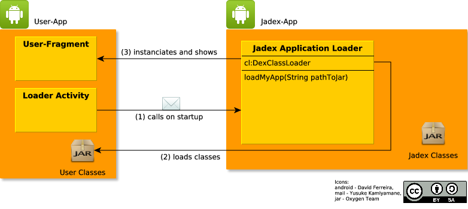

# PlatformApp - ClientApp Separation (DEPRECATED)

On desktop systems, Jadex provides a platform for other (user) applications.
Those applications can be started using the JCC and don't contain any Jadex libraries, as those are provided by the platform.

On Android devices, however, it's not simple to separate the user application from the Jadex platform, because of the way Android deals with loading Activities and Services.\
So past jadex-android versions just included all needed platform libraries in the packaged user-application.

Nevertheless, the mentioned separation is desirable, because if user applications don't contain the whole set of jadex platform libraries, there will be some advantages:

**faster application packaging time**: always dex-ing the jadex libraries is quite time-intensive   
**smaller applications**: because user applications doesn't contain the jadex platform

Since version 2.4 (which is currently only available as night build) of jadex-android, this separation is supported.

The Platform and all it's libraries are now packaged into a [standalone Android APK](https://www.activecomponents.org/bin/view/Download/Overview) .

This document describes how to develop applications using the *ClientApp* model.

Installation of the Platform App
---------------------------------------------

1.  Download the Jadex platformApp from [nightly builds](http://www.activecomponents.org/download) .
    2. Install it on your phone or emulator. For emulator, use *adb install jadex-android-platformapp-2.4-SNAPSHOT.apk*.
    For installation on your phone, enable the *unknown sources* setting, located in * settings &gt; security *, download the APK to your phone and execute it.

The Platform App will create a Startup icon just like any other android app.
However, selecting this icon will not start the platform, instead, it is started by launching client applications.

Functionality of separated Platform and Client
-----------------------------------------------------------

When a client application is started, the following steps are performed as illustrated in the image below:

1.  The started user application or rather the included Loader Activity will call the Jadex Platform application by posting an intent.
    2. The Jadex Platform application parses the intent data, which include the name of the class the User App wants to display on the screen, and loads the user classes.
    3. The User Fragment will be instanciated and shown on the screen, while all jadex classes are present and can be used by the user application.

The next step will explain how to create client applications.

Developing a Jadex ClientApp
-----------------------------------------

### Prerequisites

**Important:** Currently, it is only possible to develop Jadex ClientApps using maven!

Before you can start developing, please follow steps 1-3 from [here](02%20Installation)  to install Eclipse and the Android SDK.

### Using the ClientApp example

For a quick start, use the example project *jadex-android-clientapp-example-maven* included in the jadex-android-example-projects file.

-   extract the *jadex-android-example-projects.zip*, which is included in the jadex-android distribution
-   copy the *jadex-android-clientapp-example-maven* directory to your workspace
-   choose *File -&gt; Import -&gt; Maven -&gt; Existing Maven Projects*
-   select your workspace folder, select the *jadex-android-clientapp-example-maven* directory and click *next* / *finish* until import is completed

-   to build the project with maven **which is required as of jadex-android-2.4**, use the included launch config *Build clientapp example* 
-   to run the maven build, use the included launch config *Run clientapp example* which will deploy and run the project on any android devices plugged in or emulators running.

### The ClientApp

In Contrast to a normal android application, each Jadex ClientApp has an entry point (Activity) that **has** to extend *JadexApplication*. This Class only needs to overwrite one Method, *getClassName()*.  
The String it returns should be the fully-qualified class name of a ClientAppFragment.

#### ClientApp Fragments

Because Fragments can be added dynamically to views, we use Fragments to display the developers application content.
That means, instead of creating *Activity* classes, you should instead extend from *ClientAppFragment*, which offers mostly the same functionality.
This is the biggest difference to normal application development: **No Activities, use ClientAppFragments**!
If access to the concrete Activity is needed, call *getActivity()* in your Fragment.

We also added one Lifecycle Phase: *onPrepare()*. This is called **before** any other android lifecycle methods are called, so nothing is initialized. It is needed to perform tasks that have to execute *before* the Fragment enters the view, such as requesting Window Features.

Other Features work like before: binding Services, starting other Activities/Fragments.
