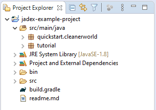
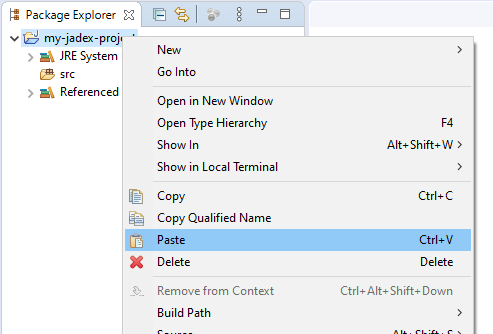

# Getting Started with Jadex Active Components

With Jadex, you can use the *Active Components* approach to develop distributed applications. This approach combines a hierachical service component architecture (SCA) with the possibility of abstract business logic implementation based on [BDI Agents](../tutorials/bdiv3/01%20Introduction.md) or [BPMN Workflows](../tutorials/bpmn/01%20Introduction.md) (see [Component Types](../component-types/component-types.md) for more information).

The communication model is based on [services](../services/services.md#implementation).
An Active Component is an entity that has defined dependencies with its environment.
Similar to other component models these dependencies are described using required and provided services, i.e. services that a component needs to consume from other components for its functioning and services that it provides to others.

The interaction between components is fully network-transparent, so components can be executed on one or different machines without changing their code.
The figure below summarizes the general concept of an Active Component.


*Active Component Structure*

The following chapters introduce concepts with hands-on code examples and help you developing your own Jadex Active Components based applications.
*(If you do not want to setup your IDE now, skip the remainder of this chapter and continue to [Platform](../platform/platform.md).)*

# IDE Setup

In this chapter, you will learn how to install eclipse for developing desktop applications with Jadex. Therefore, you will find instructions on setting up a proper eclipse working environment for programming and executing Jadex applications. If you use a different IDE the instructions and screenshots below should still be helpful for setting up your IDE accordingly.
*(If you want to develop Android applications with Jadex, please refer to [Android](../android/android.md).)*

Note that this tutorial is not a replacement for the existing eclipse documentation. If you have questions about using eclipse try also looking for an answer at the <http://www.eclipse.org/documentation/> site.

## Prerequisites

- Make sure that you have a recent **Java** environment installed e.g. from <https://jdk.java.net/> (OpenJDK) or <https://www.oracle.com/java/technologies/javase-downloads.html> (Oracle JDK). The following has been tested with Java SE 11.
- Make sure that you have a suitable **Eclipse** distribution from <http://www.eclipse.org/downloads/packages> installed. The following has been tested with the 2020‑03 Version of the 'Eclipse IDE for Enterprise Java Developers' package.

## Eclipse Project Setup with Gradle/Maven

If you want to use Gradle or apache Maven for your project, you do not need to download the whole Jadex distribution.
Just add a dependency for the required Jadex artifacts and they will be downloaded automatically.
We provide an example project that uses gradle as described in the next section.

### Importing the Jadex example project

This section describes an easy way of setting up a Jadex project for development in eclipse using the [Gradle](https://gradle.org/) build tool.

Download the jadex-example-project.zip from [Downloads](https://www.activecomponents.org/#/download) and unpack it to a place of your choice.

- Use "File -> Import -> Gradle / Existing Gradle Project" and choose "Next".

")

- "Browse..." to the directory where you unzipped the jadex-example-project.zip.

")

- Click "Finish". Gradle will import the project and start the build process thereby download the necessary Jadex libraries from the web.



### Using Jadex in a new or existing Gradle Project

To use Jadex in a new or existing Gradle project, add the following code to your build script's dependency section (set `jadex_version` to the desired version):

```groovy
def jadex_version	= "4.0.171"

dependencies {
    // [...] other dependencies
    implementation 'org.activecomponents.jadex:jadex-distribution-minimal:'+jadex_version
}
```

A minimal complete `build.gradle` could look like this:

```groovy
apply plugin: 'java'

def jadex_version	= "4.0.171"

repositories {
    jcenter()
    mavenCentral()
}

dependencies {
    implementation 'org.activecomponents.jadex:jadex-distribution-minimal:'+jadex_version
}
```

If you want to use our nightly builds, you need add another repository:

```groovy
repositories {
    jcenter()
    mavenCentral()
    maven
    {
        name 'jadexsnapshots'
        url 'https://nexus.actoron.com/content/repositories/oss-nightlies/'
    }
}
```

### Using Jadex in a new or existing Apache Maven Project:

<!-- TODO: confirm Maven setup -->

To use Jadex in a new or existing Maven project, add the following code to your build script's dependency section (set `jadexversion` to the desired version):

```xml
<properties>
    <jadexversion>4.0.171</jadexversion>
</properties>

<repositories>
    <repository>
      <id>jcenter</id>
      <url>https://jcenter.bintray.com/</url>
    </repository>
</repositories>

<dependency>
    <groupId>org.activecomponents.jadex</groupId>
    <artifactId>jadex-distribution-minimal</artifactId>
    <version>${jadexversion}</version>
</dependency>
```

If you want to use our nightly builds, you need to add our repository:

```xml
<repositories>
    <repository>
      <id>jcenter</id>
      <url>https://jcenter.bintray.com/</url>
    </repository>
    <repository>
        <id>jadex-oss-nightlies</id>
        <url>https://nexus.actoron.com/content/repositories/oss-nightlies</url>
    </repository>
</repositories>
```

## Using IntelliJ IDEA

<!-- TODO: can someone confirm this IntelliJ setup? -->

Using IntelliJ IDEA for development with Jadex Active Components is not officially supported except for [Android development](../android/android.md).
If you still want to use IntelliJ IDEA, just try to import the Jadex Example Project - gradle support is provided by IntelliJ.

If you want to compile the Jadex source code, import the project included in sources.zip.
To start Jadex with the JCC, create a new Run Configuration using the following parameters:

- Main class: ```jadex.base.Starter```
- Working directory: leave default
- Use classpath of module: *jadex-platform-standalone-launch*

## Eclipse Project Setup without Maven/Gradle

Sometimes you do not want to obtain the Jadex libraries automatically from a Maven repository, e.g. when using a custom Jadex build not available in a repository.
In this lesson you will set up an initial eclipse environment that can be used to develop applications using locally available Jadex libraries (e.g. from a downloaded Jadex distribution).
Please follow the instructions carefully and compare your setup to the screenshots to verify that everything went fine.

(This kind of setup is only recommended, if the all of previous options are not possible.
Not only are more manual steps needed.
The setup also has some drawbacks:
a) the source code of the Jadex libraries needs to attached manually, if needed, and
b) you cannot easily switch/update Jadex versions.)

* If not already done, download the desired Jadex distribution, e.g., from <https://download.actoron.com> and unpack it to a place of your choice.
* Start eclipse.
* Use "File -> New -> Project..." and choose 'Java Project':

")

* Click "Next" to start the "New Java Project" wizard.
* Enter a name for your new project and click "Finish":

")

* (If you're using Java 11 or higher, Eclipse might ask for creating a `module-info.java` file.
  If you don't know what that means, you can safely ignore it and click "Don't Create".)

")

* Now you need to add the downloaded Jadex libraries to the new project. Right-click on the project and select "Build Path -> Add External Archives...":

")

* In the file chooser that appears, browse to the directory, where you unzipped the Jadex distribution, double-click the contained `lib` folder and select all files (e.g., with `CTRL-a`). The referenced jars should now be visible in the project tree:


## Testing your Project Setup

To check that your project setup works as expected, copy the following code and paste it on the project node in eclipse. A `hello` package and a `HelloAgent.java` file will be created automatically.

```java
package hello;

import jadex.base.IPlatformConfiguration;
import jadex.base.PlatformConfigurationHandler;
import jadex.base.Starter;
import jadex.bridge.IInternalAccess;
import jadex.bridge.service.annotation.OnStart;
import jadex.commons.future.IFuture;
import jadex.micro.annotation.Agent;

@Agent
public class HelloAgent {
    /**
     *  The agent says hello every five seconds.
     */
    @OnStart
    void hello(IInternalAccess me) {
        me.repeatStep(0, 5000, dummy -> {
            System.out.println("Hello, Jadex!");
            return IFuture.DONE;
        });
    }

    /**
     *  Start Jadex platform with the hello agent.
     */
    public static void main(String[] args) {
        IPlatformConfiguration config = PlatformConfigurationHandler.getMinimal();
        config.addComponent(HelloAgent.class);
        Starter.createPlatform(config).get();
    }
}
```



* Right-click on the new source file and choose "Run As -> Java Application":


* If everything works well, you should see "Hello, Jadex!" printed to the console every five seconds.

To start your applications developed with Jadex Active Components, you always need to start a [Jadex Platform](../platform/platform.md#starting-a-platform) and [start your Component(s)](../components/components.md#startup).
As shown in the example above, you can combine these two steps by adding your agents/components to the config before starting the platform.

---
[[Up: Document Overview]](../index.md)
