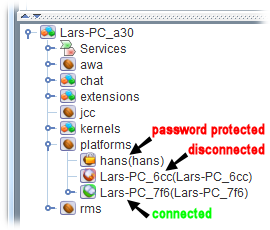
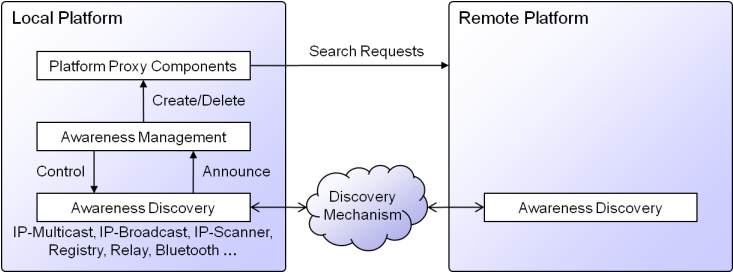

# Platform Awareness

Platform awareness allows for automatic discovery of other platforms in the network. Depending on the enabled discovery mechanisms a platform will be capable of detecting others only within the same LAN or also globally. In Jadex, awareness is introduced by so called proxy components, which are local component representatives of a remote platform. Having a proxy component of another platform will integrate this remote platform transparently, i.e. given that security settings do not restrict access to the remote platform, its services can be discovered and used by local components. The concept of proxy components makes handling interactions with remote components rather simple. On the one hand these proxies can be created automatically by the awareness component and on the other hand a proxy can also be created manually given that the platform name and transport addresses are known.  

  
*Proxy components in Starter*

In the screenshot of the JCC Starter shown above, it can be seen that platform proxy components are shown as subcomponents of the *platforms* component. In this case three other platforms haven been detected called 'hans', "Lars-PC\_6cc", and 'Lars-PC\_76f'. The user interface also visualizes the state of the remote components. The first component is connected but password protected (lock icon) so that it cannot be directly accessed or inspected. The second platform was found but communication is disturbed, e.g. the other platform could have been terminated or a network or communication problem exists. The screenshot shows that a component named 'awa' exists, which is the default name for the awareness component. 

Awareness Architecture
-----------------------------------

  
*Awareness architecture*

The awareness component is functionally split into a management and a discovery part. The management part is responsible for creating and deleting proxy components on the local platform whenever changes occur. These changes are detected by possibly different discovery components employing different kinds of discovery mechanisms. The discovery mechanisms have the task to distribute awareness infos of the own platform and also receive such infos from other platforms. Whenever a discovery component receives a new awareness info it will forward the info to the management component. The managment component integrates the awareness infos of different sources and creates a new proxy if necessary. In addition, the management component uses lease times (contained in the awareness infos) to calculate the proxy validity. If no fresh awareness info is received after this timepoint has passed the management component will delete the proxy (with some delay tolerating latencies). Currently the following discovery mechanisms are available (base package *jadex.base.service.awareness.discovery* in module *jadex-platform-base*):

-   **Local discovery** (enabled per default, local machine): The local discovery uses a file-based mechanism to detect platforms running on the same host.
-   **Broadcast discovery** (enabled per default, local network): Uses IP broadcast to announce awareness infos. It uses the default port '55670'. As IP broadcast is only availble in IPV4 networks this mechanism will not work in pure IPV6 environments.
-   **Multicast discovery** (enabled per default, local network): This mechanism uses IP multicasts to find other platforms. Per default it uses multicast address 224.0.0.0 and port 55667. As multicast requires receivers to register at the multicast address this mode does not send packets to other no Jadex nodes in the network.
-   **IP-Scanner discovery** (disabled per default, local network): The scanner tries to find out the network type and send awareness infos to IP addresses within the network. The default port the scanner uses is 55668. Please note that ip scanning might conflict with the policies of your network administrator. First, the scanner floods the network with messages and second sending out messages to a bunch of network ips is sometimes considered to be an indication for virus behavior. For these reasons the scanner is deactivated per default.
-   **Registry discovery** (disabled per default, global network): The registry mechanism allows for using a dedicated registry platform at which all other platforms register at runtime (using the address argument). The registry distributes its entries to all platforms. If you want to use the registry you should provide it with a unique platform id (otherwise it will use some fallback that is not guaranteed to be online).
-   **Message discovery** (enabled per default, global network): Message discovery is based on message receipt of other platforms. Whenever a message is received the message service will forward it to this discovery agent which subsequently announces a new platform. Using message discovery is especially beneficial in asymmetric network settings, in which one partner can find the other but not vice versa. This e.g. occurs with broadcast or multicast in virtual networks using NAT (e.g. VirtualBox or Android emulator).
-   **Relay discovery** (enabled per default, global network): The relay discovery is based on a web server that is used as a common rendezvous point for the platforms, i.e. the web server distributes awareness infos among the currently connected nodes. Per default the relay uses a server from [${URLRelay}](${URLRelay}). It is also possible to setup an own server using the Relay Standalone Distribution from the downloads section (Jadex Pro Only), which allows for building up private platform networks.

*Note: * Experience has shown that the functioning of awareness mechanisms heavily depends of the concrete network infrastructure used. For this reason it is beneficial to enable multiple of them in order to get a robust setup. 

Configuration
--------------------------

Awareness can be turned on/off by using: 

```PlatformConfiguration.setAwareness()```  
or on commandline:  
```-awareness <true|false>```

This will start the platform with or without the awareness component. If you want to disable awareness at runtime it is sufficient to kill the 'awa' component. On the other hand it is also possible to enable awareness at runtime by starting the awareness component (*jadex.base.service.awareness.management.AwarenessManagementAgent*) contained in the module *jadex-platform-base*. In addition to the global awareness setting it is also possible to determine the awareness mechanisms that should be used. This can be done by using: 

```PlatformConfiguration.setAwaMechanisms()```  
or on commandline:  
```-awamechanisms new String\[\]{"Broadcast", "Multicast", "Message", "Relay"}```

At runtime the currently active awareness mechanisms can be seen by looking at the subcomponents of the awareness management component. To deactivate or activate mechanisms at runtime again subcomponents can be started or stopped. Furthermore, the delay between awareness announcements can be configured using ```PlatformConfiguration.setAwaDelay()``` or the ```-awadelay``` parameter, which per default is 20 seconds. This delay is propagated down to all awareness mechanisms at startup. At runtime the awareness settings can be further customized. For this puropose the awareness settings JCC plugin is available. 
