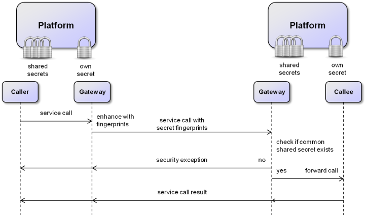
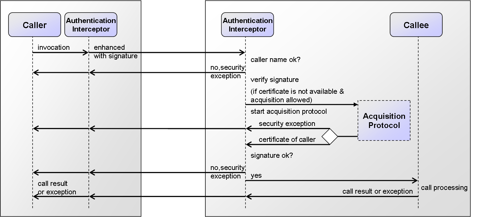

# Security

Regarding security two different levels have to be distinguished: the **platform** and **application** level. The first is concerned with mechanisms for protecting a platform against unauthorized access and the latter deals with security aspects for services.

Platform Level Security
------------------------------------



*Platform security scheme*

Platform level security is based on platform secrets, which are defined as platform passwords or networks. If no user defined password for a platform exists, the platform generates a random password at startup. This password can be changed later on using the [security settings tool](../../../tools/05 Security Settings/)). The platform password as well as other secrets are saved in cleartext in the platform settings file located in the Jadex start folder. This implicates that this folder should also be secured and not be accessible for potential attackers.

Service communication between platforms is only possible if the service caller and the callee share a common secret. On the one hand, a shared secret can be established when the caller knows the platform password of the callee, on the other hand common secrets can be defined in the form of network names and (optional) passwords. If both platforms know at least one common platform name (password) combination communication is also possible. The network names may be completely virtual (such as 'mynetwork') or correspond to the IP network identifier (such as 134.11.100.0) for a class C IP4 network. Please note that collisions may occur with NAT based IP network names (such as 192.168.0.0) and for production environments, IP based network names should not be used without additional password, because these network names can be guessed easily by potential attackers.

The general communication scheme is depicted in the figure above. The service call of a **caller** from a platform to a **callee** on another platforms is processed in multiple steps. In a first step the call arrives (transparently for the caller) at a local **gateway** of the first platform. This gateway enhances the call with fingerprints of all currently known secrets, i.e. it computes salted hashcodes (currently SHA-384) of all the secrets and adds them to the call. On the receiving platform side the call reaches first again the gateway of this platform and will be checked. This is done by iterating over all known secrets and also computing the salted hashcode of them. It is then checked for each hashcode if it is contained in the set of fingerprints sent with the call. This scheme continues until the first matching fingerprint was found or no match could be identified. In the first case, the call is allowed and is forwarded to the intended callee component, which will subsequently process the call and return the result. In contrast, in the latter case it has been determined that no common secret could been found. This implicates that the service call is immediately rejected and a security exception is raised as result of the call.

Application Level Security
=======================================

On application level different security settings can be used including access restrictions and security characteristics of services.

Service Access Restrictions
----------------------------------------

Per default all services are inaccessible from callers outside of the own platform that do not own a shared secret. In order to customize the access restrictions of a service as a whole or single methods of a service the *@Security* annotation can be used. The following settings can be made:

-   ***@Security(Security.PASSWORD)***: Access to a service or service method is only possible if the caller knows a shared secret (as described above).
-   ***@Security(Security.UNRESTRICTED)***: Access to a service or service method is possible in any case (no protection).

**Note:** Currently, per default a service interface is restricted. This means that service searches from callers with no shared secret will not proceed in that case even if single methods of the service are declared as unrestricted. To achieve an inclusion of a service in a search from an untrusted caller its interface has to be declared as unrestricted.

A small example code snippet is shown below for an artificial information service. This service offers a method to retrieve public information about a resource and another one for private info that is available for trusted platforms only. For this reason the service itself has been made unrestricted (in this way all components may find the service) but the *getPrivateInfo()* method has been made password protected.


```java

@Security(Security.UNRESTRICTED)
public interface IInformationService
{
  public IFuture<String> getPublicInfo(String id);

  @Security(Security.PASSWORD)
  public IFuture<String> getPrivateInfo(String id);
}

```


Security Characteristics
-------------------------------------

Security characteristics of services refer to security objectives like confidentiality, integrity, and authentication. Currently, the following annotations are provided:

-   ***@SecureTransmission***: Ensures confidentiality and integrity of the data within the service call.
-   ***@Authenticated***: Ensures that only specific caller (platforms) can access a service method.

### Secure Transmission

In order to ensure the confidentiality and integrity of a service call, the coressponsing call is sent only via transport protocols that provide these characteristics. This means that the security objectives are annotated to the call and the available transport protocols are selected with respect to those requirements. Currently, the local transport (for calls within one platform) and the SSL transport offer a secure channel that provides these characteristics. (**Note:** The SSL transport is part of the Jadex pro version).

An example usage of the annotation is shown below:


```java

public interface ISecurityService
{
  @SecureTransmission
  public IFuture<String> getLocalPassword();
}

```


In the example a small cutout of the *ISecurityService* of the Jadex platform is shown. In order to handle password changes from a user interface the interface has several methods that need to transfer the password via a service call. To make this call immune against eavesdropping the @SecureTransmission is annotated to the corresponsing methods such as *getLocalPassword()*.

### Authentication

Authentication can be used to ensure that only platforms with proven identity can access specific services and service methods. Authentication in Jadex relies on a **platform certificate** which is automatically generated as self-signed version if none is available. Jadex uses a local Java key store to store and retrieve its certificates, i.e. its own as well as certicates of other platforms. Certificate management can either be done automatically or manually by using the security settings plugin of the JCC. The *@Authenticated* annotation allows for specifying two parameters called *names* and *virtuals* both of type string array. As names an arbitrary number of trusted **platform prefix names** (i.e. the name without the autogenerated suffix "\_xyz") can be specified. The virtuals parameter **virtual platform names** can be given. These virtual names are mapped to real platform prefix names via a mapping table that needs to be supplied at platform startup. The virtual names have been introduced because otherwise the allowed platform names must be hardcoded within the Java code, which is not desirable e.g. if different installations of the same software need to be performed.     

An example usage of the @Authenticated annotation is shown below (from :


```java
public interface ITestService
{
  @Authenticated(names={"alphaplat", "betaplat"}, virtuals="testuser")
  public IFuture<String> getDBPassword(String user);
}
```
  

In this example the method *getDBPassword()* is equipped with an authenticated annotation that restricts access to platforms with the name "alphaplat" and "betaplat" and all platforms that can be mapped from the virtual name "testuser". Please note, that it is also possible to just declare the @Authenticated annotation in the interface without giving any names. This keeps the interface totally clean of implementation details. The service implementation then has to provide the annotation again and provide the names that are permitted. In case a call is received that could not be authenticated a security exception is raised. In case virtual names are used the name mapping can be provided as map via the platform start parameter **virtualnames** as follows:  

**-virtualnames "jadex.commons.SUtil.createHashMap(new String\[\]{\\"testuser\\"}, new Object\[\]{jadex.commons.SUtil.createHashSet(new String\[\]{\\"willi\\", \\"hans\\"})})"**

Here the methods createHashMap() and createHashSet() of Jadex commons are used, but of course any other method call could also be employed that creates a map of the form Map&lt;String, Set&lt;String&gt;&gt;. In the example, the virtual name "testuser" is mapped to the two real platform names "willi" and "hans". Please note, that the text above encloses the argument in quotation marks and escape the contained quotation marks to ensure that it is parsed as one element.

#### Authentication Protocol

The protocol that realizes the authentication is described next. It relies on the communication scheme shown below:

  
* Authentication mechanism*

The protocol shows how an authenticated call is performed between a caller and a callee. It has to be noted that the invocation mechanism is completely transparent to the caller and callee, except for the fact that the caller may receive a security exception in case it could not be authenticated or is not allowed to call the service. The invocation is first catched by the caller's authentication interceptor to compute and add the signature to the call. It is then forwarded to the caller and processed by the authentication interceptor of the callee side. The interceptor will first check if the caller's platform prefix name fits to one of the names stated within the annotation of can be mapped via the virtual names. If this is not the case the call will be rejected immediately and return with a security exception. Otherwise, the interceptor begin with the verifcation of the call. For this purpose it needs the public certificate of the caller's platform. If it is not available via the local key store, depending on the security settings, a certificate acquisition protocol will be initiated. This protocol has the aim to fetch the caller's certificate in a secured way and add it to the store. In acquisition has been disabled or the acquisition failed the authentication process is terminated with a security exception. Otherwise the certificate is used to check the signature and depending on the result the call is either rejected again with an exception or forwarded to the callee for service processing. The call result (a normal result or an application level exception) is subsequently returned to the caller.  

#### Certificate Acquisition Protocols

In case of installations consisting of multiple Jadex platforms the question arises how trusted platform certificates can be distributed among the platforms. The most secure way is to export the platform certificates to files (e.g. via the security settings in the JCC) and install them manually on each other platform. To reduce the amount of manual work also other automatic distribution schemes can be used. Currently, Jadex comes with the following two different acquisition mechanisms:

-   **Decentralized acquisition**: The decentralized protocol asks all currently available platforms for a certificate of a platform. It collects the results and checks whether they are equal. In the protocol the number of received answers before it will install a certificate, can be adjusted. If the number is set to e.g. three, the protocol will wait for three certificate answers and compare those. If it is set to one, the mechanism will install the certificate without comparing it to any other answer. Such a scheme is insecure if performed in open networks, but if used in an intra net for an initial certificate distribution, this setting can be very helpful. In production, certificate acquisition could then be set to a higher number or it could be disabled completely. 
-   **Trusted third party (TTP) acquisition**: This mechanism relies on a dedicated trusted third party platform, which knows the certificates of all platforms in the own network environment. In case a client platform requires a certificate it will just ask the TTP for it. To make this scheme completely secure the communication with the TTP should be authenticated itself. This means that each client platform has to know two certificates (its own and the TTP certificate). The TTP certificate can be either manually installed or it can be directly fetched via the security settings gui in the JCC, given that client and TTP platform are online.

