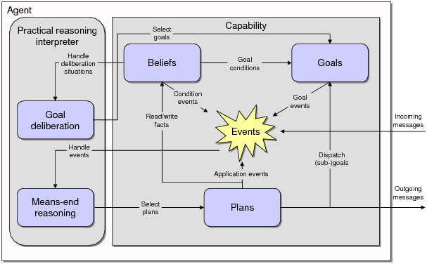
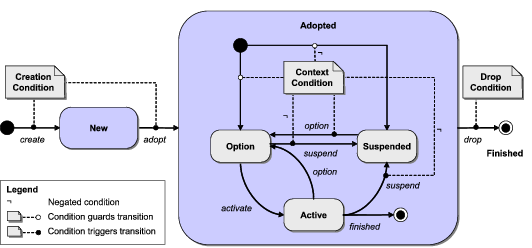
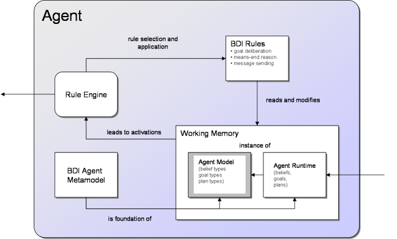

# Concepts

This chapter shortly sketches the scientific background of Jadex and describes the concepts, and the execution model of Jadex agents.

# The BDI Model of Jadex

Rational agents have an explicit representation of their environment (sometimes called world model) and of the objectives they are trying to achieve. Rationality means that the agent will always perform the most promising actions (based on the knowledge about itself and the world) to achieve its objectives. As it usually does not know all of the effects of an action in advance, it has to deliberate about the available options. For example a game playing agent may choose between a safe action or an action, which is risky, but has a higher reward in case of success.

To realise rational agents, numerous deliberative agent architectures exist (e.g. BDI [Bratman 87]), AOP [Shoham 93] and SOAR [Lehman et al. 96] to mention only the most prominent ones. In these architectures, the internal structure of an agent and therefore its capability of choosing a course of action is based on mental attitudes. The advantage of using mental attitudes in the design and realisation of agents and multi-agent systems is the natural (human-like) modelling and the high abstraction level, which simplifies the understanding of systems [McCarthy 79].

Regarding the theoretical foundation and the number of implemented and successfully applied systems, the most interesting and widespread agent architecture is the Belief-Desire-Intention BDI architecture, introduced by Bratman as a philosophical model for describing rational agents [Bratman 87]. It consists of the concepts of *belief*, *desire*, and *intention* as mental attitudes, that generate human action. Beliefs capture *informational* attitudes, desires *motivational* attitudes, and intentions *deliberative* attitudes of agents. [Rao and Georgeff 95] have adopted this model and transformed it into a formal theory and an execution model for software agents, based on the notion of beliefs, goals, and plans.

Jadex facilitates using the BDI model in the context mainstream programming, by introducing beliefs, goals and plans as first class objects, that can be created and manipulated inside the agent. In Jadex, agents have beliefs, which can be any kind of Java object and are stored in a beliefbase. Goals represent the concrete motivations (e.g. states to be achieved) that influence an agent's behavior. To achieve its goals the agent executes plans, which are procedural recipes coded in Java. The abstract architecture of a Jadex agent is depicted in the following Figure 1.

*Figure 1: Jadex abstract architecture*

Reasoning in Jadex is a process consisting of two interleaved components. On the one hand, the agent reacts to incoming messages, internal events and goals by selecting and executing plans (means-end reasoning). On the other hand, the agent continuously deliberates about its current goals, to decide about a consistent subset, which should be pursued.

The main concepts of Jadex are beliefs, goals and plans. The beliefs, goals and plans of the agent are defined by the programmer and prescribe the behavior of the agent. E.g., the current beliefs influence the deliberation and means-end reasoning processes of the agent, and the plans may change the current beliefs while they are executed. Changed beliefs in turn may cause internal events, which may lead to the adoption of new goals and the execution of further plans. In the following the realisation of each of these main concepts in Jadex will be shortly described.
  
# The Beliefbase

The beliefbase stores believed facts and is an access point for the data contained in the agent. Therefore, it provides more abstraction compared to e.g. attributes in the object-oriented world, and represents a unified view of the knowledge of an agent. In Jadex, the belief representation is very simple, and currently does not support any (e.g., logic-based) inference mechanism. The beliefbase contains strings that represent an identifier for a specific belief (similar to table names in relational databases). These identifiers are mapped to the beliefs values, called facts, which in turn can be arbitrary Java objects. Currently two classes of beliefs are supported: simple single-fact beliefs, and belief sets. Beliefs and belief sets are strongly typed, and the beliefbase checks at runtime, that only properly typed objects are stored.

On top of this simple belief representation, Jadex adds several advanced features, such as an OQL-like query language (adopted from the object-relational database world), conditions that trigger plans or goals when some beliefs change (resembling a rulebased programming style), and beliefs that are stored as expressions and evaluated dynamically on demand.

# The Goal Structure

Unlike traditional BDI systems, which treat goals merely as a special kind of event, goals are a central concept in Jadex. Jadex follows the general idea that goals are concrete, momentary desires of an agent. For any goal it has, an agent will more or less directly engage into suitable actions, until it considers the goal as being reached, unreachable, or not desired any more. Unlike most other systems, Jadex does not assume that all adopted goals need to be consistent to each other. To distinguish between just adopted (i.e. desired) goals and actively pursued goals, a goal lifecycle is introduced which consists of the goal states *option*, *active*, and *suspended* (see Figure 2).

*Figure 2: Goal life cycle*

When a goal is adopted, it becomes an option that is added to the agent's desire structure. Application specific goal deliberation mechanisms are responsible for managing the state transitions of all adopted goals (i.e. deciding which goals are active and which are just options). In addition, some goals may only be valid in specific contexts determined by the agent's beliefs. When the context of a goal is invalid it will be suspended until the context is valid again.

Four types of goals are supported by the Jadex system: Perform, achieve, query, and maintain goals as introduced by JAM [Huber 99]. A *perform goal* states that something should be done but may not necessarily lead to any specific result. For example, a waste-pickup robot may have a generic goal to wander around and look for waste, which is done by a specific plan for this functionality. The *achieve goal* describes an abstract target state to be reached, without specifying how to achieve it. Therefore, an agent can try out different alternatives to reach the goal. Consider a player agent that needs certain resources in a strategy game: It could choose to negotiate with other players or try to find the required resources itself. The *query goal* represents a need for information. If the information is not readily available, plans are selected and executed to gather the needed information. For example a cleaner robot that has picked up some waste needs to know where the next waste bin is located. If it already knows the location it can directly head towards the waste bin, otherwise it has to find one, e.g by executing a search plan. The *maintain goal* specifies a state that should be kept (maintained) once it is achieved. It is the most abstract goal in Jadex. Not only does it abstract from the concrete actions required to achieve the goal, but also it decouples the creation and adoption of the goal from the timepoint when it is executed. For example the goal to keep a reactor temperature below a certain level is a maintain goal that gets triggered whenever the temperature exceeds the normal operating level. As with achieve and query goals, to (re)establish the desired target state of a maintain goal, the agent may try out several plans, until the state is reached.

In Jadex BDI, goals are represented as objects with several attributes. The target state of achieve goals can be explicitly specified by an expression (e.g., referring to beliefs), which is evaluated to check if the goal is achieved. Attributes of the goal, such as the name, facilitate plan selection, e.g. by specifying that a plan can handle all goals of a given name. Additional (user-defined) goal parameters guide the actions of executing plans. For example in a goal to search for services (e.g. using the FIPA directory facilitator service), additional search constraints could be specified (such as the maximum cardinality of the result set). The structure of currently adopted goals is stored in the goalbase of an agent. The agent has a number of top-level goals, which serve as entry points in the goalbase. Goals in turn may have subgoals, forming a hierarchy or tree of goals.

# Plan Specification

The concrete actions an agent may carry out to reach its goals are described in plans. An agent developer has to define the head and the body of a plan. The head contains the conditions under which the plan may be executed and is specified in the agent definition file. The body of the plan is a procedural recipe describing the actions to take in order to achieve a goal or react to some event. The current version of Jadex supports plan bodies written in Java, providing all the flexibilities of the Java programming language (object-oriented programming, access to third party packages, etc.). At runtime, plans are instantiated to handle events and to achieve goals. Activation triggers in the plan headers are used to specify if a plan should be instantiated when a certain event or goal occurs. In addition, so called initial plans get executed when the agent is born. During the execution of the plan body, running plans may not only execute arbitrary Java code but can also dispatch subgoals and wait for events to occur.

# Agent Definition

The complete definition of an agent is captured in a so called *agent definition file* (ADF). The ADF is an XML file, which contains all relevant properties of an agent (e.g. the beliefs, goals and plans). In addition to the XML tags for the agent elements, the developer can use expressions in a Java-like syntax for specifying belief values and goal parameters. The ADF is a kind of a class description for agents: From the ADF agents get instantiated like Objects get instantiated from their class. For example, the different player agents from BlackJack (src/jadex/bdi/examples/blackjack) share Player.agent.xml as their definition file.

 
For each element ADF in the all important properties can be defined as attributes or subtags. For example, plans are declared by specifying how to instantiate them from their Java class (body tag), and a trigger (e.g. event) can be stated, that determines under which conditions a plan gets executed. Moreover, in the ADF, the initial state of an agent (how the agent should look like, when it is born) is determined in a so called configuration, which defines the initial beliefs, initial goals, and initial plans.

# Execution Model of a Jadex Agent
  
This sections shows the operation of the reasoning component, given the Jadex BDI concepts. Since version 0.93 Jadex does not employ the classical BDI-interpreter cycle as described in the literature [Rao and Georgeff 95] but uses a new execution scheme (described more extensive in [Pokahr and Braubach 09]). In Jadex V2 the interpreter is a rule based system operating on a set of predefined BDI rules. The basic mode of operation is simple: The agent selects an activation (a triggering rule) from the agenda and executes the corresponding action. The BDI interpreter is depicted in the following figure.

*Figure 3: Jadex BDI interpreter architecture*

The working memory of a BDI agent consists of two parts: the agent model and the agent runtime state. The agent model represents the type definition of a BDI agent and determine which beliefs, plans and goals (besides other elements) an agent possesses. In the runtime state concrete instances of these model elements are contained, e.g. belief values, specific goals and plans. The conceptual foundation of how an agent model and instance should look like is defined in the BDI agent metamodel. 

Advantages of the new rule based approach are that the new mechanism offers a much higher degree of extensibility and flexibility as new functionalities such as emotions or team behaviour can be added as new set of rules without having to change the interpreter itself. One concrete effect already contained in this version is the support for goal deliberation via the "Easy Deliberation" strategy, which allows users to define which goals inhibit others to ensure that the active set of currently pursued goals by the agent is always consistent.
