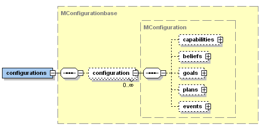
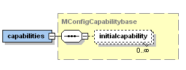
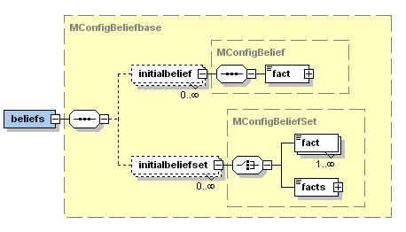
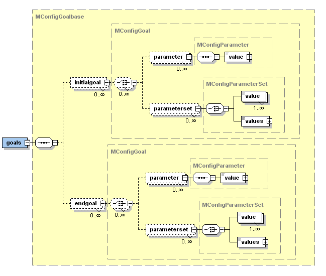
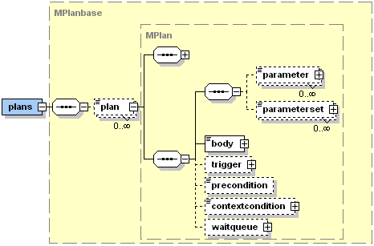
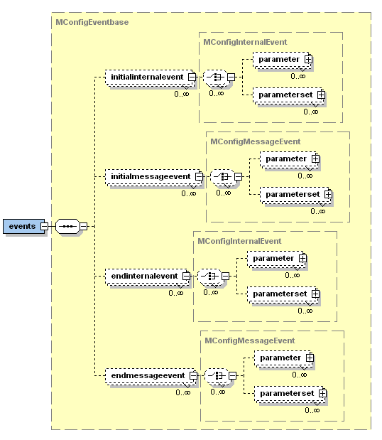

# Configurations

${SorryOutdated}

Configurations represent both the initial and/or end states of an agent type. Initial instance elements can be declared that are created when the agent (resp. the capability) is started. This means that initial elements such as goals or plans are created immediately when an agent is born. On the conatrary, end elements can be used to declare instance elements such as goals or plans that will be created when an agent is going to be terminated. After an agent has been urged to terminate (e.g. by calling *killAgent()* from within a plan or by an CMS *cms_destroy_component* goal), all normal goals and plans will be aborted (except plans that perform their cleanup code, i.e. execute one of the *passed()*, *failed()* or *aborted()* methods) and the declared end elements will be created and executed.


Instance and end elements always have to refer to some original element via the "ref" attribute. &lt;!~~ Additionally, an optional instance name can be provided via the "name" attribute. This can be useful if the element should be accessible later on via this name.~~> Besides the reference also bindings can be used in combination with initial/end elements. If (at least one) binding parameter is declared instance elements will be created for all possible bindings.


It is possible to declare any number of configurations for a single agent or capability. When starting an agent or including a capability you can choose among the available configurations In the XML portion for specifying configurations is depicted. Each configuration must have a name for identification purposes. The default configuration can be set up by using the *default* attribute of the &lt;configurations> base tag. If no explicit default configuration is specified, the first one declared in the ADF is used.




*The Jadex configurations XML schema part*

A configuration allows to specify various properties. Generally, the configuration allows two different kinds of adaptations. The first one is the creation of instance elements for declared types, e.g., initial resp. end goals or plans. The second one is the configuration of instance elements such as beliefs or capabilities at start time. In the following, the possible settings will be discussed.

## Capabilities

The &lt;capabilities> tag allows to configure included capabilities. For this purpose a reference to an included
&lt;initialcapability> must be declared. The reference to the capability is established by setting the *ref* attribute to the symbolic name of the capability specified within the &lt;capabilities> section of the agent/capability (i.e., not the type name but the instance name). The configuration to be used by the included capability can be set by using the *configuration* attribute of the initial capability tag.




*The Jadex initial capabilities XML schema part*


In the figure below an example is shown how the initial state can be used to declare two different initial states. In state "one" the included capability "mycap" is configured to use its initial state "a", while in state "two" "b" is used. Per default the agent would start using initial state "two" as it is declared as default.


```xml
<agent ...>
  ...
  <capabilities>
    <capability name="mycap" file="SomeCapability"/>
  </capabilities>
  ...
  <configurations default="two">
    <configuration name="one">
      <capabilities>
        <initialcapability ref="mycap" configuration="a"/>
      </capabilities>
    </configuration>
    <configuration name="two">
      <capabilities>
        <initialcapability ref="mycap" configuration="b"/>
      </capabilities>
    </configuration>
  </configurations>
</agent>
```
*Initial capability configuration*

1.1 Beliefs

In the &lt;beliefs> section the initial facts of beliefs and belief sets can be altered or newly introduced. In order to set the initial fact(s) of a belief or belief set an &lt;initialbelief> resp. an &lt;initialbeliefset> tag should be used. The connection to the "real" belief is again established via the *ref* attribute and the facts can be declared in the same way as default values of beliefs and belief sets. The initial state does not distinguish between original beliefs and references to beliefs from other capabilities, therefore the same tags can also be used to change initial facts of belief references and belief set references as well.




*The Jadex initial beliefs XML schema part*

The example below shows how a configuration can be used to change belief facts. Belief "name" has a default value of "Jim" which is overridden by the initial belief fact "John". The belief set "names" has no default values. In the initial state it is filled with some data from a database. This means that for all results that the method *DB.queryNames()* produces, a new fact is added to the belief set.


```xml
<agent ...>
  ...
  <beliefs>
    <belief name="name" class="String">
      <fact>"Jim"</fact>
    </belief>
    <beliefset name="names" class="String"/>
  </beliefs>
  ...
  <configurations>
    <configuration name="one">
      <beliefs>
        <initialbelief ref="name">
          <fact>"John"</fact>
        </initialbelief>
        <initialbelief set ref="names">
          <facts>DB.queryNames()</facts>
        </initialbelief set>
      </beliefs>
    </configuration>
  </configurations>
</agent>
```
*Initial belief configuration*

1.1 Goals

In the &lt;goals> section  initial and end goals can be specified. Initial goals will be instantiated when an agent is born whereas end goals are created when an agent is beginning the termination phase. This means that a new goal instance is created for each declared initial resp. end goal at the mentioned points in time. The specification of an &lt;initialgoal> and an &lt;endgoal> requires the connection to the underlying goal template which is used for instantiation. For this purpose the *ref* attribute is used. Optionally, further parameter(set) values can be declared by using the corresponding &lt;parameter> and &lt;parameterset> tags.




*The Jadex initial and end goals XML schema part*


In the example below is depicted how an initial and end goal can be created. Both, the initial and end goal refer to the declared "play_song" perform goal of the agent and provides a new parameter value for the song parameter. When the agent is started in this initial state it creates the initial goal and pursues it. So, given that the agent has some plan to play an mp3 file, it will play a welcome song in this example. On the other hand the agent will also play a good bye jingle when it is terminated by creating the corresponding end goal.
  
```xml
<agent ...>
  ...
  <goals>
    <performgoal name="play_song">
      <parameter name="song" class="URL"/>
    </performgoal>
  </goals>
  ...
  <configurations>
    <configuration name="one">
      <goals>
        <initialgoal name="welcome" ref="play_song">
          <parameter ref="song">
            <value>new URL("http://someserver/welcome.mp3")</value>
          </parameter>
        </initialgoal>
        <endgoal name="goodbye" ref="play_song">
          <parameter ref="song">
            <value>new URL("http://someserver/goodbye.mp3")</value>
          </parameter>
        </endgoal>
      </goals>
    </configuration>
  </configurations>
</agent>
```
*Initial and end goals*

1.1 Plans

In the <plans> section initial and end plans can be specified. This means that a new plan instance is created for each declared initial and end plan. The specification of an &lt;initialplan> and &lt;endplan> requires the connection to the underlying plan template which is used for instantiation. For this purpose the *ref* attribute is used. Optionally, further parameter(set) values can be declared by using the corresponding &lt;parameter> and &lt;parameterset> tags.


*The Jadex initial and end plans XML schema part*


In the example is depicted how an initial and end plan can be used. In this case an initial "print_hello" plan is declared which refers to the "print_hello" plan template of the agent. As result the agent will print "Hello World!" to the console on start-up. On the contrary it will also print "Goodbye World" when the agent gets terminated by creating the corresponding end plan.

```xml
<agent ...>
  ...
  <plans>
    <plan name="print_plan">
      <parameter name="text" class="String"/>
      <body class="PrintOnConsolePlan" />
    </plan>
  </plans>
  ...
  <configurations>
    <configuration name="one">
      <plans>
        <initialplan ref="print_hello">
          <parameter name="text">"Hello World!"</parameter>
        </initialplan>
        <endplan ref="print_goodbye">
          <paramter name="text">"Goodbye World!"</parameter>
        </endplan>
      </plans>
    </configuration>
  </configurations>
</agent>
```
*Initial and end plans*

1.1 Events

Finally, in the &lt;events> section initial and end events can be specified. This means that a new event instance is created for each declared initial event after startup of the agent. Additionally, new event instances are created for all declared end events whenever the agent is shutdowned. It is possible to define initial/end internal and initial/end message events (goal events are not necessary as initial goals can be declared). The specification of an &lt;initialinternalevent> resp. an &lt;endinternalevent> or an &lt;initialmessageevent> resp. an &lt;endmessageevent> requires the connection to the underlying event template which is used for instantiation. For this purpose the *ref* attribute is used. Optionally, further parameter(set) values can be declared by using the &lt;parameter> and &lt;parameterset> tags.


  



*The Jadex initial and end events XML schema part*


In the example below it is shown how an initial and end message event can be created. The intial/end message events refer to the underlying message event template "inform_state" and set the parameter values for the content as well as for the receiver accordingly. When an agent named "Harry" is started, it sends an initial message event with the content "Harry is born" to an agent named "Uncle" on the same platform. Likewise it sends the message "Harry is terminating" to "Uncle" when the agent shuts down.
   
```xml
<events>
  <messageevent name="inform_state" type="fipa" direction="send">
    <parameter name="performative" class="String" direction="fixed">
      <value>SFipa.INFORM</value>
    </parameter>
  </messageevent>
</events>
...
<configurations>
  <configuration name="one">
    <events>
      <initialmessageevent ref="inform_state">
        <parameter ref="content">
          <value>$scope.getAgentName()+" is born."</value>
        </parameter>
        <parameterset ref="receivers">
          <value>$scope.getEventbase().createComponentIdentifier("Uncle")</value>
        </parameterset>
      </initialmessageevent>
      <endmessageevent ref="inform_state">
        <parameter ref="content">
          <value>$scope.getAgentName()+" is terminating."</value>
        </parameter>
        <parameterset ref="receivers">
          <value>$scope.getEventbase().createComponentIdentifier("Uncle")</value>
        </parameterset>
      </endmessageevent>
    </events>
  </configuration>
</configurations>
```
*Initial events*
