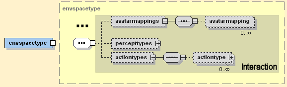
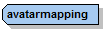
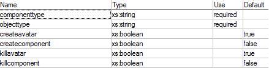
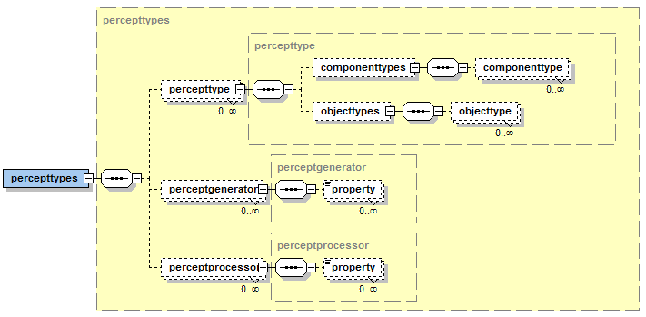
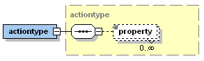

# Component Interaction

In this section the interaction concepts between components and space objects are described. The presented elements are part of the space environment type xml part as introduced in section \[Domain Model>03 Domain Model\]. For convenience the relevant cutout of the xml schema is shown again below.



*Figure 1 Interaction xml schema part of the environment space type*


## Avatar Mapping





*Figure 2 Avatar mappings xml schema part*


The avatar mapping is used to define the relation between space objects (avatars) and components (i.e. agents). This relationship determines what happens when a new space object of a specific type is created/deleted and on the other side what happens when a component is created/deleted. The connection between both can be establisched to mimic the behaviour from one side on the other side, e.g. create also an avatar (a space object) when a new component is created. The default values for the four flags *createavatar*, *killavatar*, *createcomponent*, *killcomponent* are defined in a way that the component side dominates the simulation world, i.e. whatever happens to a component is also done with its avatar in the simulation. If the creation and deletion of space objects should also lead to the creation and deletion of components this has to be explicitly set with the corresponding flags.

The code snippet below shows a fictitious robot example, which creates robot agents whenever a new robot space object is created. Also, for each newly created robot agent an avatar is initiated automatically.

```xml
<env:avatarmapping componenttype="Robot" objecttype="robot" createcomponent="true"/>
```

## Percept Types



*Figure 3 Percept types xml schema part*


Percepts are meaningful events for components, i.e. a percept can be seen as some kind of environment event that is adressed towards a specific kind of component. This means that different kinds of components may receive completely different percepts for the same observed events. Hence, a percept is a concept that connects a component with the environment. For this reason percept types include several aspects in EnvSupport. On the one hand, the basic kinds of percepts can be defined (inner percept types tag). On the other hand percept generators and processors need to be specified. A percept generator is responsible for creating percepts (based on the available percept types) and thus attached to the environment. These percepts are then consumed by components using percepts processors, which may depend on the concrete component type. E.g. a bdi agent percept processor can directly store newly arriving percepts in fitting beliefs or beliefsets.


A percept type is described using a *name* attribute for percept type identification. Using the *objecttype* attribute (or tags for multiple types) the underlying meaning of the percept can be defined. The *componenttype* attribute (or tags for multiple types) is useful for specifying the component types that can generally perceive such kind of percept. Property tags can be employed for parametrization as for most other elements. 

### Percept Generators

A percept generator is defined using *name* and implementation *class* attributes. An implemeting class has to extend the *IPerceptGenerator* interface. Currently, with the *DefaultVisionGenerator* (package jadex.application.space.envsupport.environment.space2d) a quite powerful default implementation for a percept generator, capable of creating vision range dependent percepts, exists. 


```xml
<env:perceptgenerator name="visiongen" class="DefaultVisionGenerator">
  <env:property name="range">0.1</env:property>
  <env:property name="range\_property">"vision_range"</env:property>
  <env:property name="percepttypes">
    new Object[]
    {
      new String[]{"cleaner_moved", "moved"},
      new String[]{"waste_appeared", "appeared", "created"},
      new String[]{"waste_disappeared", "destroyed"},
      new String[]{"wastebin_appeared", "appeared", "created"},
      new String[]{"wastebin_disappeared", "destroyed"},
      new String[]{"chargingstation_appeared", "appeared", "created"},
      new String[]{"chargingstation_disappeared", "destroyed"}
    }
  </env:property>
</env:perceptgenerator>
```
*Default vision generator example from cleanerworld example*


In the code snippet above an example for a vision generator specification is shown. The configuration of the default vision generator in done using the *range*, *range\_property* and *percepttypes* properties. The range determines the radius of the vision the avatar can perceive (all elements within the radius can be seen). In order to find out what range to use the following steps are performed: 1) try to get the range as property from the avatar using the range\_property (if not specified "range" ist tried) 2) if no range value could be obtained the default range is used by fetching the *range* property of the vision generator. 


The percept types are defined using String arrays of the form of a perceptname and an arbitrary number of actionnames. In order to find the correct percept type for a specific event consisting of *componenttype*, *objecttype* and *actiontype* the percepttype defined in the space is fetched and it is checked if the componenttype and objecttype of the event fit to those of the percepttype. Thereafter, the actiontype of the event is compared with those declared in the vision processor. Please note the the default vision processor supports the following action types:

-   **created:** A space object has been created.
-   **destroyed:** A space object has been destroyed.
-   **appeared:** A space object came into the vision range and was not seen before.
-   **disappeared:** A space object moved out the vision range and was seen before.
-   **moved:** A space object changed its position. 

### Percept Processors

A percept processor is specified using *componentype* and implementation *class* attributes. The first is used to define in component types the percepts shall be injected. The latter has to extend the *IPerceptProcessor* interface shown below.

```java
package jadex.application.space.envsupport.environment;

public interface IPerceptProcessor extends IPropertyObject
{
  public void processPercept(IEnvironmentSpace space, String type,
    Object percept, IComponentIdentifier component, ISpaceObject avatar);
}
```

For BDI agents a default implementation called *DefaultBDIVisionProcessor* exists.

```xml
<env:perceptprocessor componenttype="Cleaner" class="DefaultBDIVisionProcessor" >
  <env:property name="percepttypes">
    new Object[]
    {
      new String[]{"cleaner_moved", "remove_outdated", "wastes"},
      new String[]{"waste_appeared", "add", "wastes"},
      new String[]{"waste_disappeared", "remove", "wastes"},
      new String[]{"wastebin_appeared", "add", "wastebins"},
      new String[]{"wastebin_disappeared", "remove", "wastebins"},
      new String[]{"chargingstation_appeared", "add", "chargingstations"},
      new String[]{"chargingstation_disappeared", "remove", "chargingstations"}
    }
  </env:property>
</env:perceptprocessor>
```
*Default vision processor example from cleanerworld example*


In the code snippet above an example for a vision processor specification is shown. The configuration of the default vision processor is done using the *range*, *range\_property* and *percepttypes* properties. The first two range properties are only of importance for the "remove\_outdated" action as here the objects that are not seen any longer need to be determined. The concrete range is determined in the same way as explained in the text of vision generators. The syntax for specifying the percepttypes is *perceptname, action, belief(set)name, conditionname*. It means that the action will be executed when the named percept occurs and the condition evaluates to true. The condition itself has to be spercified as named property of the vision processor. The available actions are shown below.

-   **add:** Add a percept to a beliefset.
-   **remove:** Remove a percept to a beliefset.
-   **remove\_outdated:** The remove\_outdated action checks all entries in the belief set, if they should be seen, but are no longer there.
-   **set:** Set the percept as fact of a belief.
-   **unset:** Set a belief to null.

## Action Type



*Figure 4 Action type xml schema part*

Action types are used for specifying which kinds of action can be issued on an environment. It is also uniquely defined by a type *name* and additionally an action *class*. This action class has to implement the *ISpaceAction* interface (package 'jadex.application.space.envsupport.environment') and is itself an extension of the *IPropertyObject* (package 'jadex.commons') interface. The interface ISpaceAction only contains one method that has to be implemented by all action types. It is named *perform(Map parameters, perform(Map parameters, IEnvironmentSpace space)* and should contain the procedural code for the action. It has access to the space itself via the *IEnvironmentSpace* interface (you can cast if you need a concrete subclass) and to a map of action type specific parameters (name - value pairs). The *IPropertyObject* interface requires the action type to have getter and setter methods for properties. This allows a very flexible way of action type configuration from the xml. The declared property values in the xml can directly be accessed via the *getProperty(String name)* method.
