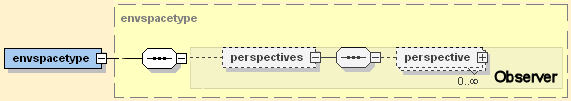
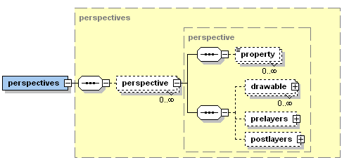
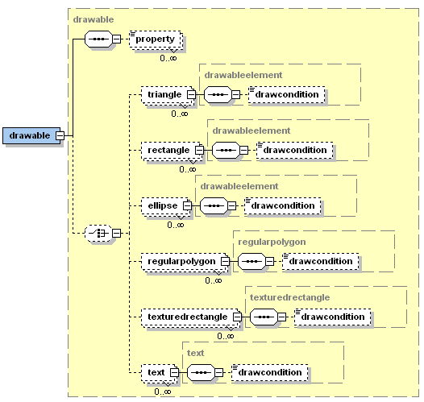
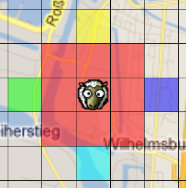
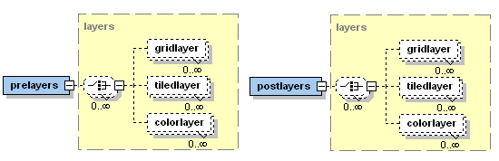

# Visualization

In this section the visualization concepts between components and space objects are described. The presented elements are part of the space environment type xml part as introduced in section [03 Domain Model](../03 Domain Model). For convenience the relevant cutout of the xml schema is shown again below.




*Figure 1 Visualization xml schema part of the environment space type*


The EnvSupport visualization is clearly decoupled from the domain and interaction aspects. It is defined using *perspectives*, whereby multiple perspectives can be specified for the same domain model. At runtime between these perspectives can be switched as needed. A perspective has an identifying *name* attribute and is composed of *property* elements as well as arbitrary many darwables and pre- and postlayers. 



*Figure 2 Perspectives declaration part of XML schema*


## Drawable



*Figure 3 Drawable declaration part of XML schema*


A drawable represents the visual counterpart of a space object type. As can be seen in the schema part above it consists of *property* elements and arbitrary many geometrical shapes composing the look of the object (triangle, rectangle, ellipse, regularpolygon, texturedrectangle and text). The drawable itself is further specified by associating it to a specific *objecttype*. Additionally, the width, height and rotation can be set. Each geometrical shape contained in the drawable is of type *drawableelement* and has the attributes described in the list below.

-   **layer:** An integer for specifying the drawing layer (0 is default).
-   **position:** An IVector2 or String for the 2d position of the object (relative to the drawable size). If it is a String it must be a property name of the drawable the value is bound to.
-   **size:** An IVecor2 or String for the shape size (relative to the drawable size). If it is a String it must be a property name of the drawable the value is bound to.
-   **rotation:** An IVecor3 or String for the rotation according to x, y, z axis (relative to the drawable rotation). If it is a String it must be a property name of the drawable the value is bound to.
-   **x:** The x value of the position (double or int, relative to the drawable x).
-   **y:** The y value of the position (double or int, relative to the drawable y).
-   **width:** The width value of the position (double or int, relative to the drawable width).
-   **height:** The height value of the position (double or int, relative to the drawable height).
-   **rotatex:** The rotation x value of the position (double or int, relative to the drawable rotation x).
-   **rotatey:** The rotation y value of the position (double or int, relative to the drawable rotation y).
-   **rotatez:** The rotation z value of the position (double or int, relative to the drawable rotation z).
-   **abspos:** Absolute position value (IVector2 or String).
-   **abssize:** Absolute size value (IVector2 or String).
-   **absrot:** Absolute rotation value (IVector2 or String).
-   **color:** Color value of the shape (String).


Moreover, some elements have certain special properties, which are not applicable to all Drawables. The easiest way to find out about the properties is to use eclipse's auto-complete to gain an overview. The Text drawable for example may be further customized with these attributes:

-   **font:** The name of the font.
-   **style:** An integer representing the font's style. Use one of Font.PLAIN, Font.BOLD, or Font.ITALIC
-   **size:** An integer for specifying the text's size (12 is default).
-   **align:** The alignment can either be left, right, or center.


### Example

```xml
<env:drawable objecttype="prey" width="1.0" height="1.0">
 <env:texturedrectangle layer="1" width="0.9" height="0.9" imagepath="jadex/micro/examples/hunterprey/images/prey.png" />
 <env:rectangle layer="-1" width="3" height="3" color="#ff00007f" /> <!-- red -->
 <env:rectangle layer="-1" width="1" height="1" x="-2" y="0" color="#00ff007f" /> <!-- green-->
 <env:rectangle layer="-1" width="1" height="1" x="2" y="0" color="#0000ff7f" /> <!-- blue -->
 <env:rectangle layer="-1" width="1" height="1" x="0" y="-2" color="#ffff007f" /> <!-- yellow -->
 <env:rectangle layer="-1" width="1" height="1" x="0" y="2" color="#00ffff7f" /> <!-- turquoise -->
</env:drawable>
```




*Figure 4 Drawable example taken from the hunter prey scenario*


In the example above, one drawable is declared. As you can see in the first line, this drawable is mapped onto objects of type prey and the whole drawable spans exactly one grid cell in width and height. As this drawable represents a prey and its vision, two layers are defined. One layer on which the icon is drawn and below this a layer for the vision. The icon shall be scaled to fill 90% of the grid cell (width=0.9 and height=0.9). The vision consists of five rectangles, a big one spanning 3x3 grid cells and four smaller ones. The x- and y- coordinates represent the horizontal and vertical offset. The color attribute declares, how a rectangle shall be filled, e.g. \#00ff007f reads as 00 (=red), ff (=green), 00 (=blue) and 7f (= alpha, i.e. transparency).


## Pre and post layers



*Figure 5 Pre and postlayer declarations part of XML schema*


Prelayers can be used for displaying graphical background elements. These layers are painted before the drawables and postlayers. On the contrary, postlayers are drawn after all other elements. For both layer groups the above depicted kinds of layers can be defined. A *gridlayer* can be used to paint a grid structure, typically for visualization of Grid2D environments. It is specified using attributes for the *color* of the grid and the *width* and *height* of the grid cells. In contrast, a *tiledlayer* can be used to paint an image repeatedly. It is declared using an *imagepath* for the image file name, *width* and *height* attributes for the tile size and additionally a *color* can be defined. The color is modulated on the tiles and changes the underlying look of the tiles. The simplest layer type is the *color* layer, which is defined by setting *color* attributes. A color layer changes the background color to the selected color value.

### Example


```xml
<!-- Draw the background -->
<env:prelayers>
 <env:tiledlayer width="0.4" height="0.4" imagepath="jadex/micro/examples/hunterprey/images/background.png" />
</env:prelayers>
     
<!-- draw a black grid upon everything -->
<env:postlayers>
 <env:gridlayer width="1.0" height="1.0" color="black" />
</env:postlayers>
```


*Pre- and postlayer example taken from the hunter prey scenario*


In the example above, the prelayer is used to draw the background. In this case an image, which spans only 40% of the overall grid. Because of this, the image is repeatedly drawn horizontally and vertically. If, for example, a street map shall be used, just set width and height to 1.0. The post layer, in contrast to the tiled background layer, is a grid, spanning the whole environment. The row and column count of the grid correspond to the width and height of the *envspacetype*.
