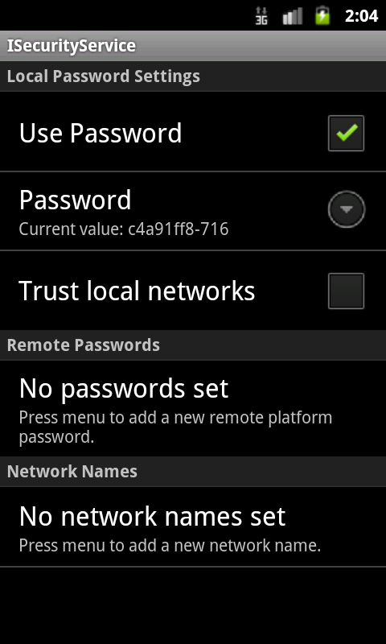

#  Introduction

Jadex Android is a framework for developing software agents running on the Android platform. Agent-Oriented Software Engineering (AOSE) is a software development paradigm especially suited for distributed Systems as the main buildings blocks are constituted by software agents, whose outstanding characteristics are - among others - autonomy, message-based and asynchronous communication, re- and proactivity, social abilities and cooperation. 


From the perspective of an Android developer, there are several advantages of using Jadex.
Communication and thus developing distributed software is made easy, because Jadex provides features such as awareness (auto-discovery of other platforms), remote service calls and secure communication.
Decomposing the software into Active Components allows the developer to migrate compute-intense tasks to a cloud infrastructure without touching interfaces or implementation. 

Most of the content of this guide assumes you are already familiar with Jadex and only discusses Android specifics and additions.

-   [Chapter 2 - Installation](02%20Installation)  describes how to install the required tools and libaries and start development of Jadex Android applications.
-   [Chapter 3 - Using Jadex on Android](03%20Using%20Jadex%20on%20Android) gives an overview of available API functions

## General Notes on Jadex Android

Most of the Jadex features are available on Android, too.
The probably most important difference is that there is no JCC and Android Apps are initialized very differently - you can read more about that in [Chapter 3](03 Using Jadex on Android/#differences-to-the-desktop-version-of-jadex).

You can follow the release notes below to get an impression of the ongoing development, the latest distribution can be found on the [download page](https://www.activecomponents.org/bin/view/Download/Distributions).

### Unsupported Modules

Most notably, there is no JCC and no envsupport available on Android.
This is a more complete list of currently unsupported modules on Jadex Android:

-   jadex-json
-   jadex-kernel-application
-   jadex-kernel-extension-agr
-   jadex-kernel-extension-envsupport
-   jadex-platform-extension-management
-   jadex-platform-extension-maven
-   jadex-platform-extension-securetransport
-   jadex-platform-extension-webservice (REST client is supported)
-   jadex-servletfilter
-   several jadex-tools modules

##  Release Notes

### 3.0.0-RC68
-	Better error messages when generating BDIV3 agents at compile time using jadex-gradle-plugin

### 3.0.0-RC42

-   Ported the jadex-gradle-plugin to the new Transform API (android build tools 2.0.0 required)

### 3.0.0-RC16

-   PlatformConfiguration object for platform configuration
-   Android Studio support (Eclipse support dropped!)

### 2.5-SNAPSHOT

-   mainly working on PlatformApp/ClientApp Separation

### 2.4

-   Maven Plugin to generate BDIV3 Agent code at compile time -&gt; enables the use of BDIV3 on Android.
-   JadexAndroidEvents for dispatching events from Agent to Service/Activity
-   synchronous getsService() method in JadexService
-   awareness set to enabled by default, as it is default on desktop platforms
-   new PlatformApp/ClientApp functionality: separate Jadex Platform into a standalone app.

### 2.3

-   API Changes! Please refer to the example project on how to start the platform.
-   fixed problems with BDI Agents
-   added REST client api + demo (working since 2012-11-14)
-   new demo applications project
-   included chat application

### 2.2.1

-   No specific changes

### 2.1

-   provides a simple control center application (see example project)
-   since 2012-05-31: based on modular jadex distribution instead of separate artifacts (NOTE: Your Android applications will require different dependencies now!)
-   adjusted version numbering to Jadex' Version
-   Jadex-Android uses android xml pull parser now instead of woodstox, reduces memory footprint
-   Jadex-Android stores settings in Android Shared Preferences now. It will, however, prefer properties stored in a default.settings.xml (/data/data/&lt;application package name&gt;/files/default.settings.xml)

### 0.0.5

-   fixed bug, preventing service calls from Desktop-Jadex to Android-Jadex. Please note, that due to the Android emulator's virtual network environment, it is still not possible to call services offered by Desktop-Jadex. You have to manually create a ProxyAgent on the Android device to communicate. On real devices, if you are not in a private Wifi network you need to use Jadex' relay server as broadcasts are generally not supported over the Internet.

### 0.0.4

-   updated maven projects to maven-andoid-plugin-3.0.0-alpha-14 -&gt; supports ADT R15
-   communication between platforms fixed, so remote mobile platform components are visible in JCC
    (This requires the HTTP Relay Transport to be enabled if running in an emulator)
-   added AndroidSettingsService for File Access on Android Devices
-   introduced AndroidContextService to provide access to android files
-   Security Service is active by default. The generated Plattform Password will be written to LogCat and saved in
    */data/data/<packagename\>/files/<platformname\>.settings.xml*.
    To disable the Security Service, just uncomment the Service in your platform.component.xml

### 0.0.3

-   uses Woodstox XML Parser instead of broken StaX reference implementation

# Installation

This document will guide you through the setup that is necessary to develop applications using Jadex-Android.

**Please [report](${URLJadexForum}) ** any difficulties or errors in this document as well as in the provided *jadex-android* libraries.

## Requirements

- Java JDK, tested with JDK 7. On Linux, look for packages from your distributor. On Windows, get the JDK from [Oracle](http://www.oracle.com/technetwork/java/javase/downloads/index-jsp-138363.html#javasejdk).
- Android Studio (currently tested with ${AndroidStudioTestedVersion}) from [here](http://developer.android.com/sdk/index.html) (Be sure to download **Android Studio**, not only the SDK)
- Android SDK (usually included in Android Studio)
- Latest Jadex Android distribution (release or nightly) from the [downloads page](https://www.activecomponents.org/bin/view/Download/Distributions) 

### **Note for 64-bit Ubuntu installations:**
> If you have a 64bit ubuntu distributions, install the following packages first:  
> ```sudo apt-get install lib32stdc++6 lib32z1```

### Install Android Studio
First, set the *JAVA_HOME* environment variable to your JDK (This may be done automatically).

To install Android Studio, just extract it and execute *studio.sh* or *studio.exe* located in the *bin/* directory.  
On the first start, you can decide whether to import settings from a previous version. Choose *I do not have a previous version* if this is your first installation and click *OK*.  
Complete the Setup Wizard. Be sure to pay attention to the page named **Emulator Settings**, which provides information on how to speed up the Android emulator.  
After Android Studio has downloaded the necessary SDK components, it will show a welcome screen.

## Extract the Jadex distribution

- Install Android Studio, following the descriptions from their download page.
- Extract the jadex-android-*version*.zip. You will see two example projects in the extracted directory.
- Extract *jadex-android-example-project-gradle.zip*. It contains a Jadex Android example project, which can be opened in Android Studio.

## Import the example project in Android Studio

Open Android Studio.
If you see a welcome screen, choose *Import project*.  
If you already have another project opened, choose *File -> Open*.

Navigate to the folder which contains the extracted the example project and click *OK*.  
If Android Studio asks whether to open the project in a new window, choose *New Window*, if unsure.  
Android Studio should now import the project, download all necessary libraries and build the example project.

### Download required SDK Platform
If you get an error like this:

    Error: Cause: failed to find target with hash string 'android-21' in: [...]
    *Open Android SDK Manager*  
Open the SDK Manager by clicking on the provided link inside the error message, click the checkbox next to the SDK Platform with the API Level given in the error message (e.g. choose **Android 5.0.1** for API Level **21**) and click *OK*.  
The required SDK platform will be downloaded and the project should build sucessfully.

## Setting up an Android Virtual Device (AVD)
If you haven't set up an Android Virtual Device at this point, follow this instructions.  
Open the AVD manager by clicking on . Click on *Create Virtual Device* and follow the instructions.  
We recommend to choose a device which supports an API Level of **21**.  
Choosing an x86 ABI will result in a faster emulator, but can only run if hardware emulation is enabled on your system.
Read more about this in the [Emulator documentation](http://developer.android.com/tools/devices/emulator.html#accel-vm)

## Run example Project

When successfully imported and built, you can view the project files by activating the *Project* Tab on the left ().
A run configuration will appear in the upper toolbar.  
Click on the green arrow on the right of the configuration *jadex-android-example-project-gradle* to launch the project (). Choose a running device or launch a new emulator as requested.  
Once the APK is generated, it will be uploaded onto the AVD and executed.  
Proceed to the next chapter to learn about how to create your own Jadex Android Application.

#  Using Jadex on Android

Once you have installed the necessary tools, the **jadex-android-example-project** can be helpful to get started.  
This guide, however, does **not** assume you are using the example project, but instead introduces the API of Jadex for Android step by step.

To understand the basics of android application development, please take a look at the [Android Developer Guide](http://developer.android.com/guide/)  .
This guide and all included demo applications are currently using a minimum API Level of ${AndroidMinApiLevel}, which is supported in android ${AndroidMinAndroidVersion} and above.

We assume that you created a basic Android Application to start with.

## Differences to the desktop version of Jadex

While developing Active Components is the same on the standard Jadex distribution and the android version, everything else is different.
We try to list some of the differences here to avoid confusion.

-   **No JCC:** First, there is no JCC (Jadex Control Center). This has a simple reason: There are no Java swing components included in the Android runtime libraries. But, when you develop Android Applications, you'll want to have a native UI anyway.

-   **UI as entry point:** In the Desktop variant of Jadex, you have Active Components that create their own UI. On Android, the entry point of an application IS the UI (e.g. an Activity). Because of this, components can never create the UI on Android.

-   **The Jadex Platform runs inside an Application:** In consequence, instead of running the Jadex Platform and then starting applications, on Android, you will first start your application which then can launch a Jadex Platform. The Platform is also not shared across applications. This is very similar to the Jadex [application integration](../AC Tutorial/09 Application Integration/), so most things written down there also apply for Jadex Android.

-   **UI can be paused any time:** Because an Android UI Component can be paused or destroyed at any time, it is recommended to let the Jadex Platform run in an Android Service.

-  **BDIV3 compile time generation:** If you want to use BDIV3 components on Android, you need to include a gradle plugin that handles the code generation that is required. As opposed to desktop variants, in Jadex Android, the required code is generated at compile time to save performance.
 This is described in detail in [Chapter 04](04 Using BDIv3/).

## Required Libraries
To use Jadex for Android, first open your project's build.gradle. 
It's usually located in *app/build.gradle* and shown in the *Gradle Scripts* section of android studio:


Now add the following lines (or insert them into the right configuration blocks) to include the Jadex dependencies:

```groovy
repositories {
    mavenCentral()
    maven
    {
        name 'jadexsnapshots'
        url 'https://nexus.actoron.com/content/repositories/oss-nightlies/'
    }
    maven
    {
        name 'jadexreleases'
        url 'https://nexus.actoron.com/content/repositories/oss/'
    }
}

dependencies {
    // required: 
    compile 'org.activecomponents.jadex:jadex-platform-android:${jadexversion}'
    
    // optional:
    compile 'org.activecomponents.jadex:jadex-kernel-bdiv3-android:${jadexversion}'
    
    compile 'org.activecomponents.jadex:jadex-kernel-bpmn:${jadexversion}'
    compile 'org.activecomponents.jadex:jadex-kernel-component:${jadexversion}'
    compile 'org.activecomponents.jadex:jadex-android-xmlpull:${jadexversion}'
    compile 'org.activecomponents.jadex:jadex-android-antlr:${jadexversion}'
    
    // Control center: 
    compile 'org.activecomponents.jadex:jadex-runtimetools-android:${jadexversion}'
    // REST client:
    compile 'org.activecomponents.jadex:jadex-platform-extension-webservice-android:${jadexversion}'
}
```

You can of course leave out any optional dependency as long as you don't need it.

## Application Manifest

Then, in your *AndroidManifest.xml*, declare the following permissions, if you want the Jadex Platform to communicate with others:
```xml
    <uses-permission android:name="android.permission.INTERNET"/>
    <uses-permission android:name="android.permission.ACCESS_WIFI_STATE"/>
```

## Start a Jadex Platform

To use Jadex components, you first have to start a Jadex Platform.
This can be done in two different ways, both of them are described below.

### Use the Jadex Platform directly in an activity

This method is only recommended for simple applications, e.g. if you **don't care** about the application's lifecycle, getting paused by the system or running in **background**.
Also, the Jadex **platform will shutdown** if the application gets destroyed, for example when **turning the device**.
Skip this section if you don't like that.

If such limitations doesn't matter or you simply want to test Jadex on Android, you can have your main activity extend the *JadexAndroidActivity* class.
This replaces the Android Activity class and provides additional, jadex-related functionality.

The Jadex-Android-Example-Project shows how to use this method in the *jadex.android.exampleproject.simple* package.

The following code shows how to set-up a jadex platform.


```java

public class HelloWorldActivity extends JadexAndroidActivity
{
public HelloWorldActivity()
  {
    super();
    setPlatformAutostart(true);
    PlatformConfiguration config = getPlatformConfiguration();
    config.setPlatformName("HelloPlatform");
    RootComponentConfiguration rootConfig = config.getRootConfig();
    rootConfig.setAwareness(true);
    rootConfig.setKernels(KERNEL_MICRO);
  }
}

```

Available platform options are documented [here](${URLPlatformConfigDoc}) .
Setting up an activity like this will start a jadex-platform during the *onCreate()* phase and inform the activity about the progress in the two methods 
```java
onPlatformStarting()  
```
and   
```java
onPlatformStarted()
```
like this:


```java

  @Override
  protected void onPlatformStarting()
  {
    super.onPlatformStarting();
    // own logic here 
  }

  @Override
  protected void onPlatformStarted(IExternalAccess result)
  {
    super.onPlatformStarted(result);
    IComponentIdentifier platformId = result.getComponentIdentifier();
    // own logic here
  }

```


The jadex platform will also be automatically terminated during the *onDestroy()* phase, e.g. when the activity is terminated by the user.

If you use ```setPlatformAutostart(false)```, the platform can be started manually by calling ```startPlatform()```.

Regardless of which method us beeing used, the platform can always be stopped by calling 
```stopPlatforms() ```.


### Use the Jadex Platform in a service

If you need to create a more complex application, which should perform background tasks or should at least keep a jadex platform running in background, you should use the jadex platform in an [android service](http://developer.android.com/guide/components/services.html) .

The Jadex-Android-Example-Project shows how to use this method in the *jadex.android.exampleproject.extended* package.

#### Creating your Jadex Service
For your service class, extend ```JadexPlatformService``` like this:

```java
public class MyJadexService extends JadexPlatformService
```

By default, the service will autostart a jadex platform on creation.
To adjust Jadex Platform behaviour, implement the constructor like below:

```java
  public MyJadexService()
  {
    super()
    setPlatformAutostart(false);
    PlatformConfiguration config = getPlatformConfiguration();
    config.setPlatformName("HelloPlatform");
    RootComponentConfiguration rootConfig = config.getRootConfig();
    rootConfig.setAwareness(true);
    rootConfig.setKernels(KERNEL_MICRO);
  }
```

As with using jadex from an activity, you can override the methods ```onPlatformStarting()``` and ```onPlatformStarted()``` to get access to the platform inside the service.

<!--TODO: Api docs-->
Take a look at the Api Docs to see available methods for starting and configuring the platform.

Additionally, it is useful to override ```onBind()``` to return your own Binder object and specifiy your own service interface. See the [Android docs: Bound Services](http://developer.android.com/guide/components/bound-services.html) for more information about this topic.

#### Declaring your service
To allow Android to start your service, it has to be declared inside the *AndroidManifest.xml* inside the *application* tag:
```xml
<service android:name=".MyJadexService"/>
```

#### Binding your Service
As with any Android Service, you can bind your Jadex Service in your main activity like this:
```java
    Intent i = new Intent(MainActivity.this, MyJadexService.class);
    bindService(i, new ServiceConnection() {
        public void onServiceConnected(ComponentName name, IBinder service) {
            // your code here
            JadexPlatformBinder binder = (JadexPlatformBinder) service;
            IFuture<IExternalAccess> fut = binder.startJadexPlatform();
        }

        public void onServiceDisconnected(ComponentName name) {
            // your code here
        }
    }, BIND_AUTO_CREATE);
```

## Create Agents/Components

Agents and components are implemented just like in the Jadex desktop variant.

A Component is started by the method ```startComponent()```, which is available both in the activity and the service base class.

As Parameters, you have to specify a component name and the path to it's model (class or xml) file, like *jadex/android/applications/demos/bdi/HelloWorld.agent.xml*. In case of MicroAgents, you can specify the Class of the Agent directly, e.g.

```java
startComponent("HelloWorldAgent", MyAgent.class).addResultListener(new DefaultResultListener<IComponentIdentifier>() {
  public void resultAvailable(IComponentIdentifier result)
  {
    System.out.println("Agent started");
  }
});
```


With the Result Listener you will be informed when the Agent is created.
For more advanced scenarios, you can pass a *CreationInfo* object to the Agent which can contain additional parameters.

## Agent <-> Android Service Coupling

The communication between Component and Service can be handled using a **ProvidedService** and **JadexAndroidEvents**.
The Combination of the two offer an easy way of agent-service coupling.

The idea is that the Android Service can invoke methods on the Agent through an interface, while the Agent can inform the Android Service about what's happening through events. Both ways are described below.

Communication with the activity will not be mentioned in this tutorial, as it is recommended to **handle all agent-based communication in a service**, since activities are pause/resumed/destroyed on a regular basis and thus are not reliable.
The image below shows an overview of the communication model:


###  Android Service to Agent

To make a Component accessable by the Android Service, first create the required interface:

```java
public interface IAgentInterface
{
  void callAgent(String message);
}
```


Now let your Component implement that interface and add it to the ProvidedServices declaration:

```java
@ProvidedServices({
  @ProvidedService(name="agentinterface", type=IAgentInterface.class)
})
@Service
@Agent
public class MyAgent implements IAgentInterface
{
  public void callAgent(String message) { ... }
}
```


To gain access to the Component via the interface you created, use the following code in your Android **Service**:

```java
  IAgentInterface agent = getService(IAgentInterface.class).get();
  agent.callAgent("Hello Agent!");
```


If you are using Jadex inside a JadexAndroidActivity, call getPlatformService() first:

```java
  IAgentInterface agent = getPlatformService().getService(IAgentInterface.class).get();
  agent.callAgent("Hello Agent!");
```


### Agent to Android Service

Agent to Android Service communication is done event-based.

#### Creating and registering events

First, create a custom Event Type that extends *JadexAndroidEvent* :

```java
public class MyEvent extends JadexAndroidEvent
{
  private String message;

  public String getMessage()
  {
    return message;
  }

  public void setMessage(String msg)
  {
    this.message = msg;
  }
}
```

For your Service to listen to Agent events, it has to register an EventReceiver in your service (you can do this in *onCreate()* ).
If you are extending the *JadexAndroidActivity*, you can use ```getPlatformService().registerEventReceiver()``` instead.

```java
final Handler handler = new Handler();
registerEventReceiver(new EventReceiver<MyEvent>(MyEvent.class)
{
  public void receiveEvent(final MyEvent event)
  {
    handler.post(new Runnable()
    {
      public void run()
      {
        System.out.println("received message: " + event.getMessage());
      }
    });
  }
});
```

Notice the *Handler*, which is used here to run code on the UI Thread, so you can easily post a Toast instead of just printing to the console.


#### Dispatching events

To dispatch events in an Agent, the *IContextService* is needed, which provides functionality to interact with the Android App Context. This service is automatically started on Android devices.
To use it, add a service declaration to your agent type:
```java
@RequiredServices({
	@RequiredService(name="context", type=IContextService.class, binding=@Binding(scope=RequiredServiceInfo.SCOPE_PLATFORM))
})
public class...
```

Now, the service can be injected into a field:
```java
	@AgentService
	protected IContextService	context;
```

And used inside the agent's body method (or elesewhere after the instantiation of the agent):

```java
    @AgentBody
	public IFuture<Void> executeBody()
	{
	    MyEvent myEvent = new MyEvent();
        myEvent.setMessage("Hello Service!");
        context.dispatchEvent(myEvent);
		return new Future<Void>();
	}
```

The dispatched event will then be passed to the matching event receiver.

## Accessing the platform

The provided methods for accessing the platform depend on whether you are using JadexAndroidActivity (running Jadex inside an activity) or JadexPlatformService (running Jadex inside a service).
You can, however, get the internal platform service from a JadexAndroidActivity by calling getPlatformService(). The returned object should contain all methods listed here.
See also API docs.
<!--TODO: Api docs-->

-   isPlatformRunning(): Checks whether the platform is running or not.
-   getService(): Gets a service of a component running on the platform (asynchronously).
-   getsService(): As before, but blocks until the service is found (synchronously).
-   startComponent(): Starts a component on the platform.
-   shutdownJadexPlatform(): Terminates the platform.

If you want to access the platform manually, for features not covered by provided methods, you can use the following methods:

-   getPlatformAccess(): returns the external access to the platform

##  Using remote services

Jadex was designed for distributed systems and Jadex-Android supports all the distribution features, too.
To use a remote service, just declare the required service like usual in the agent:


```java

@RequiredServices(
  {@RequiredService(name = "myservice", type = IMyService.class, binding = @Binding(scope = Binding.SCOPE_GLOBAL))})

```


Be sure to use the same Interface on both the service consuming and the service providing application, e.g. *use the same package and class name* for the service interface.
If Binding scope is set to global, services running on a desktop platform will be discovered by android devices, too.


## Using the Jadex Android Control Center

Jadex Android provides a simple replacement for the desktop-only JCC to configure security and awareness settings:

 

To use it, be sure to include the jadex-runtimetools-android dependency in your build.gradle (see [Required Libraries](#required-libraries)).
Add the JadexAndroidControlCenter Activity to your AndroidManifest.xml:

```xml
<activity android:name="jadex.android.controlcenter.JadexAndroidControlCenter"/>
```

The Control Center can then be launched from any jadex-android application as follows:

```java
Intent i = new Intent(this, JadexAndroidControlCenter.class);
i.putExtra("platformId", (BasicComponentIdentifier) platformId);
startActivity(i);
```

This is also part of the example-project.

# Using BDIv3 on Android

The BDI v3 programming model heavily depends on code-generation based on java annotations.
It's using the ASM Bytecode manipulation framework to generate the code.
Android not only uses a different virtual machine than any Java SE environment, the Dalvik Virtual Machine (DVM), it also uses a different bytecode representation, which is not supported by Jadex BDIV3.

As runtime bytecode generation is slow on android anyway, the classes are transformed during compile-time for android.
This is done by the *jadex-gradle-plugin*, which means you **need to use gradle to use BDIv3 components**! 
Since Android Studio uses gradle by default, this is usually not a problem.

To make BDIv3 components work, you need to include the jadex-gradle plugin in your *build.gradle*.
For compatibility with specific android tools version, please refer to the [compatibility section](#compatibility). 

## Limitations
Currently, the jadex-gradle-plugin does not work together with *Instant Run*, a feature which has been introduced with recent Android Studio updates. Please **disable Instant Run** for now if you use BDIv3.

## Applying the jadex-gradle BDIPlugin

The simplest way to use the Jadex gradle plugin is to include the jadex repositories as buildscript dependency repositories, like the following extract from build.gradle shows:


```groovy
buildscript {
    repositories {
        jcenter()
        mavenLocal()
        mavenCentral()
        maven
        {
            name 'jadexsnapshots'
            url 'https://nexus.actoron.com/content/repositories/oss-nightlies/'
        }
        maven
        {
            name 'jadexreleases'
            url 'https://nexus.actoron.com/content/repositories/oss/'
        }
    }

    dependencies {
        classpath 'com.android.tools.build:gradle:2.0.0' // this is probably already there
        classpath "org.activecomponents.jadex:jadex-gradle-plugin:${jadexversion}"
    }
}

apply plugin: 'com.android.application' // this is probably already there
// for bdiv3 code generation:
apply plugin: jadex.gradle.BDIPlugin

```

If you compile your project with gradle or android studio now (just click on "run"), the plugin will run, detect all BDIV3 Agents and will enhance the classes as needed by the Jadex runtime.


## Compatibility

### jadex-gradle-plugin 3.0.0-RC42
Starting with RC42, the jadex-gradle-plugin uses the new Android Transform API to enhance BDI classes.
This means version 2.0.0 of the android build tools is required to use the jadex-gradle-plugin now.
```groovy
dependencies {
    classpath 'com.android.tools.build:gradle:2.0.0'
}
```

### jadex-gradle-plugin up to 3.0.0-RC41
Please be aware that versions before 3.0.0-RC41 are only compatible with android build tools version up to 1.3.0. 
This means you have to make sure version 1.3.0 of the build tools is used:
```groovy
dependencies {
    classpath 'com.android.tools.build:gradle:1.3.0'
}
```