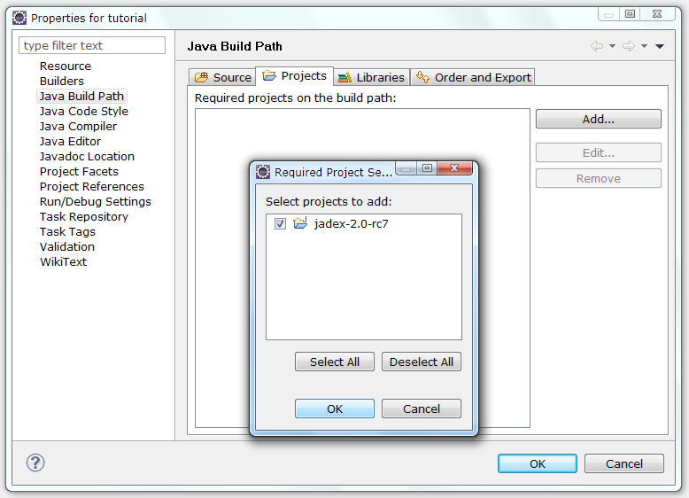
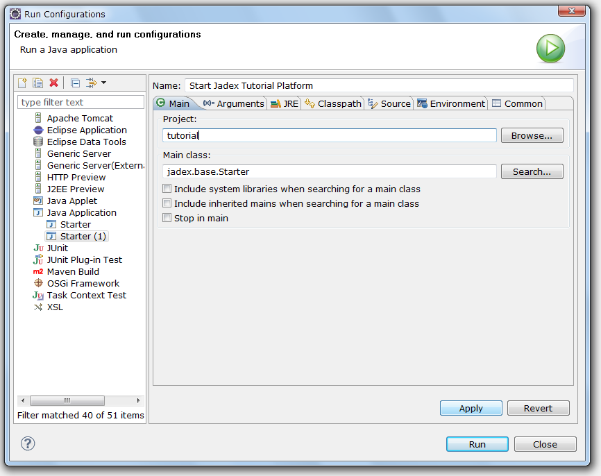
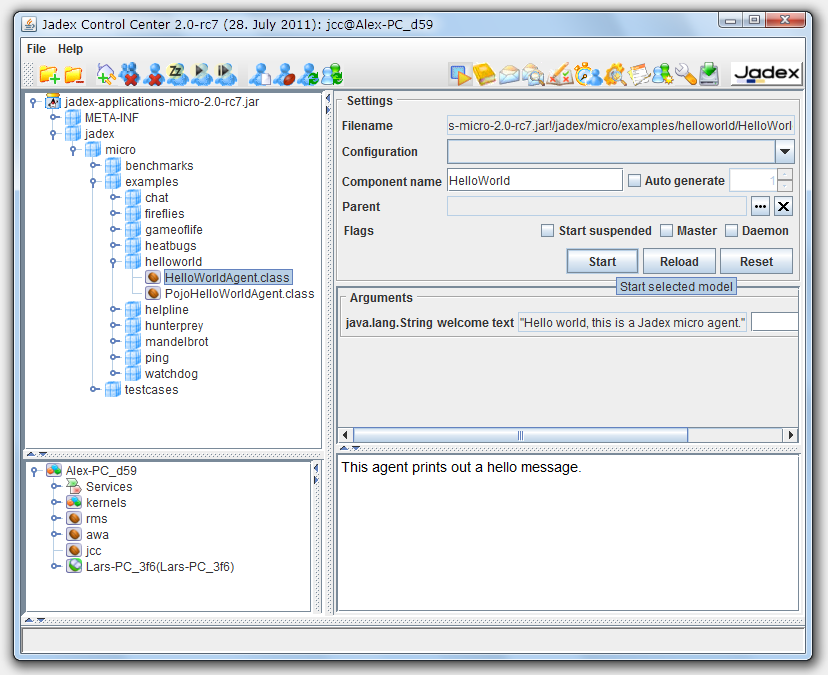

# Jadex Active Components
With Jadex, you can use the *Active Components* approach to develop distributed applications. This approach combines a hierachical service component architecture (SCA) with the possibility of abstract business logic implementation based on [BDI Agents](../tutorials/bdiv3/01 Introduction) or [BPMN Workflows](../tutorials/bpmn/01 Introduction) (see [Component Types](../component-types/component-types) for more information).

The communication model is based on [services](../services/implementation).
An Active Component is an entity that has defined dependencies with its environment. 
Similar to other component models these dependencies are described using required and provided services, i.e. services that a component needs to consume from other components for its functioning and services that it provides to others.

The interaction between components is fully network-transparent, so components can be executed on one or different machines without changing their code.
The figure below summarizes the general concept of an Active Component.

  
*Active Component Structure*

The following chapters introduce concepts with hands-on code examples and help you developing your own Jadex Active Components based applications.  
If you do **not want to setup your IDE** now, skip the remainder of this chapter and continue to **[Platform](../platform/platform/)**.

# IDE Setup

In this chapter, you will learn how to install eclipse for developing desktop applications with Jadex. Therefore, you will find instructions on setting up a proper eclipse working environment for programming and executing Jadex applications. If you use a different IDE the instructions and screenshots below should still be helpful for setting up your IDE accordingly.
If you want to develop **Android applications** with Jadex, please refer to [Android](../android/android).

Note that this tutorial is not a replacement for the existing eclipse documentation. If you have questions about using eclipse try also looking for an answer at the [http://www.eclipse.org/documentation/](http://www.eclipse.org/documentation/) site.

## Prerequisites

-   Download and install a recent **Java** environment from [http://java.sun.com/javase/downloads](http://java.sun.com/javase/downloads) (if not already present).
-   Download and install a suitable **eclipse** distribution (&gt;= ${EclipseMinVersion}) from [http://www.eclipse.org/downloads](http://www.eclipse.org/downloads/)  (if not already present). The following has been tested with the 'Eclipse IDE for Java EE Developers' package.
-   If you want to use Gradle: Install the **Gradle IDE Pack** from [eclipse marketplace](https://marketplace.eclipse.org/content/gradle-ide-pack).

## Project Setup with Gradle/Maven
Jadex uses *gradle* as build tool. If you want to use Gradle or apache Maven for your project, you do not need to download the whole Jadex distribution. Just add a dependency for the required Jadex artifacts and they will be downloaded automatically.
We provide an example project that uses maven/gradle which is described in [the next section](#example-project).

Alternatively, add the following code to your build script's dependency section (replace **${jadexversion}** with the desired version):
 
#### Gradle Project
```groovy
compile 'org.activecomponents.jadex:jadex-distribution-standard:${jadexversion}'
```
  
#### Apache Maven Project:
```xml
<dependency>
    <groupId>org.activecomponents.jadex</groupId>
    <artifactId>jadex-distribution-minimal</artifactId>
    <version>${jadexversion}</version>
</dependency>
```

### Example Project

This section describes a way of setting up a Jadex project for development in eclipse using the [Maven](http://maven.apache.org) build tool.
Since the provided example project also contains a build.gradle, it can also be used with gradle - though the following guide does only cope with maven setups.

#### Prerequisites
Download the jadex-example-project.zip from [Downloads](${URLACDownloadPage}) and unpack it to a place of your choice.

#### Importing the Jadex example project

-   Use "File -> Import -> Maven / Existing Maven Projects" and choose "Next".

  
*Import maven project (1)*

-   "Browse..." to the directory where you unzipped the jadex-example-project.zip. Maven will detect the project, which is described in the 'pom.xml' file.

  
*Import maven project (2)*

-   Click "Finish". Maven will import the project and start the build process thereby download the necessary Jadex libraries from the web.

  
*Imported example project in eclipse*

## Project Setup without Maven/Gradle
In this lesson you will set up an initial eclipse environment that can be used to develop applications using Jadex. 
Please follow the instructions carefully and compare your setup to the screenshots to verify that everything went fine. 

Download the latest Jadex distribution from [Downloads](${URLACDownloadPage}) and unpack it to a place of your choice.  
Start eclipse. Start the 'New Java Project' wizard, disable the 'Use default location' checkbox and browse to the directory, where you unpacked the Jadex distribution. Note that the name of the directory might slightly differ due to changing Jadex version numbers.

<!--TODO: update screenshots and texts-->

  
*Create Java project in eclipse*

Click 'Finish' - the project will be created. Your project should now look like the picture below. 

  
*Final Jadex eclipse project layout*

Note that depending on your eclipse configuration, the 'Referenced Libraries' node might by hidden and instead the jars from the lib folder will be displayed as direct child of the project. If you wish, you can change the appearence in the explorer menu by (de)selecting the "Show 'Referenced Libraries' Node" checkbox.

  
*Show/hide the 'Referenced Libraries' node*

This project will be used as a basis for your own development projects. To make the Jadex libraries accessible to other projects it is necessary in eclipse to export them. Right-click on the project, choose 'Build Path -&gt; Configure Build Path...'. Go to the 'Order and Export' tab, choose 'Select All' and hit 'OK'.

  
*Export jars from build path*

For further simplifying later development, you should attach the sources to the Jadex jars, as this will enable eclipse to provide better context sensitive help on method signatures, etc. Open the 'Referenced Libraries' node (if shown) and the 'jadex-applications-micro-${jadexversion}.jar'. In the 'jadex.micro.examples.helloworld' package double click on the 'HelloWorldAgent.class' file. The file will be opened, showing the reverse engineered byte code. Click the 'Attach Source...' button, choose 'Workspace...' and select the 'sources.zip' file contained in the Jadex project. Click 'OK'. The Java source of the hello world agent should now be displayed. Repeat these steps for the other Jadex jars. It is recommended for this tutorial to add the sources at least to the 'jadex-bridge', 'jadex-commons', 'jadex-kernel-micro' jars.

## Using IntelliJ IDEA

Using IntelliJ IDEA for development with Jadex Active Components is not officially supported except for [Android development](../android/android).
If you still want to use IntelliJ IDEA, just try to import the Jadex Example Project - gradle support is provided by IntelliJ.

If you want to compile the Jadex source code, import the project included in sources.zip.
To start Jadex with the JCC, create a new Run Configuration using the following parameters:

-   Main class:```jadex.base.Starter```
-   Working directory: leave default
-   Use classpath of module: *jadex-platform-standalone-launch*
-   JRE: Set to a JDK with minimum version ${JavaSdkMinVersion}

## Development Project Setup

In this lesson you will set up your own an eclipse project for all the files that you create in this tutorial.

### Eclipse Project Setup

Create a new Java project in eclipse. Choose a name as you like (e.g. 'tutorial'). Create a Java package in this project. The following examples use 'tutorial' as a package name. You can find sample solution files in the Jadex distribution in the *jadex.micro.tutorial* package.

Add a reference to the project with the Jadex distribution. To do so, right-click on the tutorial project and select 'Build Path -&gt; Configure Build Path...'. In the 'Projects' tab click 'Add...', check the 'jadex-${jadexversion}' checkbox and hit 'OK'. Close the build path window by hitting 'OK' again.

  
*Add project dependency*

Now change the launch configuration to start from the newly created project. Therefore, choose the 'Run -&gt; Run Configurations...' menu. Right-click the 'Starter' configuration and choose 'Duplicate'. Change 'Starter (1)' to a more telling name of your choice (e.g. 'Start Jadex Tutorial Platform'). In the 'Main' tab select 'Browse...' besides the project textfield and choose your 'tutorial' project. Select 'Run' to save the launch configuration and start the platform.

  
*Create Jadex launch configuration in eclipse*

### Jadex Setup

When starting the Jadex platform using your tutorial launch configuration, the JCC window will appear with the settings belonging to the tutorial project (i.e. nothing yet). Right-click in the model explorer and choose 'Add Path'. Browse to your eclipse workspace and select the 'bin' folder from the eclipse project that you created in the beginning of this lesson. When you unfold the contents, you should find the package(s) that you created. Save the settings. When you refresh the project content in eclipse, you should see the settings files appearing in the package explorer. The following screenshot shows how your setup should look like in eclipse (left) and in the JCC (right).


*Layout of Jadex tutorial project*

You are now ready to implement and execute your own components in Jadex.

# Starting your applications
In Jadex, there are (at least) two ways to start your applications:

  - graphically, using the [Jadex Control Center (JCC)](../tools/01 Introduction/) or
  - programatically, by starting a [Jadex Platform](../platform/platform/#starting-a-platform) [from code](../platform/platform/#starting-a-platform). 

The following will give you a short introduction of the JCC-way.
The JCC is a management and debugging interface for the Jadex platform and the components that run on it.
The JCC has its own way (distinct from eclipse) of loading and saving settings. The reason for this separation is to allow using Jadex without being bound to a specific IDE (like eclipse).

## Starting the Jadex Control Center

Right-click on the Jadex eclipse project and choose *Run As* &gt; *Java Application* from the popup menu. 
Select *Starter* from the package *jadex.base* in the appearing dialog (just type 'Starter' to find it).
Click "Run" and the Jadex Platform and JCC should start.

  
*Select main class for starting Jadex*

The next time you want to start the platform, you do not have to repeat the above steps. Just choose the 'Starter' entry from the run history, which eclipse generates automatically.

## Running Applications
If you managed to successfully start the Jadex platform, the [Jadex Control Center (JCC)](../tools/01 Introduction/) window will appear (see below).

To execute any applications you need to add the corresponding path to the JCC project. 
If you imported the jadex-example-project in the previous sections, the 'HelloAgent' should be already selected. 
Click "Start" to start the agent and check the console for the output "Hello world!".

### Adding Model Paths
If you did not use the example project or want to see some other examples, you have to [download the Jadex Distribution](${URLACDownloadPage}), unpack it and point the JCC to the JAR files containing the applications.
Right-click in the upper left area (called the model explorer, as it is used to browse for models of e.g. components, agents or processes) and choose 'Add Path'.

  
*Add path in JCC*

A file requester appears. Navigate to the directory, where you unpacked the Jadex distribution. 
Open the *lib* directory and select the file *jadex-applications-micro-${jadexversion}.jar*. 
Note that depending on your Jadex version the last part of the filename might differ in your setting. 

### Selecting and Starting a Component
You can now unfold the contents of the jar file and browse to the helloworld example in the *jadex/examples* package.
After you selected the *HelloWorldAgent.class* in the tree, you can start the process by clicking 'Start'.

  
*Start a component*

The component will be executed, thereby printing some messages to the (eclipse) console.

Execute some other examples, e.g. 'heatbugs' or 'mandelbrot'. Many examples involve more than one component and are typically launched by selecting and starting the *.application.xml* component, which automatically starts all components of the application.

You can also load the other 'jadex-applications-*-${jadexversion}.jar' files (e.g. BDI or BPMN) and try the examples included there. These use different [component types](../component-types/component-types) such as BDI or BPMN.

### Saving JCC and Platform Settings

As you probably do not want to add the jar file again, each time you start the Jadex platform, you should save the current settings. From the 'File' menu choose 'Save Settings'. The settings will be stored in two files in the current directory. The 'jcc.settings.xml' contains GUI settings like the window position. Another '*.settings.xml' file will be created named after the host name. It contains the platform settings (e.g. included jar files). The platform and JCC settings will automatically be loaded when the platform is started the next time.
