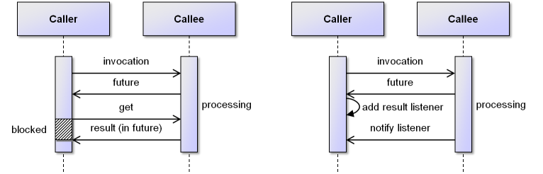

Chapter 3 - Asynchronous Programming
=================================================

  
*Synchronous call*


Understanding the difference between the synchronous and the asynchronous programming style is fundamental for using active components. The meaning of a typical synchronous call is shown in the figure above. It can be seen that a *Caller* is calling e.g. a method on a *Callee*. The result of this call is computed by the callee and delivered to the caller as result afterwards. It is important to note here that the caller is *blocked* while the callee is calculating the result of the call. Such blocking is uncritical when calls are very fast and the blocking does not hinder the caller to perform other tasks in the meantime. In distributed systems using the synchronous invocation scheme has a severe drawback besides the performance loss. The scheme is inherently deadlock prone as call graphs may lead to cycles so that no participant has a chance to leave its waiting state and continue processing. For this reason asynchronous calls should be used (The asynchronous call scheme has successfully been introduced in other areas such as in the context of the web with HTTP with AJAX or as programming model in the Google AppEngine).

Asynchronous Call Concepts
---------------------------------------

  
*a) Asynchronous call with wait by necessity                        b) Asynchronous call with listener notification*


An asynchronous call is simply a call that does not block the caller while the callee is serving the request. Hence, the question arises how the caller can determine if the processing of the callee has been finished and how it can fetch the result of the call. For this purpose the *future* abstraction has been introduced (In Jadex it is represented by *jadex.commons.future.IFuture*). A future represents the result of an asynchronous call and can be seen as a container for the real result of the call. The underlying idea is that the callee delivers immediately a future object to the caller and uses the future itself to store the real result after having finished its processing. A future allows the caller to check if the result is already available without blocking (*isDone()*). Furthermore, if the caller cannot proceed further without knowing the result of the call, it can decide to wait for the result in a possibly blocking manner (*get()*). If the call blocks depends on whether the result has already been provided by the callee or not. Fetching the result in this way is called *wait by necessity*. The blocking variant is shown in the figure above. As there is a chance for blocking in *wait by necessity* using this scheme should also be avoided in the distributed case. A purely non-blocking invocation scheme can be derived when the callee takes over the responsibility for notifying the caller when processing has finished. This means that the caller installs a result listener (in Jadex the *jadex.commons.future.IResultListener*) on the future and this result listener is called in the moment the callee provides the result value. This scheme is shown in figure *b)* and is the basis of the Jadex active components programming model.

Programming Futures and Listeners
----------------------------------------------

  
*Future types*


As can be seen in the Figure above, in Jadex several different future types can be used, which all extend the common base interface *jadex.commons.future.IFuture*. On the one hand *ITerminableFuture*s allow for aborting an ongoing asynchronous method execution from the caller side by calling terminate at any time and on the other hand *IIntermediateFuture*s can be used when more than one result value is expected. Intermediate futures can return these result values one by one allowing a caller to continue processing as soon as the first result becomes available. Of course, also a terminable version of an intermediate future exists. Finally, very similar to terminable intermediate futures are *ISubscriptionFuture*s, which only relax result storage, i.e. a subscription future immediately forgets intermediate results as soon as they have been passed to one subscriber (listener).
It follows a brief introduction of all currently available future types:

-   **IFuture&lt;E&gt;**: Basic type of future that represents a container for a value of type E. Allows for blocking wait with get() and listener callbacks using addResultListener(). The corresponding listener type is IResultListener and has two methods: resultAvailable() is called with the result value as parameter and exceptionOccurred() is invoked is case of an invocation error.  
-   **IIntermediateFuture&lt;E&gt;**: The intermediate future allows for receiving multiple result values of the same type (E). Again receiving can be done in a blocking fashion (using getNextIntermediateResult()) and via listeners. For this kind of futures with IIntermediateResultListener a specific listener type exists that supports reacting to individual results (using intermediateResultAvailable(E result)). Furthermore, it is signalled via finished() that no all values have been received. 
-   **ITerminableFuture&lt;E&gt;**: A terminable future allows the caller to cancel the task at any point in time by called terminate(). This termination will reach the called entity which may react to the request by stopping its activities regarding the invocation (the callee is not forced to do so). At callee side a termination command can be used to state what should be done when a call is cancelled. 
-   **ITuple2Future&lt;E,F&gt;**: The tuple2 future can be used if exactly two result values should be returned. The tuple2 future is strongly typed by using type E for the first and type F for the second result value. With the ITuple2ResultListener a listener type is available that offers two corresponding methods firstResultAvailable() and secondResultAvailable() which are called when the results are available. It has to be noted that the results need not necessarily be provided in order, i.e. setSecondResult() can be called also before setFirstResult(). The same order is then perceived at the receiver side, i.e. first secondResultReceived() is invoked in that case.
-   **ITerminableIntermediateFuture&lt;E&gt;**: This is the terminable version of an intermediate future. 
-   **ISubscriptionIntermediateFuture&lt;E&gt;**: A subscription future can be used to establish a **publish subscribe relationship** between the caller and callee. It is only slightly different with respect to an intermediate future. The main difference is that it does not save the intermediate values but uses a fire and forget semantics, i.e. after a value has been propagated it will not be stored in the internal result collection. This also means that a listener that is added with some delay will not receive the earlier results. An exception to this rule is that the future saves previous values until the first listener is added.  
-   **IPullIntermediateFuture&lt;E&gt;**: A pull future allows for realizing an **iterator relationship** between caller and callee. This means that is this case the caller can decide when it wants to receive the next result by calling pullIntermediateResult(). The functionality that should be executed in case of a pull of the caller is supplied as command by the callee.
-   **IPullSubscriptionIntermediateFuture&lt;E&gt;**: The subscription version of the pull future. 

The detailed interface of the *jadex.commons.future.IFuture* is also shown in the figure above. It can be seen that a future has a generic type, which allows for having method signatures that also unveil the real return value of the method. As an example consider the example *sayHello()* method signature below. It differs from a synchronous call only in the declared return type (here a String within the future).


```java

public interface IFuture<E>
{
  public static final IFuture<Void> DONE = new Future<Void>((Void)null);
	
  public boolean isDone();
  public E get(ISuspendable caller);
  public E get(ISuspendable caller, long timeout);
  public void addResultListener(IResultListener<E> listener);
}

```


The methods of the *IFuture* have already been introduced in the context of the general programming concept above and are therefore only briefly explained:

-   *isDone()* can be used to check whether the callee has already supplied the real result.
-   *get()* methods initiate possibly a blocking call and should therefore only be used in exceptional cases. The get methods takes a timeout as optional parameter. An example usage that operates on a future return from the sayHello() method is *String text = future.get()*. If the timeout variant is employed and the callee does not provide the result within the given deadline a *jadex.commons.concurrent.TimeoutException* is thrown. 
-   *addResultListener()* allows for adding a result listener to the future. This listener is notified *once* when the result is available. If the result is already set the listener is notified right after its addition. Arbitrary many listeners can be added to a future.

The *IResultListener* interface is shown below. The interface is also generic and allows for creating generically typed listeners. The general contract is that a result listener will only be called once (or not at all if the result is never set by the callee). In case everything has worked as expected the *resultAvailable()* method will be invoked and the result will be passed as parameter. Otherwise, in case of an abnormal operation, the *exceptionOccurred()* method is executed and the corresponding exception is made accessible via a parameter.


```java

public IFuture<String> sayHello();

```


In the following we will revisit the sayHello() example and use the listener style to retrieve the result. It can be seen that an anonymous Java class is added as listener to the future. This listener implementation just prints the results of the invocation.


```java

public interface IResultListener<E>
{
  public void resultAvailable(E result);
  public void exceptionOccurred(Exception exception);
}

```


Programming Intermediate Futures and Listeners
-----------------------------------------------------------

In certain situations an asynchronous call might not only return a single result but a collection of result values. Of course, for this purpose a future of type collection could be used (for example *IFuture&lt;Collection&lt;String&gt;&gt;*), but if the result values are computed independently of each other this can lead to the severe drawback that the caller has to wait until the last value has been provided till it can continue processing. In case that the caller wants to use the values as soon as they are available an alternative result value scheme has to be used. This scheme is based on *IIntermediateFuture&lt;E&gt;* and *IIntermediateResultListener&lt;E&gt;* both from the package *jadex.commons.future*. 

The interface definition of the *IIntermediateFuture&lt;E&gt;* is shown below. It can be seen that the intermediate future class extends the normal future class and defines its generic type as collection of the future type (*IFuture&lt;Collection &lt;E&gt;&gt;*). Furthermore, it only adds one method signature called *getIntermediateResults()* that allows to non-blockingly fetch the currently available intermediate results as generically typed collection. 


```java

IFuture<String> future = obj.sayHello();
future.addResultListener(new IResultListener<String>()
{
  public void resultAvailable(String result)
  {
    System.out.println("Say hello call result is: "+result);
  }
  public void exceptionOccurred(Exception exception)
  {
    System.out.println("An exception occurred: "+exception); 
  }
});

```


More interesting than the intermediate future interface is the *IIntermediateResultListener&lt;E&gt;* specification. It can be seen that the intermediate result listener also extends the normal result listener and redefines its generic type to collection. Hence, it offers the same methods as the normal result listener (*resultAvailable() and exceptionOccurred()*) plus two new methods. The general idea of letting the intermediate versions of the future and listener extend the normal versions is that it should be possible to chain listeners and futures independently of their type, i.e. if one e.g. does not care about intermediate results it is possible to add a normal listener to an intermediate future. For these reasons the contract of an intermediate listener has been defined as follows:

-   Either the *resultAvailable()* method is called once (e.g. when an intermediate result listener is added as a listener to an non-intermediate future)
-   Or the *intermediateResultAvailable()* method is called once for each result and after the last value has been provided the *finished()* method is called once.
-   In case of an exception during intermediate result reporting the *exceptionOccurred()* method is called once and no further intermediate results are generated.


```java

public interface IIntermediateFuture<E> extends IFuture<Collection <E>>
{
  public Collection<E> getIntermediateResults();
}

```


### Example

Let us assume we want to use the intermediate listener to search for different chat service providers sitting on arbitrary nodes in a network. Each chat service has a method *message()* that can be invoked to send a text message to the corresponding chat partner. The example intermediate listener implementation below shows that the *resultAvailable()* method as well as the intermediate counterparts *intermediateResultAvailable()* and *finished()* are used. With this technique the listener reacts failsafe with respect to the implementation of the callee, i.e. it will work if the callee truely provides intermediate results or just one bulk result. Hence, if the implementation of the callee is unknown both result listener methods should be implemented. In the example, it can also be seen that if processing of results is independent from the mode they are delivered, it is convenient to call *intermediateResultAvailable()* in *resultAvailable()* for each partial result value.


```java

public interface IIntermediateResultListener<E> extends IResultListener<Collection <E>>
{
  public void intermediateResultAvailable(E result);
  public void finished();
}

```


Library Support for Listeners
------------------------------------------

  
*Result listeners*


In Jadex there are several ready to use listeners that help with recurring use cases. These ready to use listeners are described in the following. Using these listeners can speed up development and simplify the code. For most of the listener implementations also intermediate versions exist. An overview of the currently supported listener types is given in the figure above. It was made to help you finding the right listener class quickly by reading it from left to right and taking a choice in each column. The first column describes the task that is achieved by the listener, the second column reveals on which thread the listener call will be performed (if not explicitly stated no thread switch will be done) and the third column distinguishes between singe result and intermediate listener versions. Finally, in the fourth column you find the concrete Java class that can be used. It has additionally to be noted that listeners in the lower part of the table (below the heading 'Listeners Supporting Delegation') allow for an easy chaining of multiple listeners. This is achieved by delegation to another listenerm which has to be provided to the new listener (in most cases as constructor argument). To show you how the table can be used consider the case you want to create a listener that signals a single result to the user in a Swing user interface and adds a timeout to the underlying call. In this case one could chain a *SwingResultListener* with a *TimeoutResultListener*.

### DefaultResultListener&lt;E&gt;

If exceptions cannot be handled or need not to be handled default result listeners can be used. They implement the exception occurred method by logging a severe message. The logger to be used can be either supplied via the listener constructor or a default logger with the name "default-result-listener" will be used. As a default listener already implements *exceptionOccurred()* only the *resultAvailable()* method needs to be implemented by the developer. In the example code snippet below it can be seen how a default result listener can be used in context of using a service.  


```java

IIntermediateFuture<IChatService> fut = ia.getServiceContainer().getRequiredServices("chatservices");
fut.addResultListener(new IIntermediateResultListener<IChatService>()
{
  public void resultAvailable(Collection<IChatService> result)
  {
    for(Iterator<IChatService> it=result.iterator(); it.hasNext(); )
    {
      IChatService cs = it.next();
      intermediateResultAvailable(cs);
    }
  }					
  public void exceptionOccurred(Exception exception)
  {
    exception.printStackTrace();
  }					
  public void intermediateResultAvailable(IChatService result)
  {
    result.message("Hugo", "Hi chat partner");
  }				
  public void finished()
  {
  }
});

```


### DelegationResultListener&lt;E&gt;

In Java methods can either use try-catch blocks to handle exceptions themselves or they can declare to throw exceptions in order to let the caller of a method handle potentially occurring exceptions. The same styles of programming are useful in the asynchronous listener based case as well. In order to let an exception be treated by a caller, delegation listener can be used. They forward *resultAvailable()* and *exceptionOccurred()* to a specified future. When using the generically typed version of the delegation listener this means that the future and the listener have to be of the same type. As an example consider a method that calls another method and wants to forward exceptions of the invoked method to the caller. The method itself uses a delegation result listener that overrides the *customResultAvailable()* method to modify the result retrieved from calling the *sayHello()* method. Should *sayHello()* raise an exception, the delegation listener will set this exception automatically on the future of the *sayHello2()* method.


```java

IFuture<IClockService> fut = agent.getServiceContainer().getRequiredService("clockservice");
fut.addResultListener(new DefaultResultListener<IClockService>()
{
  public void resultAvailable(IClockService cs)
  {
    System.out.println("Current time is: "+new Date(cs.getTime()));
  }
});

```


### ExceptionDelegationResultListener&lt;E, T&gt;

In order to allow also chaining of futures and listeners with different generic types the exception variant of the delegation listener can be used. The generic types &lt;E, T&gt; denote the type of the received and forwarded result respectively. In constrast to the delegation listener the exception delegation listener only implements the *exceptionOccurred()* method so that the *customResultAvailable* method always has to be implemented by the developer himself. The example below illustrates how a result type can be transformed from String to String\[\] using the exception delegation listener. The method *sayHellos()* returns a String\[\] but gets a String from the *sayHello()* method. Therefore, it overrides the *customResultAvailable()* to set a result of of type String\[\]. 


```java

public IFuture<String> sayHello2()
{
  final Future<String> ret = new Future<String>();
  sayHello().addResultListener(new DelegationResultListener<String>(ret)
  {
    public void customResultAvailable(String result)
    {
      ret.setResult(result+"2");
    }
  });
  return ret;
}

```


### TimeoutResultListener&lt;E&gt;

For writing robust programs it is often essential not to wait indefinitely for a result. Instead one often assumes that an error occurred, if the result is not made available after some predefined timeout. The *TimeoutResultListener* captures this assumption. It is created with a target result listener and a timeout value in milliseconds. If the result is made available before the timeout, it is immediately forwarded to the target listener. When the timeout passes without a result being available, the *exceptionOccurred()* method is called with a timeout exception. In the latter case, the result will never be forwarded to the target listener, even if it becomes eventually available after the timeout.


The timeout result listener uses any available clock service for measuring the timeout. Therefore it needs to be created with an *IExternalAccess* object used to lookup the clock service. The constructor signature is as follows:


```java

public IFuture<String[]> sayHellos()
{
  final Future<String[]> ret = new Future<String[]>();
  sayHello().addResultListener(new ExceptionDelegationResultListener<String, String[]>(ret)
  {
    public void customResultAvailable(String result)
    {
      ret.setResult(new String[]{result, result});
    }
  });
  return ret;
}

```


The following snippet shows how the timeout listener can be used:


```java

public TimeoutResultListener(long timeout, IExternalAccess exta, IResultListener<E> listener);

```


### SwingDefaultResultListener&lt;E&gt;

In many cases it is of importance on which thread the listener methods are called. In context of Java AWT or Swing GUI programming it needs to be ensured that widgets are only accessed from the Swing thread. This can always be achieved by calling *SwingUtilities.invokeLater()* and providing a *Runnable* that is executed on the Swing thread later on. To avoid manually calling invoke later in the listener methods the Swing variants of the listeners can be used (package *jadex.base.gui*). They ensure that listener methods are only called on the Swing thread.

The *SwingDefaultResultListener* extends the *DefaultResultListener* and implements\
additional behavior for handling exceptions. If a gui component is supplied in the costructor, any exception\
is alerted to the user using a simple message dialog. Otherwise the exception is logged as before.\
The example below shows how the result of a *sayHello()* call is set in a *JTextField*.


```java

sayHello().addResultListener(new TimeoutResultListener<String>(3000, agent.getExternalAccess(),
  new IResultListener<String>()
{
  public void resultAvailable(String msg)
  {
    System.out.println("Hello: "+msg);
  }
  public void exceptionOccurred(Exception exception)
  {
    if(exception instanceof TimeoutException)
    {
      System.out.println("No answer received");
    }
  }
});

```


### SwingDelegationResultListener&lt;E&gt;

The *SwingDelegationResultListener* is the swing variant of the *DelegationResultListener*.\
It allows forwarding the result or exception to another future. In addition, the listener methods\
are invoked on the swing thread. The common use case is to only override the *customResultAvailable*\
method, e.g., for doing gui stuff with a result, but keeping the *customExceptionOccurred* implementation\
for forwarding of errors.


```java

JPanel panel;
...
sayHello().addResultListener(new SwingDefaultResultListener<String>(panel)
{
  public void customResultAvailable(String result)
  {
    mytextfield.setText(result);
  }
});

```


### ExceptionSwingDelegationResultListener&lt;E, T&gt;

Represents the exception variant of the *SwingDelegationResultListener&lt;E&gt;*. Also ensures that all listener calls are performed on the Swing thread. Behaves in the same way as the *SwingDelegationResultListener&lt;E&gt;* so that no further explanation is given here.

### CounterResultListener&lt;E&gt;

The counter result listener is useful when a known number of calls needs to be done and after all calls have been finished processing should continue. A common use case is a loop with asynchronous calls inside. In this case, the loop is sequential but the calls itself may be executed concurrently. The counter result listener needs to be initialized with the expected number of calls and a target listener that is called once all results have been received. Using the *ignorefailures* flag it can be customized how exceptions of single calls are treated. Using the default behaviour (ignorefailures=false) an exception immediately leads to calling *exceptionOccurred()* on the delegation listener. If ignorefailures is set to true, always *resultAvailable()* is called on the target listener, after all calls have terminated but independently of how many exceptions occurred. Please note that the counter result listener does not collect results of the single calls and thus expects a result listener of type void as delegation listener. To collect the result the collection result listener can be used (see below). If intermediate results or exceptions are of interest two corresponding methods can be overridden (*intermediateResultAvailable()* and *intermediateExceptionOccurred()*). 


```java

Future<String> ret = new Future<String>();
sayHello().addResultListener(new SwingDelegationResultListener<String>(ret)
{
  public void customResultAvailable(String result)
  {
    mytextfield.setText(result);
    ret.setResult(result);
  }
});

```


The example code below uses a counter listener to start a hello world agent on every platform it knows. The known platforms are represented by a list of component management services (cmslist) that has been retrieved by some other code (e.g. a global scoped search). Afterwards the counter result listener is defined with a delegation listener that prints out a message after all components have been created. Last part of the code example is the loop which fetches a cms from the list and instructs it to create a hello world agent. The same counter listener is added to all asynchronous calls. If an exception occurs within a call the counter listener aborts (ignorefailues is false) and calls *exceptionOccurred()* on the default listener (which will just print a log message that an exception occurred). 


```java

public CounterResultListener(int num, boolean ignorefailures, IResultListener<Void> target);

```


### CollectionResultListener&lt;E&gt;

The collection result listener is similar to the counter result listener but collects the intermediate results in contrast to the latter. It needs to be supplied with the expected number of calls and a target result listener of type collection. Additionally, the *ignorefailures* flag can be used to customize error behavior in the same way as described above in the context of the counter result listener. The constrcutor of the listener is also shown below for convenience. Using a collection listener for a known number of asynchronous calls allows for concurrent call processing and afterwards downstream handling of the collected results. Please note that the number of results is equal to the number of calls only if ignorefailures is false. Otherwise, the result collection may contain fewer result values.


```java

List<IComponentManagementService> cmslist = ...;

CounterResultListener<IComponentIdentifier> lis = new CounterResultListener<IComponentIdentifier>(
  cmslist.size(), false, new DefaultResultListener<Void>()
{
  public void resultAvailable(Void result)
  {
    System.out.println("Created all components.");
  }
});
		
for(int i=0; i<cmslist.size(); i++)
{
  cmslist.get(i).createComponent(null, "jadex.micro.examples.helloworld/HelloWorldAgent.class", null, null)
    .addResultListener(lis);
}

```


The example is nearly identical to the example explained above in the context of the counter result listener. Instead of a counter listener a collection listener is used with "ignorefailures" set to true. This means that the *resultAvailable()* method of the listener is invoked after all calls have finished. The listener finally prints the list of successfully created agents.


```java

public CollectionResultListener(int num, boolean ignorefailures, IResultListener<Collection<E>> target);

```


### ComponentResultListener&lt;E&gt;

The component result listener is similar to the swing result listeners, as it can also be used to execute listener methods on another thread. Here, the listener methods are called on the thread of a specific component. Executing on the right component thread is important to establish state consistency: When always accessing the internal state of a component from the same thread, no race conditions can occur and inconsistent modifications are effectively prevented.


In many cases, the Jadex framework takes care of executing code on the right component thread. By default, calls to service implementations as well as results from service searches and subsequent service calls are automatically executed on the component thread. E.g. in the example below, an agent searches for and invokes the hello service and stores the result in a field. This is safe, because both *resultAvailable* methods are called on the agent's thread.


```java

List<IComponentManagementService> cmslist = ...;
		
CollectionResultListener<IComponentIdentifier> lis = new CollectionResultListener<IComponentIdentifier>(
  cmslist.size(), true, new DefaultResultListener<Collection<IComponentIdentifier>>()
{
  public void resultAvailable(Collection<IComponentIdentifier> result)
  {
    System.out.println("Created components: "+result);
  }
});
		
for(int i=0; i<cmslist.size(); i++)
{
  cmslist.get(i).createComponent(null, "jadex.micro.examples.helloworld/HelloWorldAgent.class", null, null)
    .addResultListener(lis);
}

```


Typical cases, where the automatic thread management of listener methods is not in control is when using the static methods of the *SServiceProvider* helper class and when scheduling steps on other components using *IExternalAccess.scheduleStep()*. In these cases, a component result listener should be created manually. The component result listener needs to be supplied with another result listener and an external access of the component on which the listener should be executed. The corresponding constructor is shown below. The result listener that is passed as arguments to the component result listener is used for delegation, i.e. this listener should contain the domain logic to be executed. In many component kernels there is a convenience method called *createResultListener(IResultListener listener)*, which creates a component result listener behind the scenes and hides passing the external access of the component. 


The example code assumes that the body method of a micro agent is executed and the component management service of the platform has been fetched to a variable named "cms" using the *SServiceProvider* helper class. On the component managament service the method *createComponent()* is utilized to create a new component instance of type *HelloWorldAgent*. After creation has finished successfully, the listener prints out that the component identifier. This print statement is executed on the component thread of the micro agent. 


```java

@Agent
MicroAgent agent;

String msg;

@AgentBody
public void body()
{
  IFuture<IHelloService> fhello = agent.getServiceContainer().getRequiredService("hello");
  fhello.addResultListener(new DefaultResultListener<IHelloService>()
  {
    public void resultAvailable(IHelloService hello)
    {
      hello.sayHello().addResultListener(new DefaultResultListener<String>()
      {
        public void resultAvailable(String msg)
        {
          // Safe to access component state.
          HelloClientAgent.this.msg = msg;
        }
      });
    }
  });

```


```java

public ComponentResultListener(IResultListener<E> listener, IExternalAccess access)

```


Sequential Asynchronous Loops
------------------------------------------

In the previous examples loops were used in which the asynchronous calls have been processed potentially concurrently. In some cases a sequential loop containing asynchronous calls is needed. This can be achieved by using a method that recursively calls itself. The code example shown below again creates hello world agents at all known platforms. But in contrast to the variants shown before, this time the loop is realized with a method that calls itself as long as the iterator has more elements. The method calls the asynchronous method *createComponent()* and adds an exception  delegation listener to the future. In case an exception occurs it is delegated to the future that is returned by the method. Otherwise it calls recusively itself and uses a delegation result listener to chain the results. If the iterator has no more elements the method returns a future with result null. This will cause the recursion to end and the chain of listeners and futures to be finished as well so that the outermost caller of the method is notified.


```java

@AgentBody
public void body()
{
  // ... fetching cms omitted
  cms.createComponent(null, "jadex.micro.examples.helloworld/HelloWorldAgent.class", null, null)
    .addResultListener(createResultListener(new DefaultResultListener<IComponentIdentifier>()
  {
    public void resultAvailable(IComponentIdentifier cid)
    {
      System.out.println("Created component: "+cid);
    }
  }
}

```

