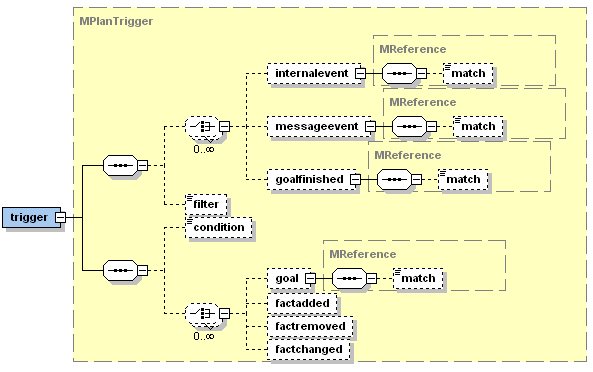

# Plans

${SorryOutdated}

Plans represent the agent's means to act in its environment. Therefore, the plans predefined by the developer compose the library of (more or less complex) actions the agent can perform. Depending on the current situation, plans are selected in response to occuring events or goals. The selection of plans is done automatically by the system and represents one main aspect of a BDI infrastructure. In Jadex, plans consist of two parts: A plan head and a corresponding plan body. The plan head is declared the the ADF whereas the plan body is realized in a concrete Java class. Therfore the plan head defines the circumstances under which the plan body is instantiated and executed.

## Defining Plan Heads in the ADF


*Figure 1: The Jadex plans XML schema part*
  
In Figure 1 the XML schema part for the plans section is shown. Inside the &lt;plans&gt; tag an arbitrary number of plan heads denoted by the &lt;plan&gt; tag can be declared. For each plan head several attributes (as shown in the following Table) and contained elements can be defined. For each plan a name has to be provided. The priority of a plan describes its preference in comparison to other plans. Therefore it is used to determine which candidate plan will be chosen for a certain event occurence, favouring higher priority plans (random selection, if activated, applies only to plans of equal priority). Per default all applicable plans have a default priority of 0 and are selected in order of appearance (or randomly when the corresponding BDI flag is set).

| Tag   |Attribute  |Required  |Default   |Possible Values            |
| ------|-----------|----------|----------|---------------------------|
| plan  |name       |yes       |          |                           |
| plan  |priority   |no        |0         |integer                    |
| body  |impl       |no        |          |implementation class name  |
| body  |class      |no        |          |implementation file name   |
| body  |type       |no        |standard  |standard, bpmn, ...        |

*Important attributes of the plan and the body tag*

For each plan the corresponding plan body has to be declared using the &lt;body&gt; element. The "impl" attribute (for backwards compatibility also the "class" attribute) is used for defining the implementation of the plan. In case of standard Java plans the classname is used to identify the implementation. The type attribute determines which kind of plan body is used. Currently, the available options are *standard* and *bpmn* plan bodies as further described in the following sections. To clarify things, a simple example ADF is given below that shows the declaration of a plan reacting on a ping message.


```xml

<agent ...>
    ...
    <plans>
        <plan name="ping">
            <body impl="PingPlan"/>
            <trigger>
                <messageevent ref="query_ping"/>
            </trigger>
        </plan>
    </plans>
    ...
    <events>
        <messageevent name="query_ping" type="fipa">
            ...
        </messageevent>
    </events>
    ...
</agent>

```


*A plan reacting on a ping message*

Plan Triggers
--------------------------

To indicate in what cases a plan is applicable and a new plan instance shall be created the &lt;trigger&gt; tag can be used (see Figure 2). Its subtags specify the goals, internal- or message events for which the plan is applicable.

For goals, it is distinguished between plans triggered for handling a goal (&lt;goal&gt;tag) and plans reacting on the completion of a goal (&lt;goalfinished&gt; tag). The &lt;goal&gt; tag indicates that a goal has been newly activated, while the &lt;goalfinished&gt; tag corresponds to a goal that has been dropped.

These events or goals can be further restricted, by specifying a match expression. When a match expression is included in the trigger element, the plan will only be selected for those goal or event instances, for which the expression evaluates to true. For backwards compatibility to older Jadex versions, additionally, a filter instance can be used, although its use is discouraged, because of the lack of declarativeness and readability.



*Figure 2: The Jadex plan trigger XML schema part*

In addition to the reaction on certain event or goal types, it is also possible to define data-driven plan execution by using the &lt;condition&gt; tag. A trigger condition can consist of arbitrary boolean Jadex expressions, which may refer to certain beliefs when their states needs to be supervised. If only some specific belief needs to be monitored the &lt;factchanged&gt; tag can be used. In this respect a belief change is reported whenever the belief's new fact value is different from the value held before. Similarly, belief sets can be monitored for addition or removal of facts by using the tags &lt;factadded&gt; and &lt;factremoved&gt; respectively. 

## Defining Plan Applicability with Pre- and Context Conditions

To find out if the plan is applicable not only with respect to the current event or belief change but also considering the current situation, the pre- and context conditions can be used. The precondition is evaluated before a plan is instantiated and when it is not fulfilled this plan is excluded from the list of applicable plans. In contrast, the context condition is evaluated during the execution of a plan and whenever it is violated the plan execution is aborted and the plan has failed. Both conditions can be specified in the corresponding tags supplying some boolean Jadex term (please note that the precondition must be specified in the expression and the context condition in the condition language). The following example shows how to execute a "repair" plan whenever the belief "out\_of\_order" becomes *true*, and as long as the agent believes to be repairable.


```xml

<plans>
  <plan name="repair">
    <body impl="RepairPlan"/>
    <trigger>
      <condition>$beliefbase.out_of_order</condition>
    </trigger>
    <contextcondition>$beliefbase.repairable</contextcondition>
  </plan>
</plans>

```


*Example of a plan with context condition*
   

## Waitqueue

When an event occurs, and triggers an execution step of a plan, it may take a while, before the plan step is actually executed, due to many plans being executed concurrently inside an agent. Therefore, it is sometimes possible, that a subsequent event, which might be relevant for a plan, is not dispatched to that plan, because it still has to execute previous plan step, and does not yet wait for the event. To avoid this, each plan has a waitqueue to collect such events. The waitqueue for a plan is set up using the &lt;waitqueue&gt; tag or the *getWaitqueue()* method in plan bodies. The waitqueue of a plan is always matched against events, although the plan may not currently wait for that specific event. The &lt;waitqueue&gt; tag provides support for waiting for finished goals and the occurrence of message and internal events. Events that match against the waitqueue of a plan are added to he plans internal waitqueue. They will be dispatched to the plan later, when it calls *waitFor()* or *getWaitqueue().getElements()*. You may have a look at the *jadex.bdi.runtime.IWaitqueue* interface for more details.
  

## Parameters, Binding, and Parameter Mapping

Similar to goals, plans may have parameters and parameter sets, which can store local values, required or produced during the execution of the plan. Plan parameters can be accessed from plan bodies for read and write access depending on the parameter direction attribute: *in* parameters allow only read access, *out* parameters can only be written, while *inout* parameters allow both kinds of access. Default values for any of these parameters and parameter sets can be provided in the ADF. Just like facts for belief sets, initial values for parameter sets can be either specified as a sequence of &lt;value&gt; tags, or as a single &lt;values&gt; tag. The parameter(set)s of a plan can also be accessed from the body tag or the context condition, by referencing the plan via the reserved variable \$plan concatenated with the parameter(set) name, e.g. \$plan.result. The precondition and the trigger condition are evaluated before the plan is instantiated, therefore from these conditions no parameters and parameter sets can be accessed with exception of the binding parameters. As binding parameters are evaluated before plan instantiation the value of a binding parameter can be accessed directly via its name (without prepending $plan).


*Figure 3: The Jadex plan parameters XML schema part*   

 
For (single valued) parameters it is possible to use binding options instead of an initial value. A binding option is an expression, that will be evaluated to a collection of values (supported are arrays or an object implementing *Iterator*, *Enumeration*, *Collection*, or *Map*). The binding options of a parameter therefore represent a set of possible initial values for that parameter. The cartesian product of all binding parameters (if there is more than one parameter with binding otpions) determines the number of candidate plans that is considered in the event dispatching process. (In mathematics, the Cartesian product (or direct product) of two sets X and Y, denoted X x Y, is the set of all possible ordered pairs whose first component is a member of X and whose second component is a member of Y. Example: The cartesian product of {1,2}x{3,4} is {(1,3),(1,4),(2,3),(2,4)}, cf. [Cartesian Product](http://en.wikipedia.org/wiki/Cartesian_product) ). Please note that the calculation of the cartesian product can easily lead to large numbers of applicable plans so that binding options should always be used with care. For example, the code example below shows a plan from the "puzzle" example, where for each possible move a plan instance is created. In addition to accessing the binding values like other parameters by writing *\$plan.paramname*, it is also possible to access the binding value directly via its name via  *paramname*. This allows binding values also to be considered for evaluating the pre- and trigger condition, before the plan instance is created.


```xml

<plan name="move_plan">
  <parameter name="move" class="Move">
    <bindingoptions>$beliefbase.board.getPossibleMoves()</bindingoptions>
  </parameter>
  ...
</plan>

```


*Example binding parameter (from the puzzle example)*

 
A common use case for plan parameter(set)s is to capture parameter(set)s from a goal or event that triggered the plan. To make this relationship between event and plan parameters explicit, the &lt;internaleventmapping&gt;, &lt;messageeventmapping&gt;, and &lt;goalmapping&gt; tags can be used. A mapping definition contains a *ref* attribute denoting the event or goal parameter to be mapped. The reference is given in the form type.param, where type is the name of the goal or event, and *param* is the name of the goal or event parameter. When a plan parameter is mapped, the parameter properties like class and direction are ignored, as the values from the mapped parameter are used. Depending on the direction of the parameter, the default values of the plan parameter are automatically assigned from the event or goal (direction *in*, *inout*), and can also automatically be written back to a goal (direction out, inout), when the plan has finished. Note that when a plan reacts to more than one goal or event, you cannot just provide a mapping for one of these events. If you want to use a mapping for a parameter, you have to provide mappings for all events or goals handled by the plan.

## Implementing a Plan Body in Java

A plan body represents a part of the agent's functionality and encapsulates a recipe of actions. In Jadex, plan bodies are written in pure Java (or alternatively in bpmn) and therfore it is easily possible to write plans that access any available Java libraries, and to develop plans in your favourite Java Integrated Development Environment (IDE). The connection between a plan body and a plan head is established in the plan head, thus plan bodies can be reused within different plan declarations. For developing reusable plans, plan parameters in combination with parameter mappings from some triggering event or goal to/from the plan should be used.

As mentioned earlier, currently two types of plan bodies are supported in Jadex, which are both implemented as conventional Java classes. The standard plans inherit from *jadex.bdi.runtime.Plan*. The code of standard plans is placed in the *body()* method.


Plans that are ready to run are executed by the main interpreter (cf. [Section 2](02%20Concepts) ). The system takes care that only one plan step is running at a time. The length of a plan step depends on the plan itself. The *body()* method of standard plans is called only once for the first step, and runs until the plan explicitly ends its step by calling one of the *waitFor()* methods, or the execution of the plan triggers a condition (e.g., by changing belief values). For subsequent steps the *body()* method is continued, where the plan was interrupted.


Below is shown a cutout of an example standard Java plan. It is a snippet of a protocol plan, which waits for messages and acts accordingly. Most interestingly are the *waitForXYZ()* calls in the plans, because these are the interruption points in the plan, i.e. the plan is interrupted when these calls are executed. Given that a *waitForMessageEvent()* method is invoked the plan is continued when a fitting message arrives (or a timeout occurs, if specified).


```java

public void body() 
{
  // Send request.
  ...
    
  // Wait for agree/refuse.
  IMessageEvent e1 = waitForMessageEvent(...);
  boolean agreed = ...;    
  ...
    
  // Wait for inform/failure.
  if(agreed) 
  {
    IMessageEvent e2 = waitForReply(...);
    boolean informed = ...;
    
    ...
    if(informed) 
    {
      ...
    }
    else 
    {
      ...
    }
  }
  else 
  {
    ...
  }
}

```


*Example plan body*
       

## Plan Success or Failure and BDI Exceptions

If a plan completes without producing an exception it is considered as succeeded. Completion means for standard plans that the *body()* method returns. To perform cleanup after the plan has finished, you can override the *passed()*, *failed()*, and *aborted()* methods, which are called when the plan succeeds (runs through without exception), fails (e.g., due to an exception), or was aborted during execution (e.g., because the root goal was dropped or has been achieved before the plan reached its end). 

Below, a plan skeleton of a standard Jadex plan is depicted including all predefined methods. In the *failed()* method, a plan may call the *getException()* method to see which problem occured. To find out whether the plan was aborted, because its root goal was achieved, you can call the *isAbortedOnSuccess()* method inside the *aborted()* method.
   
```java

public class MyPlan extends Plan 
{
  public void body() 
  {
    // Application code goes here.
    ...
  }

  public void passed() 
  {
    // Clean-up code for plan success.
    ...
  }

  public void failed()
  {
    // Clean-up code for plan failure.
    ...
    getException().printStackTrace();
  }

  public void aborted() 
  {
    // Clean-up code for an aborted plan.
    ...
    System.out.println("Goal achieved? "+isAbortedOnSuccess());
  }
}

```  
*Standard plan skeleton*

Regardless if standard or mobile plans are used, a plan is considered as failed if it produces an exception. To aid debugging, occurring exceptions are (by default) printed on the console (*logging.level.WARNING*), although the agent continues to execute. Subclasses of *jadex.bdi.runtime.BDIFailureException* are not printed, because they are produced by the system and indicate "normal" plan failure (*logging.level.INFO*). If you want your plan explicitly to fail without printing an exception, you can throw a *PlanFailureException* or, as a shortcut, call the *fail()* method. Other subclasses of the *BDIFailureException are generated automatically by the system, to denote certain failures during plan execution. All of these exceptions can be explicitly handled if desired, or just ignored (causing the plan to fail). The **GoalFailureException*, is thrown, when a subgoal of a plan could not be reached or if the subgoal could not be adopted due to its uniqueness settings (i.e. there exists already a goal that is considered equal to the new one). The *MessageFailureException* indicates that a message could not be sent, e.g., because the receiver is unknown. A *TimeoutException* occurs when calling *waitFor()* with a timout, and the awaited event does not happen. Finally, the *ComponentTerminatedException* is thrown when an operation could not be performed, because the agent has died. This usually does not occur inside plans, but only when accessing an agent from external processes.

## Atomic Blocks

Standard plans might be interrupted whenever the agent regards it as necessary, e.g., when a belief has been changed leading to the adoption of a new goal. Sometimes it is desireable that a sequence of actions is considered as a single atomic action. For example when you change multiple beliefs at once, which might trigger some conditions, you may want to perform all changes before the conditions are evaluated. In standard plans, this can be achieved by using a pair of *startAtomic()* / *endAtomic()* calls around the code you want to execute as a whole. Note that you are not allowed to end the plan step inside an atomic block (e.g., by calling *waitFor()*).
   


```java

public void body() 
{
  ...
  startAtomic();    
  // Atomic code goes here.
  ...    
  endAtomic();
  ...
}

```  
*How to establish an atomic block*

## Goal Processing


The mechanism to make a plan reacting to a specific goal is for all kinds of goals the same. A trigger matching goal events has to be defined within the plan declaration.


```java

<plan name="wanderplan">
  <constructor>...</constructor>
  <trigger>
    <goal ref="patrol" />
  </trigger>
</plan>

```  

*Plan triggered by a goal*
