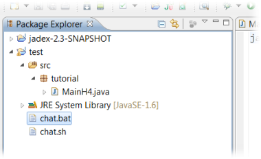

# Jadex Platform
For Active Components to be executed, a *Platform* needs to be running.
The Jadex Platform provides important runtime services such as lifecycle management, remote service invocation and component management. For more information about services provided by the Jadex Platform itself, skip to [Platform services](#platform-services).

This chapter will explain how to start a Jadex Platform from Java code (i.e. the ```main()``` method), so in consequence, components can be started on this platform.

## Starting a Platform

Starting a platform with default parameters is easy. Use the ```jadex.base.Starter``` class:

```java
IFuture<IExternalAccess> fut = Starter.createPlatform()
IExternalAccess platform = fut.get();
```

<div class="hint">test</div>
The object returned by Starter.createPlatform() is called a *Future*.
It represents a result that is not yet available - calls that return a Future will typically return it instantly.
Futures are used for asynchronous programming - please refer to chapter [Futures](Futures).
For now, using *get()* on a Future will lead to the expected result by waiting until the call is finished.

If you want to adjust the platform to your needs, you can pass a ```PlatformConfiguration``` object:

```java
PlatformConfiguration platformConfig = PlatformConfiguration.getDefault();
RootComponentConfiguration rootConfig = platformConfig.getRootConfig();

// Pass to Starter:
IExternalAccess platform = Starter.createPlatform(platformConfig).get();
```

Both the PlatformConfiguration object and the RootComponentConfiguration object provide many ways to configure the platform. Some of them are listed below. For further information, please see the API documentation of [PlatformConfiguration](../../javadoc/jadex/base/PlatformConfiguration.html) and [RootComponentConfiguration](../../javadoc/jadex/base/RootComponentConfiguration.html).

The configuration options are also explained in more detail [here](http://www.activecomponents.org/jadex-applications-web/jadexdoc/view?model=/jadex/platform/Platform.component.xml).

## Configuration examples

### Run without GUI (JCC) and CLI (common case)
```java
rootConfig.setGui(false);
rootConfig.setCli(false);
```

### Enable logging (useful for debugging)
```java
rootConfig.setLogging(true); // enables the printing of info and warning messages in addition to severe messages.
```

### Enable future debugging
```java
platformConfig.setDebugFutures(true); // enables stacktraces of exceptions
```

### Do not print password or welcome message
```java
rootConfig.setWelcome(false);
rootConfig.setPrintPass(false);
```

### Set platform name
```java
platformConfig.setPlatformName("jadexplatform");
```

### Set available component kernels
```java
rootConfig.setKernels(RootComponentConfiguration.KERNEL.micro,
				RootComponentConfiguration.KERNEL.component,
				RootComponentConfiguration.KERNEL.v3);
```


TODO: awareness, passwords

## Platform services
TODO: List of all services a default platform provides. 

## Packaging an Application

If you deploy your application to end users you will want to have some deployment package of your application that can be started by a double-click.

### Alternative 1: Executable Jar

When you develop with eclipse you are almost done, because eclipse allows exporting a project directly as an executable jar file. An executable jar is in the essence a zip file including your Java classes and contains additional meta information, so that Java knows which main class to start, when the jar file is executed.

-   Make sure that you have an up-to-date launch configuration and that your application works as expected.
-   Right-click on the project and choose *Export...*
-   In the appearing dialog choose *Java -> Runnable JAR File* and hit *Next >* (see image for step 1).
-   In the next dialog, choose your launch configuration to be exported, the target file name and specify the library handling (see image for step 2).

  
*Exporting a jar file (step 1)*

In the second step as shown below you can specify the way the dependencies of the application are exported. Your application depends on the jars from the Jadex distribution. You can either extract, package, or copy the required libraries. Extraction means that classes and support files from the dependency jars are extracted and repackaged directly in the newly produced jar file. For packaging, the dependent jar files are kept unchanged but are included in the new jar file, such that as before only one output file is produced. In the last option 'copy' the dependencies are stored in a separate folder besides the generated jar. Which option you choose is mostly a matter of taste.

  
*Exporting a jar file (step 2)*

-   Export your application with the chosen options.
-   Test the exported application by double-clicking on the jar file.

### Alternative 2: Launch Script

If you are a little bit used to Java, you may know that you can start an executable jar as produced in the last section by typing 'java -jar *filename*.jar' in the console. Therefore you can use the same command in a .bat file (on Windows) or an .sh script (on Linux). But it is also quite easy to start your application from the console or a batch script even without producing an executable jar file.

-   Locate the jadex-platform-standalone-launch-${jadexversion}.jar from the Jadex distribution (the version number might differ depending on which Jadex version you use).
-   Create a batch file (.bat or .sh) in your eclipse project using right-click *New -> File*
-   Open the script in a text editor and add the following line for windows:

```
java -classpath "<path to jadex launch jar>;bin" mypackage.Main
```

-   or for Linux (note the ':' instead of the ';'):

```
java -classpath "<path to jadex launch jar>:bin" mypackage.Main
```


-   Of course in both scripts you have to change the path to the Jadex launch jar to the actual value on your system and also change the package, if your package is not name 'mypackage'.
-   The scripts assume that your compiled classes are in the *bin* directory, which is the default for eclipse. Your directory structure should look like the following:

  
*Location of start scripts*
