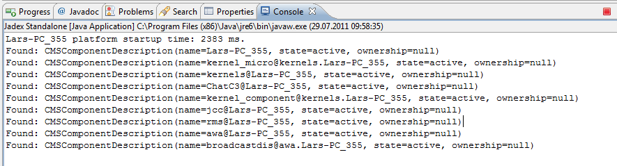

# Required Services

In this chapter we will cover the mechanisms that can be used to obtain services and use them programmatically. In active components (as in SCA) services are part of components and consist of an interface specification and a service implementation. Service interfaces are defined as Java interfaces and implementations as corresponding Java classes. Required services allow specifying in a declarative way how the service we need should look like and how the systems can find such a service. These aspects of how to find a suitable service are defined in the *service binding*. Such bindings can either be static, i.e. once the required service is bound it will not change from call to call, or dynamic meaning that it will be rebound each time the required service is accessed.

## Exercise C1 - Declaring a Predefined Service
In this exercise we will fetch the predefined clock service. The clock service is already provided by the platform component itself so that it is sufficient to define that the service interface is named *jadex.bridge.service.clock.IClockService* and that it can be found within the *platform* scope.

### Defining the Component
Create a Java class called *ChatC1Agent.java* and use the following:

-   Add the *@Agent* annotation to state that this java file is an agent
-   Add a *@Description* annotation with an illustrative example explanation such as @Description("This agent uses the clock service.")
-   Add a required service description that defines the name of the service as *clockservice*, its type as *IClockService* and its scope as *RequiredServiceInfo.SCOPE_PLATFORM*. 

The resulting definition should look like the following:

```java

package tutorial;
import ...

@Description("This agent declares a required clock service.")
@Agent
@RequiredServices(@RequiredService(name="clockservice", type=IClockService.class,
  binding=@Binding(scope=RequiredServiceInfo.SCOPE_PLATFORM)))
public class ChatC1Agent
{
}

```


### Verify the Component Behavior

To understand the code it is necessary to explain the underlying concepts of the component service container. Each active component (regardless of its type) contains a service container that basically fulfills three aspects. It allows for *fetching required services*, *searching services*, and *providing services*.  In the Starter of the JCC the each component is displayed with its service container. Within the service container node the provided and required services can be seen. In the screenshot below the ChatC1 agent instance with its service container the required clock service is shown.

  
*Component tree in Starter*

## Exercise C2 - Invoking a Predefined Service

In this lecture we will use the clock service to print out the current platform time. 

### Defining the Component

-   Create a Java class called *ChatC2Agent.java* and copy the content from the last lecture.
-   Insert a field of type *MicroAgent* and name it *agent*. Add an *@Agent* annotation above the field declaration. Jadex will notice the @Agent annotation and automatically inject the micro agent object to the agent. The injected micro agent can be used to access the agent programming interface, e.g. for fetching its service container.
-   Declare a public void method called *executeBody()* and add a *@AgentBody* annotation above the method. This method is one of three lifecycle methods of a micro agents (agentCreated(), executeBody() and agentKilled()) which will contain the functional agent code and is called once after the agent is born. 
-   What is still missing is the usage of the declared required service. This will be done in the *executeBody()* method with the following code:

```java

IFuture<IClockService> fut = agent.getServiceContainer().getRequiredService("clockservice");
fut.addResultListener(new DefaultResultListener<IClockService>()
{
  public void resultAvailable(IClockService cs)
  {
    System.out.println("Time for a chat, buddy: "+new Date(cs.getTime()));
  }
});

```

### Verify the Component Behavior

The injected micro agent is used to get the service container and then the declared service is looked up via its name using the *getRequiredService("clockservice")* method. Fetching a required service makes Jadex inspect the binding definition of that service and possibly initiates an implicit service search. As resolving the binding may involve complex lookups it is realized as asynchronous call using a *future* return value (also nearly all services are defined this way). This means that the call immediately returns the future that represents a holder for the 'real' return value. The future allows the caller to be decoupled from the action of the callee because the method call can return without waiting for the callee to finish processing and the result is set by the callee whenever it is ready. (For further details on futures e.g. refer to [Wikipedia](http://en.wikipedia.org/wiki/Futures_and_promises) ) The caller can add a listener on the future to be informed when the 'real' result is ready. Here a *DefaultResultListener* is used, which requires only one method to be overridden called *resultAvailable()*. The result is of type IClockService, on which calling the *getTime()* method delivers the current time in millis. This time is printed out to the console. (In contrast to System.currentTimeMillis() the platform clock could also return other times, e.g. when Jadex is used in simulation mode).

## Exercise C3 - Invoking a Futurized Service

In this execise we will use another service of the platform and invoke a method on it. In contrast to the clock service, which offers only normal synchronous method signatures the component management service used here has an asynchronous interface.
 

### Defining the Component

-   Create a Java class called *ChatC3Agent.java* and copy the content from the last lecture.
-   Change the required service specification to look for the *IComponentManagementService.class* and change the name to *cms*. The scope can be kept the same as this service is also made available by the platform component itself. 
-   Adapt the *getRequiredService()* call to use the new service name cms and type *IComponentManagementService*.
-   Change the parameter type of the resultAvailable method to *IComponentManagementService*.
-   Invoke the *getComponentDescriptions()* method on the service to get an array of all components in the platform. Note, that the call returns a future so that you will have to add a result listener again for result processing.
-   Iterate through the retrieved *IComponentDescription[]*  array and print out the results one by one.

### Verify the intended behavior

Start the platform and the agent and check if the component descriptions are printed out. The output should look similar to the console snapshot shown below. Please note that the component management service is one of the central services of the Jadex platform. It can e.g. be used to *create*, *kill*, *suspend* and resume components. Feel free to inspect the IComponentManagementService interface to learn more about theses functionalities.

  
* Console snaphsot*

Please note that, besides the interface type itself, the most important factor of searches and required service specifications is the search scope. It defines the area of the search and is per default set to *application*. This means that only components within the started application are considered within the search. Knowing this it becomes clear why we had to change the scope to *platform* in all lectures so far. Otherwise the search would have stopped at the application component and the platform services would not have been found. In the figure below a visual representation of search scopes is given.

  
* Component search scopes*

## Exercise C4 - Searching services

In general, the services used by a component should be made explicit by declaring required services in the component model. By default the required services are assumed to be static and therefore search a service only once and subsequently returns the cached value. (This default behavior can be changed by setting *dynamic=true* in the binding). In rare cases one might want to search for services directly. This can be done by fetching the service container and using the *searchService* methods. An alternative that can be used if really fine-grained search control is necessary is using the *jadex.bridge.service.SServiceProvider* class, which provides many static methods for searching services. In this lecture we will search for the micro agent factory service of the platform. This is not directly possible using a required service definition, because the platform has several component factories with the same interface *IComponentFactory*. (As an alternative one could use a required service binding for all services of type *IComponentFactory* and select from those). So what we need is a possibility to further restrict the search results. This can be done using a *jadex.bridge.service.IResultSelector*. For component factories there is already a ready to use selector called *jadex.bridge.service.component.ComponentFactorySelector*. 

### Defining the Component

-   Create a Java class called *ChatC4Agent.java* and copy the content from the last lecture.
-   Delete the required service annotation.
-   Use the following code to search for the factory:

```java

IFuture<IComponentFactory> factory = SServiceProvider.getService(agent.getServiceContainer(), 
  new ComponentFactorySelector(MicroAgentFactory.FILETYPE_MICROAGENT));
factory.addResultListener(agent.createResultListener(new DefaultResultListener<IComponentFactory>()
{
  public void resultAvailable(IComponentFactory result)
  {
    System.out.println("Found: "+result);
  }
}));

```


### Verify the intended behavior
After starting the component on the console the output should indicate that a factory was found that is capable to load micro agents. Depending on the platform configuration this could either be the *MultiFactory* or the *MicroAgentFactory*. 

## Exercise C5 - Declaring a Predefined Service in XML

This lecture will explain how to define a required service within an XML component specification. The lecture is functionally equivalent to the lecture C1.

### Defining the Component

-   Create a component file called *ChatC5.component.xml* and copy the content from lecture B1.
-   Adjust the filename comments.
-   Add an imports section and add an import for the class *jadex.bridge.service.types.clock.IClockService*.
-   Add a services section and add a required service definition for the clock service. Its class has to be set to *IClockService*. Within the required service definition add a binding specification with scope set to *platform.*

The result should look like this:

```xml

<?xml version="1.0" encoding="UTF-8"?>
<componenttype xmlns="http://jadex.sourceforge.net/jadex"
  xmlns:xsi="http://www.w3.org/2001/XMLSchema-instance"
  xsi:schemaLocation="http://jadex.sourceforge.net/jadex
                      http://jadex.sourceforge.net/jadex-component-2.1.xsd"
  name="ChatC5" package="jadex.micro.tutorial">

  <imports>
    <import>jadex.bridge.service.types.clock.IClockService</import>
  </imports>
	
  <services>
    <requiredservice name="clockservice" class="IClockService">
      <binding scope="platform"/>
    </requiredservice>
  </services>
</componenttype>

```

### Verify the intended behavior
Start the component and check that it has a service container with the required clock service inside.

## Exercise C6 - Invoking a Predefined Service in XML

This lecture will explain how to use a required service within an XML component specification. The lecture is functionally equivalent to the lecture C2. It has to be stated that typically plain XML components do not posses own behavior but are rather used for defining applications and composites, i.e. components with subcomponents. Despite this typical use case it is also possible to attach some behavior to XML components. For this purpose so called steps can be used which have to be implemented as Java classes. 

### Defining the Component

-   Create a component file called *ChatC6.component.xml* and copy the content from the last lecture.
-   Add a component step in the XML description by inserting the following snippet after the services section.

```xml

<configurations>
  <configuration name="first">
    <steps>
      <initialstep class="PrintTimeStep"/>
    </steps>
  </configuration>
</configurations>

```

-   Create a new Java class called *PrintTimeStep* and let it implement the *jadex.bridge.IComponentStep* interface. The class will have to implement one method called *execute(IInternalAccess ia)* in which the code to fetch and invoke the clock service (the same as in lecture C2) has to be placed. You can use the internal access argument here to get the service container of the component. For simplicity, just return *IFuture.DONE* as a result of the step. The usage of the return value of the component step will be discussed in a later chapter.

```java

public class PrintTimeStep implements IComponentStep<Void>
{
  public IFuture<Void> execute(IInternalAccess ia)
  {
    ...
    return IFuture.DONE;
  }
}

```

### Verify the intended behavior
Assure that after starting the component it will print out the current time on the console out.