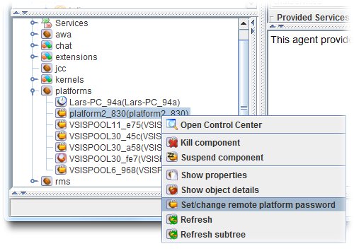

# Security

Thanks to mechanisms for global awareness and connectivity, in principle, any Jadex platform around the world may find and invoke any services of components on any other Jadex platform. In practice, of course, access to platforms and provided services needs to be restricted to appropriate groups of users. In this chapter you will learn how to specify or relax the default security restrictions of Jadex services in your application code. Furthermore you will learn how to configure your platforms to enable restricted access to other platforms.

# Exercise G1 - Making the Chat Publicly Available

The security lecvel of services and their methods can be adjusted by the *@Security* annotation (package *jadex.bridge.service.annotation*). Currently, two levels are supported (other more fine-grained levels my be added later). The default level for all services is *PASSWORD* and allows access only to platforms, which have some sort of security credentials for the invoked platform. The other level is *UNRESTRICTED* and allows access to any platform.

## Starting two different Platforms

Currently, your chat service has the default security level *PASSWORD* and therefore cannot be accessed from other platforms. To verify this behavior, start two platforms with different names. E.g. in eclipse, duplicate your launch configuration and add the following in the programm arguments section: *-platformname platform2_*.
Start the chat component on each platform (e.g. *ChatD2*) and check that chat messages are not sent between the platforms.

## Changing the security level of the service

Edit the *IChatService.java* and add a corresponding security annotation.

```java

@Security(Security.UNRESTRICTED)
public interface IChatService 
{
...
}

```

Restart the two platform and verify that that messages are exchanged. Note, that the annotation can be added to the service as a whole, but also seperately to the service methods. The annotation of a method takes precedence over the annotation of the service as a whole. E.g. when the service itself is unrestricted but the method has an additional annotation with level *PASSWORD*, the service can be found but the method can not be accessed from outside platforms.

# Exercise G2 - Accessing Restricted Services

In the Jadex Control Center, you can edit the security settings of a platform. This allows e.g. to set the password of the platform, but also to add known passwords of other platforms. Furthermore, you can setup trusted network zones. Using these security settings you can enable service calls between components, even when the services are restricted.

For this exercise, remove the security annotations from the chat service interface. Start two platforms as above and verify that the platforms do not communicate. In the following, different techniques are described to enable the restricted access.


## Platform passwords

At startup, each Jadex platform prints out the platform as stored in its *.settings.xml*. Find the password of the second platform in the console. Go to the starter panel in the JCC of the first platform, unfold the *platforms* node and right-klick on the node of the second platform (see below).

  
*Entering a password for a remote platform*

Enter the password of the second platform in the appearing dialog. The first platform should now be able to access all services of the second platform. As a result, the node of the second platform will change its color to green. Repeat the process by entering the first platform's password in the second platform's JCC. Now the two chat components should be able to communicate with each other.

## Setting up a trusted network

In the following an alternative setup for allowing restricted access is described. To be able to test if it works, reset the password settings by deleting the *platform2.settings.xml* file. When you now start the second platform it will generate a different password and also no longers knows about the first platform's password. Therefore chat communication between the two platforms will be disabled.

Now open the security panel in the first platforms JCC, which is identified by a lock symbol. In the text fields at the bottom, enter a network name of your choice and click 'Add'. Add the same network name in the second platform. Instead of having separate passwords for each platform, the security network settings allow establishing a group of platforms that allow access to each other. While not strictly necessary, you can also add a password for the network. You can also add multiple networks for platforms that should be present in more than one group. As long as two platforms share a at least one network name with the same password (or no password for both), they will allow restricted communication.

Start a chat component on each platform and verify if it works. Further details about security issues and settings can be found in the [security settings chapter in the tool guide](../../../tools/05%20Security%20Settings)) .
