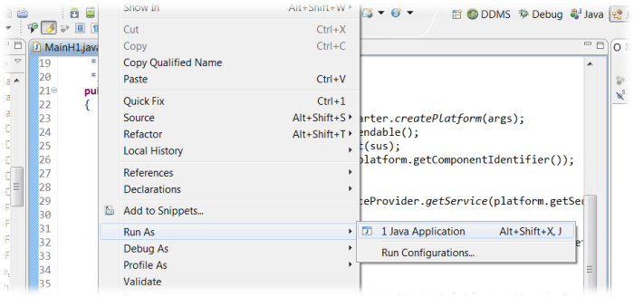

# Application Integration

${SorryOutdated}

In the previous lessons, the chat component was always started from the Jadex control center (JCC). Typically, when you are developing an application with active components, you do not want the end users having to access the JCC. Instead you want your components seamlessly integrated in a larger application.

In this chapter it will be shown how to start a Jadex platform and start and access components directly from Java code. In this way, active components can be integrated in any kind of desktop or server Java applications. Here, a Java main class is developed to start the chat as a standalone Java application. Of course, the same code can be used as well for integrating your Jadex components into servlets or other kinds of Java frameworks.


## Exercise H1 - Starting a Platform

This exercise shows how a platform can be started from Java code.

Starting a platform with standard arguments is very easy using the *createPlatform(...)* method of the *jadex.base.Starter* class. The return value of this method is a future object that contains the external access of the platform component, once the platform startup has finished successfully. For fetching the future result, you could use a result listener as known from the previous lessons. As the thread running the main() method is not managed by the Jadex concurrency model there is another option. Using a so called *ThreadSuspendable*, the main thread can be blocked until the future is available. This is used by default if *get()* is called outside a component context. This technique avoids the necessity of inner classes, which comes with the use of result listeners.

### Write a Main Class

-   Create a new java class file named *MainH1.java*.
-   In the class add a main method, i.e. a method with the following signature:

```java
public static void main(String[] args)
```

-    as explained above, place the following code in the method body:

```java

IFuture<IExternalAccess>	platfut	= Starter.createPlatform(args);
IExternalAccess	platform	= platfut.get();
System.out.println("Started platform: "+platform.getComponentIdentifier());

```


### Test the Application

For starting the newly written class as a Java program in eclipse, right-click in the editor and choose *Run As -&gt; Java Application*.

  
* Starting a Java application from eclipse*

If everything is OK the JCC should appear. In addition to the normal Jadex outputs you should also see the 'Started platform: ...' line that was printed from the above code.

## Exercise H2 - Platform Arguments

By default, the Jadex platform opens the JCC and prints some messages on the console. This is usually undesirable, when embedding Jadex in an application. Furthermore, you may want to tweak settings of the platform, e.g. for disabling unnecessary features for improved performance. In this exercise, the platform start code will be adapted to supply some custom arguments.

### Supply an Argument at Application Launch

You may have noticed in the previous exercise, that the *args* parameter of the *main(...)* method is passed to the *createPlatform(...)* method. Therefore we can adapt the eclipse launch configuration to supply arguments to the Jadex platform. In the following we want to stop the JCC from opening.

-   Open the run configuration created in the previous exercise (e.g. right-click in editor and choose  *Run As -&gt; Run Configurations...*).
-   Change to the *Arguments* tab and add the line '-gui false'.

  
* Changing launch arguments in eclipse*

-   Run the application and check, that the JCC does not appear.

### Supply Default Arguments in the Main Method
<!--TODO: outdated-->
Instead of having to supply the arguments from the outside, you will typically want to specify some kind of default settings directly in the application. Anyhow, it is useful to be able to specify additional arguments from the outside, e.g. for testing purposes.

-   Copy the *MainH1* class to a new file *MainH2.java*.
-   Change the body of the main method to the following:

TODO: outdated configuration style

```java

String[] defargs = new String[]
{
  "-gui", "false",
  "-welcome", "false",
  "-cli", "false",
  "-printpass", "false"
};
String[] newargs = new String[defargs.length+args.length];
System.arraycopy(defargs, 0, newargs, 0, defargs.length);
System.arraycopy(args, 0, newargs, defargs.length, args.length);
IFuture<IExternalAccess>	platfut	= Starter.createPlatform(newargs);
IExternalAccess platform = platfut.get();
System.out.println("Started platform: "+platform.getComponentIdentifier());

```


This code first defines a string array with default settings as follows:

-   **-gui false** disables the JCC
-   **-welcome false** disables printing of the welcome message with the platform startup time
-   **-cli false** disables the command line interface and thus also prevents printing of the command prompt (*Host\_123&gt;*)
-   **-printpass false** disables printing of platform password

Afterwards a new array is created and filled with first the default arguments and then with the args supplied to the main method. Therefore, in case of conflicts the arguments supplied from the outside override the default settings. Make sure that in the *createPlatform(...)* method the *newargs* array is passed instead of the *args*. Otherwise the default settings will be ignored.

### Test the Application

-   Start the application with a new launch configuration or change the old launch configuration to refer to *MainH2* instead of *MainH1*.
-   Observe that no messages are printed to the console except the *Started platform: ...* statement from the main method itself.
-   Change the arguments in the launch configuration (e.g. add *gui -true* for opening the JCC again)
-   Restart the application and check if your changes are respected.

Note that there is a large number of useful arguments for customizing the platform. You can e.g. configure the awareness or transport mechanisms or change security settings, etc. For debugging, especially the *-logging true* option is very helpful, as it enables printing of *info* and *warning* messages in addition to the *severe* messages, which are printed by default. An overview of available settings can be found in the [platform jadexdoc](http://www.activecomponents.org/jadex-applications-web/jadexdoc/view?model=/jadex/platform/Platform.component.xml)

## Exercise H3 - Creating a component

Now that we have the platform access available, we can do everything programmatically that we could also do with the JCC. Therefore we can access running components and also start and stop new components as needed.

In this exercise, we use the platform access to obtain the component management service (CMS). We then use the CMS to create a chat component.

### Obtain the CMS

-   Copy the *MainH2* class to a new file *MainH3.java*.
-   Extend the main method to search for the CMS service. For this purpose, use the static helper class *SServiceProvider* from package *jadex.bridge.service.search* as follows:


```java

IComponentManagementService cms = SServiceProvider.getService(platform.getServiceProvider(),
  IComponentManagementService.class, ServiceScope.PLATFORM).get();

```


The *SServiceProvider* class provides access to the service search mechanism and further provides helper methods for dealing with required and provided services of components. Here, we use the *getService(...)* method for searching for a service. The supplied service provider represents the entry point for the search, from which the components to be searched are derived using the search scope. Here we use the service provider of the platform. The cms interface class is supplied to indicate the type of service we are interested in. Finally, the search scope *platform* states that all components and subcomponents of the platform should be searched.

The result of the *getService(...)* method is a future of the corresponding service type. The application is still running on the Java main thread, therefore it is safe to use again the thread suspendable for blocking until the search result is available.

### Create a component programatically

-   On the cms, invoke the *createComponent(...)* method.
-   Most arguments can be set to *null*, only the second argument (*model*) is required.
-   As model, supply the class name of the chat component and append *".class"*. Use the chat component from Exercise D2.
-   The result is a future of the component identifier of the newly created component.
-   Wait for the component identifier using the thread suspendably and afterwards print the id to the console.
-   The resulting code should look as follows:

```java

IComponentIdentifier cid = cms.createComponent(null, ChatD2Agent.class.getName()+".class", null, null).get();
System.out.println("Started chat component: "+cid);

```


The arguments to the *createComponent(...)* method are as follows:

-   **name**: The name of the new component. When set to null, a name is automatically generated.
-   **model**: The file name of the component model. Here we derive the name from the chat component built in Exercise D2 to avoid typos. You could also supply a string directly, e.g. *"mypackage/MyAgent.class"* or *"mypackage/My.component.xml"*.
-   **info**: An object of type *jadex.bridge.service.types.cms.CreationInfo*, which can be used to supply various options like component arguments, parent, etc. Can be set to null if no special options are required.
-   **resultlistener**: A result listener that is called when the created component terminates. The result listener will be given the result values that are produced by the component.

The method returns a future result and asynchronously starts initiating the new component in the background. When the new component could be started successfully, its component identifier is provided as a result. The result is only made available after all init code of the component and its services (if any) has completed.

### Test the application

-   Start the application using a new or updated launch configuration for the *MainH3* class.
-   The chat window should appear indicating that the chat component was created.
-   Test the chat by sending some messages.
-   Close the chat window. The Java VM will exit, because as a default, the Jadex platform shuts down when no more application components are running.

## Exercise H4 - Accessing a Component

When integrating your components into some application, you often need some form of coordination and/or data exchange between the components and the remaining application code outside of Jadex. The natural way for realizing this is using services of your components. Sometimes, you may be able to reuse the services that are already present in your components. Otherwise, you need to devise new service interfaces that capture the interaction requirements between a component and outside code.

In this exercise we obtain the chat service of the chat component to print a welcome message in the GUI.

### Obtain the Chat Service

-   Copy the *MainH2* class to a new file *MainH3.java*.
-   Use the *SServiceProvider* helper class to obtain a service from the created chat component. The method *getService(provider, cid, type)* allows fecthing a declared service of a specific component directly.
-   Call the *message(...)* method of the chat service to display a startup message.
-   The required code looks as follows:


```java

IChatService chat = SServiceProvider.searchService(platform.getServiceProvider(), new ServiceQuery<>( cid, IChatService.class)).get();
chat.message("Main", "Chat started.");

```


Note that we use the service provider of the platform as search entry point, but we specify the cid of the chat component. Thus we state that we want to search for the *IChatService* only in this specific chat component. As before, the suspendable is used to wait and fetch the future result value. The obtained chat service object can be used to invoke the methods of the chat service object.

### Test the Application

-   Update the launch configuration and start the application.
-   Check that the welcome message appears in the chat window.

## Exercise H5 - Packaging the Application

In the previous exercises, you were still starting your chat application from eclipse. If you deploy your application to end users you will want to have some deployment package of your application that can be started by a double-click.

In this exercise it is described how to compose an aplication for deployment to users.

### Alternative 1: Executable Jar

When you develop with eclipse you are almost done, because eclipse allows exporting a project directly as an executable jar file. An executable jar is in the essence a zip file including your Java classes and contains additional meta information, so that Java knows which main class to start, when the jar file is executed.

-   Make sure that you have an up-to-date launch configuration and that your application works as expected.
-   Right-click on the project and choose *Export...*
-   In the appearing dialog choose *Java -&gt; Runnable JAR File* and hit *Next &gt;* (see image for step 1).
-   In the next dialog, choose your launch configuration to be exported, the target file name and specify the library handling (see image for step 2).

  
*Exporting a jar file (step 1)*

In the second step as shown below you can specify the way the dependencies of the application are exported. Your application depends on the jars from the Jadex distribution. You can either extract, package, or copy the required libraries. Extraction means that classes and support files from the dependency jars are extracted and repackaged directly in the newly produced jar file. For packaging, the dependent jar files are kept unchanged but are included in the new jar file, such that as before only one output file is produced. In the last option 'copy' the dependencies are stored in a separate folder besides the generated jar. Which option you choose is mostly a matter of taste.

  
*Exporting a jar file (step 2)*

-   Export your application with the chosen options.
-   Test the exported application by double-clicking on the jar file.

### Alternative 2: Launch Script

If you are a little bit used to Java, you may know that you can start an executable jar as produced in the last section by typing 'java -jar *filename*.jar' in the console. Therefore you can use the same command in a .bat file (on Windows) or an .sh script (on Linux). But it is also quite easy to start your application from the console or a batch script even without producing an executable jar file.

-   Locate the jadex-platform-standalone-launch-2.2.jar from the Jadex distribution (the version number might differ depending on which Jadex version you use).
-   Create a batch file (.bat or .sh) in your eclipse project using right-click *New -&gt; File*
-   Open the script in a text editor and add the following line for windows:

```
java -classpath "<path to jadex launch jar>;bin" tutorial.MainH4
```

-   or for Linux (note the ':' instead of the ';'):

```
java -classpath "<path to jadex launch jar>:bin" tutorial.MainH4
```


-   Of course in bith scripts you have to change the path to the Jadex launch jar to the actual value on your system and also change the package, if your package is not name 'tutorial'.
-   The scripts assume that your compiled classes are in the *bin* directory, which is the default for eclipse. Your directory structure should look like the following:

  
*Location of start scripts*

-   Launch your start script (from a console or by double clicking it in the windows explorer or a linux file browser).

