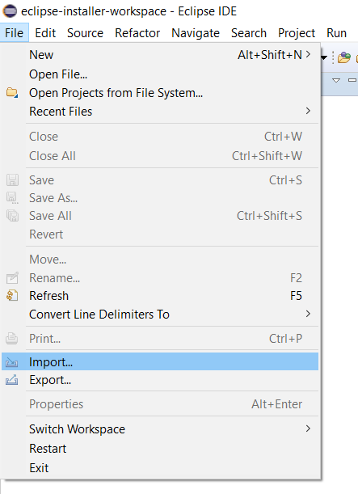
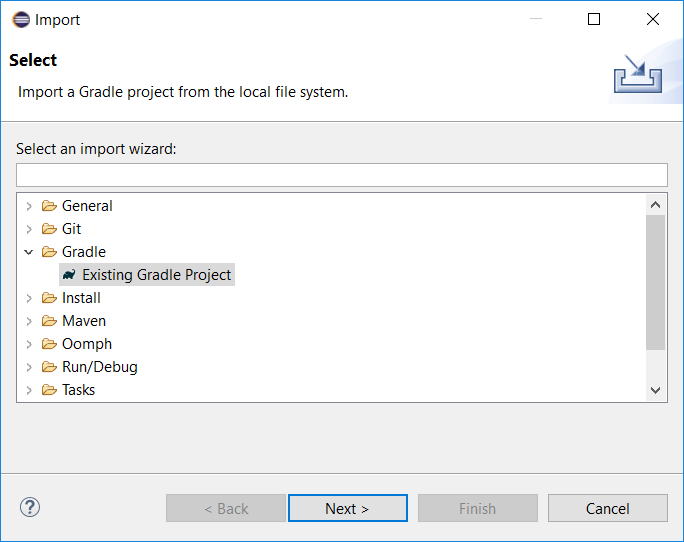
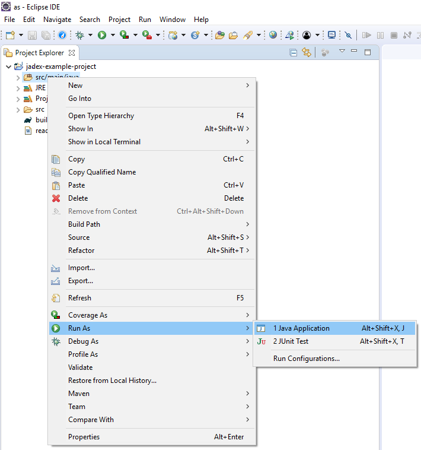
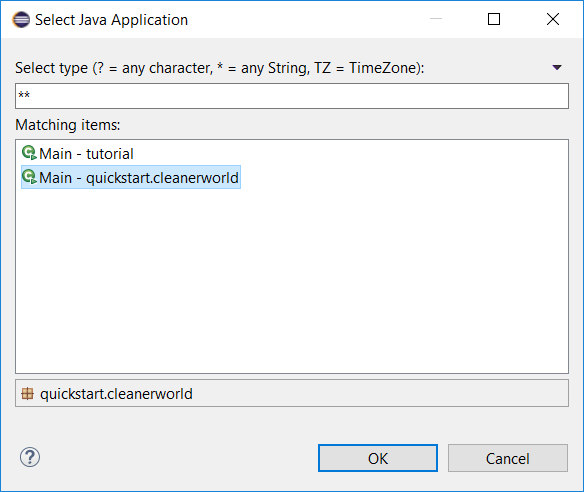
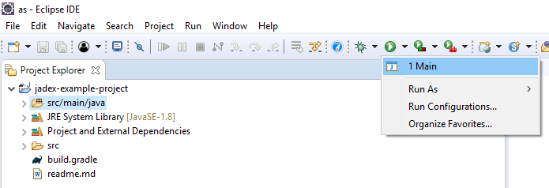

# Introduction

This tutorial introduces the notion of autonomous software agents by using a simulated environment named *Cleanerworld*. It illustrates some basic challenges for programming software agents and introduces the *BDI (belief-desire-intention)* model as implemented in Jadex. The tutorial is aimed at programmers with some basic Java experience. More advanced concepts like Java annotations are explained on the fly as needed. In addition, the tutorial provides many pointers to other documentation pages that you can follow if you want to learn a bit more about a certain topic.

# Setting up the Cleanerworld Project in Eclipse

The easiest way to start with the Cleanerworld scenario is to import the Jadex example project from the download server to an IDE of your choice. The following description explains the import process for the Eclipse IDE and the Gradle project support of Eclipse. You can download Eclipse from [https://www.eclipse.org/downloads/packages/installer](https://www.eclipse.org/downloads/packages/installer).

## Fetching the Project Files

Download the [jadex-example-project.zip](https://download.actoron.com/nightlies/oss/${jadexversiontitle}/jadex-example-project.zip) and extract the contents to an directory of your choice. 

## Importing the Project

Choose *File/Import... -> Gradle/Existing Gradle Projects* and select the unzipped example directory as root directory.

*Figure 1: Eclipse import menu*

*Figure 2: Select the Gradle project type for import in Eclipse*

## Starting the Cleanerworld

To start the Cleanerworld application, open the imported project, right-click on the `src/main/java` folder and choose  *Run As -> Java Application*. Select the `Main` class from package `quickstart.cleanerworld`. Click *OK* and the application should start.
  

*Figure 3: Eclipse run-as menu*

*Figure 4: Selecting the Cleanerworld main class*

Eclipse remembers the launch configuration. Therefore in the future,
  you can simply select the *Main* configuration from the run history
  to start the program.

*Figure 5: Quick access to the created launch config*
  