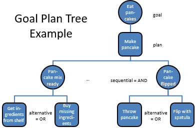

# Plans with Subgoals

This exercise shows how to build plans based on so called subgoals.
A subgoal is a goal, that exists in the context of a plan.
For the subgoal, the agent may again execute other plans,
thus forming a hierarchy of goals and plans called the *goal/plan tree*.

The figure below shows an example of an agent that wants to eat pancakes.
The goal/plan tree is an *AND/OR* decomposition of the problem.
To achieve a goal, *only one* of the available plans needs to work (*OR* decomposition, e.g. "throw pancake" *or* "flip with spatula").
For a plan to complete, *all* subgoals of the plan need to be successful (*AND* decomposition, e.g. "pancake mix ready" *and* "pancake flipped").



*Figure C.1: Example Goal Plan Tree (inspired by a [paper of Broekens et al.](https://link.springer.com/chapter/10.1007%2F978-3-642-16178-0_5))*
 
 
 
## Exercise C0: Managing Known Charging Stations in a Belief Set
 
Before we start using subgoals, we need to prepare our agent.
In the `loadBattery()` plan, the agent currently directly accesses the `actsense` object
to get the location of a known charging station. When no charging station is known,
the battery loading plan fails and the agent dies when the battery has run out.

We now want to make sure that we always know some charging station by using a subgoal
in the battery loading plan. This subgoal should be based on the current beliefs of the agent.
Thus we want to define a belief for the known charging stations, next to the `self` belief:

```java
	/** Set of the known charging stations. Managed by SensorActuator object. */
	@Belief
	private Set<IChargingstation>	stations	= new LinkedHashSet<>();
```

Also, we need to tell the `SensorActuator` object to keep this belief up to date.
We can do this in the `exampleBehavior()` method:

```java
		// Tell the sensor to update the belief sets
		actsense.manageChargingstationsIn(stations);
```

To test the new belief set, we can change the battery loading plan as follows:

```java
//		IChargingstation	chargingstation	= actsense.getChargingstations().iterator().next();	// old
		IChargingstation	chargingstation	= stations.iterator().next();	// new
		
		// Print class of stations object to show that the LinkedHashSet has been wrapped.
		System.out.println("Class of the belief set is: "+stations.getClass());
```

### The `stations` Belief Set

One important aspect of the Jadex framework is that fields and the referenced objects of field
marked with `@Belief` are monitored for changes (cf. Exercise B1). The `LinkedHashSet` as well as
other Java collection classes do not directly support monitoring their contents. For that reason,
Jadex wraps the object into a collection that supports monitoring. Jadex can do this for lists (`java.util.List`),
sets (`java.util.Set`) and Maps (`java.util.Map`). We added a `println()` in the loading plan,
so you can see that the `stations` set is wrapped in an object of type `jadex.bdiv3.runtime.wrappers.SetWrapper`.

Try changing the belief declaration as follows:

```java
	/** Set of the known charging stations. Managed by SensorActuator object. */
	@Belief
//	private Set<IChargingstation>	stations	= new LinkedHashSet<>();
	private LinkedHashSet<IChargingstation>	stations	= new LinkedHashSet<>();
```

Instead of the interface `Set`, now we use the implementation class `LinkedHashSet`.
The code compiles fine, but if you run the program, the following error will occur:

*java.lang.IllegalArgumentException: Can not set java.util.LinkedHashSet field jadex.quickstart.cleanerworld.single.CleanerBDIAgent.stations to jadex.bdiv3.runtime.wrappers.SetWrapper*

To avoid this error, remember using the interface types (`Collection`, `Set`, `List` or `Map`) for the field,
when you want to use Java collection classes as beliefs.

### The `manageChargingstationsIn()` Method

The `SensorActuator` object provides this method to simplify using belief sets for the perceptions from the environment.
Whenever the sensor perceives a previously unknown charging station, it is added to the set that you provided as a parameter in the method.

Similar methods are available for waste, waste bins, and other cleaners. The sensor also updates the belief sets on the
disappearance of objects: E.g. when the the cleaner is in vision range of a location where previously a waste object was detected,
but the waste object is no longer there, the sensor will remove the waste object from the set that has been provided
by the `manageWastesIn()` method.

Note that the beliefs are not immediately updated when an object changes that is not currently in vision range of the cleaner. 
 