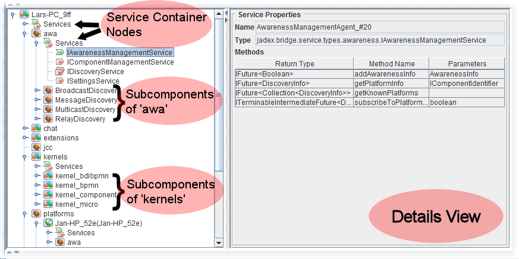

Chapter 3 - Starter 
================================

The starter plugin is one of the core tools for managing applications. It allows for starting and stopping applications and components and also provides a view of the currently running components. The basic layout of the starter is shown in the screenshot below. It basically consists of three different areas. The left upper part contains a file view of component models. When a user selects a new model it will be loaded and displayed on the right hand side of the tool. Finally, in the lower left part the platform with the currently running components is displayed.

\
*Starter screenshot*

Component Models 
-----------------------------

In the component models section a file system view on available active component models is displayed. To be able to view and select your own models here, you will first have to add the root path or jar file of your project. This can be done by clicking the add resource button  from the menu bar or by right clicking within a free space of the panel. This will also give you a popup menu with an add resource option. Activating add resource will give you a file chooser to select the project folder or jar file to add. After having confirmed the choice the folder will be displayed in the panel. You can now browse its contents and select a model to start. Please note that you cannot add any folder to the starter, as it has to be the classpath root of the contained resources, i.e. you should always add a bin or classes folder but not an internal package directly. Jadex will add the new resource automatically as classpath entry and if its not the correct folder you may encounter ClassNotFoundExceptions when selecting models. 

\
*Root entries are classpath entries*

In order to remove an unwanted entry from the model tree you have to select the topmost entry (e.g. the classes directory) and use the remove resource action  from the toolbar or popup menu. For easy navigation in the model tree you can collapse the whole tree by clicking on the corresponding action  from the toolbar. The add global resource action  can be used to add a maven resource via its artifact id. Clicking the action opens a dialog in which you can browse maven repositories and search for specific artifacts. Having selected an artifact, Jadex will automatically download the resource including all its dependencies and make it available in the model tree.

*Note:* The add global resource action  is only available in the Jadex Pro version.

**Active Component Types**

The model tree as well as the component instance tree (lower left) use different icons to display different component types. This makes it easy to quickly see which internal architecture is used by a component. The following component types are currently supported:

: The basic **component type** is defined using an XML schema. Such components do not have an explicit internal architecture (simple steps can be defined).\
: The **application type** is rather equivalent to the XML component type described above. The application type is considered as deprecated and will probably be removed in future releases.\
: The **micro agent type** is defined using annotated Java class files. Micro agents have a three-phased internal architecture consisting of an init, a body and a shutdown phase.\
: The **BDI agent type** is defined using both XML and Java class files. BDI agents have a cognitive internal architecture that allows for constructing agents with belief, goals, and plans.\
: The **BDI capability type** is a module concept for BDI agents. These modules cannot be started separately.\
: The **BPMN process type** is defined using the business process modelling notation. BPMN components are modelled using a graphical BPMN tool.\
: The **GPMN process type** is a goal oriented workflow variant. It combines a goal view with a BPMN activity perspective. GPMNs are thus defined using a graphical editor and a BPMN editor. 

Running Components 
-------------------------------

\
*Component instance tree*

In this tree view the platform itself is displayed as root (here the platform has the name Lars-PC\_9ff). The children of a component may consist of two node types: a service container node and further child component nodes. Looking at the 'awa' component you can e.g. see that it has a service container node and four components as direct children named 'BroadcastDiscovery', 'MessageDiscovery', 'MulticastDiscovery' and RelayDiscovery'. By looking at the icon of these child components you can also see that they are mirco agents. The opened service container node of 'awa' reveals that this component has one provided service  of type *IAwarenessManagementService* and three required services  with interfaces *IComponentManagementService*, *IDiscoveryService*, and *ISettingsService*. Please note that the required service *IDiscoveryService* has a multiplicity , i.e. this required service binds all service instances of the given type. On the right hand side of the tree panel a details view is provided. Double clicking on a node in the component instance tree will activate the details view and present more information about this node. In the screenshot, details of the provided service *IAwarenessManagementService* are shown, i.e. the signatures of the methods comprising the service interface. If you select a component instead of a service the details view will show more information about the component including such as its current state or the creator.

Component Starter Panel 
------------------------------------

Having selected a component model from the model tree, Jadex will attempt to load the file and display details about it on the right hand side of the screen. In the upper part the **start opions** are displayed. Below, an optional part is shown containing the properties for component **arguments and results. **In the panel at the bottom the **model description** of the component is presented.

### Start Options 

**Filename:** The filename of the selected model, i.e. it will show the physical location of the model on the hard drive.

**Configuration: **The configuration in which the component should be started. Configurations are named property settings declared within a component. A configuration e.g. describes with which subscomponents a component should be started.

**Component name: **The component instance name. This name has to be unique, i.e. there must not exist any component with the same** **name within the platform. This means, if you start a component two times without changing the instance name, you will encounter an error message stating that the component could not be created because it already exists. If you don't care about the instance name or intend starting multiple components you can select the auto generate option and set the number of components** **to create.**\
**

**Parent: **The optional parent component. Using the '...' button a component selector can be brought up and a parent component can be chosen by clicking the corresponding component.** **Using the 'x' button a previous selection can be deleted.

**Flags:**

-   **Start suspended: **If selected, the component and all its children will be started in suspended mode, i.e. the component will not start executing unless it is resumed. This option is helpful e.g. for debugging purposes, because it allows for starting suspended, switching to the debugger and executing a component piecewise without having to stop it manually.
-   **Master: **If a component is set to be master, it is a mandatory component for the component it is contained in. If this master component is destroyed  the super component will be destroyed as well.
-   **Daemon: **If a component is set to daemon it will not prevent autoshutdown of the super component (given the super component has autoshutdown turned on).
-   **Auto shutdown: **If enabled, this component is tracked to be autoshutdowned if it has no more child components. In order to allow autoshutdown even if there specific child components still exist, these** **components can be set to be daemons. 

**Buttons:**

-   **Start:** Will attempt to start the selected component type.
-   **Reload:** Will reload the currently selected model.
-   **Reset:** Will clear the selection.

### Arguments and Results 

In the arguments and results section it is shown which arguments can be provided and which results are produced by the component. Each argument type is presented with its *type*, its *name* and its *default value*, which is used if nothing else is specified. In the example shown above, the type of the argument is *int*, the name is *testcnt* and the default value is *2*. On the right hand side of each argument a text field is displayed, which can be used to enter a new argument value. It has to be noted that the string entered in this text field is treated as a Java expression, i.e. it is evaluated. In the screenshot above a user entered test, which cannot be parsed as Java expression. If such a wrong value is entered it will automatically detected and indicated by a red underline (as in the screenshot). 

In the results section below similar details about the results are shown. For each result a row with the result type, its name, the default value and the real result is shown. As results are valid only after termination of the component, the right most text field will be empty for the model. In order to see results of component instances, it is necessary to activate the **store results** checkbox. After the component has been destroyed the 'select component instance' choice can be used to select a specific component. Its result values are shown in the results section from above. Please note that result values are not automatically deleted if 'store results' is turned on. This can be achieved manually by clicking the 'clear results' button.

### Provided and Required Services 

In this area details about the required and provided services of a component are depicted. For example, in the screenshot above, a component with three required and one provided service is shown. For each required service its *logical (local) name*, its *interface type* and its *multiplicity* are stated. In the example, a required service with name clockservice, interface ILockService and no multiplicity exists. In case of provided services only the *interface type* and the *creation expression* are provided. The creation expression either is a Java expression such as e.g. a constructor call to the service implementation or in most simple cases just the class name of the service implementation class. In the example a provided service of type *IChatService* is listed, which is created via its implementation class *jadex.micro.tutorial.ChatServiceD5*.

Model Description 
------------------------------

The model description area contains the developer made description of a component model. The description may be simple text or HTML text. HTML may be used to improve the readability of the text due to the possibilities of using headings and different style attributes. The model description of a component model is the topmost comment in case of XML files or comes from the description annotation in case of Java files (Java comments are not accessible from class files).
