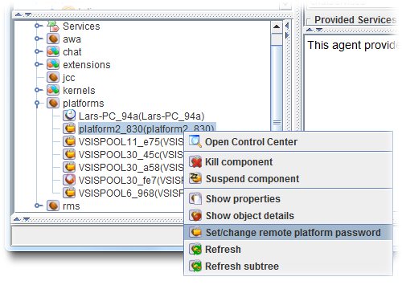

Chapter 5 - Security Settings
==========================================

  
*Security settings panel*

Platform security in Jadex is based on platform passwords and networks. Please refer to the [security chapter](../AC%20User%20Guide/08%20Security)  in the user guide to read about these concepts. The security settings panel consists of four different areas that are explained in the following sections.

Local Password Settings
------------------------------------

**Use password:** The use password setting turns on or off local password protection. If turned off any other platform potentially has full access towards all services of the unprotected platform.

**Password:** The password textfield and can be used to view (if show characters is turned on) or change the current password. To change the password the new one has to be entered and the 'Apply' button has to be pressed.

**Trust platforms from the same network:** Activating this option inspects the current network of the host and tries to find out the network IP name, i.e. the network prefix length is retrieved and the computer specific part is deleted. For example the host has the IP 134.100.11.77 and the prefix length is 24 (cf. figure below). In this case a class C network is assumed and 134.100.11.0 is added as network name (without password). As all computers within the same physical network will share this network identifier, with this option platforms can be made easily talk to each other. Please note that this option should only be used for testing purposes. Attackers that guess or get knowledge about the used network name can intrude the network. To prevent this you should always equip the network names with a password. Please remember, for an attacker it is sufficient to know one unprotected network name (i.e. one network name without password) to get access to the platforms.

Local Keystore Settings
------------------------------------

The local keystore settings are used for certificate handling of the platform which are currently used by the SSL transport only (only part of Jadex Pro version). This is important if you e.g. want Jadex to use a specific certificate already available. In this case you can tell Jadex to use the local keystore from the location provided. The keyword to the store is needed to access the store and the keyword to a password is required to let Jadex automatically generate a self-signed certificate if none is provided.

**Note:** Currently, SSL transport accepts self-signed certificates so that no strong form of platform authentication is enforced. This may change in future versions.

Remote Platform Password Settings
----------------------------------------------

The communication with password protected platforms is possible if you know the password of that remote platform. In the remote platform password table the passwords of remote platforms can be entered by writing the platform name and password in the corresponding input fields and pressing the 'Add' buttun. Please note that it is also possible and possibly more convenient to add the password of a remote platform directly within the component instance tree by activating the popup menu on a proxy component node and choosing 'Set/change remote platform password' (as shown below). To delete an entry just activate the popup menu on the table row and choose 'Remove entry' from the popup menu.

*Setting the password of a remote platform*

Network Password Settings
--------------------------------------

Entering passwords of individual platforms becomes quickly tedious when the number of platforms increases, because if the network should consist of n platforms, in each platform n-1 passwords have to be deposited. In this case, it is more convenient to use a network name and password combination that all platforms of the network share. In this case only entry has to be made in each of the n platforms. Entering a network name and password can be done by using the input fields and pressing the 'Add' button. Removal can again be achieved by using the popup menu (as shown below).

