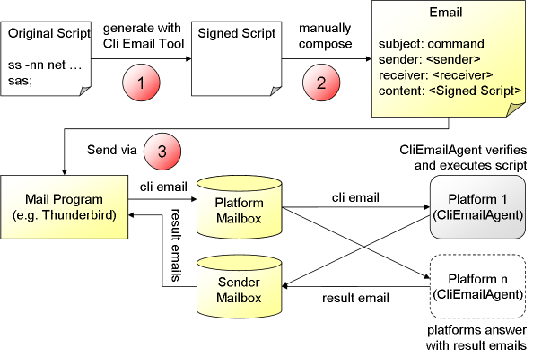

Chapter 13 - Cli Email Signer
==========================================

  
*Screenshot of the Cli Email Singer*

The Cli (command line interface) Email signer allows for signing command scripts that can be executed by the Jadex Cli platform processor. The idea is that one can use emails to send command scripts to specific Jadex platforms, which then verfify that the script comes from a trusted origin and then execute the script and send a reply email with the result of the execution. The singer tool helps to sign scripts making them acceptable for other Jadex platforms. Please note that only platforms will execute a script that share a secret with the sender (cf. [platform security mechanisms](../AC%20User%20Guide/08%20Security) ).

  
* Using the signer tool*

The general architecture and workflow is depicted in the architecture view shown above. The steps that need to be manually performed are marked with a red circle and comrise the following:

1.  Create a script text that should be executed based on Jadex Cli commands and possibly custom extensions. As an example a script could e.g. start a new application or trigger an update of an application. The script has to end each command with a semicolon. Then the script needs to be copied into the upper text area of the Cli Email Signer. Before hitting the Generate button you may want to change the validity duration of the script. If a platform receives a script after this duration has elapsed it will refuse executing it. Pressing Generate will create a signed script in the lower text area.
2.  This step needs to be done with an email client like Thunderbird. Start a new email and copy the generated signed content to the email content area. The subject of the email has to correspond to the email filter used and should be set to command. Finally, the receiver has to be configured. Here a mailbox has to be used that the platforms observe.
3.  Send the email via the mail program. If platforms are listening on the mailbox, they will regularily check for new mails. If a mail has a fitting subject it will be executed by the CliEmailAgent and after execution has finished a result mail will be assembled and sent to the initiator. The initiator will receive a result mail from each platform currently listening on the mailbox.

**Preparation of the platforms:** On each platform that should be enabled to process email scripts an instance of the *jadex.platform.service.cli.CliEmailAgent* has to be started. The agent has to be configured with the email account that should be used, i.e. it has to know details such as the username, password, smtp and imap server addresses of the account.

**Note:** The Cli Email Signer as well as the cli processor and the CliEmailAgent are only part of the Jadex Pro distribution.
