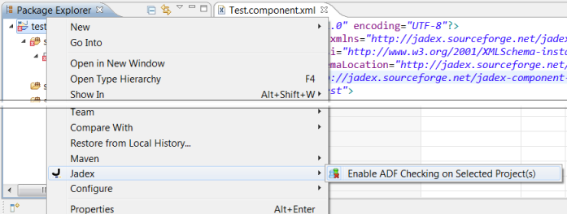

Chapter 15 - Eclipse ADF Checker Plugin
====================================================

The Jadex ADF Checker is an eclipse plugin that allows checking Jadex *agent definition files* (ADFs), i.e. Jadex source files like *.component.xml*, *.agent.xml*, *.bpmn* etc. These files typically contain Java expressions, which are only interpreted by Jadex and thus usually not checked by Eclipse. The ADF Checker closes this gap by attaching itself to the project build process and loading all ADFs in the current project for adding problem markers in eclipse, to show where errors are found in the files.

  
*Figure 1: The ADF Checker in action*

Requirements
-------------------------

The plugin should work with Eclipse 3.5 or later. It has been tested on Eclipse 3.6 (Helios), Eclipse 3.7 (Indigo) and Eclipse 4.2 (Juno). 

The plugin requires that all Jadex libraries, which are used in the project, are available in the project's build path, e.g. as referenced libraries or as maven dependencies. The ADF checker uses whatever version of Jadex is in the build path for loading the ADFs. Therefore, you can choose the Jadex version that you want to use yourself. Due to some changes in the Jadex code base, not all file types are supported for all recent Jadex versions:

-   Jadex 2.0 final
    - **.component.xml** supported, but no extensions
    - **.application.xml** supported
    - **.bpmn** supported
    - **.gpmn** not supported
    - **.agent.xml** not supported
    - **.capability.xml** not supported

-   Jadex 2.1-SNAPSHOT or later (nightly build or maven snapshot from 02/2012 or newer)
    - **.component.xml** supported
    - **.application.xml** supported
    - **.bpmn** supported
    - **.gpmn** supported
    - **.agent.xml** supported
    - **.capability.xml** supported

Installation
-------------------------

The plugin can be obtained from the eclipse update site http://www2.activecomponents.org/eclipse/update/ ](http://www2.activecomponents.org/eclipse/update/) . In Eclipse, choose the menu *Help-&gt;Install New Software...*, enter the update site address at *Work with: * and select *Jadex Eclipse Plugins-&gt;Jadex ADF Checker*.

  
*Figure 2: Installing the ADF Checker*

Usage
------------------

The ADF Checker can be activated and deactivated individually for each Eclipse project. Right-click on the project and choose *Jadex-&gt;Enable ADF Checking on Selected Project(s)*.

  
*Figure 3: Activating the ADF Checker*

The ADF Checker will be executed automatically as part of the Eclipse build process. It will check files that are contained in source folders and that are not excluded from the build path. This assures that it will behave as expected without further configuration for most Eclipse projects.

When ADF checking is enabled on a project, the checking of files is automatically triggered as follows:

-   All ADFs will be checked during a complete rebuild, i.e. after doing a *Project-&gt;Clean...* in Eclipse.
-   Each changed ADF will be rechecked after it is saved, if *Project-&gt;Build Automatically* is enabled in Eclipse.

All found problems are reported in the corresponding files editor views as well as in the Eclipse *Problems* view as shown in Figure 1. An info note is added to files that are checked without errors as shown below:

  
*Figure 4: Info Note on Successfully Validated ADF*

Known Issues and Limitations
-----------------------------------------

The information reported by the ADF Checker corresponds to the error reports shown in the JCC when loading a broken model. Due to the interpreted nature of Jadex, loading an ADF does not check all aspects. Therefore, runtime errors are still possible, even when the file was successfully checked. We are continuously trying to improve error reports and add additional checks at load time, and we would be happy to listen to your suggestions on how to do that and what to check.

The following is a list of issues that we are already aware of:

-   **Line numbers for errors are not always available.** This is due to models being loaded in more than one pass. Only errors found in the first pass currently have line numbers.
-   **Custom component factories are not yet supported.** Currently, only the file types listed in the *Requirements* section above are supported. A configuration option for adding custom component types will be added in the future.
-   **Custom extensions are not yet supported.** Currently, only EnvSupport and AGR are supported. A configuration option for adding custom extensiontypes will be added in the future.
-   **Overlapping source/resource folders when using Maven and M2Eclipse.** M2Eclipse has a bug to set source includes to *\*\*/\*.java* when source and resource folders overlap. Unfortunately, this is a common setting for Jadex projects, because we consider it useful placing e.g. *.component.xml* files in the same folder as corresponding *.java* files. As a result, ADFs are ignored during the build and the ADF Checker is not invoked. To fix this issue, you currently have to manually remove the inclusion pattern from the project setup. Right-click on the project, choose *Build Path-&gt;Configure Build Path* and open the *Source* tab. Select the *Included: \*\*/\*.java* entry and click *Remove*.

  
*Figure 5: Fixing Maven Project Setup*
