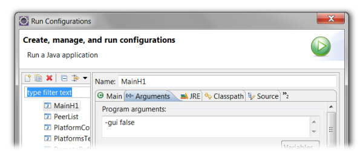

<span>Chapter 6 - Composition</span> 
====================================

In this chapter we will introduce composite components, i.e. components that are composed of subcomponents. As these subcomponents may also be primitive components or composites actually a hierarchy of components emerges. One important reason for creating components out of others is that one often wants to create *self contained* components, i.e. components with few outbound required services. Self contained components can provide most of their functionality out of the box in varying application contexts.

BEGIN MACRO: toc param: start="2" depth="2" END MACRO: toc

<span>Exercise E1 - Composite components and configurations</span> 
------------------------------------------------------------------

In the first lecture of this chapter we will create a composite component that has several subcomponents. The lecture will show how subcomponents can be defined and how configurations can be used to specify different component setups. As the composite component itself will only used as component container and does not contain functionalities by itself we will use an XML component descriptor (of course we could use a micro agent as well). A configuration is a spcific setting of a component that has a name. At startup of a component the configuration can be selected. This allows to define different interesting setups within one component. In this example we will create a component with two configurations. In the first only one chat subcomponent is created whereas in the second ten chat agents will be instantiated.

**Defining the Component**

-   Create an XML file called *ChatE1.component.xml* and copy the contents from *ChatB1.component.xml*
-   Add a *componenttypes* section and insert one *componenttype* definition inside.
-   The *componenttype* should be equipped with a *name* and a *filename* attribute.
-   The *name* is used as internal identifier within the component.xml to refer to the defined kind of agent. Here is should be set to *chatagent*.
-   The *filename* serves as file location and sould be set to *tutorial.ChatD5Agent.class*. 
-   Create a *configurations* section below the *componenttypes* section. In the configurations section place two *configuration* definitions. The first should be named *One chatter* the second *Ten chatters* using the *name* attribute of the *configuration* definition. 
-   In each of the *configuration* section add a *components* section and inside of it a *component* definition. The component should have the attribute *type* set to *chatagent* (or formerly defined logical agent type). In the component definition of the second configuration also introduced an attribute *number* and set it to *10* (all attributes must be set in quotation marks).


```xml

<configurations>
  <configuration name="One chatter">
  ...

```


*Definition of a configuration*

**Verify the component behavior**

Select the new component model in the JCC and look at the configuration choice box at the right upper panel. Ensure that you can see both configuration names. Start the component once with each of the configurations selected and look inside the component in the component. You should see one and in the second case ten subcomponents inside of it.  \
 

<span>Exercise E2 - Agent arguments</span> 
------------------------------------------

In addition to configurations a component can be customized at startup by using *arguments*. Furthermore, a component can declare *results* which are assumed to be available after component termination. Taken together, arguments and results can be used for a function oriented view on components, it a component can use a subcomponent in a function oriented way by starting it with specific arguments and waiting it to terminate for fetching the results. In this lecture we will change the component description from the last exercise to include an argument with which we can determine the number of subcomponents that should be created.

**Defining the Component**

-   Create an XML file called *ChatE2.component.xml* and copy the contents from the previous lecture.
-   Add an *arguments* section at the beginning of the componenttype definition. Within this section define an *argument* with name set to *chatters* and *class* set to *int*. In between the opening and closing tag of the argument its default value can be specified as Java expression. Here we just set it to *2*.
-   Add a configuration called *Argument number of chatters* and define it in the same way as the others. In contrast to the others we will set the number attribute of the *component* description is this case to "\$args.chatters".

**Verify the component behavior**

-   After selecting the component model in the JCC you should see an input field for the argument value in the Starter panel as shown below in the screenshot. Try out starting without and with entering a number in the argument input field. You should check that the started composite component has as many components as you entered. Be sure to have started the component in the new configuration.



<span>Exercise E3 - Static component binding</span> 
---------------------------------------------------

This lecture will show how services of components can be directly connected. In this way typically normal SCA components are bound to each other. The use case in this exercise is that we introduce a registry component at which the chatters announce their real and nickname identity. In an application there is one predefined registry component that is made directly known to the chatter agents at startup.

**Defining the registry service interface**

-   Create a new interface called *IRegistryServiceE3.java*.
-   Add a void method for registering a chatter with the following name and parameters *register(IComponentIdentifier cid, String nickname)*
-   Add a method for getting the chatter identities named *getChatters()* and *IFuture* as return value.

**Defining the registry service implementation**

-   Create a new class called *RegistryServiceE3.java* that implements the interface *IRegistryServiceE3*
-   Add a class attribute called *entries* of type *Map* and initialize it to a *new HashMap*.
-   Add both methods of the interface.
-   In the *register* method use *put* to store the nickname  as key and the component identifier in the map.
-   In the *getChatters* method simply return the entries by *new Future(entries)*.

**Defining the registry agent**

-   Create a new agent class called *RegistryE3Agent.java*.
-   Mark the class as an agent by adding the *@Agent* annotation above the class definition.
-   Add the registry service by adding a *@ProvidedServices* annotation. Inside of this annotation create a *@ProvidedService* annotation with type set to *IRegistryServiceE3*. Inside of the provided service annotation add an *@Implementation* annotation and assign it to *RegistryServiceE3.class*.

**Defining the chat agent**

-   Create a new agent class called *ChatE3Agent.java* and copy its content from *ChatD5Agent*.
-   You can keep the service implementation of D5 as we will not introduce new chat functionalities here.
-   Add a *@Arguments* annotation. Inside create a *@Argument* annotation and give it the *name* nickname, the *clazz* String and the *defaultvalue* "\\"Willi\\"". The backslash is used because Jadex expects a parseable Java expression and for a String the quotation marks necessary. The defaultvalue is used in case no other value is supplied during startup of the component (e.g. from the JCC or programmatically).
-   Also add a field *nickname* of type String in the agent class. Above this field add the *@AgentArgument* annotation. This automatically injects the argument value in the corresponding field.
-   Add a *@RequiredService* annotation with name *regservice* and type *IRegistryServiceE3.class*. Do not add a *@Binding* annotation inside. Instead we will assign the binding explicitly in the composite component.
-   Delete the content of the *executeBody* method. We will use it to fetch the registry service. On the registry service we will first call the register method with the component's identifier and some chooseable nickname. Thereafter, we will let the agent wait for 10 seconds and then use the registry service again to get all registered chat agents. This should look like the following: 


```java

agent.getServiceContainer().getRequiredService("regservice")
  .addResultListener(new DefaultResultListener()
{
  public void resultAvailable(Object result)
  {
    final IRegistryServiceE3 rs = (IRegistryServiceE3)result;
    rs.register(agent.getComponentIdentifier(), "my_nick");
				
    agent.waitFor(10000, new IComponentStep()
    {
      public IFuture<Void> execute(IInternalAccess ia)
      {
        rs.getChatters().addResultListener(new DefaultResultListener()
        {
          public void resultAvailable(Object result)
          {
            System.out.println("The current chatters: "+result);
          }
        });
        return IFuture.DONE;
      }
    });
  }
});

```


**Defining the chat composite component**

-   Create a composite file called *ChatE3.component.xml* and copy its content from *ChatE2.component.xml*.
-   Delete the *arguments* section.
-   In the *componenttypes* section change the *chatagent* component filename to the new *ChatE3Agent.class*.
-   Add a second *component* definition with name *registry* and filename *tutorial.RegistryE3Agent.class*.
-   Delete all configurations except the first one and name it *Two chatters*.
-   In this configuration add a component definition with type *registry* and name *reg*. It is important to set the name of this component as we will use it in the following binding definitions.
-   Change the chat component definition to include the arguments required service binding of the registry. Here we use the instance name of the registry *reg* to assign it as target component of the required service in the chat component. This is a deployment time wiring of components. It should look like the following:


```xml

<component name="chatter1" type="chatagent">
  <arguments>
    <argument name="nickname">"Hans"</argument>
  </arguments>
  <requiredservices>
    <binding name="regservice" componentname="reg" scope="parent"/>	
  </requiredservices>
</component>

```


-   Create a second component definition by copying the first one and change the component *name* to chatter2 as well as the *nickname* to Franz.

**Verify the component behavior**

In the JCC start the chat application (ChatE3.component.xml) and check if it has three subcomponents (one registry and two chat agents). After ten seconds you should see that the chat agents print out the information from the registry (component id and nicknames). The nicknames of the components should correspond to the argument values that have been entered in the component xml, namely Franz and Hans. In case you comment out the argument value for a component it will use the *defaultvalue* as specified in the chat component itself (here Willi). The expected output is also shown below in the figure.


<span>Exercise E4 - On demand component creation</span> 
-------------------------------------------------------

In this small lecture we will create the registry component on demand, i.e. when a chat component tries to access the registry service for the first time and no service provider could be found, it will create one on its own. This kind of behavior is not enabled per default and we need to turn it on by setting the *create* flag to true in the required service binding specification. 

**Defining the chat composite component**

-   Create the component xml file called *ChatE4.component.xml* by copying the content from *ChatE3.component.xml*.
-   Delete the registry component definition, i.e. the following line:


```xml

<component name="reg" type="registry"/>

```


-   We change the required service binding of both chat component instance definitions to look like the following:


```xml

<binding name="regservice" componentname="reg" scope="parent" create="true">
	<creationinfo name="reg" type="registry"/>
</binding>

```


**Verify the component behavior**

After startup you can see that the same components are started as in lecture E3. Looking inside the chat application reveals that it has one registry and two chat components. This time the registry is created when a chat agent resolves its required registry service. It is important to note that in this case the *name* attribute *reg* is also used for component creation, i.e. the registry gets this name. To determine the model of the component to start the *type* attribute is used, which is set to *registry*.

<span>Exercise E5 - Using services of specific components</span> 
----------------------------------------------------------------

In this exercise we will change the system behavior so that the chat agents use the registry to look up the component identifier of a chatpartner's nickname. Using the component identifier we will fetch the chat service of this chat partner and send him a private message.

**Defining the chat agent**

-   Create a chat agent Java class called *ChatE5Agent.java* by copying it from *ChatE3Agent.java*.
-   Add an *@Argument* annotation in the *@Arguments* area and name it *partner*. The type should be set to *String* and no default value needs to be specified.
-   Add a field called *partner* of type String in the chat agent class. Above the field declaration add an *@AgentArgument* annotation.
-   The existing behavior in the *executeBody* method can be kept. In addition to printing out the available chatters from the registry we insert code to talk with our specified chat partner. For this purpose we first need to fetch the component identifier of the partner and can then retrieve the chat service from the component with that id using our service container. The code looks like the following:


```java

...
Map chatters = (Map)result;
System.out.println("The current chatters: "+result);
final IComponentIdentifier cid = (IComponentIdentifier)chatters.get(partner);
if(cid==null)
{
  System.out.println("Could not find chat partner named: "+partner);
}
else
{
  agent.getServiceContainer().getService(IChatService.class, cid).addResultListener(new DefaultResultListener()
  {
    public void resultAvailable(Object result)
    {
      IChatService cs = (IChatService)result;
      cs.message(agent.getComponentIdentifier().toString(), "Private hello from: "+nickname);
    }
  });
}

```


**Defining the chat composite component**

-   Create the component xml file called *ChatE5.component.xml* by copying the content from *ChatE3.component.xml*.
-   Change the componenttype definition of the chatagent to *tutorial.ChatE5Agent.class*
-   Add an argument in the component instance argument section for the *partner* attribute. For the first chat agent with name *Hans* the partner should be *Franz* and for the second chat agent vice versa.

**Verify the component behavior**

Starting the composite component should lead to the following behavior. Both chat agents first register at the registry component. After ten seconds both agents use the registry to determine the component identifier of their chat partner using its partner's nickname (called partner). In the chat windows a private message of the other chat agent should appear as shown below.


