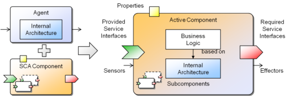

Chapter 2 - Active Components 
==========================================

The roots of active components lie within the area of multi-agent systems and in the same way help constructing complex distributed systems composed of potentially concurrent interacting entities. Experience from many software projects has shown that agent concepts are valuable but cannot be applied easily in practice due to several inherent difficulties of agent technology. One important reason is the restriction of interaction means to asynchronous messages, which are a rather low-level concept and require programmers to learn details of rather complex message formats, speech acts and think in terms of protocols (the allowed sequences of messages). Messages and protocols have their merits in scenarios requiring negotiations or other advanced coordination activities but are a too complex scheme for many rather simple scenarios. Often a service based worldview (SOA, service oriented architecture) is sufficient, which distinguishes between service providers and users and model interactions simply in the form of service invocations. An existing drawback of SOA per se consists in the tendency to build up networks of many services without an overall architecture of the target system. This problem has been recently addressed by the service component architecture ([SCA](http://oasis-opencsa.org/sca)), a new software engineering approach that has been proposed by several major industry vendors including IBM, Oracle and TIBCO. SCA combines in a natural way the service oriented architecture with component orientation by introducing SCA components communicating via services. This allows modelling a system in terms of components acting as service providers and consumers facilitating application design by offering means for assembling and especially by hierarchically (de)composing components and services.

Active components build on SCA and extend it in the direction of sofware agents. The general idea is to transform passive SCA components into autonomously acting service providers and consumers in order to better reflect real world scenarios which are composed of various active stakeholders. In the figure below an overview of the synthesis of SCA and agents to active components is shown.

*Active Component Structure*

The figure presents on the right hand side the structure of an active component. It yields from conceptually merging an agent with an SCA component (shown at the left hand side). An agent is considered here as an autonomous entity that is perceiving its environment using sensors and can influence it by its effectors. The behavior of the agent depends on its internal reasoning capabilities ranging from rather simple reflex to intelligent goal-directed decision procedures. The underlying reasoning mechanism of an agent is described as an agent architecture and determines also the way an agent is programmed. On the other side an SCA component is a passive entity that has clearly defined dependencies with its environment. Similar to other component models these dependencies are described using required and provided services, i.e. services that a component needs to consume from other components for its functioning and services that it provides to others. Furthermore, the SCA component model is hierarchical meaning that a component can be composed of an arbitrary number of subcomponents. Connections between subcomponents and a parent component are established by service relationships, i.e. connecting their required and provided service ports. Configuration of SCA components is done using so called properties, which allow values being provided at startup of components for predefined component attributes. The synthesis of both conceptual approaches is done by keeping all of the aforementioned key characteristics of agents and SCA components. On the one\
hand, from an agent-oriented point of view the new SCA properties lead to enhanced software engineering capabilities as hierarchical agent composition and service based interactions become possible. On the other hand, from an SCA perspective internal agent architectures enhance the way how component functionality can be described and allow reactive as well as proactive behavior.

Active Components by Example 
-----------------------------------------

This section illustrates several example applications that are part of the Jadex distribution. The purpose of this section is twofold. First, it aims at improving the understanding of the active components approach by using concrete scenarios. In this respect, it tries to highlight the advantages of the approach with respect to typical challenges of dirstributed systems. Second, it tries to encourage using the existing examples as a source for documentation and inspiration when developing active components programs. If descriptions in this user guide do not appear clear, it is often helpful to check how the features have been used in some of the examples.

### Chat 

The chat is a peer-to-peer application that allows users exchanging simple text messages. In the distributed scenario, each user will host a Jadex platform and start a chat component on her local computer. The Jadex platforms will discover each other automatically without configuration efforts using the built-in awareness mechanisms ([Platform Awareness](../AC%20User%20Guide/07%20Platform%20Awareness)) therefore allowing the chat components to interact with each others services. In the peer-to-peer design, each component acts as a service provider (for receiving chat messages for its user) and a service consumer (for sending chat messages to other users). The application desgin is shown in the following figure.

*Chat application design*

The figure shows the interaction between three chat components. The interaction is specified by the Java service interface *IChatService*, which declares the *message(sender, text)* method. For sending a chat message Chat1 acts as a service consumer, i.e. it searches for chat services that are provided by the other chat components (Chat2, Chat3) and invokes their *message()* methods.  The implementation of the chat components is described in depth as a running example in the [Jadex Active Components Tutorial](../AC%20Tutorial/01%20Introduction).

### Mandelbrot 

### Disaster Management 
