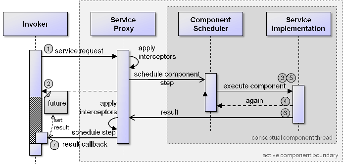
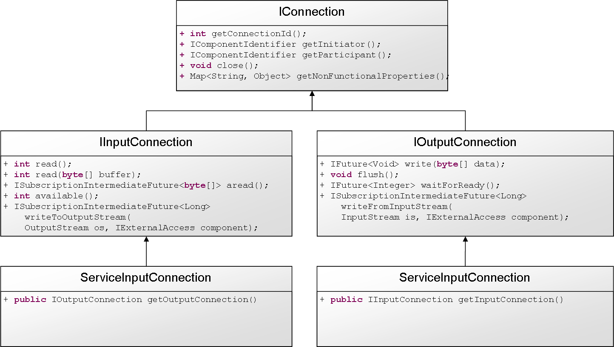

Chapter 5 - Services
=================================

  
*Service container*


The management of services is crucial for understanding how active components work. Each component can be seen as an autonomous service provider that offers services for other components. In case it needs services it can either use statically bound or dynamically searched services. Each component has a *service container* that should be used for all service management activities. It allows for fetching required services, explicitly searching for services at runtime and also for adding, removing or exchanging provided services. From within a component the service container can be fetched using *getServiceContainer()*. The interface of the container is *jadex.bridge.service.IServiceContainer*. The most important methods of the service container are shown in the following three code snippets:


```java

public interface IServiceContainer
{
  public IFuture<Void> addService(IInternalService service, ProvidedServiceInfo info);
  public IFuture<Void> removeService(IServiceIdentifier sid);
  public IService getProvidedService(String name);
  public IService[] getProvidedServices(Class clazz);

  public <T> IFuture<T> getRequiredService(String name);
  public <T> IIntermediateFuture<T> getRequiredServices(String name);
  public <T> IFuture<T> getRequiredService(String name, boolean rebind);
  public <T> IIntermediateFuture<T> getRequiredServices(String name, boolean rebind);

  public <T> IFuture<T> getService(Class<T> type, IComponentIdentifier cid);
  public <T> IFuture<T> searchService(Class<T> type);
  public <T> IFuture<T> searchService(Class<T> type, String scope);
  public <T> IIntermediateFuture<T> searchServices(Class<T> type);
  public <T> IIntermediateFuture<T> searchServices(Class<T> type, String scope);
  
  public void addInterceptor(IServiceInvocationInterceptor interceptor, Object service, int pos);
  public void removeInterceptor(IServiceInvocationInterceptor interceptor, Object service);
  public IServiceInvocationInterceptor[] getInterceptors(Object service);
}

```


Provided Services
------------------------------

The first block of methods allows for fetching, adding and removing provided services. It has to be noted that, despite it is possible to use add or remove services at runtime, one should be aware that it is often better from a software engineering point of view when components comply to their component type specifications and do not change their exposed behavior dynamically. If you want to add or remove provided services to a component it might also be easier to use corresponding methods directly on the component interpreter (cf. the DynamicServiceAgent example in package jadex.micro.testcases.semiautomatic). The methods of the container expect a readily configured service instance which is typically not the same as a user created service instance.

Required Services
------------------------------

The second block of methods shows how required services can be used. There is amethod to fetch a single service *getRequiredService()* and another one for fetching multiple services (those that have been defined with *multiple=true*) *getRequiredServices()*. Both methods come in two variants. The first variant only requires the *name* as argument. The second variant includes a *rebind* flag that allows for initiating a fresh binding by searching again the services according to the required service definition. This is only required if the service definition is static, i.e. *dynamic=false* which is the default. 

Service Search
---------------------------

The third block contains methods that can be used to dynamically locate methods at runtime. The first *getService()* methods is a convenience method to fetch a service of a given interface type from one exactly known other component. Hence the parameters are the interface type and the component identifier of the target component. The following two *searchService()* methods can be used to search for a service via its interface and an optional search scope. If no search scope is given, the default is application scope, i.e. all sub and super components within the application are included within the search. The same kinds of methods are available for multi services via the next two *searchServices()* methods.

The search scope defines the area of the search and is per default set to application. This means that only components within the started application are considered within the search. In the figure below a visual representation of the most relevant search scopes is given. Static constants for search scopes are available via the class *RequiredServiceInfo*.

  
*Search scopes*

Interceptor Handling
---------------------------------

The fourth block is meant for runtime interceptor management of service. These methods can be used to add, remove and inspect interceptors for specific services. It has to be noted that interceptors are not supported for all required and for provided services which are not declared to have *proxytype raw*. Such provided services are directly invoked from the caller without running through the interceptor chain. The first method *addInterceptor()* can be used to add an interceptor at a specific position into the interceptor chain. If the interceptor should be placed at the end of the chain (before the real invocation occurs) the position can be set to -1. The second method *removeInterceptor()* can be used to remove a specific interceptor from the chain and the third method *getInterceptors()* deliver the interceptor chain for a service as array. These array can be inspected e.g. to decide at which position a new interceptor should be placed.

Parameter Passing
------------------------------

  
*Parameter passing semantics*


An important aspect of active components is their isolation regarding state and execution, i.e. one component should not interfere with any other component. In order to realize isolation regarding the component state, parameter passing in service calls has a specific semantics. To avoid data inconsistencies due to concurrent access on data, all data is passed with \*call-by-copy\* semantics regardless if the invoked service is on the same or another platform. As call-by-copy induces an unwanted performance penalty it is also possible to adjust the parameter semantics in a fine-granular way. On the one hand the semantics can be defined based on the underlying parameter types and on the other hand also method specific parameter declarations can be used. In any case the *@Reference* annotation is used (package jadex.bridge.service.annotation). The annotation allows for defining the local and remote invocation semantics, i.e. you can e.g. define a class to be handed over per reference at local service calls and be copied at remote service calls (@Reference(local=true, remote=false)).

In the Figure above the four different cases of reference settings are illustrated from the viewpoint of three different active components (circles). The middle component invokes a service locally (left) and remotely (right) and it is shown how the data in the middle is treated.

-   **@Reference(local=false, remote=false)** In this case the parameter object is copied locally and remotely leading to two clones (LC=local copy, and RC=remote copy). This case is the default.
-   **@Reference(local=true, remote=false)** In this case the parameter object is copied only remotely and locally a reference to the same object is used (LRO=locally reference object and RC=remote copy). This case is useful for speeding up handling of immutable objects.
-   **@Reference(local=false, remote=true)** Here, the parameter object is copied locally and remotely reference semantics is used. This is only possible if a remote proxy of the object can be created. It has to implement an interface that extends the jadex.commons.IRemotable marker interface. Th proxy will be created according to that remotable interface. As a result a local copy and a virtually remotely shared object are created (LC=local copy, RRO=remotely referenced object, V=virtual object, P=proxy object).
-   **@Reference(local=true, remote=true)** In this case the parameter object is not copied. Thus, it acts as local reference for the left and middle component and as remote reference for the middle and right component (LRO=local reference object, V=virtual object, P=proxy object). The semantics of this case also applies to active component services.

**Hints:**

-   When an object is immutable per definition (example an invoice that will never change in future), it should be declared as local reference to avoid unnecessary copying.
-   In most cases remote references should be avoidable. The most common use case is a remote listener object that automatically notifies the listeners on the caller side. In the Jadex programming model such listeners in many cases can be replaced by using subscription futures as return values (subscription futures do not save intermediate results).
-   **The caller of a service call needs not to be passed explcitly as parameter value.** Instead at the beginning of the service method (i.e. before other services have been invoked or component steps have been performed), ***ServiceCall.getInstance().getCaller()***** **can be used to retrieve the component id of the caller component.

Concurrency
------------------------

The concurrency model of active components ensures that every component and thus also each service of a component is called in a thread-safe manner, i.e. a service developer can always assume that the service is exclusively executed by the component without interference of other concurrent calls. This assumption means that it is normally not necessary to use any synchronization mechanisms like monitors or synchronized methods within service implementations. If you intentionally do not want a thread-safe service you can configure with 'proxytype=raw', which means that the implementation class will be directly called. In this case the developer has to ensure that concurrent access will not harm the service and/or component state consistency. Another important aspect is that a service implementation might use asynchronous methods until it completes and returns the result. This implies that a service call may be executed interleaved with other service calls regarding the steps its consists of.


Whenever a (non-raw) service is called from another component thread switching is automatically performed, i.e. the call is first decoupled from the caller and executed on the thread of the receiving component. When the callee finishes processing and ends the method by setting the return value again a thread switch is automatically performed to ensure that the result listener is notified on the thread of the original caller. This scheme is changed if specific thread switching listeners are used, e.g. if the user uses a SwingDefaultResultListener, the call will be received on the swing thread.


  
*Invocation scheme*


The general service invocation scheme is also visualized in the figure above. It can be seen how a service invocation is processed step by step. First, the service request reaches the service proxy (that looks like the original service for the service user), which applies the interceptors one by one. The invocation is scheduled as a new component step on the component scheduler. Thereafter, the original call returns to the invoker and presents a future to it. The future represents the placeholder object for the real result that is made available via the callee. The scheduler possibly awakens the component by initiating its execution. The component then may processes serveral steps until the service call result could be determined and is handed over to the service proxy, which in turn applies all interceptors in the opposite direction. Finally, the service proxy will schedule a step on the original invoker to set the callback result in the listener. This ensures that the user will perceive the result on the invoker's component thread.

Contract Oriented Programming
------------------------------------------

[Programming by contract](http://en.wikipedia.org/wiki/Design_by_contract)  is a well-known approach that focusses on the relationships between suppliers and clients. In the active components approach contracts between service providers and service consumers can be defined and automatically monitored. The basic idea is to allow **pre-** and **postconditions** to be stated for service interfaces. These conditions can be expressed in terms of different kinds of annotations attached to method parameters and/or the return value and are automatically checked by the Jadex infrastructure, i.e. the conditions need not be manually evaluated at the beginning or end of a service call. Jadex simply uses specific condition interceptors before and after a service call to ensure that conditions hold. If that is not the case a runtime exception is raised and returned to the caller. Currently, the following types of conditions are supported:

-   **@CheckNotNull:** As the name suggests, this annotation ensures that the corresponding parameter or result value is different from null.
-   **@CheckIndex:** Precondition for checking if the argument is a valid index. This annotation needs a further value that states in which parameter the collection is given, to which the index should be checked against. The annotation works for all kinds of elements that can be somehow iterated over (e.g. arrays or collections) 
-   **@CheckState:** Allows a Java expression to be evaluated. Reserved variables are \$arg for the current argument and \$arg0 - \$argn for other arguments. In case of a post condition the result is available via \$res and intermediate results via \$res\[0\], \$res\[-1\], etc.

An example application (from package jadex.micro.testcases.prepostconditions) further illustrates how conditions can be specified:


```java

public interface IContractService
{
 public @CheckNotNull @CheckState("$res>0 && $res<100") IFuture<Integer> doSomething(
  @CheckNotNull String a, 
  @CheckState("$arg>0 && $arg<100") int x,
  @CheckState("$arg>0") int y);
 
 public IFuture<String> getName(@CheckIndex(1) int idx, @CheckNotNull List<String> names);

 public @CheckState(value="$res[-1] < $res", intermediate=true) IIntermediateFuture<Integer> getIncreasingValue();
}

```


The example interface definition shows how the different conditions can be used:

-   The first method *doSomething()* takes three parameters (a, x, y) and expects that a never nulls, x is between 0 and 100 and y is greater 0. Furthermore, the result value of the method must never be null.
-   The second method *getName()* works with an index (idx) and a collection (names). The precondition ensures that the index is valid according to the referenced collection (the 1 argument in @CheckIndex(1)), i.e. idx&gt;=0 and idx&lt;size of the collection.
-   The third method getIncreasingValue() shows how postconditions can be used with intermediate results. In the example it is safeguarded that the method delivers only monotonically increasing values (\$res\[-1\] &lt; \$res). 

Streams
--------------------

Streams are a convenient and versatile programming concept in Java. Basically, the idea is that a stream can be opened and data can be either witten to it (output stream) or read from it (input stream) step by step, i.e. the data producer and data consumer are logically separated. This concept is ideal also for distributed systems, in which a data producer may exist on another host than the consumer. Jadex offers a dedicated streaming API that allows for high-level programming with streams. Originally, it was planned to directly support the Java streaming API with new classes for the distributed case. Regrettably, this was not easily possible, because a) Java does not introduce interfaces for streams and more importantly b) has a blocking API, which does not fit well to principally non-blocking active components. For these reasons, the Jadex streaming API is based on a new set of interfaces (and classes) shown in the figure below. It can be seen that those interfaces resemble the original Java classes (InputStream / OutputStream) to a high degree, but additionally take into account the new possibilities by future based return values.



*Overview of important stream interfaces and classes*

The base interface for all types of Jadex streams is ***IConnection***, which mainly provides methods to get general information about the stream (such as the connection id, the initiator and participant component ids). From this interface ***IInputConnection*** and ***IOutputConnection ***are derived. These coarsely correspond to the Java *InputStream* and *OutputStream* and offer functionalities to read and write data. Finally, the concrete classes ***ServiceInputConnection*** and ***ServiceOutputConnection*** implement those interfaces and additionally add one important method to get a corresponding output for input connection and vice versa. The idea is that a service connection can be created within a service implementation of a component. The original service connection can then be used to e.g. write or read data and the derived opposite connection can be passed as parameter value in a method call or can be passed back as return value. In this way two services can communicate via streams. In Jadex streaming support is based on two different APIs, a low and a high level one as described next.

### Low-Level Streaming API

The low-level streaming API directly makes use of the ***IMessageService*** of the platform. Besides sending single messages, the message service also allows for creating **virtual streams**. The streams exist between two component instances and can be used to transport binary data between them. The streams are virtual as different real connections may be used to bring the data from the source to the target. The binary data will be handled in small packets in the same way as ordinary messages, i.e. depending on the destination different transport mechanisms can be used to send the data. The message service hence multiplexes the binary streams in time and space leading to the following benefits:

-   The platform does not need to open any extra ports for handling streaming data
-   The platform can switch transports if connection settings change during the transmission, i.e. an underlying aborted tcp connection does not harm the stream if another connection to the target exists

The low-level API provides two basic functionalities that allow for creating a stream, and retrieving a stream from another component. Creating a stream can be done by calling one of the following two methods on the ***IMessageService***:


```java

public IFuture<IOutputConnection> createOutputConnection(IComponentIdentifier sender, 
  IComponentIdentifier receiver, Map<String, Object> nonfunc);

public IFuture<IInputConnection> createInputConnection(IComponentIdentifier sender,
  IComponentIdentifier receiver, Map<String, Object> nonfunc);

```


The component that receives the stream is notified about the new stream arrival. How this is exactly performed depends on the concrete component type and the way the interpreter forwards the (streamArrived()) call.

**Micro Agent**

In case of a micro agent notification is done via a simple callback method. In case a pojo agent is used, the method that is annotated with ***@AgentStreamArrived*** is called with the* IConnection* as method parameter as shown below.


```java

@AgentStreamArrived
public void newStream(IOutputConnection con)
{
  System.out.println("received new connection: "+con);
}


```


In case the agent extends MicroAgent directly, the following method can be overridden to place custom code that is executed when a new stream arrives:


```java

public void streamArrived(IConnection con)
{
  System.out.println("received new connection: "+con);
}

```


**BDI Agent**

A BDI agent can receive in the same way as a message. Internally, the interpreter just creates a new FIPA message map and sets the sender and receiver ids to the received stream sender and receiver. Furthermore, it puts the stream as content in the fake message. To be able to receive a stream at the application level an appropriate message event template has to be declared in the agent (or capability). In order to distinguish a stream message from other kinds of messages a match expression can be used that tests if the content is a connection (using e.g. \$content instanceof IConnection). The message event template can then be used as trigger for plans as usual.

**BPMN Process**

A bpmn process can receive a stream also very similar to a message using a corresponding catching message event. In this case the wait filter of the catching event has to be programmed to react to a connection. After having received a steam via a message event element, \$event can be used to fetch the stream in the next activity. A corresponding filter might look like the following:


```java

IFilter fil = new IFilter()
{
  public boolean filter(Object obj)
  {
    return obj instanceof IConnection;
  }
}

```


**Other component types**

XML component types do not possess behavior specifications so that they do not possess a way to react to an incoming stream directly. Yet, service implementations of XML components (as well as any other component types) may use the high-level streaming API described next.

### High-Level Streaming API

The high-level streaming API deals with streams as parameters and return values of service calls. This enables to pass a stream directly to another component, so that one side can write and the other one read data. 

In general the high-level streaming API allows to:

-   Pass ***IInputConnection ***and*** IOutputConnection*** as parameters of services
-   Pass ***IInputConnection*** and ***IOutputConnection*** as return value of services
-   Offers ***ServiceInputConnection*** and ***ServiceOutputConnection*** to create pipes between services\
    (using getInputConnection(), getOutputConnection())
-   Makes reading/writing data from/to Java streams very easy by creating pipes\
    (writeFromInputStream(), writeToOutPutStream())

In order to make this scheme more transparent a small example will be explained. The basic assumption is that there is a service that needs an input stream as parameter to fetch some data. The service could look like this:


```java

public interface IExampleService
{
  public IFuture<Void> m1(IInputStream is);
}

```


This service is invoked from a service of some other component. This component wants to provide the content of a specific file as input stream to the service. To achieve this the following steps need to be performed:

-   Create a service output connection using\
    
```java
ServiceOutputConnection ocon = new ServiceOutputConnection();
```


<!-- -->

-   Fetch the corresponding input connection using\
    
```java
IInputConnection icon = con.getInputConnection();
```


<!-- -->

-   Call the service method and provide the input connection\
    
```java
service.m1(icon)
```
  

<!-- -->

-   Start writing data to the output connection. This can be performed manually by calling\
    
```java
public IFuture<Void> write(byte[] data)
```
 for each piece of data that should be transferred. In addition a service output method also offers a convenience method that allows to pipe all data from a Java input stream to the Jadex output stream. This comes very handy in the example where a file should be transferred. For this purpose it is sufficient to do the following.\
    
```java
FileInputStream fis = new FileInputStream(new File("somefile.data"));
service.writeFromInputStream(fis, exta); 
```
  

  
