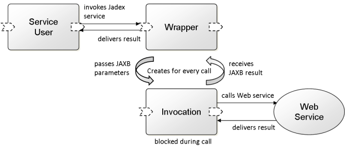

<span>Chapter 6 - Web Service Integration</span> 
------------------------------------------------

In this chapter it will be explained how existing standard web technologies can be used in concert with Jadex active components. Jadex allows for seamless usage of existing web services as well as publishing Jadex services with minimal effort in the web. Classical WSDL-based web services as well as RESTful web services are supported. In order to use the web service support the Jadex module *jadex-platform-extension-webservice* has to be included. Example applications that make use of the presented techniques can be found in the package *jadex-applications-webservices*. In order to publish WSDL or RESTful services the platform has to provide corresponding publish services. The default publish implementations can be automatically started at startup of the platform by using the arguments *-wspublish true* and *-rspublish true* respectively.

### <span>Integration Concept</span> 

The integration of Jadex components with web services includes two directions. The first deals with using existing web services with Jadex applications in a transparent manner. The latter considers how Jadex services can be made available as web services also for non-Jadex users.  

#### <span>Integrating Existing Web Services</span> 

\
*Web Service Invocation Architecture*

<div class="wikimodel-emptyline">

</div>

<div class="wikimodel-emptyline">

</div>

The objective of the web service call integration consists in integrating an external web service as normal Jadex component service within the Jadex platform. This allows for using the web service in the same way as other Jadex services, i.e. it can be used as required service or dynamically searched in other components. The general approach is sketched in the figure above. It can be seen that a Jadex wrapper agent is used to offer the web service as Jadex service. This Jadex service offers an asynchronous variant of the synchronous web service. The wrapper agent forwards service calls to the web service and returns the results to the caller. As the web service call is synchronous and therefore blocking it has to be ensured that the wrapper agents can handle multiple calls concurrently. This is achieved by creating a new invocation component for each call. This invocation component only perform the web service invocation, is blocked during the call, and afterwards returns the results to the wrapper component and terminates.

#### <span>Publishing Jadex Services as Web Services</span> 

\
*Web Service Publish Architecture*

<div class="wikimodel-emptyline">

</div>

<div class="wikimodel-emptyline">

</div>

Publishing Jadex services as web service has the underlying idea that one can easily make available Jadex selected services in a standards compliant manner. The Jadex publishing mechanism is inspired by the same mechanism in SCA. For each provided service within a component it can be specified if and how this service should be published. After starting a service (usually at component startup) this publishing information is inspected and a corresponding publishing service (according to the publishing type) is invoked in order to publish the service. In the same way, at shutdown of the service the publish service is requested to end publishing. Publishing a service as web service typically means that some kind of web container is instructed to listen at a given url and handle web service requests with a created web service implementation. When using the default WSDL or RESTful publishing mechanisms a proxy service component is created within the web container, which hands over requests towards the backend Jadex service.

<div class="wikimodel-emptyline">

</div>

<div class="wikimodel-emptyline">

</div>

At the moment of publishing the Jadex interpreter searches for all available *IPublishService*s. In order to add new kinds of publishing or use alternative publishing mechanisms just the available publish services at the platorm need to be changed. This interface contains the following methods: 


```java

public interface IPublishService
{
  public IFuture<Boolean> isSupported(String publishtype);
	
  public IFuture<Void> publishService(ClassLoader cl, IService service, PublishInfo pi);

  public IFuture<Void> unpublishService(IServiceIdentifier sid);
}

```


All these methods are automatically called by Jadex. The *isSupported()* method is used to check whether the publish service is able to publish the given type. If yes, the component interpreter will call the *publishService()* method in order to publish the service on the endpoint. Here the logic has to be filled in which knows the concrete endpoint type and can supply it with the necessary artifacts to make the web service available. The parameters include the current classloader, the Jadex service to which web service requests should be forwarded and a publish info object that represents just a struct with information about the publishing properties (publishtype, publishid and servicetype). The last method is called when the service is terminated, e.g. if the component is killed. Here the service identifier is passed as parameter in order to find the service and instruct the\
endpoint to stop the web service.

### <span>WSDL Web Services</span> 

#### <span>Integrating Existing WSDL Web Services</span> 

A Jadex wrapper agent needs to be created that provides access to the external web service as a separate Jadex component service. The interfaces of both services differ with respect to the return value of the method signatures. The return value of the Jadex service interface always has to be a *IFuture&lt;originaltype&gt;* that contains the original type as generic part. This has to be done to make the synchroneous web service asynchronous. The input parameters of methods directly correspond to the generated parameter types coming from the Java included *wsimport* tool, which itself relies on *JAXB*. Service calls on the Jadex service will be forwarded from the wrapper agent to the original web service and the result will be returned to the caller. In order to avoid that the wrapper agent is blocked by the synchronous web service call and cannot process any further invocations, internally a subcomponent is created for each call. This subcomponent will be automatically deleted immediately after the call has returned.

<div class="wikimodel-emptyline">

</div>

<div class="wikimodel-emptyline">

</div>

Implementation steps:

<div class="wikimodel-emptyline">

</div>

-   **The Java web service classes and data types have to be generated using wsimport** (usually available in the *bin* directory of the JDK). The most important options are: -keep for not deleting the source files, -p for specifying the target package (example: *wsimport -keep -p jadex.micro.examples.ws.geoip.gen <span class="wikiexternallink">[<span class="wikigeneratedlinkcontent">http://www.webservicex.net/geoipservice.asmx?WSDL</span>](http://www.webservicex.net/geoipservice.asmx?WSDL)</span>*). The following block shows the service interface as generated by the wsimport tool. The tool automatically includes all the annotations required by the JAX-WS framework that allows publishing and invoking web services seamlessly from Java. Between all the annotations, you can see that the interface defined two methods: *getGeoIP(ipAddress)* and *getGeoIPContext()*.


```java

@WebService(name = "GeoIPServiceSoap", targetNamespace = "http://www.webservicex.net/")
@XmlSeeAlso({ObjectFactory.class})
public interface GeoIPServiceSoap
{
  @WebMethod(operationName = "GetGeoIP", action = "http://www.webservicex.net/GetGeoIP")
  @WebResult(name = "GetGeoIPResult", targetNamespace = "http://www.webservicex.net/")
  @RequestWrapper(localName = "GetGeoIP", targetNamespace = "http://www.webservicex.net/", className = "jadex.micro.examples.ws.geoip.gen.GetGeoIP")
  @ResponseWrapper(localName = "GetGeoIPResponse", targetNamespace = "http://www.webservicex.net/", className = "jadex.micro.examples.ws.geoip.gen.GetGeoIPResponse")
  public GeoIP getGeoIP(@WebParam(name = "IPAddress", targetNamespace = "http://www.webservicex.net/") String ipAddress);

  @WebMethod(operationName = "GetGeoIPContext", action = "http://www.webservicex.net/GetGeoIPContext")
  @WebResult(name = "GetGeoIPContextResult", targetNamespace = "http://www.webservicex.net/")
  @RequestWrapper(localName = "GetGeoIPContext", targetNamespace = "http://www.webservicex.net/", className = "jadex.micro.examples.ws.geoip.gen.GetGeoIPContext")
  @ResponseWrapper(localName = "GetGeoIPContextResponse", targetNamespace = "http://www.webservicex.net/", className = "jadex.micro.examples.ws.geoip.gen.GetGeoIPContextResponse")
  public GeoIP getGeoIPContext();
}

```


-   **The Jadex service interface has to be defined** on basis of the generated service interface class and WSDL. Return values have to be encapsulated into IFuture types. You can see below that the additional interface for the Jadex service declares the same methods as the interface generated from the WSDL, but changes the return types by wrapping the result objects in corresponding futures.


```java

public interface IGeoIPService
{
  public IFuture<GeoIP> getGeoIP(String ip);	
  public IFuture<GeoIP> GetGeoIPContext();
}	

```


-   **The wrapper component has to be defined.** Therefore, e.g. a micro agent can be created, which extends *jadex.extension.ws.invoke.WebServiceAgent*. The new agent has to declare a provided service (using the *@ProvidedService* annotation). The implementation of the service should use the inherited method *createServiceImplementation(Class type, WebServiceMappingInfo mapping)*. As parameters the JAXB generated service class (*GeoIPService.class* in the example) and the name of the method for fetching the porttype (here *getGeoIPServiceSoap*) need to be passed. In case another component type should be used the provided service implementation should call the static method /createServiceImplementation(IInternalAccess agent, Class type, WebServiceMappingInfo mapping)* on *jadex.extension.ws.invoke.SWebService*. As first parameter the internal access of the agent needs to be passed. In xml type components it is available using the predefined *\$component* variable.*

Example:


```java

@Agent
@Imports({"jadex.extension.ws.invoke.*", "jadex.webservice.examples.ws.geoip.gen.*"})
@ProvidedServices(@ProvidedService(type=IGeoIPService.class, 
  implementation=@Implementation(expression="$pojoagent.createServiceImplementation(
    IGeoIPService.class, new WebServiceMappingInfo(
    GeoIPService.class, \"getGeoIPServiceSoap\"))")))
public class GeoIPWebServiceAgent extends WebServiceAgent
{
}

```


#### <span>Publishing Jadex Services as Web Services</span> 

It is also possible to make a Jadex component service accessible as Web Service. Jadex reuses existing publishing mechanisms for this purpose and encapsulates their functionality in services. For each provided service publishing information can be given by using the *@Publish* annotation (or in XML components the publish tag). This annotation allows for specifying:

-   *publishtype*: The publish type helps identifying the way the service should be published. Currently, the only built-in publish type supported by Jadex is *ws* for web service (in Java the constant IPublishService.PUBLISH\_WS can be used). 
-   *publishid*: The id that is used to publish the service. In case of web service publishing the id should be the url under which the service will be made available in the infrastruture. 
-   *mapping*: The Java interface of the web service. This should the synchronous variant of the Jadex service interface.

Publishing services works internally as follows. On service creation available platform services of type *IPublishService* from package *jadex.bridge.service.types.publish* will be searched and the first with a fitting publish type will be executed. This means that new custom publish services can be easily integrated by just starting components that offer new publish services implementing the aforementioned interface. 

Steps for publishing a Jadex service:

-   Implement a component service as usual including an asynchronous service interface and an implementation class. Additionally, the data classes for parameters have to be implemented. In the example shown below only the service interface and implementation are sketched:


```java

public interface IBankingService
{
  public IFuture<AccountStatement> getAccountStatement(Request request);
}

```


```java

@Service
public class BankingService implements IBankingService
{
  public IFuture<AccountStatement> getAccountStatement(Request request)
  {
    String[] data = new String[]{"Statement 1", "Statement 2", "Statement 3"};
    AccountStatement as = new AccountStatement(data, request);
    return new Future<AccountStatement>(as);
  }
}

```


-   Write a synchronous variant of the Jadex service interface. This means that the\
    web service return value types will change from *IFuture&lt;type&gt;* to just *type*.\
    In the example it can be seen that that *IFuture&lt;AccountStatement&gt;* was adapted\
    to *AccountStatement*.


```java

public interface IWSBankingService
{
  public AccountStatement getAccountStatement(Request request);
}

```


-   Add the @Publish annotation with values for the publishing url (publishid), the publishtype (IPublishService.PUBLISH\_WS or just "ws") and the servicetype (the interface created in the last step). In the example below the service is published at locahost with port 8080:


```java

@Agent
@Imports({"jadex.extension.ws.publish.*", "jadex.webservice.examples.ws.offerquote.gen.*"})
@ProvidedServices(@ProvidedService(type=IBankingService.class, 
  implementation=@Implementation(BankingService.class),
  publish=@Publish(publishtype=IPublishService.PUBLISH_WS, publishid="http://localhost:8080/banking", servicetype=IWSBankingService.class)))
public class BankingAgent
{
}

```


-   In order to test if publishing has work you can start the component and check if the WSDL is available at the publishing url with appended *?WSDL*. Again, wsimport can be used to generate the client sources. These can be utilized to invoke the web service and check if results are retrieved. 

A current limitation is that only the Java internal web service endpoint can be used for publishing. Other publishing services that can deploy on other common infrastructures like e.g. Glassfish are not yet available. If a deployment is needed on another kind of endpoint a new publish service has to be created and provided by a component. Custum publish services need to implement the *IPublishService* already mentioned.

### <span>REST Web Services</span> 

#### <span>Integrating Existing REST Web Services</span> 

In order to make existing REST web services usable inside of Jadex system, a wrapper agent needs to be defined, which offers a Jadex service that corresponds to the REST service. The wrapper agent uses a new invocation sub-agent for each incoming REST service call. It maps the Jadex service call to a suitable REST call and uses the invocation agent to execute the call. Parameters and the result value are converted if needed.  

Implementation steps:

-   **Jadex service interface specification.** Currently, the Jadex service interface has to be defined manually based on reading the documentation of the REST service that should be used. (It could also be an option to start with the Java wadl2java tool if the REST service offers a WADL description and generate Java classes from it. A WADL description is the REST pendant to the WSDL description for SOAP based web services). The Jadex service interface should abstract away from the REST service syntax and use a clean object oriented style with typed parameters and return value (instead of only using String etc.). The reason is that the Jadex service should be designed in a way that makes it easy to use it from other Jadex components and services (these do not know that the Jadex service implmentation is a web service). 

As an example a small cutout of the <span class="wikiexternallink">[Google chart API](http://code.google.com/intl/de-DE/apis/chart/)</span> is used. In this case methods for creating images for bar, pie and line charts will be specified. The corresponding Jadex service interface is shown below. The reference annotation for result and color parameters is used to pass them via *call-by-reference* semantics. This is acceptable if parameters are considered immutable objects. With and height describe the size of the resulting chart image in pixels, data represents the data values of possibly more than one data series, labels define description texts and colors specify how the different data series are visualized.


```java

public interface IChartService
{
  public @Reference(local=true) IFuture<byte[]> getBarChart(int width, int height, 
    double[][] data, String[] labels, @Reference(local=true) Color[] colors);

  public @Reference(local=true) IFuture<byte[]> getLineChart(int width, int height, 
    double[][] data, String[] labels, @Reference(local=true) Color[] colors);
	
  public @Reference(local=true) IFuture<byte[]> getPieChart(int width, int height, 
    double[][] data, String[] labels, @Reference(local=true) Color[] colors);
}

```


-   **Defining the parameter and result mappings.** In the next step it has to be defined how the Jadex service calls are mapped to REST service calls. This is done by specifying a mapping file as Java interface. This interface should contain the same signatures as the original service interface but add annotations for the REST mappings to it. Currently the following annotations are supported (we have reused Jersey annotations as much as possible).
    -   *@GET, @POST, @PUT, @HEAD, @DELETE, @OPTIONS: *The rest service type defines the http method that is used to perform the rest call.
    -   *@Path: * The url path where the request should be targeted to. This annotation can be used at the class level as well as on individual methods. The target url is built from both.
    -   *@Consumes: *The media type of the request parameters.
    -   *@Produces: *The accpeted media type the result should be delivered in.
    -   *@ParameterMapper, @ParametersMapper: * The Jadex service possibly has a comletely different parameters compared to the REST web service. In order to convert parameters from Jadex to the reqquired REST format parameter mappers can be used. These mappers allow for creating n (named) parameters from m incoming parameters. This is necessary because the REST service may required more or less parameters than the original one. The simplest way is to define a parameters mapper (@ParametersMapper at method) that is responsible for converting all parameters at once. This is simple but also incurs the drawback that the corresponding mapper class is highly application dependent and thus not very reusable. In order to be able to use simpler mappers also each parameter can be mapped on its own (@ParameterMapper at each parameter). It is also possible to create a parameter mapper that gets more than one input parameter. For this purpose the *source* attribute can be set to the numbers of the formal parameters that should be fed in. Furthermore, if parameters are needed in the REST call that are not present in the Jadex method interface, you can add one or more parameter mapper at the method itself. More than one additional parameter mapper have to be included into a @ParameterMappers container annotation.
    -   *@ResultMapper: *The result mapper annotation is used to map back the REST result to a parameter object. All parameter and result mappers have to implement the interface *IValueMapper* shown below:


```java

public interface IValueMapper
{	
  public Object convertValue(Object value) throws Exception;
}

```


In the chart example the following mapping is used:


```java

@Path("https://chart.googleapis.com")
public interface IRSChartService
{
  @GET
  @Path("chart")
  @Produces(MediaType.APPLICATION_OCTET_STREAM)
  @ParameterMapper(value="cht", mapper=@Value("new ConstantStringMapper(\"bhs\")"))
  public @ResultMapper(@Value(clazz=ChartResultMapper.class)) IFuture<byte[]> getBarChart(
    @ParameterMapper(value="chs", mapper=@Value(clazz=SizeStringMapper.class), source={0,1}) int width, int height, 
    @ParameterMapper(value="chd", mapper=@Value(
      "new IterableStringMapper(\"t:\",\"|\", null, new IterableStringMapper(\",\"))")) double[][] data, 
    @ParameterMapper(value="chl", mapper=@Value("new IterableStringMapper(\"|\")")) String[] labels,
    @ParameterMapper(value="chco", mapper=@Value(
      "new IterableStringMapper(\",\", new ColorStringMapper())")) Color[] colors);
...

```


It can be seen that the *getBarChart()* method is annotated to produce REST requests. The request URL is composed of the general path *<span class="wikiexternallink">[<span class="wikigeneratedlinkcontent">https://chart.googleapis.com</span>](https://chart.googleapis.com)</span> * and the concrete method path *chart*. Furthermore, the http request type is set to *get* and the acceptable media type is set to binary. The rest of the mapping declaration deals with parameter conversion. Here, it is shown how a mapping per parameter can be done, i.e. for (most) of the parameters it is stated how they should be converted to a rest parameter. As the chart API requires the size to be given in the format *widthxheight* a chart specific *SizeStringMapper* class is used. Normally, a parameter mapper only gets its own parameter as input. If more are needed, these can be stated using the *source* attribute, which takes a set of integer values representing the absolute numbers of the parameters. The second parameter is used in the first mapper so that it does not declare its own mapper. The mapping of data series is a bit more complex. It requires a format that looks like the following example *t:s11,s12,s13|s21,s22|s31 ...*. The corresponding mapper is called *IterableStringMapper*, which iterates over some form of collection or array and concatenates the entries with a given separator. In addition a prefix (here t:) and postfix can be specified if needed. In order to map the two dimensional array the mapper can be equipped with a submapper, which it calls for each entry. In this way another mapper can be used to handle the inner series data. The labels are also mapped using an *IterableStringMapper*, which produces the format *label1|label2|label3 ...*. Finally, the colors a mapped to hex string values using a *ColorStringMapper*. It prodcues a format like *\#rrggbb, example \#FF2233*.  

Using different mappers per parameter makes the mapper code simpler and facilitates reuse. On the other hand it leads to complex looking signatures. As an alternative also a paramaters mapper can be used which takes all input parameters at once and produces the complete REST parameters. The equivalent method mapping of getBarChart is shown below:


```java

@Path("https://chart.googleapis.com")
public interface IRSChartService
{
  @GET
  @Path("chart")
  @Produces(MediaType.APPLICATION_OCTET_STREAM)
  @ParametersMapper(@Value(clazz=ChartParameterMapper.class))
  @ResultMapper(@Value(clazz=ChartResultMapper.class))
  public IFuture<byte[]> getPieChart(int width, int height, double[] data, String[] labels);
...

```


-   **Specifying the wrapper component.**


```java

@Agent
@ProvidedServices(@ProvidedService(type=IChartService.class, implementation=@Implementation(
  expression="$pojoagent.createServiceImplementation(IChartService.class, IRSChartService.class)")))
public class ChartProviderAgent extends RestServiceAgent
{
}

```


The wrapper component is very simple and specifies the chart service as provided service. The implementation is an expression that takes the interface and mapping as arguments. Please note that the method *createServiceImplementation* is either available via the *RestServiceAgent* if it is extended or via the class *SRest* as static method. In this case the method takes the internal access of the component as further argument. After having started the component, its chart service can be searched and used as any other Jadex component service.

#### <span>Publishing Jadex Services as REST Web Services</span> 

The publication of a Jadex service as RESTful web service can be used to make Jadex functionality available to external system users. As REST web service interfaces are quite different from object oriented service interfaces the publication can be customized to a high degree. The mapping from the Jadex service interface to the REST service interface can be done in the following ways:

-   fully automatic: The REST publishing service will generate the REST interface directly from the Jadex service interface. It will use simple heuritsics to decide about the mapping details.
-   semi automatic: Additional mapping is specified using an annotated interface or annotated (abstract) class. The mapping information is annotated to the methods of the mapping interface and state how this method should be made available. The method signatures in the mapping file represent the REST view of the service, i.e. the parameters are expected REST input parameters. In case an interface is used, besides the REST call specifics it has to be specified to which Jadex service method the REST call should be delegated. If an (abstract) class is used the method body can also be provided directly so that no automatic service delegation needs to be done.
-   manual: In manual mode the publishing service takes the mapping class directly as implementation and does not provide further delegation code.

The currently supported mapping annotations are (most of them are reused directly from Jersey JAX-RS):

-   *@GET, @POST, @PUT, @HEAD, @DELETE, @OPTIONS: * The rest service type defines the http method that can be used to perform the rest call.
-   *@Path: * The URL path to invoke the service method. This annotation can be used at the class/interface and at the method level. The complete path is retrieved by adding both parts.
-   *@Consumes: * The consumable media types.
-   *@Produces: * The produced media types.
-   *@ParametersMapper: * The parameters mapper annotation is used to define how the REST input parameters should be transformed to Jadex service parameters. Please note that no single mapping of parameters is currently supported. 
-   *@ResultMapper: * The result mapper can be used to transform the result.

In addition to the annotation based mapping information the publish service can be instructed with several properties:

-   generate: Boolean flag to state if the generator should add all methods from the Jadex interface to the REST interface. Default is true. If set to true, the generator will use the mapping information as provided.
-   generateinfo: Boolean flag if an additional *getServiceInfo* method should be created. This REST methods return an auto generated HTML page with a section for each method. These methods can be directly invoked with parameters from the page. Default is true.
-   formats: A string array that can be used to state the producible and consumable media types. This is helpful for autumatic generation, i.e. if no mapping file is provided.

The steps to publish a Jadex service are as follows:

-   Implement a component service as usual including an asynchronous service interface and an implementation class. Additionally, the data classes for parameters have to be implemented. In the example shown below only the service interface and implementation are outlined:


```java

public interface IBankingService
{
  public IFuture<AccountStatement> getAccountStatement(Date begin, Date end);
}

```


The service implementation here is very simple and just returns some pseudo statements without considering the actual begin and end dates.


```java

@Service
public class BankingService implements IBankingService
{
  protected List<String> data;
	
  @ServiceStart
  public void start()
  {
    data = new ArrayList<String>();
    data.add("Statement 1");
    data.add("Statement 2");
  }
	
  public IFuture<AccountStatement> getAccountStatement(Date begin, Date end)
  {
    System.out.println("getAccountStatement(Date begin, Date end)");
    AccountStatement as = new AccountStatement(data.toArray(new String[data.size()]), 
      new Request(begin, end));
    return new Future<AccountStatement>(as);
  }
...
}

```


-   Create a mapping if the default mapping does not fit your needs:


```java

public interface IRSBankingService
{
  @GET
  @Path("getAS/")
  @Produces(MediaType.TEXT_HTML)
  @MethodMapper(value="getAccountStatement", parameters={Request.class})
  @ParametersMapper(@Value(clazz=RequestMapper.class))
  @ResultMapper(@Value(clazz=BeanToHTMLMapper.class))
  public String getAcci(String begin, String end);
...
} 

```


This mapping defines a REST resource reachable under the base url plus *getAS*. This custom method uses its own request and result mappers and produces HTML output (generated by the BeanToHTMLMapper).  

-   Add the @Publish annotation with values for the publishing url (publishid), the publishtype (IPublishService.PUBLISH\_RS or just "rs") and optional mapping information (the interface created in the last step). In the example below the service is published at locahost with port 8080:


```java

@Agent
@Imports({"jadex.extension.ws.publish.*", "jadex.webservice.examples.ws.offerquote.gen.*"})
@ProvidedServices(@ProvidedService(type=IBankingService.class, 
  implementation=@Implementation(BankingService.class),
  publish=@Publish(publishtype=IPublishService.PUBLISH_WS, publishid="http://localhost:8080/banking/", mapping=IRSBankingService.class)))
public class BankingAgent
{
}

```


-   In order to test if publishing has work you can start the component and check if the service info page in available. Per default the info page is reachable under the base url. Please note that due to some Jersey issues the base url has to contain a trailing slash. The example from above can be reached using <span class="wikiexternallink">[<span class="wikigeneratedlinkcontent">http://localhost:8080/banking/</span>](http://localhost:8080/banking/)</span>.

