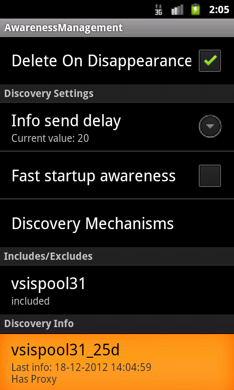

<span>Using Jadex on Android</span> 
===================================

Once you have installed the necessary tools, the **jadex-android-example-project** can be helpful to get started.

This guide, however, does **not** assume you are using the example project, but instead introduces the API of Jadex for Android step by step.

To understand the basics of android application development, please take a look at <span class="wikiexternallink">[<span class="wikigeneratedlinkcontent">http://developer.android.com/guide/</span>](http://developer.android.com/guide/)</span> .\
This guide and all included demo applications are currently using the API Level 8, which is supported in android 2.2 and above.

We assume that you created a basic Android Application to start with.

<span>Differences to the desktop version of Jadex</span> 
--------------------------------------------------------

While programming components is the same on the standard jadex distribution and the android version, everything else is different.\
We try to list some of the differences here to avoid confusion.

-   **No JCC:** First, there is no JCC (Jadex Control Center). This has a simple reason: There are no Java Swing components included in the Android runtime libraries. But, when you develop Android Applications, you'll want to have a native UI anyway.

<!-- -->

-   **UI as entry point:** In Desktop Jadex, you have Active Components that create their own UI. On Android, the entry point of an application IS the UI (e.g. an Activity). Because of this, components can never create the UI on Android.

<!-- -->

-   **The Jadex Platform runs inside an Application:** In consequence, instead of running the Jadex Platform and then starting applications, on Android, you will first start your application which then can launch a Jadex Platform. The Platform is also not shared across applications by default.

<!-- -->

-   **UI can be paused any time:** Because an Android UI Component can be paused or destroyed at any time, it is recommended to let the Jadex Platform run in an Android Service.

<span>Start a Jadex Platform</span> 
-----------------------------------

To use Jadex components, you first have to start a Jadex Platform.\
This can be done in different ways, both of them are described below.

### <span>Use the Jadex Platform directly in an activity</span> 

This method is only recommended for simple applications, e.g. if you **don't care** about running in **background**.\
Also, the jadex **platform will shutdown** if the application gets destroyed, for example when **turning the device**.\
Skip this section if you don't like that.

If such limitations doesn't matter or you simply want to test jadex on android, you can have your main activity extend the *JadexAndroidActivity* class.\
This replaces the Android Activity class and provides additional, jadex-related functionality.

The Jadex-Android-Example-Project shows how to use this method in the *jadex.android.exampleproject.simple* package.

The following code shows how to set-up a jadex platform.


```java

public class HelloWorldActivity extends JadexAndroidActivity
{
public HelloWorldActivity()
  {
    super();
    setPlatformKernels(JadexPlatformManager.KERNEL_MICRO);
    setPlatformAutostart(true);
    setPlatformName("HelloPlatform");
    setPlatformOptions("<insert normal jadex options here>");
  }
}

```


Available platform options are documented <span class="wikiexternallink">[here](http://www.activecomponents.org/jadex-applications-web/jadexdoc/view?model=/jadex/platform/Platform.component.xml)</span>.\
Setting up an activity like this will start a jadex-platform during the *onCreate()* phase and inform the activity about the progress in the two methods 
```java
onPlatformStarting()
```
 and 
```java
onPlatformStarted()
```
:


```java

  @Override
  protected void onPlatformStarting()
  {
    super.onPlatformStarting();
    // own logic here 
  }

  @Override
  protected void onPlatformStarted(IExternalAccess result)
  {
    super.onPlatformStarted(result);
    IComponentIdentifier platformId = result.getComponentIdentifier();
    // own logic here
  }

```


The jadex platform will also be automatically be terminated during the *onDestroy()* phase, e.g. when the activity is terminated by the user.

If you use 
```java
setPlatformAutostart(false)
```
, the platform can be started manually by calling 
```java
startPlatform()
```
.\
Regardless of which method us beeing used, the platform can always be stopped by calling 
```java
stopPlatforms()
```
.

### <span>Use the Jadex Platform in a service</span> 

If you need to create a more complex application, which should perform background tasks or should at least keep a jadex platform running in background, you should use the jadex platform in an <span class="wikiexternallink">[android service](http://developer.android.com/guide/components/services.html)</span>.

The Jadex-Android-Example-Project shows how to use this method in the *jadex.android.exampleproject.extended* package.

For your service class, extend 
```java
JadexPlatformService
```
 like this:


```java

public class MyJadexService extends JadexPlatformService

```


By default, the service will autostart a jadex platform on creation.\
To adjust Jadex Platform behaviour, use the methods 
```java
setPlatformAutostart()
```
, 
```java
setPlatformKernels()
```
, 
```java
setPlatformName()
```
 and 
```java
setPlatformOptions
```
 in the service constructor, like below:


```java
  public MyJadexService()
  {
    setPlatformAutostart(false);
    setPlatformKernels(JadexPlatformOptions.KERNEL_MICRO);
    setPlatformName("JadexAndroidExample");
    setPlatformOptions("-awareness false");
  }
```
  

### <span>Create Agents/Components</span> 

When you implement Agents that should run on an Android device, use the specific Classes 
```java
AndroidMicroAgent
```
, ... (available since 2.4).\
These classes offer additional functionality, such as event dispatching (see next section).

A Component is started by the method 
```
startComponent()
```
. As Parameters, you have to specify a component name and the path to it's model (xml) file. In case of MicroAgents, you can specify the Class of the Agent directly, e.g.


```java

startComponent("HelloWorldAgent", MyAgent.class).addResultListener(new DefaultResultListener<IComponentIdentifier>() {
  public void resultAvailable(IComponentIdentifier result)
  {
    System.out.println("Agent started");
  }
});

```


With the Result Listener you will be informed when the Agent is created.\
For more advanced scenarios, you can pass a 
```java
CreationInfo
```
 object to the Agent which can contain additional parameters.

<span>Agent &lt;-&gt; Android Service Coupling</span> 
=====================================================

The communication between Component and Service can be handled using a **ProvidedService** and **JadexAndroidEvents**.\
The Combination of the two offer an easy way of agent-service coupling.

The idea is that the Android Service can invoke methods on the Agent through an interface, while the Agent can inform the Android Service about what's happening through events. Both ways are described below.

Communication with the activity will not be mentioned in this tutorial, as it is recommended to **handle all agent-based communication in a service**, since activities are pause/resumed/destroyed on a regular basis and thus are not reliable.\
The image below shows an overview of the communication model:


<span>Android Service to Agent</span> 
-------------------------------------

To make a Component accessable by the Android Service, first create the required interface:


```java

public interface IAgentInterface
{
  void callAgent(String message);
}

```


Now let your Component implement that interface and add it to the ProvidedServices declaration:


```java

@ProvidedServices({
  @ProvidedService(name="agentinterface", type=IAgentInterface.class)
})
@Service
public class MyAgent extends AndroidMicroAgent implements IAgentInterface
{
  public void callAgent(String message) { ... }
}

```


To gain access to the Component via the interface you created, use the following code in your Android **Service**:


```java

  IAgentInterface agent = getsService(IAgentInterface.class);
  agent.callAgent("Hello Agent!");

```


If you are using Jadex inside a JadexAndroidActivity, call getPlatformService() first:


```java

  IAgentInterface agent = getPlatformService().getsService(IAgentInterface.class);

```


<span>Agent to Android Service</span> 
-------------------------------------

Agent to Android Service communication is done event-based.\
First, create a custom Event Type that extends 
```
JadexAndroidEvent
```
:


```java

public class MyEvent extends JadexAndroidEvent
{
  private String message;

  public String getMessage()
  {
    return message;
  }

  public void setMessage(String msg)
  {
    this.message = msg;
  }
}

```


<div class="wikimodel-emptyline">

</div>

For your Service to listen to Agent events, it has to register an EventReceiver (you can do this in 
```java
onCreate()
```
):


```java

registerEventReceiver(new EventReceiver<MyEvent>(MyEvent.class)
{
  @Override
  public void receiveEvent(final MyEvent event)
  {
    handler.post(new Runnable()
    {
          
      @Override
      public void run()
      {
        System.out.println("received message: " + event.getMessage());
      }
    });
  }
});

```


To dispatch events in an Agent, just use the 
```java
dispatchEvent()
```
 method (you need to extend AndroidMicroAgent for this method):


```java

  MyEvent myEvent = new MyEvent();
  myEvent.setMessage("Hello Service!");
  dispatchEvent(myEvent);

```


<span>Starting Components</span> 
================================

To simply start a (bdi, bpmn, ...) component, use 
```java
startComponent()
```
 in your Activity or Service and provide a component name and a valid model path:


```java

startComponent("HelloWorldAgent", "jadex/android/applications/demos/bdi/HelloWorld.agent.xml")
.addResultListener(bdiCreatedResultListener);

```


For micro agents, please use 
```java
startMicroAgent()
```
 and provide the class of the agent.

<span>Accessing the platform</span> 
-----------------------------------

The provided methods for accessing the platform depend on whether you are using JadexAndroidActivity (running Jadex inside an activity) or JadexPlatformService (running Jadex inside a service).\
You can, however, get the internal platform service from a JadexAndroidActivity by calling getPlatformService(). The returned object should contain all methods listed here.

-   isPlatformRunning(): Checks whether the platform is running or not.
-   getService(): Gets a service of a component running on the platform (asynchronously).
-   getsService(): As before, but blocks until the service is found (synchronously).
-   startComponent(): Starts a component on the platform.
-   shutdownJadexPlatform(): Terminates the platform.

If you want to access the platform manually, for features not covered by provided methods, you can use the following methods:

-   getPlatformAccess(): returns the external access to the platform

<span>Using remote services</span> 
==================================

Jadex was designed for distributed systems and Jadex-Android supports all the distribution features, too.\
To use a remote service, just declare the required service like usual in the agent:


```java

@RequiredServices(
  {@RequiredService(name = "myservice", type = IMyService.class, binding = @Binding(scope = Binding.SCOPE_GLOBAL))})

```


Be sure to use the same Interface on both the service consuming and the service providing application, e.g. *use the same package and class name* for the service interface.\
If Binding scope is set to global, services running on a desktop platform will be discovered by android devices, too.

<div class="wikimodel-emptyline">

</div>

### <span>Using the jadex control center</span> 

Jadex-android provides a simple replacement for the Desktop-JCC to configure security and awareness settings:

 

To use it, your AndroidManifest.xml has to include the following line:


```xml

<activity android:name="jadex.android.controlcenter.JadexAndroidControlCenter"/>

```


And *jadex-runtimetools-android-&lt;version&gt;.jar* should be included in your project build path.

The Control Center can then be launched from any jadex-android application as follows:


```java

Intent i = new Intent(this, JadexAndroidControlCenter.class);
i.putExtra("platformId", (ComponentIdentifier) platformId);
startActivity(i);

```


This is also part of the example-project.
