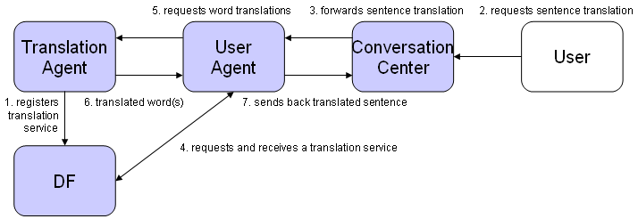

# Using Events

Communication takes place at two different abstraction levels in Jadex.  
The so called intra-agent communication is necessary when two or more plans inside of an agent want to exchange information.
They can utilize several techniques to achieve this. The encouraged possibility is to use beliefs (and conditions). 
Beliefs in Jadex are containers for normal Java objects, but they are a specially designed concept for agent modelling and therefore using beliefs has several advantages. 
One advantage is that they allow the usage of conditions to trigger events depending on belief states (e.g. creating a new goal when a new fact is added to a belief set). 
A further advantage is that using the beliefbase one is able to formulate queries and retrieve only entities that correspond to the query-expression. 

Another possibility of internal communication is to use explicit internal events. In contrast to goals, events are (per default) dispatched to all interested plans but do not support any BDI-mechanisms (e.g. retry). 
Therefore the originator of an internal event is usually not interested in the effect the internal event may produce but only wants to inform some interested parties about some (important) occurence.

On the other hand inter-agent communication describes the act of information exchange between two or more different agents. 
The inter-agent information exchange in Jadex is based on asynchronous message event passing. Each message event in Jadex has a dedicated `jadex.bridge.MessageType` which constrains the allowed parameters and the parameter types of the message event. Currently, only the [FIPA message type](http://fipa.org/specs/fipa00061/SC00061G.html) is supported. 
It equips a message type with all possible FIPA parameters such as sender, receivers, performative, content, etc.  
Besides the underlying message type (which is normally not of very much importance for agent programmers) in the ADF user defined message event types are specified, such as the request_translation message event we already encountered in earlier exercises.  
Note that the message event types are only locally visible and each agent uses its own message event types for sending and receiving messages. 
Hence, when an agent receives a message it has to decide which local message event type will be used to represent this message. 
The details of this process will be outlined in one of the following exercises. 

In this tutorial we will only show how a basic communication between two agents is implemented, when one agent offers a service that the other one seeks. 
The supplier therefore has to register it's services by the Directory Facilitator (DF) and is further on available as service provider. Another agent seeks a service by asking the DF and receives the providers address which it subsequently uses for the direct communication with the provider.

## Exercise F1 - Internal Events

In this exercise we will use internal events to broadcast information. We extend the simple translation agent from exercise C2 with a plan that shows the processed requests in a gui triggered by an internal event.

**Create a new GUI class named TranslationGuiF1.java as an extension of a JFrame**

-   This class has the purpose to show the already performed actions in a table. As member variable the table model is needed to be able to refresh the data in response to update notifications. 

```java
protected DefaultTableModel tadata;
```

-   In the constructor the table and its model should be created and added to the frame:

```java
tadata = new DefaultTableModel(new String[]{"Action", "Language", "Content", "Translation"}, 0);
JTable tatable = new JTable(tadata);
JScrollPane sp = new JScrollPane(tatable);
this.getContentPane().add("Center", sp);
this.pack();
this.setLocation(SGUI.calculateMiddlePosition(this));
this.setVisible(true);
```

-   Finally, for updating the gui a method is needed:

```java
public void addRow(final String[] content)
{
  SwingUtilities.invokeLater(new Runnable()
  {
    public void run()
    {
      tadata.addRow(content);
    }
  });
}
```

### Modifying the plans

-   Create a new GUIPlanF1 plan that has the purpose to create the gui and update it accordingly. The plan should create the gui in its constructor. In its body method it should wait in an endless loop for internal events of type gui_update:

```java
IInternalEvent event = waitForInternalEvent("gui_update");
```

-   Whenever such an event occurs the plan has to invoke the addRow() method of the gui whereby the update information is contained in a parameter named content

```java
event.getParameter("content").getValue();
```

-   In addition the plan's aborted method can be used to close the gui automatically when the agent is terminated:
```java
    public void aborted(){
      SwingUtilities.invokeLater(new Runnable()
      {
        public void run()
        {
          gui.dispose();
        }
      });
    }
```

-   Modify the EnglishGermanTranslationPlanF1 so that it produces an internal event after translation processing:

```java
IInternalEvent event = createInternalEvent("gui_update");
event.getParameter("content").setValue(new String[]{action, dir, eword, gword});
dispatchInternalEvent(event);
```

### Modifying the ADF

-   The addword plan and event declarations are not used and can be removed for clarity.
-   Modify the ADF so, that it contains the declaration for the new gui plan without specifying a trigger:

```xml
<plan name="gui">
  <body class="GUIPlanF1"/>
</plan>
```

-   Introduce the declaration of the new gui_update event within the events section:

```xml
<internalevent name="gui_update">
    <parameter name="content" class="String[]"/>
</internalevent>
```

-   Add an configurations section with one configuration that creates an initial gui plan:

```xml
<configurations>
    <configuration name="default">
        <plans>
            <initialplan ref="gui"/>
        </plans>
    </configuration>
</configurations>
```

### Starting and test the agent

Start the agent and send several translation requests to the agent. Observe if the gui displays all the translation requests.
     
## Exercise F2 - Receiving Messages

This exercise will explain how the mapping of received messages to the agent's message events works. Whenever an agent receives a message it has to decide which message event will internally be used for representing the message. 
This mapping is very important because any agent behavior such as e.g. plan triggers may only depend on the interpreted message event type.  
In general the event mapping works automatically and an agent designer does not have to worry about the mappings. Nevertheless, there are situations in which more than one mapping from a received message to different message events are available (normally this is undesirable and should be avoided by using more specific message event declarations).  
In such situations the agent rates the alternatives by specificity that is simply estimated by the number of parameters used for the declaration and chooses the one with the highest specificity.  
If more than one alternative has the same specificity the first one is chosen, although this case indicates an implementation flaw and might lead to undesired behavior when the wrong mapping is chosen. In any case the developer is informed with a logging message whenever more than one mapping was found by the agent.

As starting point for this exercise we take agent B2, which only has one passive translation plan which reacts on request messages. Other kinds of messages are simply ignored by the agent. To improve this situation and let the agent answer on all incoming messages we use the ready to use NotUnderstoodPlan from the Jadex plan library. Additionally, instead of the original B2 translation plan we take the enhanced one from section 5.1 which sends back inform/failure  messages to the requesting agent.

**Modify the copied file TranslationF2.agent.xml to include the new not-understood plan**

-   Add the following to the imports section:

```xml
<imports>
  <import>jadex.bdi.planlib.*</import>
  <import>jadex.base.fipa.*</import>
  <import>java.util.logging.*</import>
</imports>
```

-   Add the new not-understood plan to the plan declarations:

```xml
<plan name="notunderstood">
  <body class="NotUnderstoodPlan"/>
  <trigger>
    <messageevent ref="any_message"/>
  </trigger>
</plan>
```

-   Add the new any_message event which matches all kinds of messages and the not understood message that will be sent by the NotUnderstoodPlan to the event declarations:

```xml
<messageevent name="any_message" direction="receive" type="fipa"/>
<messageevent name="not_understood" direction="send" type="fipa">
    <parameter name="performative" class="String" direction="fixed">
        <value>SFipa.NOT_UNDERSTOOD</value>
    </parameter>
</messageevent>
```

-   Besides the any_message for receiving arbitrary kinds of messages  and the not_understood message which will be send by the not understood plan, we also need message declarations for the other messages to be sent be our agent. Here we need inform and failure messages that will be used by the modified translation plan:

```xml
<messageevent name="inform" direction="send" type="fipa">
    <parameter name="performative" class="String" direction="fixed">
        <value>SFipa.INFORM</value>
    </parameter>
</messageevent>
<messageevent name="failure" direction="send" type="fipa">
    <parameter name="performative" class="String" direction="fixed">
        <value>SFipa.FAILURE</value>
    </parameter>
</messageevent>
```

### Starting and testing the agent

The added plan provides the agent with the ability to react on arbitrary messages. When the agent receives a message with performative request, both message events match and the request_translation event is chosen due to its higher specificity. Other messages are directly mapped to the any_message event type and hence, the agent will repond with a not understood message. Send the agent different messages and observe if it invokes the right plans.

## Exercise F3 - Service Publication
We make the services of our translation agent publicly available by registering its service description at the Directory Facilitator (DF).

**Use the translation agent D1 as starting point and extend its copied ADF by performing the following steps**

-   Include the DF capability in the ADF to be used:

```xml
<capabilities>
  <capability name="dfcap" file="jadex.bdi.planlib.df.DF"/>
  <capability name="transcap" file="jadex.bdi.tutorial.TranslationD1"/>
</capabilities>
```

-   Create a reference for the df_keep_registered goal to make it locally available:

```xml
<goals>
    <maintaingoalref name="df_keep_registered">
        <concrete ref="dfcap.df_keep_registered"/>
    </maintaingoalref>
</goals>
```

-   Create a configurations section with one configuration. In this configuration an initial goal for the df registration should be provided. The agent description that is used for the registration is provided as initial value of the "description" parameter of the df_keep_registered goal:

```xml
<configurations>
  <configuration name="default">
    <goals>
      <initialgoal ref="df_keep_registered">
        <parameter ref="description">
          <value>
            ((IDF)$scope.getServiceContainer().getService(IDF.class))
              .createDFComponentDescription(null, ((IDF)$scope.getServiceContainer().getService(IDF.class))
              .createDFServiceDescription("service_translate", "translate english_german", "University of Hamburg"))
          </value>
        </parameter>
        <parameter ref="leasetime">
          <value>20000</value>
        </parameter>
      </initialgoal>
    </goals>
  </configuration>
</configurations>      
```

### Starting and testing the agent

Start the agent and open the DF GUI. Observe if an entry for the agent exists. Use the DF GUI to deregister your agent
(via popup-menu) and observe what happens after a while. Note that when you want to register the agent at a remote df, you only need to slightly modify your initial goal description by adding parameter values for the DF IComponentIdentifier and address.

## Exercise F4 - A Multi-Agent Scenario

As a little highlight we now extend our scenario from F3 to become a real multi-agent system. The conceptual scenario is depicted in the following figure.  
The user wishes to translate a sentence and sends its requests via the conversation center to the user agent. 
The user agent searches for a translation service at the DF and subsequently sends for each word from the sentence, a translation request to the translation agent. 
The user agent collects the translated words and sends back the translated sentence to the message center, where it is visible for the user.

  
*Figure 1 The multi-agent scenario*

**Create a new UserAgentF4.agent.xml**

-   Create a new agent called UserAgent by creating an ADF and one plan called EnglishGermanTranslateSentencePlanF4. In the ADF define the translate sentence plan with an appropriate waitqueue that handles message events of the new type request_translatesentence. The new request_translatesentence message event should be declared to match request messages that start with "translate_sentence english_german". Additionally incorporate the DF and Protocols capabilities in the capabilities section and create references for the rp_initiate (request protocol initiate) and df_search goals. This agent uses the df search goal to find a translation agent and the request goal to communicate in a similar standard way with the translation agent.

```xml
<agent xmlns="http://jadex.sourceforge.net/jadex-bdi ](http://jadex.sourceforge.net/jadex-bdi) "
       xmlns:xsi="http://www.w3.org/2001/XMLSchema-instance ](http://www.w3.org/2001/XMLSchema-instance) "
       xsi:schemaLocation="http://jadex.sourceforge.net/jadex-bdi ](http://jadex.sourceforge.net/jadex-bdi) 
                           http://jadex.sourceforge.net/jadex-bdi-2.0.xsd ](http://jadex.sourceforge.net/jadex-bdi-2.0.xsd) "
  name="UserF4"
  package="jadex.bdi.tutorial">
  
  <imports>
    <import>jadex.planlib.*</import>
    <import>jadex.base.fipa.*</import>
    <import>java.util.logging.*</import>
  </imports>

  <capabilities>
    <capability name="procap" file="jadex.bdi.planlib.protocols.request.Request"/>
    <capability name="dfcap" file="jadex.bdi.planlib.df.DF"/>
  </capabilities>

  <goals>
    <achievegoalref name="rp_initiate">
      <concrete ref="procap.rp_initiate"/>
    </achievegoalref>

    <achievegoalref name="df_search">
      <concrete ref="dfcap.df_search"/>
    </achievegoalref>
  </goals>

  <plans>
    <plan name="egtrans">
      <body class="EnglishGermanTranslateSentencePlanF4"/>
      <waitqueue>
        <messageevent ref="request_translatesentence"/>
      </waitqueue>
    </plan>
  </plans>

  <events>
    <messageevent name="request_translatesentence" direction="receive" type="fipa">
      <parameter name="performative" class="String" direction="fixed">
        <value>SFipa.REQUEST</value>
      </parameter>
      <match>$content instanceof String &amp;&amp; ((String)$content).startsWith("translate_sentence english_german")</match>
    </messageevent>

    <messageevent name="inform" direction="send" type="fipa">
      <parameter name="performative" class="String" direction="fixed">
        <value>SFipa.INFORM</value>
      </parameter>
    </messageevent>

    <messageevent name="failure" direction="send" type="fipa">
      <parameter name="performative" class="String" direction="fixed">
        <value>SFipa.FAILURE</value>
      </parameter>
    </messageevent>
  </events>

  <configurations>
    <configuration name="default">
      <plans>
        <initialplan ref="egtrans"/>
      </plans>
    </configuration>
  </configurations>
</agent>
```

-   The body method of this plan should adhere to the following basic structure:

```java
public void body()
{
  protected IComponentIdentifier ta;    
  ...

  while(true)
  {
    // Read the user request.
    IMessageEvent mevent = (IMessageEvent) waitForMessageEvent("request_translatesentence");

    // Save the words of the sentence.
    // Process the message event here.
    ...        
    String[] words = ...;
    String[] twords = ...;
    ...

    // Search a translation agent.
    while(ta==null) // ta is the instance variable for the translation agent
    {
      // Create a service description to search for.
      // You can use the ServiceDescription from the ADF of exercise F3.
      // Use a df-search subgoal to search for a translation agent
      // Save the translation agent in the variable ta
      // If no translation agent could be found waitFor() some time and try again
    }

    // Translate the words.
    for(int i=0; i<words.length; i++)
    {
      IGoal tw = createGoal("rp_initiate");
      tw.getParameter("action").setValue("translate english_german "+words[i]);
      tw.getParameter("receiver").setValue(this.ta);
      try
      {
        dispatchSubgoalAndWait(tw);
        twords[i] = (String)tw.getParameter("result").getValue();
      }
      catch(GoalFailureException gfe)
      {
        twords[i] = "n/a";
      }
    }

    // Send the reply with the translation of the whole sentence
    // to the caller (the user agent)
    // ...
  }
}
```

### Starting and test the agent

Start a translation agent and a user agent. Now send a translate sentence request to to the user agent, which will answer with a message in which the translated sentence is contained, e.g."translate_sentence english_german dog cat milk".
