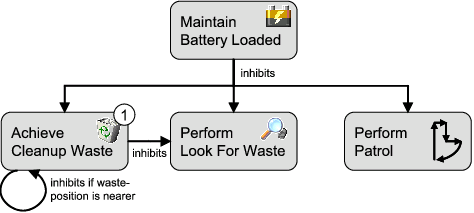

Goals make up the agent's motivational stance and are the driving forces for its actions. Therefore, the representation and handling of goals is one of the main features of Jadex. The concepts that make up the basis for the representation of goals in Jadex are described in the following sections and in more detail in \\\[Braubach et al. 04\\\] and \\\[Braubach et al. 09\\\]. Currently Jadex supports four different goal kinds and a meta-level goal kind. A perform goal specifies some activities to be done. Therefore the outcome of the goal depends only on the fact, if activities were performed. In contrast, an achieve goal can be seen as a goal in the classical sense by representing a target state that needs to be achieved. Similar to the behavior of the achieve goal is the query goal, which is used to enquire information about a specified issue. The maintain goal has the purpose to observe some desired world state and actively reestablishes this state when it gets violated. Meta-level goals can be used in the plan selection process for reasoning about events and suitable plans.

Figure 1 shows that a specific tag for each goal kind exists. Additionally, the \\&lt;...goalref\\&gt; tags allow for the definition of references to goals from other capabilities (cf. Figure 1 in the Capabilities section).

\

\~Figure 1: The Jadex goals XML schema part\~

\
At runtime an agent may have any number of top-level goals, as well as subgoals (i.e. belonging to some plan). Top-level goals may be created when the agent is born (contained in an initial state in the ADF) or will be later adopted at runtime, while subgoals can only be dispatched by a running plan. Regardless of how a goal was created, the agent will automatically try to select appropriate plans to achieve all of its goals. The properties of a goal, specified in the ADF, influence when and how the agent handles these goals. In the following, the features common to all goal kinds will be described, thereafter the special features of the specific goal kinds will be explained.

1.1 Common Goal Features

In Figure 2 the base type of all four goal kinds is depicted to illustrate the shared goal features. In Jadex, goals are strongly typed in the sense that all goal types can be identified per name and all parameters of a goal have to be declared in the XML. The declaration of parameters resembles very much the specification of beliefs. Therefore it is distinguished between single-valued parameters and multi-valued parameter sets. As with beliefs, arbitrary expressions can be supplied for the parameter values. The system distingiushes \~in\~, \~out\~, and \~inout\~, parameters, specified using the \~direction\~ attribute. \~in\~ parameters are set before the goal is dispatched, while \~out\~ parameters are set by the plan processing the goal, and can be read when the goal returns. Additionally, it can be specified that a parameter is not mandatory by using the \~optional\~ attribute.

Whenever a goal instance of the declared type is created and dispatched to the system it will be checked with respect to its parameters, and when no value has been supplied for a mandatory \~in\~ parameter or parameter set a runtime exception will be thrown. The creation of new goals can be further influenced by using binding options for parameters via the a normal \\&lt;bindingoptions\\&gt;tag that expects a set of values. All possible combinations of assignments of binding parameters will be calculated when the creation condition is affected from a change. For those bindings that fullfil the creation condition new goals are instantiated. If you expect the creation condition to trigger for each element that should be processed it may be sufficient to use a normal \\&lt;value\\&gt; tag and refer in it to a variable that is bound in the creation condition.

\~Figure 2: The Jadex common goal features\~

The \\&lt;unique\\&gt; settings influence if a goal is adopted or ignored. When the unique tag is present, the agent does not adopt two equal instances of the goal at once. By default two goal instances of the same type are equal, when all parameters and parameter sets have the same values. Using the \\&lt;exclude\\&gt; tag this default behavior can be overriden by specifying which parameter(set)s should not be considered in the comparison. When a plan tries to adopt a goal that already exists and is declared as unique, a goal failure exception is thrown.

To describe the situations in which a new goal of the declared user type will be automatically instantiated, the \\&lt;creationcondition\\&gt; may be used. For adopted goals, it can be specified under which conditions such a goal has to be suspended or dropped using the \\&lt;contextcondition\\&gt; and \\&lt;dropcondition\\&gt; respectively. The suspension of a goal means that all currently executing plans for that goal and all subgoals are terminated at once. If the suspension is cancelled, new means for achieving the goal will be inited. On the other hand, when a goal is dropped it is removed from the agent, and cannot be reactivated. Finally, the \\&lt;recurcondition\\&gt; can be used to specify in what cases the reactivation of a goal should be considered. In case the recur mode of a goal is enabled it is considered as a potential long-term goal and will not be dropped when no available plan can immediately achieve the goal. Instead of failing the goal is paused and will be reconsidered when the recur condition triggers. The \\&lt;deliberation\\&gt; settings, which influence which of the possible (i.e., not suspended) goals get pursued, will be explained in the deliberation section.\
  \
1.1 Example Goal

The following Figure shows an example goal using most of the features described above. It is a simplified example taken from the Hunter-Prey scenario (package jadex.bdi.examples.hunterprey) from the BasicBehaviour capability, common to all prey creatures. The goal is named "eat\_food" and has one parameter \$food, which is assigned from binding options taken from the food belief set. It is created whenever there is food (in the \$food parameter) and the creature is allowed to eat (see creation condition). The goal is \\&lt;unique/\\&gt; meaning that the creature will not pursue two goals to eat the same food at the same time. Moreover, the \\&lt;deliberation\\&gt; settings specify that the eat\_food goal is more important than the wander\_around goal. 

{code:xml}\
&lt;achievegoal name="eat\_food"&gt;\
  &lt;parameter name="food" class="ISpaceObject"&gt;\
    &lt;value&gt;\$food&lt;/value&gt;\
  &lt;/parameter&gt;\
  &lt;unique/&gt;\
  &lt;creationcondition language="jcl"&gt;\
    \$beliefbase.eating\_allowed\
  &lt;/creationcondition&gt;\
  &lt;dropcondition language="jcl"&gt;\
    !Arrays.asList(\$beliefbase.seen\_food).contains(\$goal.food)\
  &lt;/dropcondition&gt;\
  &lt;deliberation&gt;\
    &lt;inhibits ref="wander\_around"/&gt;\
  &lt;/deliberation&gt;\
&lt;/achievegoal&gt;\
{code}\
\~Example goal (similar in Hunter-Prey scenario)\~

1.1 BDI Flags

The handling and the exposed behavior of goals can be adapted to the requirements of your application using the so called BDI flags as depicted in the table below. The flags can be specified as attributes of the different goal tags in the ADF. The retry flag indicates that the goal should be retried or redone, until it is reached, or no more plans are available, which can handle the goal. An optional waiting time (in milliseconds) can be specifed using the retrydelay. The exclude flag is used in conjunction with retry and indicates that, when retrying a goal, only plans should be called that where not already executed for that goal.\
  \
{table}\
Name| Default| Possible Values\
retry| true| true false\
retrydelay| 0| positive long value\
exclude| "when\_tried"| "when\_tried", "when\_succeeded", "when\_failed", "never"\
posttoall| false| true false\
randomselection| false |true false\
metalevelreasoning| true |true false\
recur| false| true false\
recurdelay| 0 |positive long value\
{table}\
\~Common goal attributes (BDI flags)\~

The posttoall flag enables parallel processing of a goal by dispatching the goal to all applicable plans at once. The first plan to reach the goal "wins" and all other plans are terminated. When all plans terminate without achieving the goal, it is regarded as failed. The randomselection flag can be used to choose among applicable plans for a given goal randomly. Using this flag, the order of plan declarations within the ADF becomes unimportant, i.e., random selection is only applied to plans of the same priority and rank.

The metalevelreasoning flag activates the meta-level reasoning for processing of that goal. Meta-level reasoning means, that the selection among the applicable plans for a given goal (or event) is shifted to a meta-level. This is done by the system by creating a meta-level goal which subsequently needs to be handled by a meta-level plan, which actually has to make the decision and return the result. As the description indicates this process could be made recursive to further meta-meta levels if more than one meta-plan is applicable for the meta-goal, but in our experience this is only a theoretical issue without practical relevance. In Jadex the meta-goals and plans need to be explicitly defined within an ADF. From this circumstance the Meta Goal type is derived which will be explained in more detail in the following section about meta goals.

\
Furthermore the goal introduce the recur flag and the recurdelay (in milliseconds) option as further BDI settings. Consider a goal to have failed after trying all available plans. Setting recur to true, this goal will not be dropped but try to execute again, when the specified delay has elapsed. For recurring goals, all plans are considered again, i.e. recur allows to completely restart the reasoning for a goal after some delay.\
   \
1.1 Perform Goal

Perform goals are conceived to be used when certain activities have to be done. Below, an example declaration from the cleaner world example is shown. You can see that the perform goal "patrol" refines some BDI flags to obtain the desired behavior. By allowing the goal to redo activities (retry="true"), it is assured that the agent does not conclude to knock off after having performed one patrol round, but instead patrols as long as it is night. Even when the agent only knows one patrol plan, it will reuse this plan and perform the same patrol rounds, because it is not allowed to exclude a plan (exclude="never").\
  \
{code:xml}\
&lt;performgoal name="performlookforwaste" retry="true" exclude="never"&gt;\
  &lt;contextcondition language="jcl"&gt;\
    \$beliefbase.daytime\
  &lt;/contextcondition&gt;\
&lt;/performgoal&gt;\
{code}\
\~Example perform goal\~

1.1 Achieve Goal

Achieve goals are used to reach some desired world state. Therfore, they extend the presented common goal features by adding a \\&lt;targetcondition\\&gt;. With the target condition it can be specified in what cases a goal can be considered as achieved. The opposite can be specified using the drop condition that can be found in all goal types. If no target condition is specified, the results of the plan executions are used to decide if the goal is achieved. In contrast to a perform goal, an achieve goal without target condition is completed when the first plan completes without error, while the perform goal would continue to execute as long as more applicable plans are available. Below another goal specification from the cleaner world example is shown. The "moveto" goal tries to bring the agent to a target position as specified in the location parameter. The goal has been reached, when the agent's position is near the target position as described in the target condition.

{code:xml}\
&lt;achievegoal name="moveto"&gt;\
  &lt;parameter name="location" class="Location"/&gt;\
  &lt;targetcondition&gt;\
    \$beliefbase.my\_location.isNear(\$goal.location)\
  &lt;/targetcondition&gt;\
&lt;/achievegoal&gt;\
{code}\
\~Example achieve goal\~\
\
1.1 Query Goal

Query goals can be used to retrieve specified information. From the specification and runtime behavior's point of view they are very similar to achieve goals with one exception. Query goals exhibit an implicit target condition by requesting all out parameters to have a value other than null and out parameter sets to contain at least one value. Therefore, a query goal automatically succeeds, when all out parameter(set)s contain a value. The agent will engage into actions by performing plans only, when the required information is not available. Below, the "query\_wastebin" example realizes a query goal to find the nearest not full waste bin. It defines an out parameter, which contains a query expression. If one or more not full waste bins are already known by the agent and therefore contained in the wastebins belief set, the result will be set to the nearest waste bin calculated from the agent's current position (as described in the order by clause). Otherwise the agent does not know any not full waste bin and will try to reach the goal by using matching plans. Note that in the example the "\\&amp;" entity is used to escape the AND character ("\\&") in XML.\
  \
{code:xml}\
&lt;querygoal name="query\_wastebin" exclude="never"&gt;\
  &lt;parameter name="result" class="Wastebin" evaluationmode="push" direction="out"&gt;\
    &lt;value variable="\$wastebin"&gt;\
      Wastebin \$wastebin &amp;amp;&amp;amp; !\$wastebin.isFull()\
      &amp;amp;&amp;amp; !(Wastebin \$wastebin2 &amp;amp;&amp;amp; !\$wastebin2.isFull()\
      &amp;amp;&amp;amp; \$beliefbase.my\_location.getDistance(\$wastebin.getLocation())\
      &gt; \$beliefbase.my\_location.getDistance(\$wastebin2.getLocation()))\
    &lt;/value&gt;\
  &lt;/parameter&gt;\
&lt;/querygoal&gt;\
{code}\
\~Example query goal\~

1.1 Maintain Goal

Maintain goals allow a specific state to be monitored and whenever this state gets violated, the goal has the purpose to reestablish its original maintain state. Hence it adds a mandatory \\&lt;maintaincondition\\&gt; tag for the specification of the state to observe. Sometimes it is desirable to be able to refine the maintain state for being able to define more accurately what state should be achieved on a violation of the maintained state. Therefore the optional \\&lt;targetcondition\\&gt; can be declared.

Note that maintain goals differ from the other kinds of goals in that they do not necessary lead to actions at once, but start processing automatically on demand. In addition, maintain goals are never finished according to actions or state, so the only possibility to get rid of a maintain goal, is to drop it either by specifying a drop condition or by dropping it from a plan.

The maintain goal "battery\_loaded" shown below, makes sure that the cleaner agent recharges its battery whenever the charge state drops under 20%. To avoid the agent moving to the charging station and loading only until 21% (which satisfies the maintain condition), the extra target condition is used. It ensures that the agent stays loading until the battery is fully recharged. &lt;!~~Note that in the example the "\\&gt;" entity is used to escape the greater-than character ("&gt;") in XML.~~&gt;\
  \
{code:xml}\
&lt;maintaingoal name="maintainbatteryloaded"&gt;\
  &lt;deliberation&gt;\
    &lt;inhibits ref="performlookforwaste" inhibit="when\_in\_process"/&gt;\
    &lt;inhibits ref="achievecleanup" inhibit="when\_in\_process"/&gt;\
    &lt;inhibits ref="performpatrol" inhibit="when\_in\_process"/&gt;\
  &lt;/deliberation&gt;\
  &lt;maintaincondition language="jcl"&gt;\
    \$beliefbase.my\_chargestate &gt; 0.2\
  &lt;/maintaincondition&gt;\
  &lt;targetcondition language="jcl"&gt;\
    \$beliefbase.my\_chargestate &gt;= 1.0\
  &lt;/targetcondition&gt;\
&lt;/maintaingoal&gt;\
{code}\
\~Example maintain goal\~

1.1 Creating and Dispatching New Goals

Jadex distinguishes between top-level goals and subgoals. Subgoals are created in the context of a plan, while top-level goals exist independently from any plans. When a plan terminates or is aborted, all its not yet finished subgoals are dropped automatically. There are four ways to create and dispatch new goals: Goals can be contained in the configuration of an agent or capability, and are directly created and dispatched as top-level goals when an agent is born or terminated. In addition, goals are automatically created and dispatched as top-level goals, when the goal's creation condition triggers. Subgoals may be created inside plans only, while top-level goals may be created manually from plans, as well as from external interactions \[cf. Chapter External Interactions&gt;14 External Interactions\].

When a plan wants to dispatch a subgoal or make the agent adopt a new top-level goal it also has to create an instance of some goal model. For convenience a method \~createGoal()\~ is provided in \~jadex.runtime.AbstractPlan\~ that automatically performs the necessary goal lookup for the model element of the new goal instance. The name therefore specifies the goal model to use as basis for the new \~IGoal\~.

A subgoal is dispatched as child of the root goal of the plan, and remains in the goal hierarchy until it is finished or aborted. To start processing of a subgoal, the plan has to dispatch the goal using the \~dispatchSubgoal()\~ method. When the subgoal is finished (e.g., failed or succeeded), an appropriate notification will be generated, which can be handled by the plan that created the subgoal. A \~dispatchSubgoalAndWait()\~ method is provided in the Plan class, which dispatches the goal and waits until the goal is completed. Alternatively to subgoals, the plan can make the agent adopt a new top-level goal by using the \~dispatchTopLevelGoal()\~ method. Further on, a plan may at any time decide to abort one of its subgoals or a top-level goal by using the \~drop()\~ method of the goal. Note, that a goal cannot be dropped when it is already finished.

{code:java}\
public void body()\
{\
  * Create new top-level goal.\
  IGoal goal1 = createGoal("mygoal");\
  dispatchTopLevelGoal(goal1);\
  ...\
  * Create subgoal and wait for result.\
  IGoal goal2 = createGoal("mygoal");\
  dispatchSubgoalAndWait(goal2);\
  Object val = goal2.getParameter("someoutparam").getValue();\
  ...\
  * Drop top-level goal.\
  goal1.drop();\
}\
{code}\
\~Dispatching goals from plan bodies\~\
  \
When dispatching and waiting for a subgoal from a standard plan, a goal failure will be indicated by a GoalFailureException being thrown. Normally, this exception need not be catched, because most plans depend on all of their subgoals to succeed. If the plan may provide alternatives to failed subgoals, you can use try/catch statements to recover from goal failures:*

{code:java}\
public void body()\
{\
  ...\
  * Goal failure will cause plan to fail.\
  dispatchSubgoalAndWait(goal1);*

 * Goal failure will not cause plan to fail.\
  try\
  {\
    dispatchSubgoalAndWait(goal2);\
  }\
  catch(GoalFailureException e)\
  {\
    * Recover from goal failure.\
    ...\
  }\
}\
{code}  \
\~Handling of failed subgoals\~

1.1 Goal Deliberation with "Easy Deliberation"

One aspect of rational behavior is that agents can pursue multiple goals in parallel. Unlike other BDI systems, Jadex provides an architectural framework for deciding how goals interact and how an agent can autonomously decide which goals to pursue. This process is called goal deliberation, and is facilitated by the goal lifecycle (introduced in \[Chapter 2, BDI Concepts&gt;02 Concepts\]) and refined here to facilitate the understanding of the strategy. The life cycle introducess the \~active\~, \~option\~, and \~suspended\~ states. The context condition of a goal specifies which goals can possibly be pursued, and which goals have to be suspended. A goal deliberation strategy then has the task to choose among the possible (i.e., not suspended) goals by activating some of them, while leaving the others as options (for later processing). 

\~Figure 3: Easy deliberation strategy\~

The current release of Jadex includes a goal deliberation strategy called \~Easy Deliberation\~, which is designed to allow agent developers to specify the relationships between goals in an easy and intuitive manner. It is based on goal cardinalities, which restrict the number of goals of a given type that may be active at once, and goal inhibitions, which prohibit certain others goal to be pursued in parallel. The figure above shows which goal transitions the strategy uses. On the one hand it may transfer an inhibited goal from the active to the option state and on the other hand it can reactivate an option by activating it. More details and scientific background about the Easy Deliberation strategy and goal deliberation in general can be found in \\\[Pokahr et al. 05\\\].

The goal deliberation settings are included in the goal specification in the ADF Using the \\&lt;deliberation\\&gt; tag. The cardinality is specified as an integer value in the cardinality attribute of the \\&lt;deliberation\\&gt; tag. The default is to allow an unlimited number of goals of a type to be processed at once. Inhibition arcs between goal types are specified using the \~ref\~ attribute of the \\&lt;inhibits\\&gt; tag, which specifies the name of the goal to inhibit. Per default, any instance of the inhibiting goal type inhibits any instance of the referenced goal type. An expression can be included as content of the inhibits tag, in which case the inhibition only takes effect when the expression evaluates to true. Using the expression variables \$goal and \$ref, fine-grained instance-level inhibition releationships may be specified. Some goals, such as idle maintain goals, might not alway be in conflict with other goals, therefore it is sometimes required to restrict the inhibition to only take effect when the goal is in process. This can be specified with the inhibit attribute of the \\&lt;inhibits\\&gt; tag, using "when\_active" (default) or "when\_in\_process" as appropriate. For a better understanding of the goal deliberation mechanism in the following the deliberation settings of the cleanerworld example will be explained.\
\
&lt;xref linkend="goals.deliberation.example.fig"/&gt; 

shows the dependencies between the goals of a cleaner agent (cf. package jadex.bdi.examples.cleanerworld). The basic idea is that the cleaner agent (being an autonomous robot) has at daytime the task to look for waste in some environment and clean up the located pieces by bringing them to a near waste-bin. At night it should stop cleaning and instead patrol around to guard its environment. Additionally, it always has to monitor its battery state and reload it at a charging station when the energy level drops below some threshold.

\~Figure 4: Example goal dependencies (taken from Cleanerworld scenario)\~

The dependencies can be naturally mapped to the goal specifications in the ADF 

(see &lt;xref linkend="goals.deliberation.example.xml"/&gt;). 

The \\&lt;inhibits\\&gt; tags are used to specify that the "maintainbatteryloaded" goal is more important than the other goals. As the "maintainbatteryloaded" is a maintain goal, it only needs to precede the other goals when it is in process, i.e., the cleaner is currently recharging its battery. The cardinality of the "achievecleanup" goal specifies, that the agent should only pursue one cleanup goal at the same time. The goal inhibits the "performlookforwaste" goal and additionally introduces a runtime inhibition relationship to other goals of its type. The expression contained in the inhibits declaration means that one "achievecleanup" goal should inhibit other instances of the "achievecleanup" goal, when its waste location is nearer to the agent.\
  \
{code:xml}\
&lt;maintaingoal name="maintainbatteryloaded"&gt;\
  &lt;deliberation&gt;\
    &lt;inhibits ref="performlookforwaste" inhibit="when\_in\_process"/&gt;\
    &lt;inhibits ref="achievecleanup" inhibit="when\_in\_process"/&gt;\
    &lt;inhibits ref="performpatrol" inhibit="when\_in\_process"/&gt;\
  &lt;/deliberation&gt;\
&lt;/maintaingoal&gt;

&lt;achievegoal name="achievecleanup" retry="true" exclude="when\_failed"&gt;\
  &lt;parameter name="waste" class="Waste" /&gt;\
  &lt;!~~ Omitted conditions for brevity. ~~&gt;\
  &lt;deliberation cardinality="1"&gt;\
    &lt;inhibits ref="performlookforwaste"/&gt;\
    &lt;inhibits ref="achievecleanup"&gt;\
      \$beliefbase.my\_location.getDistance(\$goal.waste.getLocation())\
      &lt; \$beliefbase.my\_location.getDistance(\$ref.waste.getLocation())\
    &lt;/inhibits&gt;\
  &lt;/deliberation&gt;\
&lt;/achievegoal&gt;\
{code}\
\~Example goals (taken from Cleanerworld scenario)\~

1.1 Meta Goal

Meta Goals are used for meta-level reasoning. This means, whenever an event or goal is executed and it is determined that meta-level resoning needs to be done (i.e., because there are multiple matching plans) the corresponding meta-level goal of the goal or event is created and dispatched. Corresponding meta-level plans are then executed to achieve the meta goal (i.e., find a plan to execute). When the meta goal is finished the result contains the selected plans, which are afterwards scheduled for execution.

With the trigger tag, it is specified for which kind of event or goal the meta goal should be activated. Possible meta goal triggers are shown in Figure 5. As can be seen, meta goals can be used to select among applicable plans for an internal event, message event, a goal finished event, and a new goal to process. Any number of these triggers can appear inside a meta goal specification, i.e., a meta goal can be used to control meta-level reasoning of more than one event type. Each triggering element can be further described using a match expression, which can be used, e.g., to match only elemens with given parameter values. For backwards compatibility it is also possible to specify the triggering events in form of a single filter expression. This should only be needed in very special cases and should otherwise be avoided, because support for filter expressions might be dropped in future releases of Jadex.

\~Figure 5: Meta goal trigger tag\~

Besides the declaration of a triggering goal or event, the specification of a meta goal requires including the in parameter set "applicables" and the out parameter set "result" (both of type jadex.bdi.runtime.ICandidateInfo). The applicables are filled in by the system, while the result is set by the meta-level plan executed to achieve the meta goal. Furthermore, a failure condition can specified (similar to query goals) as meta goals are also used for information retrieval (to find a plan to execute for a goal resp. event). Meta-goals are only created internally by the system when the demand for meta-level reasoning arises. Therefore, in contrast to the query goal and the other goal types presented here, meta-goals exhibit several restrictions, as for these kinds of goals creation condition, unique settings and binding parameters are not allowed. On the other hand, meta-plans do not differ from other plans (there is no a separate tag for meta plans). A plan is a meta plan, when its plan trigger contains a meta goal.

In the example below, adapted from the jadex.bdi.examples.puzzle example, for every "makemove" goal a large number of plan instances might be applicable, as the "move\_plan" has a binding option which always contains all possible moves. Therefore, the "choosemove" meta goal is used to decide which of the applicable "move\_plan" instances should be executed. In turn, handling the "choosemove" meta goal another plan is executed ("choose\_move\_plan"). As you can see in the plan body code snippet below, the "choose\_move\_plan" has access to the parameters of applicable plans and may use this informations to decide which plan(s) to execute. The selected plans are placed in the "result" parameter of the "choose\_move\_plan" goal.\
  \
{code:xml}\
&lt;goals&gt;\
  &lt;achievegoal name="makemove"&gt;\
    ...\
  &lt;/achievegoal&gt;\
  \
  &lt;metagoal name="choosemove" recalculate="false"&gt;\
    &lt;parameterset name="applicables" class="ICandidateInfo"/&gt;\
    &lt;parameterset name="result" class="ICandidateInfo" direction="out"/&gt;\
    &lt;trigger&gt;\
      &lt;goal ref="makemove"/&gt;\
    &lt;/trigger&gt;\
  &lt;/metagoal&gt;\
&lt;/goals&gt;

&lt;plans&gt;\
  &lt;plan name="move\_plan"&gt;\
    &lt;parameter name="move" class="Move"&gt;\
      &lt;bindingoptions&gt;\$beliefbase.board.getPossibleMoves()&lt;/bindingoptions&gt;\
    &lt;/parameter&gt;\
    ...\
    &lt;trigger&gt;\
      &lt;goal ref="makemove"/&gt;\
    &lt;/trigger&gt;\
  &lt;/plan&gt;\
    \
  &lt;plan name="choose\_move\_plan"&gt;\
    &lt;parameterset name="applicables" class="ICandidateInfo"&gt;\
      &lt;goalmapping ref="choosemove.applicables"/&gt;\
    &lt;/parameterset&gt;\
    &lt;parameterset name="result" class="ICandidateInfo" direction="out"&gt;\
      &lt;goalmapping ref="choosemove.result"/&gt;\
    &lt;/parameterset&gt;\
    &lt;body clss="ChooseMovePlan"/&gt;\
    &lt;trigger&gt;\
      &lt;goal ref="choosemove"/&gt;\
    &lt;/trigger&gt;\
  &lt;/plan&gt;\
&lt;/plans&gt;\
{code}\
\~Example meta goal and corresponding plan\~

{code:java}\
public void body()\
{\
  ICandidateInfo\[\] apps = (ICandidateInfo\[\])getParameterSet("applicables").getValues();

  ICandidateInfo sel = null;\
    \
  for(int i=0; i&lt;apps.length; i++)\
  {\
    * Decide which plan to select, e.g. using the move parameter of the move\_plan.\
    Move move = (Move)apps\[i\].getPlan().getParameter("move").getValue();\
    ...\
  }\
  getParameterSet("result").addValue(sel);\
}\
{code}\
\~Body of the ChooseMovePlan\~*
