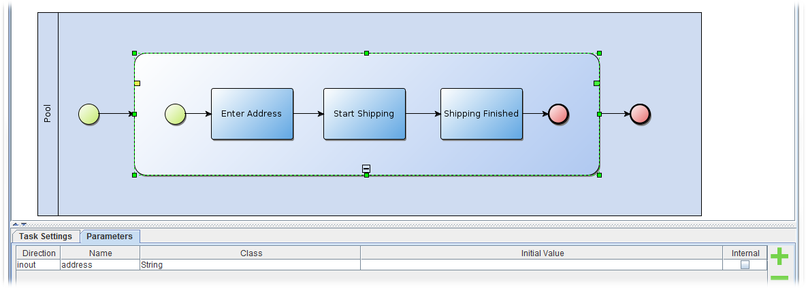

<span>Chapter 2 - Installation</span> 
=====================================

In this chapter, you will learn how to start the Jadex BPMN editor. You will also find some instructions on setting up a proper eclipse working environment for executing Jadex BPMN processes.

BEGIN MACRO: toc param: start="2" numbered="false" END MACRO: toc

<span>Prerequisites</span> 
--------------------------

-   Download and install a recent Java environment from <span class="wikiexternallink">[<span class="wikigeneratedlinkcontent">http://www.oracle.com/technetwork/java/javase/downloads/index.html</span>](http://www.oracle.com/technetwork/java/javase/downloads/index.html)</span> (if not already present).
-   Download and install a suitable eclipse distribution from <span class="wikiexternallink">[<span class="wikigeneratedlinkcontent">http://www.eclipse.org/downloads/</span>](http://www.eclipse.org/downloads/)</span> (if not already present). 
-   Download the latest Jadex build .zip from <span class="wikiexternallink">[<span class="wikigeneratedlinkcontent">http://www.activecomponents.org/download/</span>](http://www.activecomponents.org/download/)</span> and unpack it to a place of your choice (only necessary if you don't want to use maven).

<span>Exercise A1 - Eclipse Project Setup</span> 
------------------------------------------------

In this lesson you will set up an initial eclipse environment that will be used in the following lessions. Please follow the instructions carefully and compare your setup to the screenshots to verify that everything went fine.

We will first describe how a setup is done based on downloaded Jadex, afterwards using maven. Thus, you can choose one of both options.  

### <span>Alternative 1: Using Downloaded Jadex</span> 

Start eclipse. Start the 'New Java Project' wizard, set the project name to e.g. 'bpmntutorial' and click 'Finish' - the project will be created.


<div class="wikimodel-emptyline">

</div>

Now we need to add the Jadex jars to the build path of our project. For this purpose right click on the project folder and select 'properties'. Switch to the 'build path' options and click 'add external jars'. Navigate to the Jadex directory and add all jars that are in the 'lib' folder as shown below.


<div class="wikimodel-emptyline">

</div>

### <span>Alternative 2: Using Jadex via Maven</span> 

Create a new maven project by right-clicking in the package explorer and selecting 'new' -&gt; 'other'. Choose 'Maven Project' and click 'next'. In the 'New Maven Project' dialog activate the checkbox 'create a simple project' and click 'next'. 


<div class="wikimodel-emptyline">

</div>

Afterwards enter a group and artifact id, e.g. 'jadex' and 'bpmntutorial' and click 'Finish'.


<div class="wikimodel-emptyline">

</div>

Now we have to add a dependency to Jadex in the 'pom.xml'. If you want to use the latest Jadex nighly builds, it is necessary to add the Jadex repository to the pom.xml. Releases can be directly obtained from the Maven central repository. Below, it is shown what has to be added to the pom.xml for using the 2.5 nightly build.


```xml

<dependencies>
  <dependency>
    <groupId>net.sourceforge.jadex</groupId>
    <artifactId>jadex-distribution-standard</artifactId>
    <version>2.5-SNAPSHOT</version>
  </dependency> 
</dependencies> 
  
<repositories>
  <repository>
    <id>jadex-snapshots</id>
    <url>http://www0.activecomponents.org/nexus/content/repositories/snapshots</url>
  </repository>
</repositories>

```


Please note, that you can also use other Jadex servers (www0, www1, www2, www3) or the generic www address. In the latter case a server is chosen randomly, which might not be helpful because the working builds may differ.

<span>Exercise A2 - Starting the BPMN Editor</span> 
---------------------------------------------------

Since version 2.5 Jadex comes with a standalone BPMN editor that is directly bundled in the distributed. It can be either start via the command line by navigating to the Jadex folder and executing 'bpmn\_editor.bat/sh' depending on the operating type you are using.

As we develop BPMN process via eclipse in this tutorial we will also add a new runtime configuration for starting the editor. For this puropose open the 'run configurations...' dialog and enter 'BPMN Editor' as configuration name. If no project is selected, choose our new 'bpmntutorial' project. As main class enter 'jadex.bpmn.editor.BpmnEditor' or search it via the corresponding button.



<div class="wikimodel-emptyline">

</div>

After starting the run configuration, the BPMN editor gui should pop up. It should look similar to below.\
\


<div class="wikimodel-emptyline">

</div>

<span>Exercise A3 - Running Example Processes</span> 
----------------------------------------------------

In this lesson we will create a launch configuration to start the Jadex platform. To see that everything works, we will execute some example processes that are distributed with the Jadex package.

### <span>Eclipse Launch Configuration</span> 

Enter the 'run configurations' dialog again and create a new configuration for a Java application. You can name it e.g. 'Jadex Platform' and enter 'jadex.base.Starter' as main class. Instead you can of course also use the search dialog as shown below. Hit 'Run' to start the Jadex platform. 


<div class="wikimodel-emptyline">

</div>

### <span>Selecting and Starting a Process</span> 

If you managed to successfully start the Jadex platform, the Jadex control center (JCC) window will appear (see below). The JCC is a management and debugging interface for the Jadex platform and the components that run on it. 

To execute a process you need to add the corresponding resource path to the JCC project. Right-click in the upper left area (called the model explorer, as it is used to browse for models of e.g. processes) and choose 'Add Path'.


<div class="wikimodel-emptyline">

</div>

A file requester appears that should initially present the directory, where you unpacked the Jadex distribution. Open the *lib* directory and select the file *jadex-applications-bpmn-xyz.jar* (with xyz as placeholder for the current version). You can now unfold the contents of the jar file and browse to the helloworld example. After you selected the *HelloWorld.bpmn2* in the tree, you can start the process by clicking 'Start'.


<div class="wikimodel-emptyline">

</div>

The process will be executed, thereby printing some messages to the (eclipse) console.

### <span>Saving the JCC Project</span> 

As you probably do not want to add the jar file again, each time you start the Jadex platform, you should save the current settings of the JCC. From the 'File' menu choose 'Save Settings'. 

### <span>Using the Visual BPMN Debugger</span> 

Jadex additionally provides a visual debugger for BPMN processes. We will show here how the tool can be used to control the execution of the helloworld process. As a first step we start the helloworld process again, but this time as suspended. For this purpose activate the 'Start suspended' checkbox in the 'Settings-Flags' section of the BPMN process model (on the right hand side of the JCC). After having started the process it will be displayed as suspended, which is indicated by a 'zzz' on the component icon. 


<div class="wikimodel-emptyline">

</div>

Now we are ready to use the BPMN debugger. First we have to switch to the debugger view by activating the corresponding JCC plugin via the toolbar button . In the debugger view you can see the running components on the left and the debugging panel on the right. This panel depends on the concrete type of component, i.e. for BPMN the debugger panel looks different than for BDI or micro agent components. Double-click the helloword component in the left side of the window to activate debugging for that component. On the right hand side, the debugger panel consists of three different areas. On the top-left the breakpoint panel shows the available breakpoints in the process. On the top-right the bpmn diagram is shown and below the currently existing process threads including their state and variables are displayed.


<div class="wikimodel-emptyline">

</div>

To execute a step of the process two options are available. First, you can directly double-click activated elements in the visual process diagram. Such activated elements are displayed in green (in the figure above the start event is the only activated element). As an alternative you can press the 'Step' button at the bottom, which will execute a step of one process thread. If you want to determine which process thread is selected you have to select it in the 'processes table' above.    

You can also debug multiple processes at once. Try starting multiple instances of the process. Each of the created instances can be independently controlled in the debugger tool. A double-click on a process instance in the debugger opens/closes the debugger view for this process. An active debugger view is represented by a symbolic magnifying glass on the process icon. A single-click on such an icon will switch to the debugger view of this process instance.

The debugger also allows you to set breakpoints in your process. The available breakpoints are shown in the left area of the debugger view. The breakpoints correspond to the elements in the process diagram (e.g. tasks but also other elements such as events or gateways). The checkbox left besides each element allows to activate/deactivate the breakpoint for this element. When a running process hits a breakpoint, the process is automatically suspended. E.g., when the next activity of a process has an active breakpoint, the process is stopped before the activity is executed. To resume a suspended process, you can also use the 'Run' button in the debugger view. The process is then executed until it finishes or hits the next breakpoint. Try setting a breakpoint and clicking 'Run'. Observe how the process executes some activities before it stops at the breakpoint. The visual debugger shows elements with an active breakpoint using a red stop sign .

### <span>Execute Example Processes</span> 

Execute some other example processes, e.g., from the 'execute' or 'message' folder. Open the diagrams of these processes in eclipse to get an initial impression of the features of Jadex BPMN modeling and execution. These features will be introduced in the lessons of the subsequent chapters.
