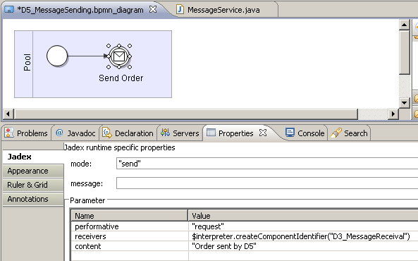

Chapter 5 - Events and Messages
============================================

This chapter deals with the dispatching and processing of events insinde processes. Events can be e.g. timing events, errors or custom internal events. 

BPMN distinguishes *start*, *intermediate* and *end* events. Intermediate events are further subdivided into *thrown* and *catched* events, i.e. events, which are produced or consumed, respectively. Start events are always considered to be catched (consumed), while end events are thrown (produced). The [BPMN Poster](http://www.bpmb.de/images/BPMN2_0_Poster_DE.pdf)  presents an overview of available event types.

In the previous lessons you have already come across the empty start and end events. These empty events have no additional semantics and only serve for readability purposes. In the following event types will be introduced, that influence how the process is executed.

Exercise D1 - Timer Events
---------------------------------------

The timer event represents some passing of time. As time is outside the control of any process, this event only exists as *catched* event, i.e. a process can react to the passing of time, but the process can not influence time itself.

### Create the Time Event Process

Create a process as shown in the figure below. This example represents a reminder process, e.g. when some order is late. First, an initial reminder is sent. If nothing happens after some delay, a second reminder is sent. 

After placing the time event in the diagram, left-click on the event element to edit its properties in the properties view. Edit the *duration* property and enter some value, e.g., '3000'. The event duration specifies the time that the process will wait before continuing. It is specified in milliseconds, i.e. entering '3000' will cause the process to wait for three seconds.

### Observe the Process Execution

Use print tasks for the first and second reminder, such that you can observe the process execution in the console. Start the process and verify that there is a three seconds delay between the first and the second message.

Now start the process in suspended mode and switch to the debugger. Execute the process stepwise. You can notice that the event intermediate activity chages its status from ready to waiting (switching from red to green), when you click 'Step', but the process does not proceed to the next activity. This means that the process has started the time event activity and still waits for this activity to finish. The time event activity finishes after three seconds, thus after the time has passed, the process proceeds to the second reminder activity automatically.

Exercise D2 - Exceptions
-------------------------------------

Exceptions are situations and events that deviate from the normal course of action. Usually you want to describe in a process what happens, when everything goes well. But unexpected things can happen and sometimes this needs to be reflected in the process description.

Thus, exception events can be attached to subprocess elements. When an exception occurs during the execution of a subprocess, the subprocess does not continue, but instead the exception exit is triggered.

### An Exception Process

Consider the following process. It starts with one activity: 'Credit Check'. If the credit check is successful the process proceeds to the 'Credit Approved' task. If some problem occurs during the credit check, the exception exit is triggered and the process moves on to the 'Credit Denied' task.

### Failed and Successful Tasks

Use a UserInteractionTask for the credit check. When executing the process, a dialog will be opened offering you two buttons 'OK' and 'Cancel' (or similar options based on your locale). Pressing cancel will cause an exception in the task. The process catches this exception and continues with the credit denied task.

Try out what happens, when you omit the exception handler. Delete the exception handler and the credit denied task from the diagram. Execute the process and choose 'Cancel'. An exception like 'java.lang.RuntimeException: Task not completed' will be printed to the console and the process will be removed from the platform. Whenever a task produces an exception which is not handled in the process, the process will be terminated. Thus it is important to use exception handlers appropriately, when you have tasks that might fail.

Exercise D3 - Receiving Messages
---------------------------------------------

Using messages, processes can communicate with the outside world. The outside world may be another process or an external software system (e.g. a web service). A message is represented as a set of name/value pairs, which specify, e.g., the sender and receiver of the message as well as its content.

### Message Intermediate Event

Draw a process as shown below. The process has a preparatory task (e.g. print out a message to the console), then waits for a message being received and finally prints out the content of the received message.

Per default, the message intermediate event reacts to any received message, so you do not need to edit this element at first. The received message is stored in a parameter called '\$event', which can be used in the subsequent activity. E.g. use a print task for the 'Order Received' activity with the text parameter set to '"Received order: "+\$event.content' to print out the content of the received message.

### Using the Conversation Center

To send the process a message, you can use the conversation center. Choose the conversation center from the toolbar in the JCC. It is represented by the envelope icon ().

The tree on the left of the conversation center shows the components that are currently running on the platform. If you have started your process in the starter tool, you should see it in the tree. If you double click on an icon on the tree, the component will be added as a receiver of the current message.

The two lists in the middle show messages that have been sent or received previously. These lists will probably be empty when you first open the conversation center. The last sent messages are saved when you close the project or exit the platform. This is useful if you have created some test messages to send to your processes, so you can easily reuse them in subsequent sessions.

The right side shows the currently edited message. You can see that the message has a number of properties that can be specified (sender, receiver, etc.). Double click on your process in the left tree and observe that it is added as a receiver. If you want to remove a receiver, you may click on the 'X' icon besides the receivers box. This will clear all receivers. The text box at the bottom is used for the content of the message. This is what the process will print out, because we used the expression '\$event.content' in the text parameter. You can also access the other parameters of the message in a similar way, e.g. '\$event.language' or '\$event.performative'.

After setting the receiver and the content, hit the 'Send' button below the message. Observe that the process continues and prints out the text as received in the message.

### FIPA Message Structure

You may wonder, what all the message properties are about. Jadex allows (in principle) different types of messages.\
The type of the message constrains the available parameters of a message. Currently, the only available type is "fipa" which defines parameter(set)s according to the FIPA message specification (e.g., parameters for the receivers, content, sender, etc. are introduced). Through this message typing Jadex does not require that only FIPA messages are being sent, as other options may be added in future. In the following table, all available parameter(set)s are itemized. For details about the meaning of the FIPA parameters, see the FIPA specifications available at [FIPA ACL Message Structure Specification](http://www.fipa.org/specs/fipa00061/SC00061G.html) . The meanings of all of these parameters are shortly sketched in the following table.

  Name                Class                  Meaning
  ------------------- ---------------------- ---------------------------------------------------------------------------------------------------------------------------------------------------------------------------------------------------------------------------------------------------------------------------------------------------------
  performative        String                 Speech act of the message that expresses the senders intention towards the message content.
  sender              IComponentIdentifier   The senders component identifier, which contains besides other things its globally unique name.
  reply\_to           IComponentIdentifier   The component identifier of the component to which should be replied.
  receivers \[set\]   IComponentIdentifier   Arbitrary many (at least one) component identifier of the intended receiver components.
  content             Object                 The content (string or object) of the message. If the content is an object it has to be specified how the content can be marshalled for transmission. For this puropose codecs are used. Jadex has built in support for marshalling arbitrary Java beans when using one of the available XML languages.
  language            String                 The language in which the content of the message should be encoded.
  encoding            String                 The encoding of the message.
  ontology            String                 The ontology that can be used for understanding the message content. Can also be used for deciding how to marshal the content.
  protocol            String                 The interaction protocol of the the message if it belongs to a conversation.
  reply\_with         String                 Reply-with is used for assigning a reply to a original message. The receiver of the message should respond to this message by putting the reply-with value in the in-reply-to field of the answer.
  in\_reply\_to       String                 Used in reply messages and should contain the reply-with content of the answered message.
  conversation\_id    String                 The conversation-id is used in interactions for identifying messages that belong to a specific conversation. All messages of one interaction should share the same conversation-id.
  reply\_by           Date                   The reply-by field can contain the latest time for a response message.

*Reserved FIPA message event parameters*

### Message Matching based on Parameters

Sometimes a process should not react to just any message, but only to messages that match a given template. In the message intermediate event, you can add parameters and corresponding values. If such parameters are specified, the event will only match those messages, where the parameter values are the same as in the event specification.

Edit the properties of the message intermediate event in the diagram. Add a parameter 'performative' with the value '"request"'. Use quotes for the value, because the value should be a string in this case.

Save and start the process. Send messages to the process using the conversation center. First send some messages with a performative other than 'request'. Verify that the process does not react to these messages. Then send a request message and check that the process reacts to it.

Exercise D4 - Multiple Events and Timeouts
-------------------------------------------------------

When waiting for an event such as an incoming message, this branch of the process is blocked until the event occurs.\
In reality, sometimes events do not happen as expected. This would cause a process to be blocked forever. A common way to deal with this problem is using timeouts, i.e. only waiting for a limited amount of time. If the events does not happen within the given time frame, the process continues with another branch.

In BPMN there exists a *multiple event* element, which represents a choice between a set of events. You can connect an arbitrary number of other events to the multiple event. If one of these events happens, the process continues on the branch, where the event is placed. Therefore, you can e.g. wait for two different messages specified by different message event elements (e.g. distinguishing the message content or performative) and continue on different branches of the process depending on the message received.

To wait for a message with a timout, you can use a multiple event to combine the message event with a time event.\
If the message is not received within the time specified in the time event, the time event will trigger and the process continues.

### A Process with a Timeout

The above mentioned timeout pattern is shown in the following process description. The process combines the elements from exercises D1 and D3.

Note the use of the multiple event (). In eclipse, it is available from the *Intermediary Events* section of the palette and is called *Multiple intermediate event*. Set a conveniently long timeout like e.g. 5000 milliseconds in the time event, because you need to send the process a message manually for testing.

### Testing the Timeout Process

Start the process in the starter tool. Wait the specified amount of time to see, if the timeout works as expected. Now start the process again, switch to the conversation center and send the process an appropriate message. Verify that the process handles the message as expected.

If you have problems sending the message in time, you can increase the timeout value. Alternatively, you can start the process in suspended mode. Now you have as much time as you want to send the process a message. After sending the message you can resume the process. The process will then handle the message and terminate.

A process may receive an arbitrary number of messages even when suspended. Each process has its own message queue, where received messages are stored until they are handled.

Exercise D5 - Sending Messages
-------------------------------------------

To send a process a message, we need to know how to address the process. The addressing depends on the message type. The fipa message type that Jadex supports out-of-the-box uses so called component identifiers for addressing. You have seen component identifiers in the previous lessons when using the conversation center.

A component identifier is composed of a unique name, usually of the form &lt;component&\#95;name&gt;'@'\\

, e.g. 'D3&\#95;MessageReceival@lars'. Additionally, a component identifier may hold a number of transport addresses, which tell the platform how to reach the component, when it resides on a remote platform.

### Sending a Message in a Process

For sending a message, add a message intermediate event as shown below. As mentioned earlier, BPMN distinguishes between *catching*- and *throwing*-events. The events we have used so far, were all catching-events which are represented by white icons within the BPMN event symbol. In contrast, throwing events are represented by black icons (see below). While catching a message is an analogy to receiving, throwing is an analogy to sending a message. Because of this, the event's mode has to be changed by right-clicking on the symbol and choosing "Set as a throwing shape". Add message parameters as required (cf.  ToDo: Update screenshot !

We want to send a message to the process from Exercise D3. Thus, set the performative to request as expected by the D3 process and and enter an appropriate content for the message. Finally, we need to specify the recipient of the message.\
You can use the helper method *createComponentIdentifier()* to create a local component identifier. The method is defined in the BMPN interpreter object, which is available from the reserved variable '\$interpreter'. Supply the local name of the process without the platform name, e.g., 'D3&\#95;MessageReceival'.

### Testing the Process

Start the process. An warning message 'Message could not be delivered to receiver(s)' will be printed to the console. This is because a message was sent, but the platform did not find the intended receiver. Whenever you send a message to a non-existent recipient, you will observe such a warning message.

Now start the process from exercise D3. The D3 process waits indefinitely for a request message. When the process is started, start the D5 process. The message will be delivered and the D3 process will print out the received order.\
If it does not work as expected, make sure that the name of the D3 process instance is the same as specified as receiver in the D5 process description.

### Observing Messages using the Communication Analyzer

The JCC includes a tool to monitor the messages that are exchanged between processes: the communication analyzer (). Open the tool by selecting its icon from the upper right tool bar in the JCC. The window is divided in two main areas. On the left, there is a tree of the currently running agents. On the right you can see the observed messages in four different views: as a table, as a sequence diagram, as a 2D graph, and as a bar or pie chart. Furthermore, details of a selected message can be shown at the bottom.

To observe the message between D3 and D5 perform the following steps. Start D3 (using the starter tool). Switch to the communication analyzer and double click on the D3 process. You will see that the icon is enriched with a small looking glass. This means that the communication analyzer now observes this process and therefore notices any message that this process may send or receive. Now start the D5 process. The message will be exchanged and both processes will terminate.\
The tree in the communication analyzer will now show both processes with a small ghost icon, meaning that these processes are no longer alive.

The different views of the communication analyzer can consume quite some resources. Therefore they have to be activated separately. Switch to the 'Diagram' view and click the start button (the yellow triangle at the top left). The recorded message will be displayed. Double click on the message arrow to see details about the message (timestamp, etc.). Switch to other view like 'Graph' and see how the message is displayed there.

The communication analyzer is a very powerful and complex tool. When you right-click on a message, you get access to various filtering options. The filters are very helpful, if you have a larger application with many messages being exchanged. A complete discussion of all the features of the communication analyzer is outside the scope of this tutorial. Feel free to experiment with the tool to explore its functionality in more depth.

### todo: further topics

-   data
    -   parameters in AND-join
    -   loops
    -   complex Java values (business objects)
    -   reserved variables: \$interpreter, \$thread, \$event, \$platform, \$clock, \$args, \$results
    -   arguments and results
-   tasks
    -   predefined tasks (esp. create comp for external subprocess)
    -   custom tasks
-   other elements (lanes etc. - discuss only, no lesson?)

