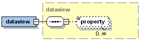

1 Domain Model

In this section the \~domain model\~ concepts will be presented in detail. Each concept will be explained using the XML schema parts and additionally with example xml code snippets

1.1 Space Type Definition

All space types are defined with the \\&lt;spacetypes\\&gt; section of Jadex application descriptor. This section is an extension point (using xml-schema any element) and allows for custom space types to be plugged in. These specific space types typically come with their own  schema definition and hence use tags within a separate namespace. For EnvSupport the outermost declaration is called \\&lt;env:envspacetype\\&gt; (using here 'env' as prefix for its namespace). The figure below shows the basic elements an environment is composed of.

\~XML schema part for the environment space type\~

It can be seen that a space type is generally specified by declating \~objecttypes\~, \~avatarmappings\~, \~actiontypes\~, \~tasktypes\~, \~processtypes\~, \~percepttypes\~, \~views\~, \~perspectives\~ and a \~spaceexecutor\~. For the domain model we will first cover the details of \~objecttypes\~, \~actiontypes\~, \~tasktypes\~, \~processtypes\~ and the \~spaceexecutor\~. Before explaing these elements a we will have a short look on the envspacetype element itself. 

In this basic definition the type name, its implementation class and also its extent (using width, height and optionally depth) as well as its border mode (as subtag) can be included. Currently, two different implementations are available: the \~ContinuousSpace2D\~ for a continuous 2d world and \~Grid2D\~ for a 2d grid world consisting of a discrete raster. Both implementation are contained in the package 'jadex.application.space.envsupport.environment.space2d', which has to be imported if the classes are not referenced fully qualified. The border mode determines the behaviour of the space objects at the borders of the 2d field. If set to 'strict' the world ends at the borders, whereas if the 'torus' mode is used the space objects can cross\
the borders and enter the field on the other side.

1.1.1 Object Type

\~Object type xml schema part\~

Object types are the foundation for space object instances. They represent some kind of simple class (better struct as it cannot contain behaviour) definition for an object. Each object type has to be uniquely identified via a \~name\~ attribute. An object type may contain an arbitrary number of property type declarations. A property is then described using attributes for a \~name\~ and a \~class\~. Additionally, two flags can be used. The \~dynamic\~ flag determines how a property value is interpreted at runtime. If set to false the initial value is evaluated once and the result is stored. Otherwise, the declared value is treated as dynamic expression, which is reevaluated on every access. The \~event\~ flag can be used to tell the system that property change events should be generated whenever the property value changes. Please note that also the parametrization of many other elements is done using the property machanism as described above. 

In the following code snippet a short example for an object type is shown. It is the avatar type sentry of the marsworld example. It has proprties for its \~vision\~ range, \~speed\~ and \~position\~.

{code:xml}\
&lt;env:objecttype name="sentry"&gt;\
  &lt;env:property name="vision" class="double"&gt;0.1&lt;/env:property&gt;\
  &lt;env:property name="speed" class="double"&gt;0.05&lt;/env:property&gt;\
  &lt;env:property name="position" class="IVector2" dynamic="true"&gt;\
    \$space.getSpaceObjectsByType("homebase")\[0\].getProperty("position")\
  &lt;/env:property&gt;\
&lt;/env:objecttype&gt;\
{code}\
\~Sentry avatar object type\~

1.1.1 Task Type

\~Task type xml schema part\~

A task type can be used for encoding behaviour that is associated to a specific object at runtime. A type type has to be defined using attributes for a \~name\~ and its implementation \~class\~. In addition to these attributes an arbitrary number of properties may be specified as subtags of the tasks. These properties can be used for initialization of task instances of the given task type. The implementation of a task type has to follow the \~IObjectTask\~ interface (package jadex.application.space.envsupport.environment). It consists of four method signatures (cf. code snippet below). All these methods will be called automatically from the environment support runtime (space executor). The \~start()\~ and \~shutdown()\~ methods should contain code for the initialization and close down of the object task. The \~execute()\~ is called in every step the space executor issues. It should contains the main logic of the task to perform. In order to quit a task automatically the \~isFinished()\~ method can be used. As long as the task runs the method will be called to find out is the task has finished its execution. For programmer convenience an abstract task implementation \~AbstractTask\~ (package jadex.application.space.envsupport.environment) is also available. Extending this abstract task requires only the \~execute()\~ method being filled with code (if \~start()\~ and \~shutdown()\~ are overridden they should call \~super().start()/shutdown()\~). It already implements a solution for finishing tasks. On the one hand it is possible to call a \~setFinished()\~ and manually terminate the task and on the other hand the task fetches a boolean condition via \~(IBooleanCondition)getProperty("condition")\~ and calls \~isValid()\~ on this condition to check if the task should still run.

{code:java}\
package jadex.application.space.envsupport.environment;

public interface IObjectTask extends IPropertyObject\
{\
  public void start(ISpaceObject obj);\
\
  public void shutdown(ISpaceObject obj);

  public void execute(IEnvironmentSpace space, ISpaceObject obj, long progress, IClockService clock);

  public boolean isFinished(IEnvironmentSpace space, ISpaceObject obj);\
}\
{code}\
\~IObjectTask interface\~

As an example below a move task from the cleanerworld example is shown. It basically changes the avatar position according to its velocity and direction step by step. It also reduces the amount of available energy according the currently travelled distance. The task is set to finished when the target location has been reached.

{code:java}\
public class MoveTask extends AbstractTask\
{\
  public static final String PROPERTY\_DESTINATION = "destination";\
  public static final String PROPERTY\_SPEED = "speed";\
  public static final String PROPERTY\_VISION = "vision";\
  public static final String PROPERTY\_CHARGESTATE = "chargestate";

  public void execute(IEnvironmentSpace space, ISpaceObject obj, long progress, IClockService clock)\
  {\
    IVector2 destination = (IVector2)getProperty(PROPERTY\_DESTINATION);\
    double speed = ((Number)obj.getProperty(PROPERTY\_SPEED)).doubleValue();\
    double maxdist = progress\*speed\*0.001;\
    double energy = ((Double)obj.getProperty(PROPERTY\_CHARGESTATE)).doubleValue();\
    IVector2 loc = (IVector2)obj.getProperty(Space2D.PROPERTY\_POSITION);

    IVector2 newloc = ((Space2D)space).getDistance(loc, destination).getAsDouble()&lt;=maxdist?\
      destination : destination.copy().subtract(loc).normalize().multiply(maxdist).add(loc);

    if(energy&gt;0)\
    {\
      energy = Math.max(energy-maxdist/5, 0);\
      obj.setProperty(PROPERTY\_CHARGESTATE, new Double(energy));\
      ((Space2D)space).setPosition(obj.getId(), newloc);\
    }\
    else\
    {\
      throw new RuntimeException("Energy too low.");\
    }\
  \
    if(newloc==destination)\
      setFinished(space, obj, true);\
}\
{code}

1.1.1 Process Type

\~Process type xml schema part\~

A process type is very similar to a task type. It also represents dynamic behaviour, but on a global level, i.e. it is not connected to a specific environment object but to the environment as a whole. The process type definition is done again using a \~name\~ and a \~class\~ attribute optionally extended with properties as subtags. A process type implementation has to be compliant to the \~ISpaceProcess\~ interface (package jadex.application.space.envsupport.environment). This interface is similar to the task interface and also contains methods for starting (\~start()\~) and terminating (\~shutdown()\~) the process. The space executor calls \~execute()\~ in each step, so that this method should contain the application logic of the process. It does not have a isFinished() method as in most cases processes determine themselves that they do not want to run any longer. This can be achieved by calling \~removeSpaceProcess()\~ on the environment. 

{code:java}\
package jadex.application.space.envsupport.environment;

public interface ISpaceProcess extends IPropertyObject\
{\
  public void start(IClockService clock, IEnvironmentSpace space);

  public void shutdown(IEnvironmentSpace space);

  public void execute(IClockService clock, IEnvironmentSpace space);\
}\
{code}\
\~ISpaceProcess interface\~

One frequent use case is the creation of domain objects by an environment process. For this purpose a customizable default implementation is provided by the \~DefaultObjectCreationProcess\~ class (package jadex.application.space.envsupport.environment). It can be parametrized using the following parameters:  

-   \*type:\* The type of the object to be created (String, required).
-   \*properties:\* The initial properties of the object (Map, optional).
-   \*condition:\* A condition to enable/disable object creation (boolean, optional).
-   \*tickrate:\*: Number of ticks between object creation (double, optional, 0 == off).
-   \*timerate:\* Number of milliseconds between object creation (double, optional, 0 == off)

1.1.1 Data View

\~Data view type xml schema part\~

A data view is similar to a data base view, i.e. it defines what cutouts of the environments can be perceived by the one using the view. Currently data views are mainly used by observers that use data views for presenting what can be seen from a specific perspective, e.g. from one avatar in the envrionment. A data view has attributes for \~name\~ and \~class\~ and optional for \~objecttype\~. The implementation class has to follow the \~IDataView\~ interface shown in the figure below. It has to implement the methods \~init(), \~getType()\~, \~getObjects()\~ and \~update()\~. Init is called once on initialization of the view. Update is called in each step from the space executor to refresh the view and \~getType()\~ return the type name of the view. The observer uses the \~getObjects()\~ method for fetching the current objects of the view.

{code}\
package jadex.application.space.envsupport.dataview;

public interface IDataView\
{\
  public void init(IEnvironmentSpace space, Map properties);\
\
  public String getType();\
\
  public Object\[\] getObjects();\
\
  public void update(IEnvironmentSpace space);\
}\
{code}\
\~IDataView interface\~

There are two default implementations for views available. The \~GeneralDataView2D\~ simply returns all the objects contained in the space, whereas the \~LocalDataView2D\~ implementation can be used for creating personal views of specific objects. The local view implementation can be parametrized using the attribute \~objecttype\~ specifying the type of objects for which a specific view is applicable and these properties:

-   \*object:\* The space object instance.
-   \*range:\* The range for determining objects around the creature.

