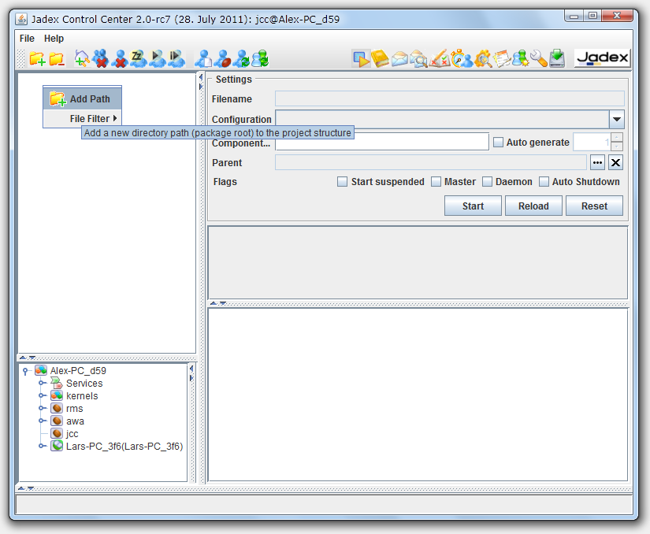
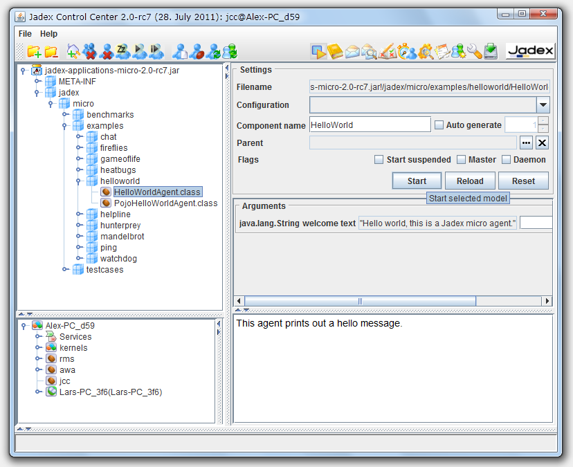

${SorryOutdatedv3}

# Introduction

The Jadex Control Center (JCC) is a management and debugging interface for the Jadex platform and the components that run on it. The JCC includes many useful development tools.

This tool guide gives an overview about the Jadex tool suite and explains how they can be used to administrate, manage, and debug your infrastructure and applications.

# Starting the Jadex Control Center

Choose one of the following sections depending on your situation:

  - Start JCC [from your own project](#from-your-own-project)
  - Start JCC [from Jadex Distribution](#from-jadex-distribution)
  - Start JCC [from Jadex Sources](#from-jadex-sources-in-eclipse)

## From your own Project

If you are already starting a Jadex Platform from inside your project (as described in [Starting a Platform](../platform/platform.md#starting-a-platform), you can just set the GUI option to true:

```java
rootConfig.setGui(true);
```

This will launch the JCC as your application starts up the Jadex Platform.

## From Jadex Distribution

If you downloaded a Jadex distribution, you can start the JCC by executing *jadex.sh* (Linux/Mac OS) or *jadex.bat* (Windows), depending on your operating system.

## From Jadex Sources in Eclipse

If you imported the Jadex Sources into your IDE, you can start the JCC from there:
Right-click on the Jadex eclipse project and choose *Run As* &gt; *Java Application* from the popup menu.
Select *Starter* from the package *jadex.base* in the appearing dialog (just type 'Starter' to find it).
Click "Run" and the Jadex Platform and JCC should start.


*Select main class for starting Jadex*

The next time you want to start the platform, you do not have to repeat the above steps. Just choose the 'Starter' entry from the run history, which eclipse generates automatically.

# Running Applications

If you managed to successfully start the Jadex platform, the [Jadex Control Center (JCC)](02%20JCC%20Overview.md) window will appear (see below).

To execute any applications you need to add the corresponding path to the JCC project.

## Adding Model Paths

If you did not use the example project or want to see some other examples, you have to [download the Jadex Distribution](https://www.activecomponents.org/#/download), unpack it and point the JCC to the JAR files containing the applications.
Right-click in the upper left area (called the model explorer, as it is used to browse for models of e.g. components, agents or processes) and choose 'Add Path'.


*Add path in JCC*

A file requester appears. Navigate to the directory, where you unpacked the Jadex distribution.
Open the *lib* directory and select the file *jadex-applications-micro-${jadexversion}.jar*.
Note that depending on your Jadex version the last part of the filename might differ in your setting.

### Selecting and Starting a Component

You can now unfold the contents of the jar file and browse to the helloworld example in the *jadex/examples* package.
After you selected the *HelloWorldAgent.class* in the tree, you can start the process by clicking 'Start'.


*Start a component*

The component will be executed, thereby printing some messages to the (eclipse) console.

Execute some other examples, e.g. 'heatbugs' or 'mandelbrot'. Many examples involve more than one component and are typically launched by selecting and starting the *.application.xml* component, which automatically starts all components of the application.

You can also load the other 'jadex-applications-*-${jadexversion}.jar' files (e.g. BDI or BPMN) and try the examples included there. These use different [component types](../component-types/component-types.md) such as BDI or BPMN.

### Saving JCC and Platform Settings

The JCC has its own way (distinct from eclipse) of loading and saving settings. The reason for this separation is to allow using Jadex without being bound to a specific IDE (like eclipse).

As you probably do not want to add the jar file again, each time you start the Jadex platform, you should save the current settings. From the 'File' menu choose 'Save Settings'. The settings will be stored in two files in the current directory. The 'jcc.settings.xml' contains GUI settings like the window position. Another '*.settings.xml' file will be created named after the host name. It contains the platform settings (e.g. included jar files). The platform and JCC settings will automatically be loaded when the platform is started the next time.

# Tool Guide Overview

- [Chapter 02 JCC Overview](02%20JCC%20Overview.md) : Getting around the Jadex Control Center (JCC) window
- [Chapter 03 Starter](03%20Starter.md) : A JCC view for starting and stopping components on the platform
- [Chapter 04 Awareness Settings](04%20Awareness%20Settings.md) : A JCC view for administering automatic platform discovery features
- [Chapter 05 Security Settings](05%20Security%20Settings.md) : A JCC view for specifying local and remote platform passwords and trusted networks
- [Chapter 06 Library Center](06%20Library%20Center.md) : A JCC view for adding and removing Java resources (i.e. Jar files or Maven artifacts)
- [Chapter 07 Deployer](07%20Deployer.md) : A JCC view for remote file system access
- [Chapter 08 Chat](08%20Chat.md) : An application that allows worldwide chatting and exchanging files with Jadex users
- [Chapter 09 Simulation Control](09%20Simulation%20Control.md) : A JCC view for switching execution between continuous and simulation clocks
- [Chapter 10 Component Viewer](10%20Component%20Viewer.md) : A JCC view for showing custom user interfaces of components and services
- [Chapter 11 Test Center](11%20Test%20Center.md) : A JCC view for executing component unit tests.
- [Chapter 12 Debugger](12%20Debugger.md) : A JCC view for inspecting components and step-wise component execution
- [Chapter 13 Cli Email Signer](13%20Cli%20Email%20Signer.md) : A JCC view for inspecting components and step-wise component execution
- [Chapter 14 Relay Server](14%20Relay%20Server.md) : A rendezvous server for cross-network platform discovery and communication
- [Chapter 15 ADF Checker](15%20ADF%20Checker.md) : An eclipse plugin for consistency checking of component descriptions

Legacy tools that are still supported but whose applicability is partially reduced due to the new active component approach:

- [Chapter A1 Conversation Center](A1%20Conversation%20Center.md) : A JCC view for manual sending and receiving of component messages
- [Chapter A2 Communication Analyzer](A2%20Communication%20Analyzer.md) : A JCC view for monitoring message exchange between components
- [Chapter A3 Directory Facilitator](A3%20Directory%20Facilitator.md) : A JCC view for old-fashioned service registrations
