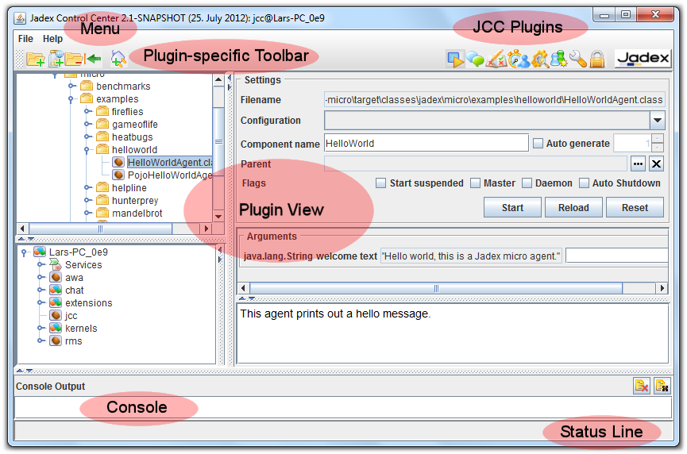
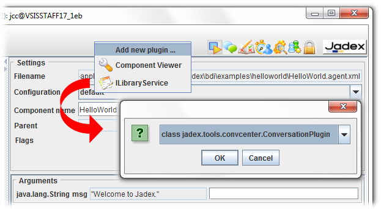

# Jadex Control Center Overview

  
*JCC Overview*

The Jadex Control Center (JCC) is the heart of most Swing based runtime tools. The JCC itself uses an extensible plugin-based mechanism to offer differnt functionalties to the user. As can be seen in the screenshot above it consists of different areas that are explained in the following:

**Menu:** In the menu general settings as well as plugin-specific ones can be found, i.e. the menu may change when the plugin view is changed. The general menu has a 'File' and a 'Help' section. In the first the platform and user interface settings can be saved or restored. Furthermore, in the help section a link to the Jadex online documentation can be found.

**Toolbar:** Similar to the menu also the toolbar consists of a plugin-specific (left-hand side) and a general part (right-hand side). The general part consists of icons for all currently loaded pluging. By clicking on another icon the corresponsing plugin will be activated and show in the lower area. By right clicking on a free space in the toolbar a popup menu can be activated that allows for adding new plugins at runtime. A plugin chooser allows for selecting the plugin to load. After successful initialization a new icon will be shown for the plugin at the right hand side of the toolbar. In addition to adding new pluging, also existing ones can be hidden or their ordering in the toolbar can be changed. For this purpose rightclick on a plugin icon. A popup menu will appear that allows you to move the icon to the left or right or hide it completely. Hidden plugins can be made visible again just by right clicking on a free space in the toolbar and selecting the hidden tool in the popup menu.

Adding a tool plugin via popup menu on toolbar

**Plugin**: The main plugin view in the middle of the JCC show the user interface of the currently selected plugin. 

**Console**: The console can be used to display the Java System.out and System.err streams of the platform. Especially, when adminstrating remote platforms it can be used to make visible the print outs of the otherwise inaccessible streams.

**Status line**: The status line is used by the plugins and the JCC itself to announce recent events to the user. The messages will be displayed for several seconds and vanish automatically. In additiona, on the right hand side of the status line current  processing activities may be visualized.

Overview of Plugins
--------------------------------

: The **starter plugin** for starting and stopping applications and components.\
: The **awareness plugin** that can be used to configure awareness options such as in- or excluded nodes.\
: The **security plugin** allows for configuring platform security settings.\
: The **library plugin** can be used to add custom resources (jars or directories) to the Java classpath.\
: The **deloyer plugin** is similar to a ftp tool and can be used to transfer files from/to other platforms.\
: The **chat plugin** can be used to chat with users from other platforms.\
: With the **simulation plugin** the execution mode and time progress can be controlled.\
: The **component viewer** can be used to view components and services that expose user interfaces.\
: The **test center** is a front end for executing junit like component based test cases.\
: The **debugger** allows for executing components is step mode and inspecting their state.\
: The **conversation center** can be used to manually send messages to specific components.\
: The **communication analyzer** is helpful for tracking message based communication between components.\
 (deprecated): The **directory facilitator GUI** can be used to inspect the state of the DF and manually add or remove subscriptions.
