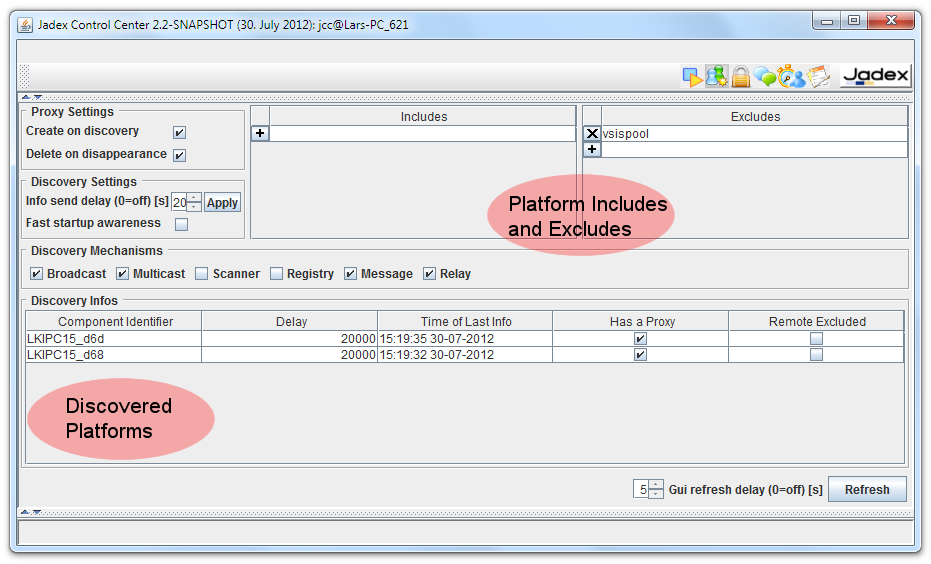

# Awareness Settings

Awareness is the mechanism used in Jadex to automatically discover other platforms. The awareness settings allow for customizing how awareness is realized and which other platforms one wants to ignore. The general mechanism how awareness works is described in the corresponding [tool guide chapter](../../../guides/ac/07%20Platform%20Awareness) . The main idea is to represent remote platforms as local components (called proxy components). Thus, for the platform there is no specific mechanism to search for remote services. Instead these remote services are discovered automatically if a proxy component of that platform exists locally and the search reaches the proxy. The awareness component automatically creates platform proxy components if it is notified by one of its awareness mechanisms that such a platform exists. Hence, platforms participating in awareness regularily send awareness infos over the network. These infos include the sender id of the platform as well as a lease time that tells the receiver the validity of the received packet. If this time passes by and the lease has not been renewed by the platform the proxy wil be automatically deleted (assuming some buffer time).

The awareness settings contain the following sections: **Proxy Settings**, **Discovery Settings**, **Discovery Mechanisms**, **Includes and Excludes**, and **Discovery Infos**. The meaning of these settings is explained in the following.

Proxy Settings
---------------------------

The proxy settings determine how the awareness management component should behave when new information becomes available. Using **create on discovery **one can control if a new proxy component should be created in case a new platform was discovered. If this feature is turned off, no new proxies will be generated any more. The **delete on disappearance **option can be used to determine if proxies are automatically deleted when contact to the remote platform has been lost.

Discovery Settings
-------------------------------

The discovery settings allow for changing the announcement properties of the own platform. The **info send delay** can be used to specify the delay between platform announcements sent by the active awareness mechanisms (in seconds). The delay defined here will be set in all running awareness mechanisms. The **fast startup awareness **option can be used to turn on / off a specific protocol on platform startup. If fast awareness is on, the platform will initiate an immediate awareness discovery to find other platforms as fast as possible.

Discovery Mechanisms
---------------------------------

Discovery of other Jadex platforms is difficult to achieve as it depends on details of the network configuration, e.g. if multicast is allowed in a local network. In order to provide a robust discovery experience for Jadex applications, multiple awareness mechanisms may work concurrently in order to discover as much as possible from the surrounding environment. In general, Jadex supports two kinds of techniques: a) local mechanisms that work only in LANs and b) global mechanisms which allow for Internet scale discovery. To the first category belong *broadcast*, *multicast*, and *scanner* and to the latter belong *registry*, *message* and *relay*. Details about the mechanisms can be found in the [awareness chapter of user guide.](../../../guides/ac/07%20Platform%20Awareness) The checkboxes can be used observe which mechanisms are activated and can additionally be used to turn them on or off.

Includes and Excludes
----------------------------------

The includes and excludes list allow for customizing the general awareness behavior in the context of specific platforms. Adding a platform name to the **exclude list** results in ignoring all discovered platforms that *start with a string* of a exclude list entry. E.g. if 'otago' is put to the exclude list and 'otago' or 'otagoBa16' is discovered, neither for the first nor for the second entry a proxy will be created. Instead of the logical platform name also IP addresses of hosts can be added to the exclude list. In this case all platforms that have a transport address containing the banned IP will be irgnored. On the other hand using the** include list**, one can define platform names and IP adresses for which proxy creation is allowed, i.e. if the include list is not empty and a newly discovered platform name or IP is not present in the inlude list, no proxy will be created. In this respect the exclude list is a blacklist and the include list a whitelist mechanism. If you combine both lists, a newly discovered entry has to satisfy both, i.e. must be contained in the include list and must not be contained in the exclude list to not being ignored.

Discovery Infos
----------------------------

The table of discovery infos contains all currently valid awareness infos received from other platforms. The table shows for each entry the **component identifier **of the platform that sent the awareness info, its **delay** in sending awareness infos, the **local time of the last received info** from that source and additionally, if a **proxy is available** for the platform and if it is **remote excluded**. In the screenshot it can be seen that a platform with id 'LKIPC15\_d6d' sends awareness infos every 20 seconds. The last info was received at 15:19:35 on 30-07-2012 and it current has a proxy and is not excluded.
