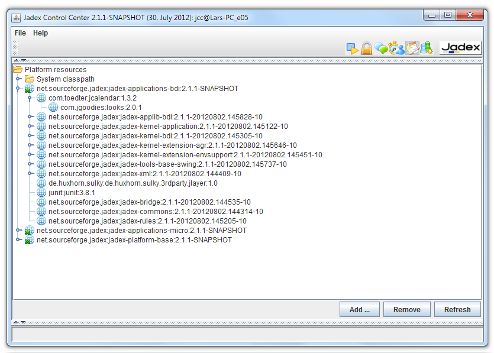
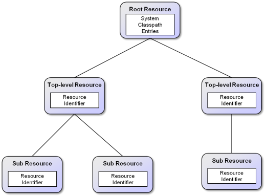

# Library Center

*Library center screenshot*

The library center presents a deployment oriented resource view of the platform. Platform resources are organized in a resource tree. The meaning is that a resource with child resources depends on those childs resources and needs them for execution. Internally, resources correspod to Java classloaders (each resource is represented by exactly one classloader) so that the hierarchy also shows how resource fetching is performed. The library center can be used to inspect the current deployment setting and also allows for adding or removing resources at aribrary levels within the resource tree. In order to understand better the concrete setup of the resource tree a conceptual model is shown below.

*Resource tree*

The root of the resource tree contains basic system resources directly as classpath entries and all further resources via dependencies to subresources. It can be seen that each resource is described via a resource identifier (RID), which has the purpose to uniquely identify a resource.Resource identifiers come in two flavors. Global resource identifiers use a globally unique id represented by a maven artifact id to identify a resource. Local resource identifiers use a local URL to refer to a file representing the resource. Global resource identifiers are automatically resolved at runtime to a concrete local path to the resource and are hence enriched with a local resource identifier.

*Note:* Maven dependency support is part of the Jadex Pro version.

Basically, two options for modifying resources are available to modify the resource tree, which are described in the following.

Adding/Removing System Level Classpath Entries
-----------------------------------------------------------

Changing the global classpath allows for adding resources to all resource on the platform, i.e. a new resource is visible to all top-level and subresources. A system level classpath entry can be added by activating the popup menu 'Add path' option on the 'System classpath' node (as shown below). To remove a classpath entry the 'System classpath'  node needs to be opened and the corresponding child has be selected and removed via 'Remove Path' from the popup menu. Please note that only manually added entries can be removed (indicated by the small ). Furthermore, removal of system classpath entry will take effect only after a restart of the platform.

*Adding a system level classpath entry*

Adding/Removing Resources in the Resource Tree
-----------------------------------------------------------

A new resource can be added to the resource tree by choosing the 'Add Path' or 'Add RID' action from the popup menu of a tree resource or by choosing the 'Add' button from the bottom of the panel. If no node in the tree is selected while pressing the 'Add' button, new resources will be added as top-level resources. The difference between the 'Add Path' and 'Add RID' actions is that the first adds a local path, while the latter adds a maven artifact id. Please note that a resource is a deployment artifact that can be referenced at multiple places within the tree. If you change a resource by adding or removing a resource all usages will automatically see this change. A resource can be removed by activating the 'Remove Path' option from its resource identifier node (see screenshot below).

