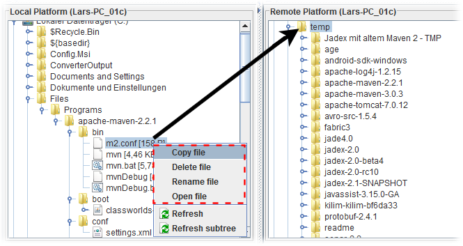

# Deployer

The deployer tool can be used to transfer files between computers. In this sense it is very similar to a typical ftp tool but it could be convenient to use the Jadex deployer tool for the following reasons:

- Can be used to transfer files between arbitrary hosts within your Jadex network, i.e. given you are on host a you can transfer A to B or vice versa but you can also transfer files between B and C.
- The deployer tool allows for transferring files between hosts that do not have a direct TCP connection as it relies on the Jadex platform transport mechanisms, i.e. it can use a relay server to bridge differnt unconnected networks.
- The deployer will automatically try to find the most efficient connection to the target and will also tolerate if one (of several available connections) to the target dimishes.
- There is no need to install further software on the hosts with the platform, i.e. no server and/or client.

Transferring Files
-------------------------------

Select the hosts you want to use by choosing the corresponding Jadex platforms (more concisely deployer services) from the Instance Settings panel. The Instance Settings panel can be made visible by clicking in the left upper area the arrow button (see screenshot above). Having expanded the panel the instance can be selected via the choice box. To discover new remote hosts, click the Remote checkbox and then the Refresh button. The discovered platforms will be added to the choice box. By selecting a new instance the tree view below will show the file system of the corresponding host.

Copying a file can be achieved in two ways. The first option is to select the source file that should be transferred and either use drag and dop to pull it directly to the target folder on the other side. The second option is not based on drag & drop. Instead, first the target folder has to be selected and then the source file has to be chosen. To start the copy process the Copy file action from the popup menu has to be used as shown in the screenshot above.

Further Commands
-----------------------------

In addition to copying files between hosts, the deployer also allows for renaming, deleting and opening files. In order to initiate such actions, select a file in the file tree and choose it from the popup menu.
