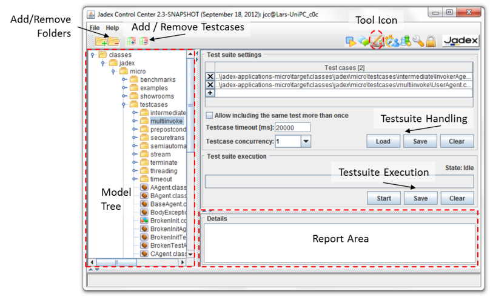
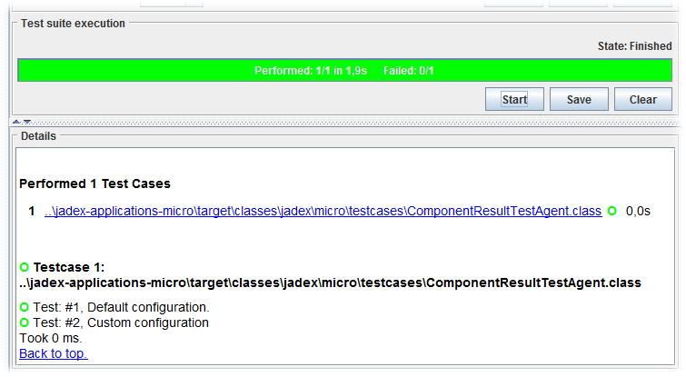

# Test Center

The test center can be used to execute component unit tests within test suites. Therefore, the tool is very similar to the well known visual [JUnit](http://www.junit.org/)  test environment. The test center mainly consists of three areas (cf. screenshot above). A model tree on the left, a test suite view on the upper right and a test suite report on the lower right. The general scheme the tool is used consists of the following steps:

1.  Select the folders in which your tests reside.
2.  Select the test cases and add them to the current test suite.
3.  Execute the test suite and inspect the test report.

To include the source folders of the test cases the add folder action  on the model tree can be used (either via the tool bar or via the popup menu). Given that you have included the folders you can now navigate to the folder or file you want to include as test case(s) by selecting the element and afterwards choosing the add testcases action . If the component is a testcase (determined by the fact that it declares a specific return value of type *jadex.base.test.Testcase*), it will appear within the Test Suite Settings panel on the right. Please note that each test case can be included in the test suite only once, because this is a sensible default behavior often desired. If an application case demands including a test case more than once, this can be done by first activating the 'Allow including the same test more than once' checkbox and then adding the component as often as needed. The current test suite can be stored on disk by using the Save button in the 'Testsuite Handling' area. It will allow you to choose a filename and save the current settings. Such a stored test suite can be fetched from disk by using the corresponding Load buttun.

Before a test suite is executed, some execution preferences can be changed if necessary. On the one hand the **test case timeout** can be used to alter the maximum waiting time for a single test case. On the other hand the **test case concurrency** determines the degree of test cases that are started at the same point in time. This means that the testcase executor can start n test cases without having to wait for a finish signal, i.e. n=1 means a sequential execution is performed, whereas n=5 means that at most five test cases can be run in parallel. If n=all the test case executor will simply start all test cases at the same time leading to maximum concurrency. To initiate the test case execution the Start button can be used. Once, the test suite is executing, the Start button will be renamed to an Abort button that stops test suite execution. 

During test suite execution, the progress is shown with a progress bar that remains green as long as none of the test cases of the suite has failed so far (cf screenshot above). Within the progress bar it is displayed how many test cases already have been performed, how many test cases are in the suite and how long the execution took. In the lower right area the test results are presented as report. The test report consists of an overview area on the top with links to all performed test cases and a details section in which the tests are shown with description and possible the concrete failure reasons. Using the Save button within the Testcase Execution area allows for storing the current report as html file.
