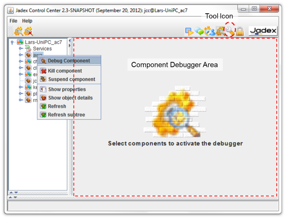
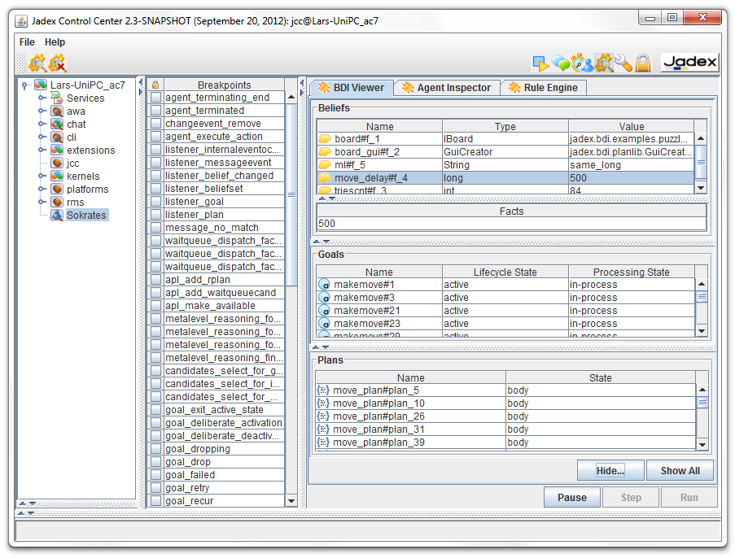
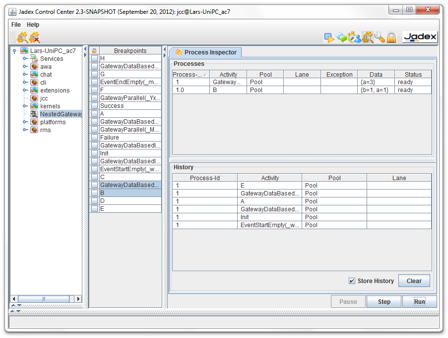
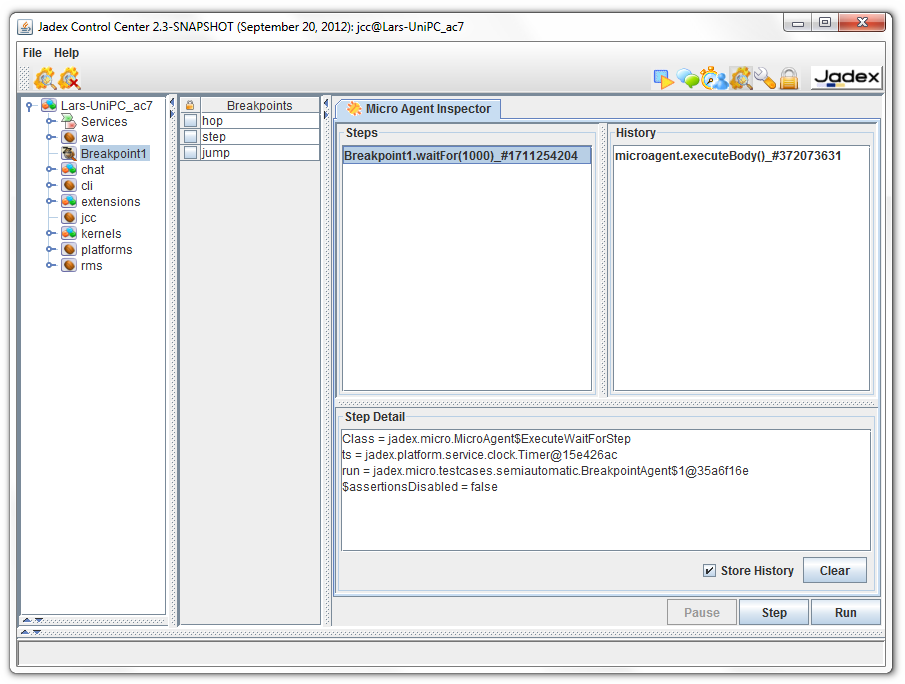

# Debugger



*Debugger screenshot*

The Debugger can be used to inspect components during execution. The Debugger view (as shown in the screenshot above) consists of a tree view at the left and a Component Debugger Area on the right. The tree view shows all currently running components of the platform and can be used to select a component to debug. For this purpose a component can be either double clicked, or the Debug Component action can be chosen via popup menu or from the toolbar. Having selected a component the debugger view will be opened at the right hand side of the window. It has to be noted that the concrete debugger view depends on the component type being inspected, i.e. a BPMN process has a completely different debugger compared to a BDI agent. Thus in the following the available component specific debuggers will be presented.

BDI Agent Debugger
-------------------------------



*BDI Debugger screenshot*

The BDI debugger offers four different views:

-   **BDI Viewer:** The BDI Viewer shows the beliefs, plans and goals of an agent in the corresponding section. By clicking at a belief or belief set its current value is displayed in the Facts area below. Furthermore, the goal and plan views show the goal and plan instances of the agent and their current state.
-   **Agent Inspector:** In the agent inspector the state of the agent can be inspected according to its internal composition. In this tree view more details can be seen about the agent's beliefs, plans, and goals, yet the view is also more diffucult to interpret as one has to navigate along the agent structure to get to the elements.
-   **Rule Engine:** The rule engine is also a rather internal view that shows which rules make up the behavior of the agent. In addition, the rule engine view contains a visual representation of the rules of the agent as [Rete](http://en.wikipedia.org/wiki/Rete_algorithm)  network.
-   **Breakpoints:** For a BDI agent in the breakpoints view all rules of the agent are listed, i.e. by selecting a rule the interpreter automatically stops just before a rule of the given type gets executed.  One can use the Step, or Run buttons to continue processing.

BPMN Process Debugger
==================================



The BPMN process debugger comprises three views:

-   **Process threads:** In Jadex, parallel execution within one BPMN workflow are described with (virtual) process threads. A process thread is characterized by the current program counter (the BPMN activity or element that gets executed next) and its own state (variable values within this thread) and execution state (if it is waiting or ready). Concretly the following properties are shown:
    - Process id: The unique id of the process thread.
    - Activity, Pool, Lane: The activity the thread wants to execute and the location of that activity with respect to the pools and lanes.
    - Exception: The exception instance if one has occurred during execution of the process thread.
    - Data: A map containing the specific variable values as name, value pairs.
    - Status: The current state of the thread. If it is ready the next step can be executed if it is waiting some conditional has to be met before execution can continue.
-   **History of steps: **In the history the executed steps and their association to the process thread that executed them are shown.
-   **Breakpoints: **In the breakpoint list of BPMN process all its activities, gateways and events are showns.** **By selecting such an element and executing the process the debugger will suspend execution until such an element is reached.

Micro Agent Debugger
=================================



()* annotation. Additionally, a method has to be implemented that checks if a specific breakpoint has been reached. When implementing a pojo micro agent the @AgentBreakpoint annotation can be used, otherwise the method should override 
```java
public boolean isAtBreakpoint(String[] breakpoints)
```
See *jadex.micro.testcases.semiautomatic.BeakpointAgent *and *PojoBreakpointAgent* for example code.

**Note:** Currently, the XML component types 'component' and 'application' do not posses a dedicated debugger. Instead, if a component of such a type is selected for debugging an Object Inspector view will be shown. This view displays the object structure of the underlying component and can be used to get information about the current state of the object.

**Note:** Jadex component debuggers are not meant to replace other existing debugging tools. In contrast, in many cases it is beneficial to combine traditional object oriented debuggers (like the eclipse debugger) with the more high-level component debuggers in order to find reasons for errors in the code.
