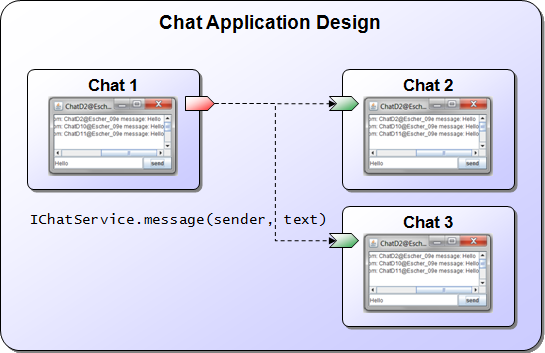

# Introduction

**Outdated Documentation**: This page is yet to be updated to the latest Jadex version. The documentation is still valid and the explanations still apply. Yet, due to some API changes, not all code examples in this document may be used as such. When in doubt, check the example sources in the *applications* modules available on GitHub, e.g. for [Micro](https://github.com/actoron/jadex/tree/master/applications/micro/src/main/java/jadex/micro) and [BDI](https://github.com/actoron/jadex/tree/master/applications/bdiv3/src/main/java/jadex/bdiv3) agents.

This tutorial provides step-by-step instructions to learn how to use the Jadex Active Components concept for developing applications. You will learn how to compose systems from components.

The following topics are covered in the upcoming chapters:

- [Chapter 03 Active Components](03%20Active%20Components.md)  illustrates how to program simple components.
- [Chapter 04 Required Services](04%20Required%20Services.md)  describes how to fetch and use services of other components.
- [Chapter 05 Provided Services](05%20Provided%20Services.md)  explains how to equip a component with services.
- [Chapter 06 Composition](06%20Composition.md)  describes how to compose a component from subcomponents.
- [Chapter 07 External Access](07%20External%20Access.md)  describes how to attach tightly coupled functionality, e.g. for GUIs.

# Application Context

In this tutorial a simple chat application will be implemented. The chat application can be used to send messages to other users. This base functionality will be extended in the different exercises, but it is not our goal to build up a solution that combines all the extensions, because this would lead to difficulties concerning the complexity of the application. Instead this tutorial will concentrate on setting up simple components that explain the Jadex concepts step by step.

*Conceptual design of the Chat application*

The figure above shows the conceptual design of the chat application. On different computers, so called 'Chat' components are running, each of which provides a graphical interface to a local user. When a user enters a new chat message (e.g. in 'Chat 1'), the message gets forwarded to all chat components in the network (e.g. 'Chat 2' and 'Chat 3).

We will come back to this design in [05 Provided Services](05%20Provided%20Services.md), where we put all the pieces together that allow us building an initial working version of this chat application.

# Prerequisites

Before you can start with this tutorial, please follow the steps in our [Getting Started](../../getting-started/getting-started.md#ide-setup) section to setup your IDE.
