# Installation

In this chapter, you will learn how to install eclipse for developing with Jadex. Therefore, you will find instructions on setting up a proper eclipse working environment for programming and executing Jadex applications. If you use a different IDE the instructions and screenshots below should still be helpful for setting up your IDE accordingly.

Note that this tutorial is not a replacement for the existing eclipse documentation. If you have questions about using eclipse try also looking for an answer at the [http://www.eclipse.org/documentation/](http://www.eclipse.org/documentation/)  site.


## Prerequisites

-   Download and install a recent Java environment from [http://www.oracle.com/technetwork/java/javase/downloads/](http://www.oracle.com/technetwork/java/javase/downloads/) (if not already present).
-   Download and install a suitable eclipse distribution (&gt;= 3.5) from [http://www.eclipse.org/downloads/](http://www.eclipse.org/downloads/)  (if not already present). The following has been tested with the 'Eclipse IDE for Java EE Developers' package.
-   *(Standard setup: A1-A3)* Download the latest Jadex distribution .zip from [https://www.activecomponents.org/index.html#/download](https://www.activecomponents.org/index.html#/download)  and unpack it to a place of your choice.
-   *(Alternative setup: A4)* Download the jadex-example-project.zip from [https://www.activecomponents.org/index.html#/download](https://www.activecomponents.org/index.html#/download)  and unpack it to a place of your choice.

Before starting with the exercises, you need to decide if you'd like to use the standard setup as described in exercises A1-A3 or the alternative setup with the Maven build tool as described in exercise A4. For inexperienced users, it is recommended to follow the standard setup, were most steps are performed manually and are thus explained in the exercises. 

## Exercise A1 - Eclipse Environment Setup

In this lesson you will set up an initial eclipse environment that will be used in the following lessions. Please follow the instructions carefully and compare your setup to the screenshots to verify that everything went fine. The steps below describe how to develop Jadex applications with a basic eclipse installation. For advanced users it may be more convenient to use eclipse (or another IDE) in conjunction with [Maven](http://maven.apache.org/) . In the Jadex distribution, there is a 'jadex-example-project.zip' that conatins a basic Maven project for Jadex including a 'readme.txt' with the alternative setup instructions.

Start eclipse. Start the 'New Java Project' wizard, disable the 'Use default location' checkbox and browse to the directory, where you unpacked the Jadex distribution. Note that the name of the directory might slightly differ due to changing Jadex version numbers.

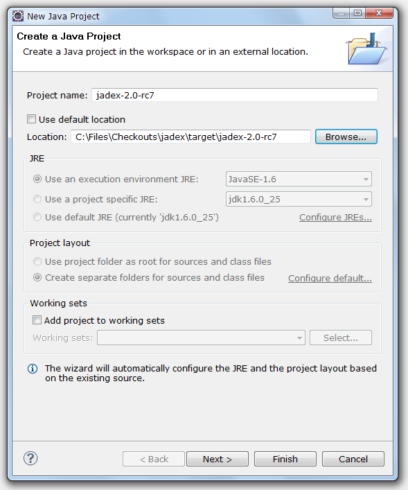  
*Create Java project in eclipse*

Click 'Finish' - the project will be created. Your project should now look like the picture below. 

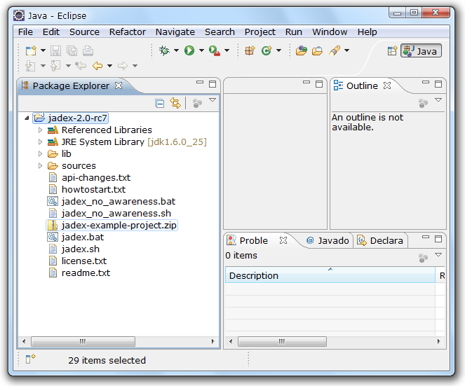  
*Final Jadex eclipse project layout*

Note that depending on your eclipse configuration, the 'Referenced Libraries' node might by hidden and instead the jars from the lib folder will be displayed as direct child of the project. If you wish, you can change the appearence in the explorer menu by (de)selecting the "Show 'Referenced Libraries' Node" checkbox.

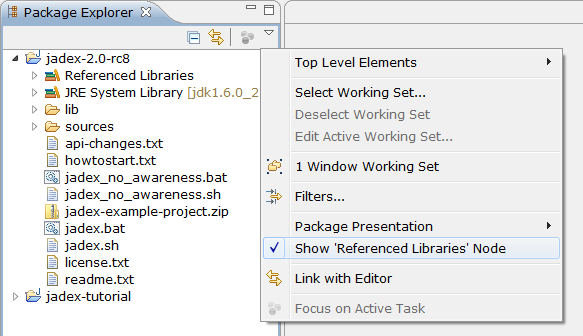  
*Show/hide the 'Referenced Libraries' node*

This project will be used as a basis for your own development projects. To make the Jadex libraries accessible to other projects it is necessary in eclipse to export them. Right-click on the project, choose 'Build Path -&gt; Configure Build Path...'. Go to the 'Order and Export' tab, choose 'Select All' and hit 'OK'.

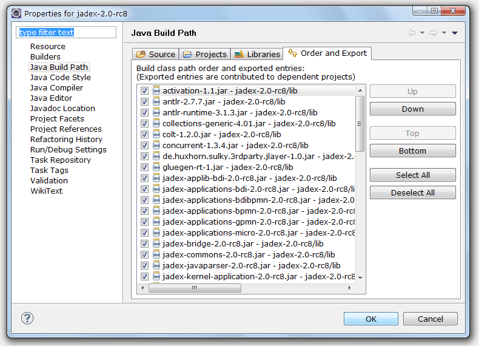  
*Export jars from build path*

For further simplifying later development, you should attach the sources to the Jadex jars, as this will enable eclipse to provide better context sensitive help on method signatures, etc. Open the 'Referenced Libraries' node (if shown) and the 'jadex-applications-micro-2.0-rc7.jar'. In the 'jadex.micro.examples.helloworld' package double click on the 'HelloWorldAgent.class' file. The file will be opened, showing the reverse engineered byte code. Click the 'Attach Source...' button, choose 'Workspace...' and select the 'sources.zip' file contained in the Jadex project. Click 'OK'. The Java source of the hello world agent should now be displayed. Repeat these steps for the other Jadex jars. It is recommended for this tutorial to add the sources at least to the 'jadex-bridge', 'jadex-commons', 'jadex-kernel-micro' jars.

## Exercise A2 - Running Example Applications

In this lesson we will create a launch configuration to start the Jadex platform. To see that everything works, we will execute some example applications that are distributed with the Jadex package.

### Eclipse Launch Configuration

As we imported the Jadex distribution in lesson A1, we are almost ready to go. Right-click on the Jadex eclipse project and choose 'Run As' &gt; 'Java Application' from the popup menu. Eclipse will search for main types, i.e. startable Java classes (with a *main()* method). Select *Starter* from the package *jadex.base* in the appearing dialog (just entering an 's' will probably be enough to find the starter class easily in the list).

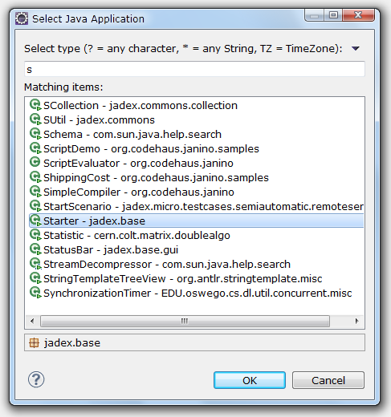  
*Select main class for starting Jadex*


Hit 'Ok' to start the Jadex platform. The next time you want to start the platform, you do not have to repeat the above steps. Just choose the 'Starter' entry from the run history, which eclipse generates automatically.

### Selecting and Starting a Component

If you managed to successfully start the Jadex platform, the Jadex control center (JCC) window will appear (see below).
The JCC is a management and debugging interface for the Jadex platform and the components that run on it.
The JCC has its own way (distinct from eclipse) of loading and saving settings. The reason for this separation is to allow using Jadex without being bound to a specific IDE (like eclipse).

To execute any applications you need to add the corresponding path to the JCC project. We will now set up the platform for starting some examples. Right-click in the upper left area (called the model explorer, as it is used to browse for models of e.g. processes) and choose 'Add Path'.

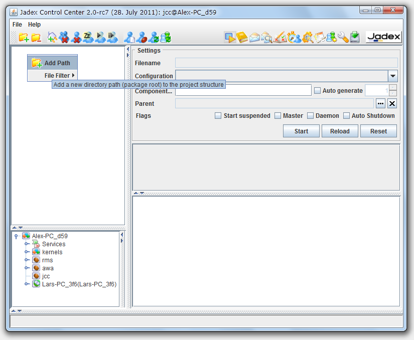  
*Add path in JCC*

A file requester appears that should initially present the directory, where you unpacked the Jadex distribution. Open the *lib* directory and select the file *jadex-applications-micro-2.0-rc7.jar*. Note that depending on your Jadex version the '2.0-rc7' part might slightly differ in your setting. You can now unfold the contents of the jar file and browse to the helloworld example in the *jadex/examples* package. After you selected the *HelloWorldAgent.class* in the tree, you can start the process by clicking 'Start'.

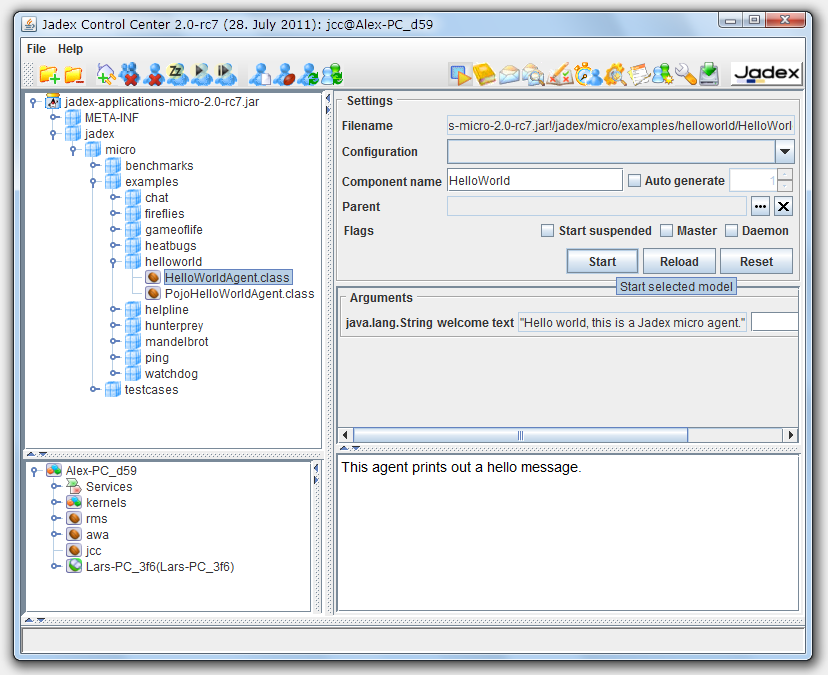  
*Start a component*


The component will be executed, thereby printing some messages to the (eclipse) console.

### Saving JCC and Platform Settings

As you probably do not want to add the jar file again, each time you start the Jadex platform, you should save the current settings. From the 'File' menu choose 'Save Settings'. The settings will be stored in two files in the current directory. The 'jcc.settings.xml' contains GUI settings like the window position. Another '*.settings.xml' file will be created named after the host name. It contains the platform settings (e.g. included jar files). The platform and JCC settings will automatically be loaded when the platform is started the next time.

### Execute Example Applications

Execute some other examples, e.g. 'heatbugs' or 'mandelbrot'. Many examples involve more than one component and are typically launched by selecting and starting the '*.application.xml' component, which automatically starts all components of the application.

You can also load the other 'jadex-applications-*-2.0-rc7.jar' files (e.g. BDI or BPMN) and try the examples included there. These types of components are described in separate tutorials. This tutorial limits itself to XML components and Java-based Micro agents for simplicity.


## Exercise A3 - Development Project Setup

In this lesson you will set up your own an eclipse project for all the files that you create in this tutorial.

### Eclipse Project Setup

Create a new Java project in eclipse. Choose a name as you like (e.g. 'tutorial'). Create a Java package in this project. The following examples use 'tutorial' as a package name. You can find sample solution files in the Jadex distribution in the *jadex.micro.tutorial* package.

Add a reference to the project with the Jadex distribution. To do so, right-click on the tutorial project and select 'Build Path -&gt; Configure Build Path...'. In the 'Projects' tab click 'Add...', check the 'jadex-2.0-rc7' checkbox and hit 'OK'. Close the build path window by hitting 'OK' again.

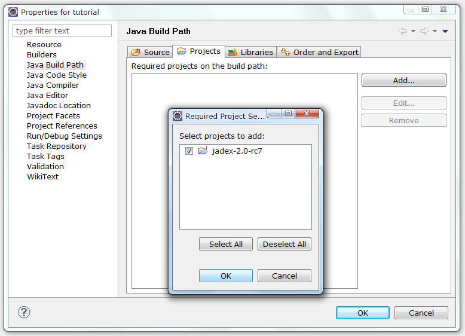  
*Add project dependency*

Now change the launch configuration to start from the newly created project. Therefore, choose the 'Run -&gt; Run Configurations...' menu. Right-click the 'Starter' configuration and choose 'Duplicate'. Change 'Starter (1)' to a more telling name of your choice (e.g. 'Start Jadex Tutorial Platform'). In the 'Main' tab select 'Browse...' besides the project textfield and choose your 'tutorial' project. Select 'Run' to save the launch configuration and start the platform.

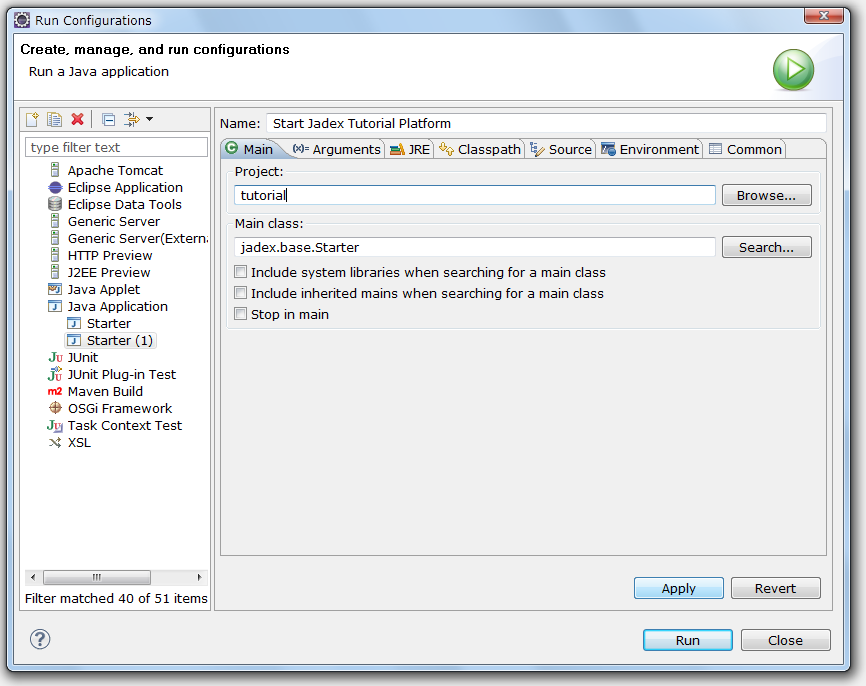  
*Create Jadex launch configuration in eclipse*

### Jadex Setup

When starting the Jadex platform using your tutorial launch configuration, the JCC window will appear with the settings belonging to the tutorial project (i.e. nothing yet). Right-click in the model explorer and choose 'Add Path'. Browse to your eclipse workspace and select the 'bin' folder from the eclipse project that you created in the beginning of this lesson. When you unfold the contents, you should find the package(s) that you created. Save the settings. When you refresh the project content in eclipse, you should see the settings files appearing in the package explorer. The following screenshot shows how your setup should look like in eclipse (left) and in the JCC (right).

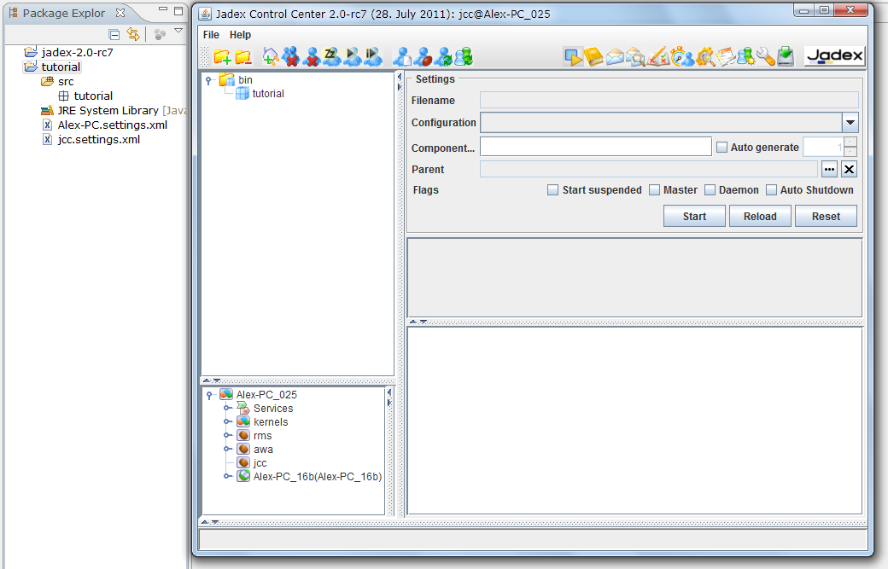

*Layout of Jadex tutorial project*

You are now ready to implement and execute your own components in Jadex. The following exercise represents an alternative installation process using Maven, which is optional and can be skipped. The next chapter will introduce the active components concept in more detail and show how simple components are built in XML or Java.

## Exercise A4 - Alternative Project Setup Using Maven


This exercise describes an alternative way of setting up a Jadex project for development in eclipse using the [Maven](http://maven.apache.org)  build tool. The exercise replaces all steps from the previous exercises (A1-A3). It does not require prior knowledge of Maven for initial setup, but you should be willing to learn about using Maven later, when you need to do custom changes to the project setup. Furthermore, if you just started using Jadex then you should read A2 and A3 as well, as these exercises contain helpful usage information.

### Prerequisites

-   Download the jadex-example-project.zip from [https://www.activecomponents.org/index.html#/download](https://www.activecomponents.org/index.html#/download)  and unpack it to a place of your choice.
<!--TODO: outdated-->

### Installing the M2Eclipse plugin

-   Select "Help -&gt; Install New Software..." from the menu.
-   Enter the plugin URL [http://download.eclipse.org/technology/m2e/releases](http://download.eclipse.org/technology/m2e/releases)  (for newer eclipse versions, the Maven plugin is available from the default, e.g. Juno, eclipse update site)
-   Select "Maven Integration for Eclipse" and install the plugin.

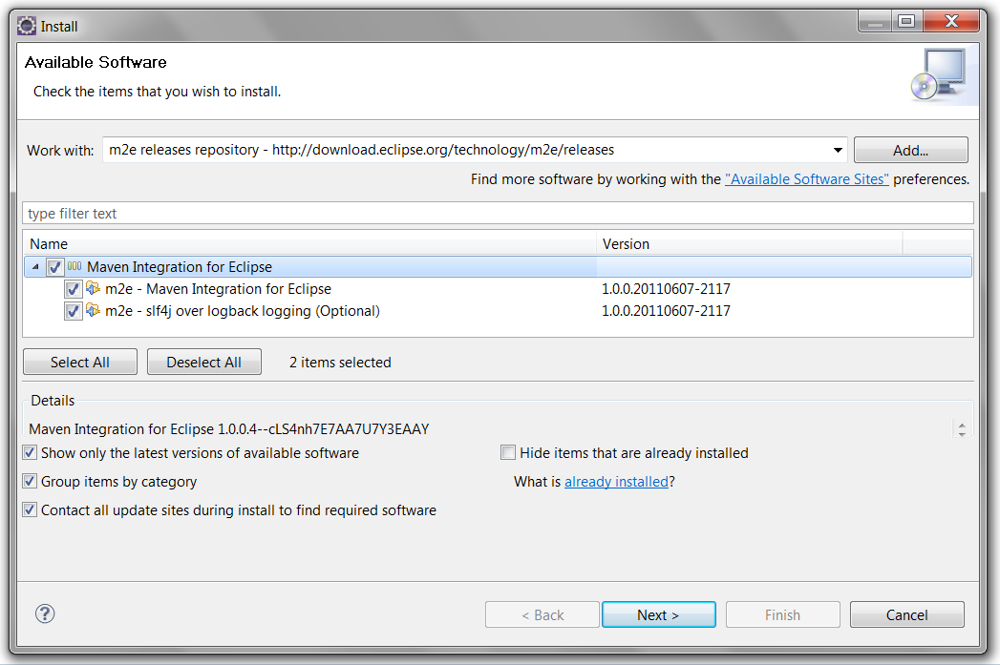  
*Install the m2eclipse plugin*


### Importing the Jadex example project

-   Use "File -&gt; Import -&gt; Maven / Existing Maven Projects" and choose "Next".

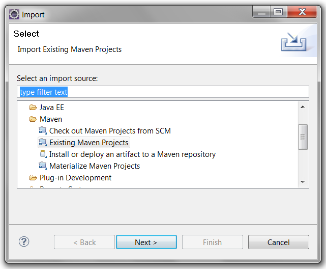  
*Import maven project (1)*

-   "Browse..." to the directory where you unzipped the jadex-example-project.zip. Maven will detect the project, which is described in the 'pom.xml' file.

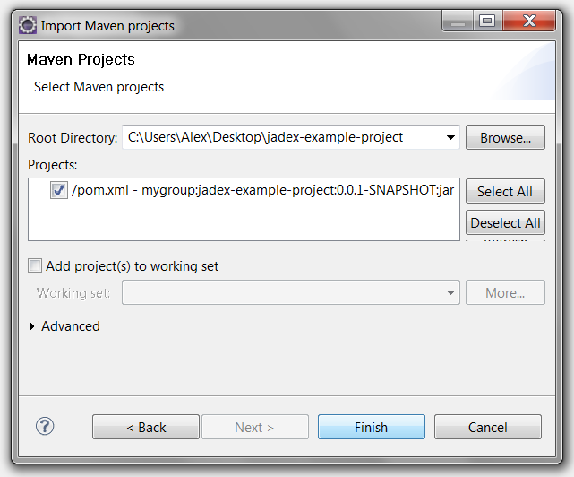  
*Import maven project (2)*

-   Click "Finish". Maven will import the project and start the build process thereby download the necessary Jadex libraries from the web.

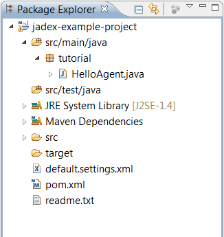  
*Imported example project in eclipse*


### Starting the Jadex platform

-   Right-click on the imported project and choose "Run As" -&gt; "Java Application". Select the 'Starter' class from package 'jadex.base'. Click "Run" and the Jadex platform should start.
-   In the JCC, the 'HelloAgent' should be already selected. Click "Start" to start the agent and check the console for the output "Hello world!". (cf. Exercise A2)
-   Eclipse remembers the launch configuration. Therefore in the future, you can simply select the "Starter" configuration from the run history to start the platform.

You are now ready to continue with the tutorial. If you later wish to setup your own project you can unzip the jadex-example-project.zip again to a different location. Change the following line by replacing 'jadex-example-project' with a project name of your choice. Afterwards import the project in eclipse as described above.

```xml
<artifactId>jadex-example-project</artifactId>
```

