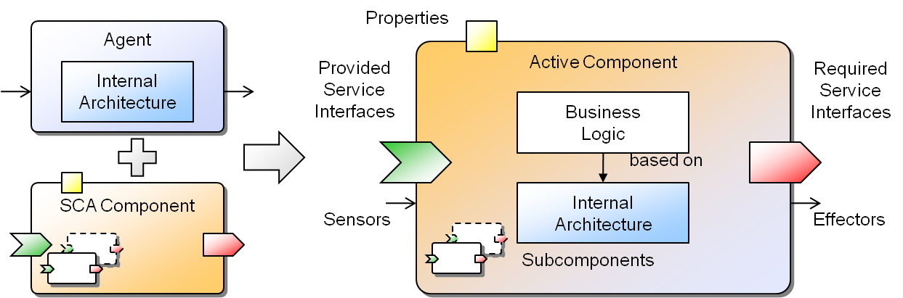

# Active Components

The active component approach brings together agents, services and components in order to build a worldview that is helpful for modelling and programming various classes of distributed systems. 
Services and components have been combined before in the *service component architecture* ([SCA](http://www.osoa.org/display/Main/Service+Component+Architecture+Home))* by introducing components that communicate via services.
 
Active components build on SCA and extend it in the direction of software agents. The general idea is to transform passive SCA components into autonomously acting service providers and consumers in order to better reflect real world scenarios which are composed of various active stakeholders.
 In the figure below an overview of the synthesis of SCA and agents to active components is shown.

  
*Active Component Structure*

You can read more about this in the [Active Components User Guide](../../../guides/ac/02 Active Components)).

# Exercise B1 - Java Component Definition
There are various Jadex active component types such as applications, BPMN workflows, micro and BDI agents (learn more about [component types](../../../component-types/component-types/))).
Micro (and BDIV3) agents are defined using plain Java objects that are enhanced by annotations:

```java
package tutorial;

/**
 *  Chat micro agent. 
 */
@Description("This agent offers a chat service.")
@Agent
public class ChatB1Agent
{
}
```

*Basic chat micro agent definition*

Use your IDE to create a Java class called *ChatB1Agent.java* and add the annotations as shown in the figure above. 
In this case the component only posses a description that will be displayed in the [JCC](../../../tools/01 Introduction) (if used)) and the marker annotation *@Agent*. 

Please further note that it is also required to follow a **naming convention** which requires that all micro agent files end with *Agent.java*. 

## Start your first Active Component

The easiest way to start your component is to create a class *Main* with a main method that starts up a Jadex Platform together with your agent:
```java
public class Main {
    public static void main(String[] args) {
        PlatformConfiguration   config  = PlatformConfiguration.getDefaultNoGui();
        
        config.addComponent("tutorial.ChatB1Agent.class");
        Starter.createPlatform(config).get();
    }
}
```

As you component does not do anything for now, there will be no useful output.
If you want to use the JCC, use ```PlatformConfiguration.getDefault()``` as configuration instead.

More about starting your components/applications can be found in the [Getting Started](../../../getting-started/getting-started/#starting-your-applications)) section.
