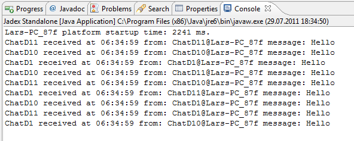
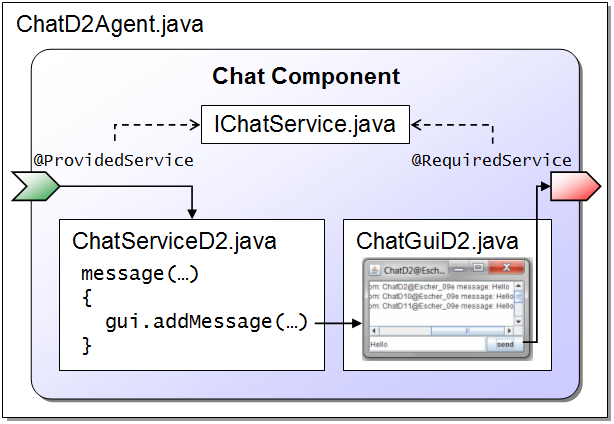
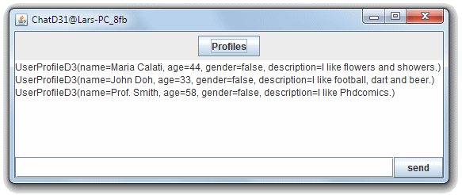
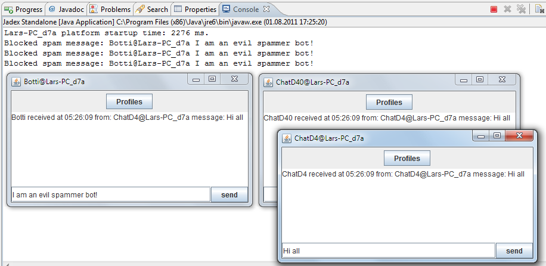

# Provided Services

This chapter will deal with aspects of how to implement and provide component services. In general, a component service consists of two aspects: a service interface and a service implementation.

Learning how to build provided services allows building an initial version of the chat application as described in [Application Context](01%20Introduction.md#application-context).
The design figure is repeated below for completeness.


*Conceptual design of the chat application*

Now that the concepts of active components and services has been introduced, you should be able to grasp some more details of this figure.
First, each chat instance is represented by an active component.
Second, the chat components communicate using a provided and required service called *IChatService*.
Third, this service provides a method *message()* that is called on all running components, whenever a chat component wishes to send a message.

# Exercise D1 - Defining a service

In this exercise we will create a basic chat service, attach it to the chat component and invoke it for testing purposes. 

## Defining the chat service interface

- Create a Java interface file called *IChatService.java* and add one method called *message* with two input parameters of type String called *sender* and *text*.

## Defining the chat service implementation

- Create a Java class file called *ChatServiceD1.java* and let it implement the *IChatService* interface.

- Add the ```@Service``` annotation above the class definition.

- Add a field of type ```IInternalAccess``` and name it *agent*. Also add a ```@ServiceComponent``` annotation above this field. Jadex will automatically inject the agent API to this field.

- You can also [inject agent features directly into services](../../services/services.md#accessing-the-component)): Add a field of type ```IRequiredServicesFeature``` and name it *requiredServicesFeature*. Also add a ```@ServiceComponent``` annotation above this field.

- Add a field of type *IClockService* and name it *clock*.

- Add a field of type *DateFormat* and name it *format*.

- Add the *message* method from the *IChatService* interface. The method will be called to let the chat service know about a new message. In the message body this new message should be printed out to the console. You can access the receiver's component name using ```agent.getComponentIdentifier().getLocalName()```. Concretely the output should look like: ```<receiver component name> received at <time> from: <sender> message: <text>```.

- Add a public method called *startService* with no parameters and an *IFuture&lt;Void&gt;* return value. Place the ```@ServiceStart``` annotation above the method signature (see [service lifecycle](../../services/services.md#service-lifecycle)))
- In this case the method should assign the *format* with ```new SimpleDateFormat("hh:mm:ss")``` and the *clock* by fetching the clock service in the same way as in earlier lectures.
- Please note that it is important that the method should return a future indicating when the init has been finished. As fetching the clock service is done asynchronously init has finished when the clock service has been assigned.
- To ensure that the caller of the start method is notified also in case an error occurs and the service could not be found an ```ExceptionDelegationResultListener``` can be used (read more about it in the [Futures](../../futures/futures.md#special-result-listeners) chapter)) It will forward exceptions to the future that is passed to it.

This init code for the clock should look like this: 

```java
format = new SimpleDateFormat("hh:mm:ss");
final Future<Void> ret = new Future<Void>();
IFuture<IClockService> fut = requiredServicesFeature.getService("clockservice");
fut.addResultListener(new ExceptionDelegationResultListener<IClockService, Void>(ret)
{
    public void customResultAvailable(IClockService result)
    {
        clock = result;
        ret.setResult(null);
    }
});
return ret;
```

## Defining the chat service component

- Create a Java class file called *ChatD1Agent.java* by copying the agent from ChatC2Agent.
- Add a second required service definition to the agent. For that purpose you have to change the required services specification to look like ```@RequiredServices({rs1, rs2})```, with rs1, rs2 representing the respective service definitions (see the [Services](../../services/services.md#using-services) Chapter)).
  The first clock service specification can be kept and the second we will name *chatservices*. The type has to be declared as *IChatService* and as we wish to retrieve all chat services we need to set *multiple* to true. In the binding of the service we use scope *platform* again and additionally define it as *dynamic*. Making it dynamic disables caching former search results and will always deliver the currently available chat services to the caller. 

- Furthermore, we need to specifiy the provided service. We use the ```@ProvidedServices``` annotation and add one ```@ProvidedService``` annotation inside. For a provided service we have to define its interface using the type attribute and set it to *IChatService.class* in this case. In addition, a provided service should have an implementation which is defined using the ```@Implementation``` annotation. Here, we just directly specify the implementation class to *ChatServiceD1*. It should look like the following:

```java
@ProvidedServices(@ProvidedService(type=IChatService.class, implementation=@Implementation(ChatServiceD1.class)))
```

- The code of the agent body should be changed to fetch the chat services using the call ```requiredServicesFeature.getServices("chatservices")```. As result you will retrieve a *java.util.Collection* of the available chat services (at least the one our agent is offering itself).
- Iterate through this collection and invoke the *message* method on each service with your own component name as sender (```agent.getComponentIdentifier().getName()```) and some arbitrary text as message content. 

## Verify the Component Behavior

Start the component and observe if it prints out the message text to the console. Then try out to start another chat agent with another name.

<!--If you didn't change the name, the platform will complain that it cannot start the agent due to a naming conflict. -->
<!--You can activate the *Auto Generate* option in the Starter to ensure that the platform automatically creates a new component instance name for each started component. -->

Whenever you start a new component you should see in the output that it sends a message to all existing agents. Below you can see the output that has been produced from three chat agents.



# Exercise D2 - Chat User Interface

In this lecture we will add a small graphical chat user interface. The interface will display chat messages of other chat users and allow us to send manually entered chat messages.

## Defining the chat user interface

- Create a new Java class called *ChatGuiD2* that extends *JFrame*.
- Add a field of type ```JTextArea``` and name it *received*. It will be used to display the received messages.
- Add a method *addMessage(String)* that adds new chat messages to the content of the text area.
- Create a constructor with one parameter ```ChatGuiD2(final IExternalAccess agent)```. The external access allows the user interface to work on the agent. In the constructor the following needs to be done:
    - Set the title of the chat window to the component name by calling ```super(agent.getComponentIdentifier().getName())```
    - Create the user interface components, the *received* text area, a ```JTextField``` called *message* for the user to enter a message text and a ```JButton``` called *send* for sending messages.
    - Layout the gui components using some LayoutManager, e.g. using a ```BorderLayout```
    - Show the gui by calling ```pack()``` and ```setVisible(true)```
    - Add an ```ActionListener``` to the send button to notify the available chat services of the new message. The code should look like the following:

```java
send.addActionListener(new ActionListener()
{
    public void actionPerformed(ActionEvent e)
    {
        final String text = message.getText();
        agent.scheduleStep(new IComponentStep<Void>()
        {
            public IFuture<Void> execute(IInternalAccess ia)
            {
                IFuture<Collection<IChatService>>    chatservices    = ia.getComponentFeature(IRequiredServicesFeature.class).getServices("chatservices");
                chatservices.addResultListener(new DefaultResultListener<Collection<IChatService>>()
                {
                    public void resultAvailable(Collection<IChatService> result)
                    {
                        for(Iterator<IChatService> it=result.iterator(); it.hasNext(); )
                        {
                            IChatService cs = it.next();
                            cs.message(agent.getComponentIdentifier().getName(), text);
                        }
                    }
                });
                return IFuture.DONE;
            }
        });
    }
});
```

Note that we need to schedule a step on the component in order to get the internal access which in turn let's us access the components features, including the required services feature.

- Also in the constructor, add code to terminate the chat component when the window is closed:

```java
addWindowListener(new WindowAdapter()
{
  public void windowClosing(WindowEvent e)
  {
    agent.killComponent();
  }
});
```

## Defining the chat service implementation

- Create a Java class file called *ChatServiceD2.java* and copy its content from the last lecture.
- Add a field *gui* of type *ChatGuiD2*
- In contrast to the previous lecture we will use the user interface to output the received messages. Therefore, in the *startService* method we need to create the gui and then use it in the *message* method.
- The creation of the gui has to be done on the Swing thread. Hence, we will change the result listener to a ```SwingExceptionDelegationResultListener``` which ensures that the ```customResultAvailable()``` method is called on the Swing thread. The user interface can be created by calling ```new ChatGuiD2(exta)```, letting exta being the external access of the agent. The init code should then look like the following:

```java
final IExternalAccess exta = agent.getExternalAccess();
IFuture<IClockService>    clockservice    = requiredServicesFeature.getService("clockservice");
clockservice.addResultListener(new SwingExceptionDelegationResultListener<IClockService, Void>(ret)
{
    public void customResultAvailable(IClockService result)
    {
        clock = result;
        gui = createGui(exta);
        ret.setResult(null);
    }
});
```

- Add the *protected ChatGuiD2 createGui(IExternalAccess agent)* method and implement it by simply returning *new ChatGuiD2(agent)*. 

- In order to dispose the user interface when the component is killed, a new method *shutdownService* needs to be created. Equip the method with the ```@ServiceShutdown``` annotation to let Jadex call the method when the service is terminated.
- Within the method you should call *gui.dispose()* to close the user interface. You should call dispose from the Swing thread, which can be achieved by using ```SwingUtilities.invokeLater()``` and placing the dispose within the ```Runnable``` that has to be passed as parameter. 

- Finally the *message* method has to be adjusted that it does not print out the message but redirects it to user interface using the previouly defined gui method *addMessage*

## Defining the chat service component

- Create a Java class file called *ChatD2Agent.java* and copy its content from the last lecture.
- Remove the *executeBody* method.
- Adapt the implementation class of the provided service to *ChatServiceD2*.

## Verify the Component Behavior

After starting several chat agents you should be able to enter text messages and send them using the send button. If your implementation works correctly you should see the sent messages appearing the all other chat windows. Also verify that the chat window is close when you kill the agent (by stopping the platform or from the component tree in the JCC). Below the screenshot shows what can be expected.


## Understanding the Chat Implementation

The figure below shows the interplay between the implemented Java classes when executing a chat component. The component is defined in the file *ChatD2Agent.java*, where the provided and required services are specified. Both specifications refer to the service interface defined in the file *IChatService.java*. The provided service annotation further specifies the service implementation *ChatServiceD2.java*. On startup, the service implementation creates a user interface as defined in *ChatGuiD2.java*. Whenever a chat message is received through the provided service interface, the *message()* method of the chat service implementation gets executed. It calls the *addMessage()* method of the user interface, such that the chat message is displayed. Moreover, when the user hits the "send" button in the gui, the gui will fetch the available chat service as specified in the required services and call the *message()* method on the remote chat services.


*Interplay between implemented Java classes inside a chat component*

<!-- TODO: ab hier weitermachen mit ueberarbeitung! -->

# Exercise D3 - Service Interfaces

So far we have used a very simple chat service interface. In this lecture we will extend the interface with another method that has a non-void return value. In general, all methods with return values should return future objects. In this way methods can be processed asynchronously by the called active component and the caller does not have to wait for the answer but instead is notified once it has been made available by the callee. With this purely asynchronously call model Jadex achieves a loose coupling between caller and callee and additionally avoids technical thread deadlocks simply because there are never waiting threads in components. Regarding the rule of future return values there is one exception. Methods without parameters that return constant values can be used because their result values can be cached. In this lecture we will add a method that returns the user profile of a chatter on request. This will allow us to see details of our potential chat partners. As a user may change its profile at any time it cannot be considered constant.

## Defining the chat service interface

- Create a new Java interface file called *IExtendedChatService.java* and let it extend IChatService
- Add a method *getUserProfile()* with no in parameters and *IFuture&lt;UserProfileD3&gt;* as return value.
- Create a new Java class file *UserProfileD3* and add fields as well as public getter and setter methods for *String name*, *int age*, *boolean gender*, and *String description*.
- Add an emtpy constructor and a field based constructor with all fields to the *UserProfileD3* class.
- Override the *toString()* method and return a descriptive representation of the profile using its attributes.  

## Defining the chat service implementation

- Create a Java class file called *ChatServiceD3.java*, let it inherit from *ChatServiceD2* and implement the new *IExtendedChatService*.
- Add a field of type *UserProfileD3* with name *profile* and assign it a random generated user profile already as part of the variable declaration. (Hint: you could e.g. use a statically created list of predefined user profiles from which you select an entry using Math.random()\*num\_of\_profiles).
- Implement the *getUserProfile()* method by returning *new Future&lt;UserProfileD3&gt;(profile)*, i.e. a future with the user profile.
- Override the *createGui()* method and return a new gui version using *new ChatGuiD3(agent)*. 

## Defining the chat user interface

- Create a Java class file called *ChatGuiD3.java* and let it extend *ChatGuiD2.java*.
- In the constructor create a new JButton called *profiles* and add it to the frame's content pane by using *getContentPane()*. Depending on your layout of the content pane you can add the new button with different constraints,\
    e.g. if you chose BoderLayout and north has not been used you could call *getContentPane().add(profiles, BorderLayout.NORTH).*
- You also need to add an action listener on the new *profiles* button that is in charge of printing the user profiles to the gui message area (using *addMessage()*). The code of the action listener should start with:

```java

agent.scheduleStep(new IComponentStep<Void>()
{
  public IFuture<Void> execute(IInternalAccess ia)
  {
    IFuture<Collection<IChatService>> chatservices = ia.getServiceContainer().getServices("chatservices");
    chatservices.addResultListener(new DefaultResultListener<Collection<IChatService>>()
    ...
  }
}

```

## Defining the chat service component

- Create a Java class file called *ChatD3Agent.java* and copy its content from the last lecture.
- Replace occurrences of *IChatService* with *IExtendedChatService*.
- Replace *ChatServiceD2* with *ChatServiceD3*.

## Verify the Component Behavior

Use the JCC to start several chat agents. Check if the new *Profiles* button is present in the chat user interface and if hitting the button causes the profiles of currently online users to be printed out. Below a screenshot of the solution with imaginary profiles of three chatters are shown.


 

# Exercise D4 - Service Interceptor

In this lecture we will deal with service interceptors, which are a means for interrupting a method call before and/or after it is executed and executing arbitrary code for pre- or postprocessing purposes. Using service interceptors it is possible to easily implement crosscutting concerns which would be scattered in many method otherwise. In this way the interceptor concept is very similar to [aspect oriented programming](http://en.wikipedia.org/wiki/Aspect-oriented_programming) , in which point cuts are used to intercept calls. Good example use cases are autorization checks or logging. In our example we will use an interceptor to prevent spam messages from being displayed at the users message display. In this case we make the simplified assumption that spam messages can be identified by the senders name. Concretely, we will block all messages coming from chatters with 'Bot' in their name.

## Defining the chat service interceptor

- Create a new Java class file called *SpamInterceptorD4.java* and let it implement *IServiceInvocationInterceptor*.
- Add method implementations for the defined method signatures in the interface.
- The *isApplicable* method is used to check if the interceptor should be called for the current call. Here, we only want to intercept method calls to the *message* method. So in the method body you should use * context.getMethod().getName().equals("message")* to determine the result. 
- In the *execute* method the functionality of an intercepted call should be placed. In order to check if the sender's name contains 'Bot' we need first to fetch the argument with the sender's name. This can be achieved using *(String)context.getArgumentArray()\[0\]*. The check itself can be performed by a substring containment operation using *sender.indexOf("Bot")!=-1*. In case this check is true we will not call the message method but return an exception immediately by returning *new Future((new RuntimeException("No spammers allowed.") ) )*. Additionally, you should print out to the console that a spammer call was blocked and the sender's name and message content. If the name is ok, we let the call pass by returning *context.invoke()*. 

## Defining the chat service component

- Create a Java class file called *ChatD4Agent.java* and copy its content from the last lecture.
- Change the provided service definition to contain the interceptor definition. The chat implementation needs not to be modified. This should look like the following:

```java

@ProvidedServices(@ProvidedService(type=IExtendedChatService.class,
  implementation=@Implementation(value=ChatServiceD3.class,
  interceptors=@Value(clazz=SpamInterceptorD4.class))))

```

## Verify the Component Behavior

Start several chat agents including an agent that contains 'Bot' in its name. The name of a component can be entered in the *Component name* field of the Starter. If the field is uneditable you should deselected the checkbox named *Auto generate*, which will generate names autonamtically. Enter messages in normal chatter and the spam bot and test if messages from the spam bot are blocked. You should see a printout on the console as shown in the screenshot below.



# Exercise D5 - Remote Services

Until now we have used chat agents only from one platform. In this lecture we will change our chat agent to effeciently communicate also with agents from other platforms that may reside on different network nodes. Basically, the only important change that has to be performed consists in changing the search scope of the required service for chat agents from *SCOPE\_PLATFORM* to *SCOPE\_GLOBAL*. One problem with this solution is that we currently search for chat services in a way that delivers the results altogether, i.e we have to wait till all known platforms have answered or a timeout has occurred. To avoid waiting for all results an *IIntermediateResultListener* can be used. This listener is notified separately for each result as soon as it becomes available. Each time the *intermediateResultAvailable* method is called with one result value. After the last result has been made available the *finished* method is called. In case the called method does not support intermediate results it behaves exactly as the already known *IResultListsner*, i.e. *resultAvailable* is called when all results are available or *exceptionOccurred* is invoked if an exception occurred during processing.

## Defining the chat user interface

- Create a Java class file called *ChatGuiD5.java* and copy its content from *ChatGuiD2.java*
- Change the listener implementation that is added to search for the chat services in a step by step manner. Implement the *intermediateResultAvailable* method in the same way as before by calling the *message* method on the found service. Please note that you will get a single service as parameter, not a collection of services.

```java

ia.getServiceContainer().getServices("chatservices")
  .addResultListener(new IIntermediateResultListener()...

```

## Defining the chat service implementation

- Create a Java class file called *ChatServiceD5.java* and copy its content from *ChatServiceD2.java*.
- Change the created gui by making the *createGui* method return *new ChatGuiD5(agent)*.

## Defining the chat service component

- Create a Java class file called *ChatD5Agent.java* and copy its content from *ChatD4Agent.java*.
- Change the scope of *chatservices* to *RequiredServiceInfo.SCOPE\_GLOBAL*.
- Change the implementation of the provided chat service to *ChatServiceD5*.

## Verify the Component Behavior

Start two or more Jadex platforms and on each at least one chat agent. Send a chat message via a chat agent and observe if the message arrives also at the remote chatters. Simulate a network breakdown by right clicking on the rms component and selecting suspend (the rms is the remote management service component, which is responsible for remote service communication between platforms). Then choose a chat agent from another platform and send a message again. Ensure that the still available chatters get the message immediately and do not suffer from waiting for a timeout from the disconnected remote platform. 
