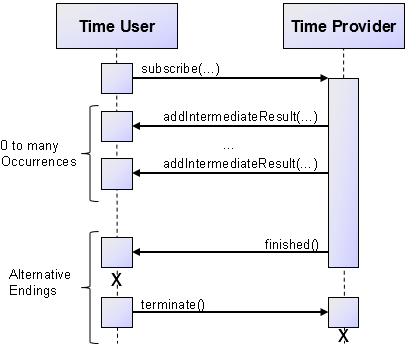

# Time Service Interface

This chapter sketches the Java project setup and explains how to define a Jadex service interface.

## Prerequisites

This quickstart tutorial assumes that you are familiar with Java and your favourite IDE. Therefore, you should know how to set up a project to start developing Java applications, which use Jadex.

For your Java project please make sure **not** to include the `jadex-application-xyz` jars as they already contain the quickstart tutorial classes. If you include these, Java might ignore your own classes and only use the ones from the jar. If you set up your project using the gradle-based [Jadex example project](../../getting-started/getting-started.md#importing-the-jadex-example-project), the appropriate jars will be automatically included and excluded as needed.

If you need additional guidance for the project setup, please have a look at the [getting started guide](../../getting-started/getting-started.md#ide-setup)).

## The Time Service Interface

Create Java file `ITimeService.java` in the package `jadex.micro.quickstart` and paste the contents as shown below. In Eclipse you can also copy/paste the code directly into your project and [have Eclipse create the package and file automatically](../../getting-started/getting-started.md#testing-your-project-setup). The relevant aspects of this file are explained in the following subsections.

```java
package jadex.micro.quickstart;

import java.text.DateFormat;

import jadex.bridge.service.annotation.Security;
import jadex.bridge.service.annotation.Service;
import jadex.commons.future.IFuture;
import jadex.commons.future.ISubscriptionIntermediateFuture;

/**
 *  Simple service to publish the local system time.
 *  As the service does not change the local system
 *  and provides no sensitive information, no security
 *  restrictions are required.
 */
@Security(roles=Security.UNRESTRICTED)
@Service
public interface ITimeService
{
    /**
     *  Get the location of the platform, where the time service runs.
     */
    public IFuture<String> getLocation();

    /**
     *  Subscribe to the time service.
     *  Every couple of seconds, a string with the current time will be
     *  sent to the subscriber.
     */
    public ISubscriptionIntermediateFuture<String> subscribe(DateFormat format);
}

```

### The Name and Package of the Interface

In Jadex, the fully qualified name of a service interface is used for service discovery. Therefore when you implement a time user component to search for your `ITimeService`, Jadex will discover all components worldwide that offer a service of type `jadex.micro.quickstart.ITimeService`. If you make sure to use the interface and package name as shown, you might be able to find other people's time provider components.

<!--
TODO:

* link to web-registry
* explanation of discovery mechanisms (local/global registry vs. awareness)
* web page listing available time providers (jadex.js)

-->

### The `getLocation()` Method

Service methods are potentially remote calls. Therefore service methods should use [future types](../../futures/futures.md)) as return values. Futures avoid that the caller is blocked during the service processing and add further support e.g. for dealing with timeouts.

The result of the `getLocation()` method is not directly a `String` object, but an object of type `jadex.commons.future.IFuture<String>`, that is, a placeholder or promise for the location string that might or might not be available yet.

### The `subscribe()` Method

A method with an basic `IFuture` return type captures a simple request-reply interaction. Jadex provides different future types for realizing more complex interaction schemes. The `subscribe()` method signature captures such a complex interaction between time provider and time user. It accepts a `DateFormat` object as input and uses the [subscription intermediate future](../../futures/futures.md#subscription-futures)) as a return type, which denotes a subscription semantics for the interaction as shown in the diagram below.



The interactions starts by the user calling the `subscribe()` method on the service of the provider. While the interaction is active, the time provider may post time values in arbitrary intervals. These time values are transmitted as intermediate results of the future and immediately become available to the time user. At any point in time, either of both sides may decide to end the interaction. The time provider may do this by setting the future to finished to indicate that no more results will be published. The time user on the other hand may decide that it no longer wants to receive time values from the time provider and thus may call the `cancel()` method on the future.

As you can see, using subscription futures allows capturing a complex interaction semantics in a single method signature. Using generics, the shown method signature further demands that the intermediate results must be of type `String.

## Security Issues

Jadex platforms can potentially detect any other Jadex platforms on the internet using several [awareness mechanisms](../../remote/remote.md#awareness). This means that a time service hosted on your platform may be found and invoked by some other Jadex platform that you are not aware of. To avoid security issues due to being visible and accessible to other platforms, in Jadex all services are restricted by default. This would mean that only components on your platform can invoke your time service. This behavior is advantageous for getting used to Jadex, because you can just start and implement your own services without having to consider security issues. All your services are available for local testing but shielded from outside platforms.

For our time service example, we consider that the service does not pose any security threats, because the service does not change the local system and provides no sensitive information. Therefore, we want the service to be accessible to outside platforms as well. For example you should be able to test your user agent with one of our time provider components hosted in our infrastructure. To enable unrestricted access to the service, the `@Security` annotation is specified. More information about security and restricted and unrestricted services can be found in the [user guide](../../guides/ac/08%20Security.md).

---
[[Back: 01 Introduction](01%20Introduction.md) | [Next: 03 Time User](03%20Time%20User.md)]
